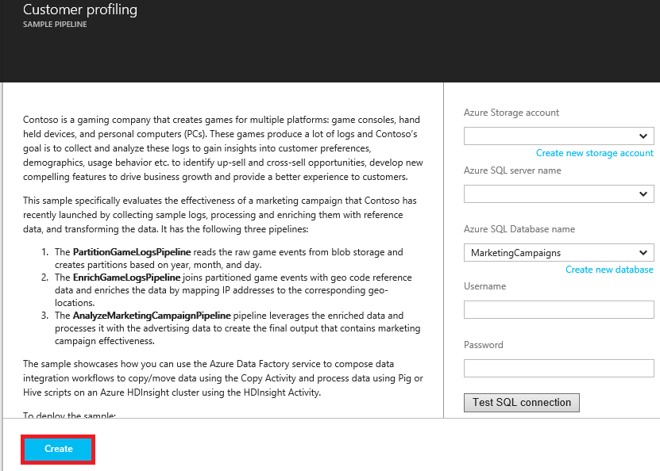
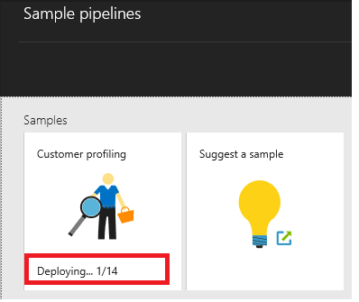

<properties     
    pageTitle="Dati di Azure Factory - esempi" 
    description="Vengono fornite informazioni dettagliate sugli esempi forniti con il servizio di Azure Data Factory." 
    services="data-factory" 
    documentationCenter="" 
    authors="sharonlo101" 
    manager="jhubbard" 
    editor="monicar"/>

<tags 
    ms.service="data-factory" 
    ms.workload="data-services" 
    ms.tgt_pltfrm="na" 
    ms.devlang="na" 
    ms.topic="article" 
    ms.date="10/18/2016" 
    ms.author="shlo"/>

# Dati di Azure Factory - esempi

## Esempi di su GitHub
[Archivio DataFactory di Azure GitHub](https://github.com/azure/azure-datafactory) contiene diversi esempi che consentono di rapidamente rampa backup con il servizio di Azure Data Factory (o) modificare gli script e usarla in un applicazione. La cartella Samples\JSON contiene frammenti JSON per scenari comuni.

| Esempio | Descrizione |
| :----- | :---------- | 
| [Procedura dettagliata alimentatore automatico](https://github.com/Azure/Azure-DataFactory/tree/master/Samples/ADFWalkthrough) | In questo esempio fornisce una procedura dettagliata-to-end per l'elaborazione di utilizzo di dati Azure di trasformare i dati da un file di log in a informazioni dettagliate sui file di log.   In questa procedura dettagliata pipeline Factory dati consente di raccogliere i registri di esempio, i processi e faciliti la i dati dei registri con dati di riferimento e trasforma i dati per valutare l'efficacia di una campagna di marketing recente avviata. |
| [Esempi JSON](https://github.com/Azure/Azure-DataFactory/tree/master/Samples/JSON) | In questo esempio vengono forniti esempi JSON per scenari comuni. | 
| [Esempio di Downloader dati HTTP](https://github.com/Azure/Azure-DataFactory/tree/master/Samples/HttpDataDownloaderSample) | In questo esempio presentazioni il download dei dati da un endpoint HTTP a archiviazione Blob Azure con attività .NET personalizzata. |
| [Cross dominio applicazione punto attività netto campione](https://github.com/Azure/Azure-DataFactory/tree/master/Samples/CrossAppDomainDotNetActivitySample) | In questo esempio consente di creare un'attività .NET personalizzata che non è vincolata a versioni di assembly utilizzato dal pulsante di visualizzazione della alimentatore automatico (ad esempio WindowsAzure.Storage v4.3.0, Newtonsoft.Json v6.0.x e così via). |
| [Eseguire script R](https://github.com/Azure/Azure-DataFactory/tree/master/Samples/RunRScriptUsingADFSample) |  In questo esempio include l'attività personalizzata Factory dati che può essere utilizzato per richiamare RScript.exe. In questo esempio funziona solo con il proprio cluster HDInsight (non le connessioni) che è già installato R su di esso. |
| [Richiamare processi ad cluster HDInsight Hadoop](https://github.com/Azure/Azure-DataFactory/tree/master/Samples/Spark) | In questo esempio viene illustrato come utilizzare attività MapReduce per avviare un programma di motori. I motori appena copiato dati da un contenitore di Blob Azure a un'altra. |
| [Analisi di Twitter tramite Azure Machine Learning Batch punteggio attività](https://github.com/Azure/Azure-DataFactory/tree/master/Samples/TwitterAnalysisSample-AzureMLBatchScoringActivity) | In questo esempio viene illustrato come utilizzare AzureMLBatchScoringActivity per richiamare un modello di apprendimento Azure che esegue l'analisi di valutazione in twitter, punteggio, la funzione di completamento e così via. |
| [Analisi di Twitter tramite un'attività personalizzata](https://github.com/Azure/Azure-DataFactory/tree/master/Samples/TwitterAnalysisSample-CustomC%23Activity) |  In questo esempio viene illustrato come utilizzare un'attività .NET personalizzata per richiamare un modello di apprendimento Azure che esegue l'analisi di valutazione in twitter, punteggio, la funzione di completamento e così via. |
| [Pipeline parametri per l'apprendimento Azure](https://github.com/Azure/Azure-DataFactory/tree/master/Samples/ParameterizedPipelinesForAzureML/) | L'esempio fornisce un codice-to-end c# per distribuire pipeline N per punteggi e formazione ognuno con un parametro area diversa nel punto in cui sarà disponibile a breve l'elenco delle aree da un file parameters.txt, inclusa in questo esempio. | 
| [Aggiornamento dei dati di riferimento per i processi di Azure flusso Analitica](https://github.com/Azure/Azure-DataFactory/tree/master/Samples/ReferenceDataRefreshForASAJobs) |  In questo esempio viene illustrato come utilizzare Factory di dati di Azure e Azure flusso Analitica per eseguire la query con dati di riferimento e installare l'aggiornamento dei dati di riferimento alla programmazione di un. |
| [Pipeline ibrido con Hortonworks Hadoop locale](https://github.com/Azure/Azure-DataFactory/tree/master/Samples/HybridPipelineWithOnPremisesHortonworksHadoop) | L'esempio utilizza un cluster di Hadoop locale come destinazione calcolo per l'esecuzione di processi nella Factory dati nello stesso modo in cui aggiungere altri destinatari di calcolo come cluster Hadoop nel cloud in base a un HDInsight. |
| [Strumento di conversione JSON](https://github.com/Azure/Azure-DataFactory/tree/master/Samples/JSONConversionTool) | Questo strumento consente di convertire JSONs dalla versione precedente a 2015-07-01-anteprima per più recente o Anteprima 01 di 07 2015 (impostazione predefinita). |  
| [File di input di esempio U SQL](https://github.com/Azure/Azure-DataFactory/tree/master/Samples/U-SQL%20Sample%20Input%20File) |  Il file è un file di esempio utilizzato da un'attività U-SQL. | 

## Modelli di Azure Manager delle risorse
È possibile trovare modelli di gestione di Azure risorse seguenti per fabbrica dati Github. 

| Modello | Descrizione |
| -------- | ----------- | 
| [Copiare dallo spazio di archiviazione Blob Azure al Database SQL Azure](https://github.com/Azure/azure-quickstart-templates/tree/master/101-data-factory-blob-to-sql-copy) | La distribuzione di questo modello consente di creare una factory di dati di Azure con una pipeline che consente di copiare dati dallo spazio di archiviazione blob Azure specificato al database SQL Azure |    
| [Copiare Salesforce a archiviazione Blob Azure](https://github.com/Azure/azure-quickstart-templates/tree/master/101-data-factory-salesforce-to-blob-copy) | Distribuzione di questo modello crea un factory Azure dati con una pipeline che consente di copiare i dati con l'account di Salesforce specificato per l'archiviazione blob Azure. |    
| [Trasformare i dati eseguendo Hive script in un cluster di Azure HDInsight](https://github.com/Azure/azure-quickstart-templates/tree/master/101-data-factory-hive-transformation) | Distribuzione di questo modello crea un factory Azure dati con una pipeline che trasforma i dati eseguendo lo script Hive di esempio in un cluster di Azure HDInsight Hadoop. | 

## Esempi di Azure portale
È possibile utilizzare il riquadro **pipeline di esempio** nella home page del produttore dati per la distribuzione di esempio tubazioni e le relative entità associato (set di dati e servizi collegati) in su factory i dati. 

1. Creare una factory di dati o aprire una factory dati esistenti. Vedere [Guida introduttiva a Azure Data Factory](data-factory-copy-data-from-azure-blob-storage-to-sql-database.md#CreateDataFactory) per la procedura per creare una factory di dati.
2. In blade **FACTORY dati** per la factory di dati, fare clic sul riquadro **pipeline di esempio** .

    

2. Selezionare l' **esempio** che si desidera distribuire e il **pipeline di esempio** . 
    
    

3. Specificare le impostazioni di configurazione per il campione. Ad esempio, la chiave account e nome account Azure dello spazio di archiviazione, nome del server SQL Azure, database, ID utente e la password e così via. 

    

4. Dopo aver con specificando le impostazioni di configurazione, fare clic su **Crea** per creare/distribuire la pipeline di esempio e servizi/tabelle collegate utilizzate per la pipeline.
5. Vedere lo stato della distribuzione sul riquadro esempio che fa clic in precedenza e il **pipeline di esempio** .

    

6. Quando viene visualizzato il messaggio **distribuzione completata** sul riquadro dell'esempio, chiudere e il **pipeline di esempio** .  
5. Su **FACTORY dati** blade, vedere servizi collegati, set di dati e pipeline verranno aggiunti al produttore dati.  

    
   
## Esempi di Visual Studio

### Prerequisiti

È necessario disporre dei seguenti prodotti installati nel computer in uso: 

- Visual Studio 2013 o Visual Studio 2015
- Scaricare Azure SDK per Visual Studio 2013 o Visual Studio 2015. Passare alla [Pagina di Download di Azure](https://azure.microsoft.com/downloads/) e fare clic su **VS 2013** o **VS 2015** nella sezione **.NET** .
- Scaricare il plug-in Azure Data Factory più recenti per Visual Studio: [VS 2013](https://visualstudiogallery.msdn.microsoft.com/754d998c-8f92-4aa7-835b-e89c8c954aa5) o [VS 2015](https://visualstudiogallery.msdn.microsoft.com/371a4cf9-0093-40fa-b7dd-be3c74f49005). Se si utilizza Visual Studio 2013, è inoltre possibile aggiornare il plug-in, eseguendo la procedura seguente: dal menu fare clic su **Strumenti** -> **Extensions e aggiornamenti** -> **Online** -> **Visual Studio Gallery** -> **Microsoft Azure dati Factory Tools per Visual Studio** -> **aggiornare**.

### Utilizzare i modelli di dati Factory

1. Dal menu **File** , scegliere **Nuovo**e fare clic su **progetto**. 
2. Nella finestra di dialogo **Nuovo progetto** , eseguire la procedura seguente: 
    1. Selezionare **DataFactory** in **modelli**. 
    2. Nel riquadro destro, selezionare **Modelli di dati Factory** . 
    3. Immettere un **nome** per il progetto. 
    4. Selezionare un **percorso** per il progetto. 
    5. Fare clic su **OK**. 

    
6. Nella finestra di dialogo **Dati Factory modelli** selezionare il modello di esempio nella sezione **Modelli in caso di utilizzo** e fare clic su **Avanti**. La procedura seguente consentono utilizzando il modello **Di analisi dei clienti** . Passaggi sono simili per altri esempi. 

     
7. Nella finestra di dialogo **Configurazione Factory dati** , fare clic su **Avanti** nella pagina **Informazioni di base sul produttore dati** .
8. Nella pagina **Configura factory di dati** , eseguire la procedura seguente: 
    1. Selezionare **Crea nuova Factory di dati**. È inoltre possibile selezionare **factory dati esistenti di utilizzo**.
    2. Immettere un **nome** per la factory di dati.
    3. Selezionare l' **abbonamento Azure** in cui si desidera factory dati da creare. 
    4. Selezionare il **gruppo di risorse** per la factory di dati.
    5. Selezionare **Usa ovest**, **Stati Uniti orientali**o **Nord Europa** per l' **area geografica**.
    6. Fare clic su **Avanti**. 
9. Nella pagina **Configura dati archivia** specificare un esistente **database SQL Azure** e **account Azure archiviazione** (o) creare lo spazio di archiviazione/database e fare clic su Avanti. 
10. Nella pagina **Configura calcolare** , selezionare le impostazioni predefinite e fare clic su **Avanti**. 
11. Nella pagina di **Riepilogo** , esaminare tutte le impostazioni e fare clic su **Avanti**. 
12. Nella pagina **Stato distribuzione** attendere fino al completamento della distribuzione e fare clic su **Fine**.
13. Fare clic sul progetto in Esplora soluzioni e fare clic su **pubblica**. 
19. Se viene visualizzato la finestra di dialogo di **accedere al proprio account Microsoft** , immettere le credenziali dell'account che dispone di sottoscrizione Azure e fare clic su **Accedi**.
20. Viene visualizzato nella finestra di dialogo seguenti:

    

21. Nella pagina **Configura factory di dati** , eseguire la procedura seguente: 
    1. Verificare l'opzione **Usa esistente dati factory** .
    2. Selezionare la **factory dati** era selezionare quando si usa il modello. 
    6. Fare clic su **Avanti** per passare alla pagina **Pubblica elementi** . (Premere **TAB** per spostarsi fuori il campo nome a se il pulsante **Avanti** è disattivato) 
23. Nella pagina **Pubblicare articoli** , verificare che tutte le factory dati entità siano selezionate e fare clic su **Avanti** per passare alla pagina di **Riepilogo** .     
24. Controllare il riepilogo e fare clic su **Avanti** per avviare il processo di distribuzione e visualizzare lo **Stato di distribuzione**.
25. Nella pagina **Stato di distribuzione** , verrà visualizzato lo stato del processo di distribuzione. Al termine della distribuzione, fare clic su Fine. 

Per informazioni dettagliate sull'utilizzo di Visual Studio per creare entità Factory dati e pubblicarli facilmente Azure, vedere [creare la prima factory di dati (Visual Studio)](data-factory-build-your-first-pipeline-using-vs.md) .          