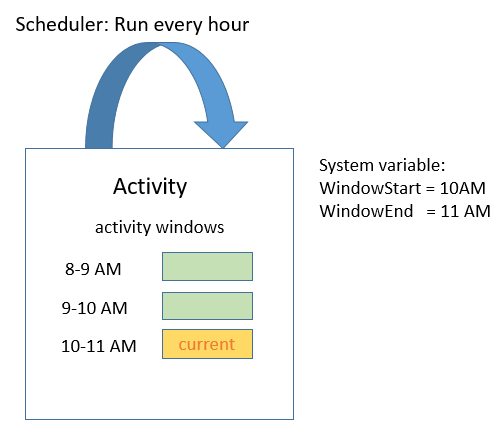
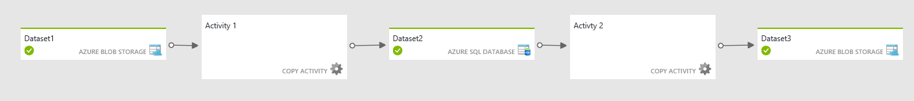

<properties
    pageTitle="Pianificazione e all'esecuzione con dati Factory | Microsoft Azure"
    description="Informazioni su pianificazione e all'esecuzione aspetti del modello di applicazione Azure Data Factory."
    services="data-factory"
    documentationCenter=""
    authors="spelluru"
    manager="jhubbard"
    editor="monicar"/>

<tags
    ms.service="data-factory"
    ms.workload="data-services"
    ms.tgt_pltfrm="na"
    ms.devlang="na"
    ms.topic="article"
    ms.date="08/22/2016"
    ms.author="spelluru"/>

# Dati Factory pianificazione e l'esecuzione
Questo articolo illustra gli aspetti di pianificazione e l'esecuzione del modello di applicazione di Azure Data Factory. 

## Prerequisiti
In questo articolo si presuppone acquisite nozioni di base dei concetti di modello applicazione Factory dati, inclusi attività, tubazioni, servizi collegati e set di dati. Per concetti di base di Azure Data Factory, vedere gli articoli seguenti:

- [Introduzione ai dati Factory](data-factory-introduction.md)
- [Pipeline](data-factory-create-pipelines.md)
- [Set di dati](data-factory-create-datasets.md) 

## Pianificare un'attività

Con la sezione utilità di pianificazione dell'attività JSON, è possibile specificare una pianificazione per un'attività ricorrente. Ad esempio, è possibile pianificare un'attività ogni ora come indicato di seguito:

    "scheduler": {
        "frequency": "Hour",
        "interval": 1
    },  

Come mostrato nella figura, specificare una pianificazione per l'attività crea una serie dello scambio di windows. Lo scambio di windows sono una serie di intervalli di tempo di dimensioni fisse, sovrapposti non contiguo. Queste finestre lo scambio logico per l'attività sono denominate *windows attività*.

Per la finestra di attività attualmente in esecuzione, è possibile accedere l'intervallo di tempo associato alla finestra di attività con le variabili di sistema [WindowStart](data-factory-functions-variables.md#data-factory-system-variables) e [WindowEnd](data-factory-functions-variables.md#data-factory-system-variables) nell'attività JSON. È possibile utilizzare queste variabili per diversi scopi nell'attività JSON. Ad esempio usarli per selezionare i dati di input e di output set di dati che rappresenta ora serie dati.

La proprietà **utilità di pianificazione** supporta le stesse sottoproprietà della proprietà di **disponibilità** in un set di dati. Per informazioni dettagliate, vedere [la disponibilità di set di dati](data-factory-create-datasets.md#Availability) . Esempi: pianificazione in uno scarto di tempo specifico o impostare la modalità per allineare elaborazione all'inizio o alla fine dell'intervallo per la finestra di attività.

È possibile specificare le proprietà di **utilità di pianificazione** per un'attività, ma questa proprietà è **facoltativa**. Se si specifica una proprietà, deve corrispondere digitazione che specificare nella definizione del set di dati di output. Set di dati di output è al momento, quali unità della programmazione, è necessario creare un set di dati di output anche se l'attività non produce alcun output. Se l'attività non richiede qualsiasi tipo di input, è possibile ignorare la creazione di set di dati di input.

## Serie set di dati e i dati temporali

Dati della serie ora sono una sequenza continua di punti dati che in genere è costituito da successive misurazioni effettuate in un intervallo di tempo. Esempi comuni di dati della serie ora includono dati sensore e i dati di telemetria applicazione.

Con Data Factory, è possibile elaborare esecuzione serie di dati in modo in batch con un'attività. In genere, non esiste una digitazione ricorrente arriva e output esigenze di dati da produrre dati di input. Questo digitazione si basa specificando **disponibilità** nel set di dati come indicato di seguito:

    "availability": {
      "frequency": "Hour",
      "interval": 1
    },

Ogni unità di dati utilizzato e prodotto da un'esecuzione di attività rappresenta la cosiddetta una sezione di dati. Il diagramma seguente illustra un esempio di un'attività con un set di dati di input e un set di dati di output. Questi set di dati avere **disponibilità** impostato su una frequenza oraria.

Il diagramma precedente illustra le sezioni di dati per il set di dati di input e di output. Il diagramma mostra tre sezioni inpue già pronte per l'elaborazione. L'attività di 10-11 AM è in corso, che produce la sezione di output 10-11 AM.

È possibile accedere l'intervallo di tempo associata la sezione corrente realizzata il set di dati JSON con variabili [SliceStart](data-factory-functions-variables.md#data-factory-system-variables) e [SliceEnd](data-factory-functions-variables.md#data-factory-system-variables).

Al momento Factory dati richiede la pianificazione specificata nell'attività esattamente corrispondente pianificazione specificata nella **disponibilità** del set di dati di output. Di conseguenza, **WindowStart**, **WindowEnd**, **SliceStart**e **SliceEnd** sempre eseguire il mapping per lo stesso periodo di tempo e una sezione di output singola.

Per ulteriori informazioni sulle diverse proprietà disponibili per la sezione disponibilità, vedere [Creazione set di dati](data-factory-create-datasets.md).

## Spostare i dati da Database SQL di archiviazione Blob

Di seguito inserire alcuni aspetti insieme e in azione mediante la creazione di una pipeline che consente di copiare dati da una tabella di Database SQL Azure archiviazione Blob Azure ogni ora.

**Input: Set di dati Database di SQL Azure**

    {
        "name": "AzureSqlInput",
        "properties": {
            "published": false,
            "type": "AzureSqlTable",
            "linkedServiceName": "AzureSqlLinkedService",
            "typeProperties": {
                "tableName": "MyTable"
            },
            "availability": {
                "frequency": "Hour",
                "interval": 1
            },
            "external": true,
            "policy": {}
        }
    }

**Frequenza** è impostata su **ora** e **intervallo** è impostato su **1** nella sezione disponibilità.

**Output: Set di dati dello spazio di archiviazione Blob Azure**

    {
        "name": "AzureBlobOutput",
        "properties": {
            "published": false,
            "type": "AzureBlob",
            "linkedServiceName": "StorageLinkedService",
            "typeProperties": {
                "folderPath": "mypath/{Year}/{Month}/{Day}/{Hour}",
                "format": {
                    "type": "TextFormat"
                },
                "partitionedBy": [
                    {
                        "name": "Year",
                        "value": {
                            "type": "DateTime",
                            "date": "SliceStart",
                            "format": "yyyy"
                        }
                    },
                    {
                        "name": "Month",
                        "value": {
                            "type": "DateTime",
                            "date": "SliceStart",
                            "format": "%M"
                        }
                    },
                    {
                        "name": "Day",
                        "value": {
                            "type": "DateTime",
                            "date": "SliceStart",
                            "format": "%d"
                        }
                    },
                    {
                        "name": "Hour",
                        "value": {
                            "type": "DateTime",
                            "date": "SliceStart",
                            "format": "%H"
                        }
                    }
                ]
            },
            "availability": {
                "frequency": "Hour",
                "interval": 1
            }
        }
    }

**Frequenza** è impostata su **ora** e **intervallo** è impostato su **1** nella sezione disponibilità.

**Attività: Attività di copia**

    {
        "name": "SamplePipeline",
        "properties": {
            "description": "copy activity",
            "activities": [
                {
                    "type": "Copy",
                    "name": "AzureSQLtoBlob",
                    "description": "copy activity",
                    "typeProperties": {
                        "source": {
                            "type": "SqlSource",
                            "sqlReaderQuery": "$$Text.Format('select * from MyTable where timestampcolumn >= \\'{0:yyyy-MM-dd HH:mm}\\' AND timestampcolumn < \\'{1:yyyy-MM-dd HH:mm}\\'', WindowStart, WindowEnd)"
                        },
                        "sink": {
                            "type": "BlobSink",
                            "writeBatchSize": 100000,
                            "writeBatchTimeout": "00:05:00"
                        }
                    },
                    "inputs": [
                        {
                            "name": "AzureSQLInput"
                        }
                    ],
                    "outputs": [
                        {
                            "name": "AzureBlobOutput"
                        }
                    ],
                    "scheduler": {
                        "frequency": "Hour",
                        "interval": 1
                    }
                }
            ],
            "start": "2015-01-01T08:00:00Z",
            "end": "2015-01-01T11:00:00Z"
        }
    }

L'esempio seguente la programmazione delle attività e sezioni di disponibilità di set di dati è impostato su una frequenza oraria. L'esempio mostra come è possibile utilizzare **WindowStart** e **WindowEnd** per selezionare i dati rilevanti per un'attività eseguire e copiarlo in un blob con appropriato **folderPath**. **FolderPath** parametri per impostare una cartella distinta per ogni ora.

Le tre sezioni tra 8-11 AM eseguire nel Database di SQL Azure diventano come indicato di seguito:

Dopo la pipeline distribuisce, blob Azure viene popolato come segue:

-   File mypath/2015/1/1/8/dati. &lt;Guid&gt;txt con i dati

            10002345,334,2,2015-01-01 08:24:00.3130000
            10002345,347,15,2015-01-01 08:24:00.6570000
            10991568,2,7,2015-01-01 08:56:34.5300000

    > [AZURE.NOTE] &lt;GUID&gt; viene sostituito con un guid effettivo. Nome file di esempio: Data.bcde1348-7620-4f93-bb89-0eed3455890b.txt
-   File mypath/2015/1/1/9/dati. &lt;Guid&gt;txt con i dati:

            10002345,334,1,2015-01-01 09:13:00.3900000
            24379245,569,23,2015-01-01 09:25:00.3130000
            16777799,21,115,2015-01-01 09:47:34.3130000
-   File mypath/2015/1/1/10/dati. &lt;Guid&gt;txt senza dati.

## Periodo attivo per pipeline

[La creazione di tubazioni](data-factory-create-pipelines.md) introdotto il concetto di un periodo attivo per una pipeline specificato impostando le proprietà di **inizio** e **Fine** .

È possibile impostare la data di inizio per il periodo attivo pipeline in passato. Dati Factory automaticamente Calcola (riempimenti posteriore) tutte le sezioni di dati in passato e comincia.

## Elaborazione parallela delle sezioni di dati
È possibile configurare le sezioni di dati compilata indietro per l'esecuzione in parallelo impostando la proprietà **concorrenza** nella sezione criteri dell'attività JSON. Per ulteriori informazioni su questa proprietà, vedere [Creazione pipeline](data-factory-create-pipelines.md).

## Rieseguire una sezione di dati non riuscito 
È possibile monitorare l'esecuzione delle sezioni in modo accattivanti e dall'aspetto visivo. Per informazioni dettagliate, vedere [monitoraggio e la gestione mediante pale portale Azure](data-factory-monitor-manage-pipelines.md) o [Gestione e il monitoraggio app](data-factory-monitor-manage-app.md) .

Valutare la possibilità di esempio seguente, che mostra due attività. Activity1 produce un set di dati serie ora con le sezioni come output che viene utilizzato come input dai Activity2 per generare il set di serie di dati di output finale ora.

Il diagramma mostra che fuori tre sezioni recenti, si è verificato un errore che produce la sezione 9-10 AM per Dataset2. Dati Factory rileva automaticamente dipendenza per il set di dati di serie di tempo. Di conseguenza, non si avvia l'attività eseguita per la sezione downstream 9-10 AM.

Strumenti di gestione e il monitoraggio Factory dati consentono di drill-down dei registri diagnostici per la sezione non riuscito facilmente individuare la causa principale per il problema e risolvere il problema. Dopo che è stato risolto il problema, è possibile avviare attività eseguita per produrre la sezione non riuscita. Per ulteriori informazioni su come eseguire di nuovo e si conoscono le transizioni di stato per sezioni di dati, vedere [monitoraggio e la gestione mediante pale portale Azure](data-factory-monitor-manage-pipelines.md) o [Gestione e il monitoraggio app](data-factory-monitor-manage-app.md).

Dopo che si esegue nuovamente la sezione 9-10 AM per **Dataset2**, Data Factory avvia l'esecuzione della sezione dipendenti 9-10 AM il set di dati finale.

## Eseguire attività in sequenza
È possibile concatenare due attività (eseguire un'attività dopo l'altra) impostando il set di dati di output di un'attività come il set di dati di input di altre attività. Le attività possono essere nella stessa pipeline o condutture diverso. La seconda attività viene eseguita solo quando il primo viene completata correttamente.

Si consideri ad esempio il caso seguente:

1.  Pipeline P1 ha A1 attività che richiede di set di dati esterni input D1 e produce set di dati di output D2.
2.  Pipeline P2 sono A2 attività che richiede l'immissione di set di dati D2 e genera set di dati di output D3.

In questo scenario, le attività A1 e A2 sono condutture diverso. L'attività A1 viene eseguita quando i dati esterni sono disponibili e viene raggiunta la frequenza di disponibilità pianificata. L'attività A2 viene eseguita quando le sezioni pianificate da D2 diventano disponibile e quando viene raggiunta la frequenza di disponibilità pianificata. Se si verifica un errore in una delle sezioni nel set di dati D2, A2 non vengono eseguite per tale sezione fino a quando diventa disponibile.

La visualizzazione Diagramma sarà simile a nel diagramma seguente:

Come descritto in precedenza, le attività possono essere nella stessa pipeline. Vista diagramma con entrambe le attività nella stessa pipeline sarà simile a nel diagramma seguente:

### Copiare in sequenza
È possibile eseguire più operazioni di copia uno dopo l'altro in modo sequenziale/ordinata. Se si dispone, ad esempio, due attività Copia in una pipeline (CopyActivity1 e CopyActivity2) con i set di dati di output dati di input seguenti:   

CopyActivity1

Input: set di dati. Output: Dataset2.

CopyActivity2

Input: Dataset2.  Output: Dataset3.

CopyActivity2 verrà eseguita solo se la CopyActivity1 è stato eseguito correttamente e Dataset2 è disponibile.

Ecco la pipeline di esempio JSON:

    {
        "name": "ChainActivities",
        "properties": {
            "description": "Run activities in sequence",
            "activities": [
                {
                    "type": "Copy",
                    "typeProperties": {
                        "source": {
                            "type": "BlobSource"
                        },
                        "sink": {
                            "type": "BlobSink",
                            "copyBehavior": "PreserveHierarchy",
                            "writeBatchSize": 0,
                            "writeBatchTimeout": "00:00:00"
                        }
                    },
                    "inputs": [
                        {
                            "name": "Dataset1"
                        }
                    ],
                    "outputs": [
                        {
                            "name": "Dataset2"
                        }
                    ],
                    "policy": {
                        "timeout": "01:00:00"
                    },
                    "scheduler": {
                        "frequency": "Hour",
                        "interval": 1
                    },
                    "name": "CopyFromBlob1ToBlob2",
                    "description": "Copy data from a blob to another"
                },
                {
                    "type": "Copy",
                    "typeProperties": {
                        "source": {
                            "type": "BlobSource"
                        },
                        "sink": {
                            "type": "BlobSink",
                            "writeBatchSize": 0,
                            "writeBatchTimeout": "00:00:00"
                        }
                    },
                    "inputs": [
                        {
                            "name": "Dataset2"
                        }
                    ],
                    "outputs": [
                        {
                            "name": "Dataset3"
                        }
                    ],
                    "policy": {
                        "timeout": "01:00:00"
                    },
                    "scheduler": {
                        "frequency": "Hour",
                        "interval": 1
                    },
                    "name": "CopyFromBlob2ToBlob3",
                    "description": "Copy data from a blob to another"
                }
            ],
            "start": "2016-08-25T01:00:00Z",
            "end": "2016-08-25T01:00:00Z",
            "isPaused": false
        }
    }

Si noti che nell'esempio, il set di dati di output dell'attività prima di copia (Dataset2) è specificato come input per la seconda attività. Pertanto, la seconda attività viene eseguita solo quando il set di dati di output dalla prima attività è pronta.  

Nell'esempio, CopyActivity2 può avere un input diverso, ad esempio Dataset3, ma si specifica Dataset2 come input per CopyActivity2, in modo che l'attività non vengono eseguite fino al termine della CopyActivity1. Per esempio:

CopyActivity1

Input: Dataset1. Output: Dataset2.

CopyActivity2

Input: Dataset3, Dataset2. Output: Dataset4.

    {
        "name": "ChainActivities",
        "properties": {
            "description": "Run activities in sequence",
            "activities": [
                {
                    "type": "Copy",
                    "typeProperties": {
                        "source": {
                            "type": "BlobSource"
                        },
                        "sink": {
                            "type": "BlobSink",
                            "copyBehavior": "PreserveHierarchy",
                            "writeBatchSize": 0,
                            "writeBatchTimeout": "00:00:00"
                        }
                    },
                    "inputs": [
                        {
                            "name": "Dataset1"
                        }
                    ],
                    "outputs": [
                        {
                            "name": "Dataset2"
                        }
                    ],
                    "policy": {
                        "timeout": "01:00:00"
                    },
                    "scheduler": {
                        "frequency": "Hour",
                        "interval": 1
                    },
                    "name": "CopyFromBlobToBlob",
                    "description": "Copy data from a blob to another"
                },
                {
                    "type": "Copy",
                    "typeProperties": {
                        "source": {
                            "type": "BlobSource"
                        },
                        "sink": {
                            "type": "BlobSink",
                            "writeBatchSize": 0,
                            "writeBatchTimeout": "00:00:00"
                        }
                    },
                    "inputs": [
                        {
                            "name": "Dataset3"
                        },
                        {
                            "name": "Dataset2"
                        }
                    ],
                    "outputs": [
                        {
                            "name": "Dataset4"
                        }
                    ],
                    "policy": {
                        "timeout": "01:00:00"
                    },
                    "scheduler": {
                        "frequency": "Hour",
                        "interval": 1
                    },
                    "name": "CopyFromBlob3ToBlob4",
                    "description": "Copy data from a blob to another"
                }
            ],
            "start": "2017-04-25T01:00:00Z",
            "end": "2017-04-25T01:00:00Z",
            "isPaused": false
        }
    }

Si noti che nell'esempio, due set di dati input specificate per la seconda attività di copia. Quando vengono specificati più input, il primo set di input viene utilizzato per la copia di dati, ma altri set di dati vengono utilizzati come dipendenze. CopyActivity2 preferisce iniziare solo dopo che sono soddisfatte le condizioni seguenti:

- CopyActivity1 ha completato e Dataset2 è disponibile. Questo set di dati non viene usata quando si copiano dati a Dataset4. Solo funge da una dipendenza programmazione per CopyActivity2.   
- Dataset3 è disponibile. Questo set di dati rappresenta i dati copiati alla destinazione.  

## Set di dati di modello con frequenza diversa

Negli esempi, la frequenza i set di dati di input e di output e la finestra di pianificazione attività sono state lo stesso. Alcuni scenari richiedono la possibilità di produrre output una frequenza diversa da quella la frequenza di uno o più input. Dati Factory supporta gli scenari di modellazione.

### Esempio 1: Creare un report di output giornaliera per i dati di input che sono disponibili ogni ora

Valutare la possibilità di uno scenario in cui si dispongano di dati di input misura dai sensori disponibili ogni ora nell'archiviazione Blob Azure. Si desidera creare un report di aggregato giornaliero con statistiche, ad esempio Media, massimo e minimo per il giorno con [Data Factory hive attività](data-factory-hive-activity.md).

Ecco come è possibile modellare questo scenario con Factory dati:

**Set di dati di input**

I file di input orari vengono eliminati nella cartella per il giorno specificato. Disponibilità di input è impostata su **Hour** (frequenza: ora, intervallo: 1).

    {
      "name": "AzureBlobInput",
      "properties": {
        "type": "AzureBlob",
        "linkedServiceName": "StorageLinkedService",
        "typeProperties": {
          "folderPath": "mycontainer/myfolder/{Year}/{Month}/{Day}/",
          "partitionedBy": [
            { "name": "Year", "value": {"type": "DateTime","date": "SliceStart","format": "yyyy"}},
            { "name": "Month","value": {"type": "DateTime","date": "SliceStart","format": "%M"}},
            { "name": "Day","value": {"type": "DateTime","date": "SliceStart","format": "%d"}}
          ],
          "format": {
            "type": "TextFormat"
          }
        },
        "external": true,
        "availability": {
          "frequency": "Hour",
          "interval": 1
        }
      }
    }

**Set di dati di output**

Ogni giorno viene creato un file di output nella cartella del giorno. Disponibilità di output è impostata su **giorno** (frequenza: giorno e l'intervallo: 1).

    {
      "name": "AzureBlobOutput",
      "properties": {
        "type": "AzureBlob",
        "linkedServiceName": "StorageLinkedService",
        "typeProperties": {
          "folderPath": "mycontainer/myfolder/{Year}/{Month}/{Day}/",
          "partitionedBy": [
            { "name": "Year", "value": {"type": "DateTime","date": "SliceStart","format": "yyyy"}},
            { "name": "Month","value": {"type": "DateTime","date": "SliceStart","format": "%M"}},
            { "name": "Day","value": {"type": "DateTime","date": "SliceStart","format": "%d"}}
          ],
          "format": {
            "type": "TextFormat"
          }
        },
        "availability": {
          "frequency": "Day",
          "interval": 1
        }
      }
    }

**Attività: hive attività in una pipeline**

Lo script hive riceve le informazioni di *DateTime* appropriate come parametri che utilizzano la variabile **WindowStart** , come illustrato nel seguente frammento. Lo script hive utilizza questa variabile per caricare i dati dalla cartella corretta per il giorno ed eseguire l'aggregazione per generare l'output.

        {  
            "name":"SamplePipeline",
            "properties":{  
            "start":"2015-01-01T08:00:00",
            "end":"2015-01-01T11:00:00",
            "description":"hive activity",
            "activities": [
                {
                    "name": "SampleHiveActivity",
                    "inputs": [
                        {
                            "name": "AzureBlobInput"
                        }
                    ],
                    "outputs": [
                        {
                            "name": "AzureBlobOutput"
                        }
                    ],
                    "linkedServiceName": "HDInsightLinkedService",
                    "type": "HDInsightHive",
                    "typeProperties": {
                        "scriptPath": "adftutorial\\hivequery.hql",
                        "scriptLinkedService": "StorageLinkedService",
                        "defines": {
                            "Year": "$$Text.Format('{0:yyyy}',WindowStart)",
                            "Month": "$$Text.Format('{0:%M}',WindowStart)",
                            "Day": "$$Text.Format('{0:%d}',WindowStart)"
                        }
                    },
                    "scheduler": {
                        "frequency": "Day",
                        "interval": 1
                    },          
                    "policy": {
                        "concurrency": 1,
                        "executionPriorityOrder": "OldestFirst",
                        "retry": 2,
                        "timeout": "01:00:00"
                    }
                 }
             ]
           }
        }

Il diagramma seguente illustra lo scenario dal punto di vista della dipendenza di dati.

La sezione di output per ogni giorno dipende dal 24 ore sezioni da un set di dati di input. Factory dati calcola automaticamente le relazioni per scoprire i dati di input sezioni che rappresentano lo stesso periodo di tempo di sezione output da produrre. Se nessuna delle sezioni inpue 24 è disponibile, per la sezione input sia pronto prima di iniziare le attività giornaliere eseguire che venga Data Factory.

### Esempio 2: Specificare dipendenza con espressioni e funzioni di Data Factory

Si consideri un altro scenario. Si supponga che un'attività hive che elabora due set di dati input. Uno di essi ha giornaliero nuovi dati, ma uno di essi Ottiene nuovi dati ogni settimana. Si supponga di che voler eseguire un join tra i due input e produrre un output ogni giorno.

Approccio in quale Data Factory figure fuori destra immettere automaticamente le sezioni per l'elaborazione tramite l'allineamento per l'output ora della sezione dati periodo non funziona.

È necessario specificare che per ogni attività eseguire, Data Factory deve utilizzare sezione di dati della settimana scorsa per il set di dati di input settimanale. Utilizzare funzioni di Azure Data Factory come illustrato nel frammento di codice seguente per implementare questo comportamento.

**Input1: Archivio blob Azure**

Il primo input è blob Azure vengono aggiornati ogni giorno.

    {
      "name": "AzureBlobInputDaily",
      "properties": {
        "type": "AzureBlob",
        "linkedServiceName": "StorageLinkedService",
        "typeProperties": {
          "folderPath": "mycontainer/myfolder/{Year}/{Month}/{Day}/",
          "partitionedBy": [
            { "name": "Year", "value": {"type": "DateTime","date": "SliceStart","format": "yyyy"}},
            { "name": "Month","value": {"type": "DateTime","date": "SliceStart","format": "%M"}},
            { "name": "Day","value": {"type": "DateTime","date": "SliceStart","format": "%d"}}
          ],
          "format": {
            "type": "TextFormat"
          }
        },
        "external": true,
        "availability": {
          "frequency": "Day",
          "interval": 1
        }
      }
    }

**Ingresso2: Archivio blob Azure**

Ingresso2 è blob Azure vengono aggiornati ogni settimana.

    {
      "name": "AzureBlobInputWeekly",
      "properties": {
        "type": "AzureBlob",
        "linkedServiceName": "StorageLinkedService",
        "typeProperties": {
          "folderPath": "mycontainer/myfolder/{Year}/{Month}/{Day}/",
          "partitionedBy": [
            { "name": "Year", "value": {"type": "DateTime","date": "SliceStart","format": "yyyy"}},
            { "name": "Month","value": {"type": "DateTime","date": "SliceStart","format": "%M"}},
            { "name": "Day","value": {"type": "DateTime","date": "SliceStart","format": "%d"}}
          ],
          "format": {
            "type": "TextFormat"
          }
        },
        "external": true,
        "availability": {
          "frequency": "Day",
          "interval": 7
        }
      }
    }

**Output: Archivio blob Azure**

Ogni giorno viene creato un file di output nella cartella per il giorno. Disponibilità di output è impostata su **giorno** (frequenza: giorno, intervallo: 1).

    {
      "name": "AzureBlobOutputDaily",
      "properties": {
        "type": "AzureBlob",
        "linkedServiceName": "StorageLinkedService",
        "typeProperties": {
          "folderPath": "mycontainer/myfolder/{Year}/{Month}/{Day}/",
          "partitionedBy": [
            { "name": "Year", "value": {"type": "DateTime","date": "SliceStart","format": "yyyy"}},
            { "name": "Month","value": {"type": "DateTime","date": "SliceStart","format": "%M"}},
            { "name": "Day","value": {"type": "DateTime","date": "SliceStart","format": "%d"}}
          ],
          "format": {
            "type": "TextFormat"
          }
        },
        "availability": {
          "frequency": "Day",
          "interval": 1
        }
      }
    }

**Attività: hive attività in una pipeline**

L'attività hive accetta due input e genera una sezione di output ogni giorno. È possibile specificare una sezione di output ogni giorno per dipendono sezione input della settimana precedente per l'input settimanale come indicato di seguito.

    {  
        "name":"SamplePipeline",
        "properties":{  
        "start":"2015-01-01T08:00:00",
        "end":"2015-01-01T11:00:00",
        "description":"hive activity",
        "activities": [
          {
            "name": "SampleHiveActivity",
            "inputs": [
              {
                "name": "AzureBlobInputDaily"
              },
              {
                "name": "AzureBlobInputWeekly",
                "startTime": "Date.AddDays(SliceStart, - Date.DayOfWeek(SliceStart))",
                "endTime": "Date.AddDays(SliceEnd,  -Date.DayOfWeek(SliceEnd))"  
              }
            ],
            "outputs": [
              {
                "name": "AzureBlobOutputDaily"
              }
            ],
            "linkedServiceName": "HDInsightLinkedService",
            "type": "HDInsightHive",
            "typeProperties": {
              "scriptPath": "adftutorial\\hivequery.hql",
              "scriptLinkedService": "StorageLinkedService",
              "defines": {
                "Year": "$$Text.Format('{0:yyyy}',WindowStart)",
                "Month": "$$Text.Format('{0:%M}',WindowStart)",
                "Day": "$$Text.Format('{0:%d}',WindowStart)"
              }
            },
            "scheduler": {
              "frequency": "Day",
              "interval": 1
            },          
            "policy": {
              "concurrency": 1,
              "executionPriorityOrder": "OldestFirst",
              "retry": 2,  
              "timeout": "01:00:00"
            }
           }
         ]
       }
    }

## Funzioni dei dati fabbrica e le variabili di sistema   

Per un elenco di funzioni e variabili di sistema che supporta Factory dati, vedere [funzioni di Data Factory e le variabili di sistema](data-factory-functions-variables.md) .

## Dati dipendenza approfondita

Per generare una sezione di set di dati da un'esecuzione di attività, Data Factory utilizza il seguente *modello di relazione* per determinare le relazioni tra set di dati utilizzato e prodotto da un'attività.

L'intervallo di tempo dei set di dati di input necessari per generare la sezione set di dati di output si chiama il *periodo di relazione*.

Eseguire un'attività genera una sezione di set di dati solo dopo che sono disponibili le sezioni di dati in un set di dati input entro il periodo di relazione. In altre parole, tutte le sezioni di input che comprendono il periodo di relazione devono essere nello stato **Pronto** per l'attività eseguite per produrre una sezione di set di dati di output.

Per generare la sezione set di dati [**inizio**, **Fine**], una funzione deve mappare la sezione set di dati al periodo di relazione. Questa funzione è essenzialmente una formula che converte all'inizio o alla fine della sezione set di dati all'inizio e alla fine del periodo di relazione. Più formale:

    DatasetSlice = [start, end]
    DependecyPeriod = [f(start, end), g(start, end)]

**F** e **g** mapping di funzioni che calcolano all'inizio o alla fine del periodo di relazione per ogni attività di input.

Come illustrato negli esempi, è uguale al periodo per la sezione di dati che viene visualizzato il periodo di relazione. In questi casi, Data Factory calcola automaticamente le sezioni di input che rientrano nel periodo di relazione.  

Nell'esempio di aggregazione in cui risultato è ogni giorno e dati di input sono disponibili ogni ora, ad esempio, il periodo di sezione di dati è 24 ore. Factory dati consente di trovare l'input oraria pertinenti sezioni del periodo di tempo e fa sì che la sezione di output dipenda la sezione input.

È inoltre possibile fornire un mapping personalizzato per il periodo di relazione, come illustrato nell'esempio, dove uno degli input è settimanale e la sezione di output viene prodotta ogni giorno.

## Convalida e relazioni di dati

Un set di dati può avere definito un criterio di convalida che specifica come i dati generati da una sezione di esecuzione possono essere convalidati prima che sia pronto per l'utilizzo. Per informazioni dettagliate, vedere [Creazione set di dati](data-factory-create-datasets.md) .

In tal caso, al termine dell'esecuzione, la sezione lo stato di sezione output viene modificato in **attesa** con un stato secondario di **convalida**. Le sezioni vengono convalidate, lo stato di sezione Cambia in **pronti**.

Se una sezione di dati è stato prodotto ma non ha superato la convalida, l'esecuzione di attività per sezioni downstream che dipendono da questa sezione non vengono elaborate.

[Monitor e la gestione dei condotti](data-factory-monitor-manage-pipelines.md) descrive i vari stati di sezioni di dati nella Factory dati.

## Dati esterni

Un set di dati possono essere contrassegnati come esterno (come illustrato nel seguente frammento di JSON), per indicare che non è stato generato con dati Factory. In tal caso, il criterio di set di dati può avere un ulteriore set di parametri che descrive la convalida e riprovare a criteri per il set di dati. Per una descrizione di tutte le proprietà, vedere [Creazione pipeline](data-factory-create-pipelines.md) .

Analogamente ai set di dati generati da Factory dati, le sezioni di dati per i dati esterni devono essere pronti prima di possono elaborare le sezioni dipendenti.

    {
        "name": "AzureSqlInput",
        "properties":
        {
            "type": "AzureSqlTable",
            "linkedServiceName": "AzureSqlLinkedService",
            "typeProperties":
            {
                "tableName": "MyTable"
            },
            "availability":
            {
                "frequency": "Hour",
                "interval": 1     
            },
            "external": true,
            "policy":
            {
                "externalData":
                {
                    "retryInterval": "00:01:00",
                    "retryTimeout": "00:10:00",
                    "maximumRetry": 3
                }
            }  
        }
    }

## Pipeline unica
È possibile creare e pianificare una pipeline eseguire periodicamente (ad esempio: ogni ora o quotidianamente) all'interno di ora di inizio e fine specificare nella definizione del pipeline. Per informazioni dettagliate, vedere [attività di pianificazione](#scheduling-and-execution) . È anche possibile creare una pipeline che esegue una sola volta. A tale scopo, impostare la proprietà **pipelineMode** nella definizione del pipeline a **unica** come illustrato nell'esempio seguente viene JSON. Il valore predefinito per questa proprietà è **pianificata**.

    {
        "name": "CopyPipeline",
        "properties": {
            "activities": [
                {
                    "type": "Copy",
                    "typeProperties": {
                        "source": {
                            "type": "BlobSource",
                            "recursive": false
                        },
                        "sink": {
                            "type": "BlobSink",
                            "writeBatchSize": 0,
                            "writeBatchTimeout": "00:00:00"
                        }
                    },
                    "inputs": [
                        {
                            "name": "InputDataset"
                        }
                    ],
                    "outputs": [
                        {
                            "name": "OutputDataset"
                        }
                    ]
                    "name": "CopyActivity-0"
                }
            ]
            "pipelineMode": "OneTime"
        }
    }

Tenere presente quanto segue:

- Ora di **inizio** e **Fine** per la pipeline non è specificati.
- **Disponibilità** del set di dati di input e di output viene specificato,**num_rate** e **intervallo**, anche se Factory dati non utilizzare i valori.  
- Visualizzazione Diagramma non verranno visualizzati pipeline copia unica. Questo comportamento risulta in base alla progettazione.
- Pipeline monouso non possono essere aggiornate. È possibile duplicare una tantum pipeline, rinominarlo, aggiornare le proprietà e distribuirlo per crearne uno.
