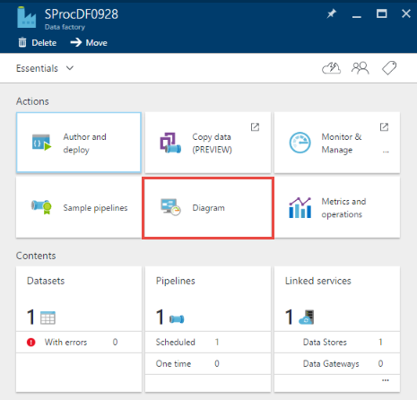

<properties 
    pageTitle="Stored Procedure attività di SQL Server" 
    description="Informazioni su come utilizzare le attività di SQL Server archiviati procedura per richiamare una stored procedure in un Database SQL Azure o Azure SQL Data Warehouse da una pipeline di dati Factory." 
    services="data-factory" 
    documentationCenter="" 
    authors="spelluru" 
    manager="jhubbard" 
    editor="monicar"/>

<tags 
    ms.service="data-factory" 
    ms.workload="data-services" 
    ms.tgt_pltfrm="na" 
    ms.devlang="na" 
    ms.topic="article" 
    ms.date="09/30/2016" 
    ms.author="spelluru"/>

# Stored Procedure attività di SQL Server
> [AZURE.SELECTOR]
[Hive](data-factory-hive-activity.md)  
[Maialino](data-factory-pig-activity.md)  
[MapReduce](data-factory-map-reduce.md)  
[Streaming Hadoop](data-factory-hadoop-streaming-activity.md)
[Apprendimento](data-factory-azure-ml-batch-execution-activity.md) 
[Stored Procedure](data-factory-stored-proc-activity.md)
[Dati Lake Analitica U-SQL](data-factory-usql-activity.md)
[.NET personalizzato](data-factory-use-custom-activities.md)

È possibile utilizzare l'attività di SQL Server Stored Procedure in una Data Factory [pipeline](data-factory-create-pipelines.md) per richiamare una stored procedure in uno degli archivi di dati seguenti: 

- Database SQL Azure 
- SQL Azure Data Warehouse  
- Database di SQL Server nell'organizzazione oppure una macchina virtuale Azure. È necessario installare il Gateway di gestione dati nello stesso computer che ospita i database o su un computer separato per evitare concorrenti per le risorse con il database. Gateway di gestione dati è un programma che si connette locale dati origini/origini ospitate in macchine virtuali di Azure ai servizi cloud in modo sicuro e gestito. Vedere l'articolo [spostare dati tra locali e cloud](data-factory-move-data-between-onprem-and-cloud.md) per informazioni dettagliate su Gateway di gestione dati. 

In questo articolo si basa su articolo [le attività di trasformazione dati](data-factory-data-transformation-activities.md) , che viene fornita una panoramica generale di trasformazione dei dati e le attività di trasformazione supportati.

## Procedura dettagliata

### Tabella di esempio e stored procedure
1. Creare la seguente **tabella** nel Database di SQL Azure con SQL Server Management Studio o un altro strumento si ha familiarità con. La colonna datetimestamp è la data e ora corrispondente ID viene generato. 

        CREATE TABLE dbo.sampletable
        (
            Id uniqueidentifier,
            datetimestamp nvarchar(127)
        )
        GO

        CREATE CLUSTERED INDEX ClusteredID ON dbo.sampletable(Id);
        GO

    ID è identificato univoco e la colonna datetimestamp è la data e ora corrispondente ID viene generato.
    

    > [AZURE.NOTE] In questo esempio viene utilizzato il Database di SQL Azure, ma funziona nello stesso modo per Azure SQL Data Warehouse e Database di SQL Server. 
2. Creare le seguenti **stored procedure di** che consente di inserire dati in a **sampletable**.

        CREATE PROCEDURE sp_sample @DateTime nvarchar(127)
        AS
        
        BEGIN
            INSERT INTO [sampletable]
            VALUES (newid(), @DateTime)
        END

    > [AZURE.IMPORTANT] **Nome** e **le maiuscole e minuscole** del parametro (DateTime in questo esempio) deve corrispondere a quello del parametro specificato nella pipeline/attività JSON. Nella definizione della stored procedure, verificare che **@** viene utilizzato come un prefisso per il parametro.
    
### Creare una factory di dati  
4. Accedere al [portale di Azure](https://portal.azure.com/). 
5. Fare clic su **Nuovo** nel menu a sinistra, fare clic su **Intelligence + Analitica**e fare clic su **Factory dati**.
    
       
4.  Per il nome e il **Nuovo factory di dati** , utilizzare **SProcDF** . Azure Data Factory nomi sono **univoci**. È necessario anteporre al nome della factory dati con il proprio nome, per consentire la creazione della factory.

          
3.  Selezionare l' **abbonamento Azure**. 
4.  Per **Gruppo di risorse**, eseguire una delle operazioni seguenti: 
    1.  Fare clic su **Crea nuovo** e immettere un nome per il gruppo di risorse.
    2.  Fare clic su **Usa esistente** e selezionare un gruppo di risorse esistenti.  
5.  Selezionare il **percorso** per la factory di dati.
6.  Selezionare **Aggiungi a dashboard** in modo che è possibile visualizzare la factory di dati nel dashboard di nuovamente che l'accesso. 
6.  Fare clic su **Crea** in e il **Nuovo factory di dati** .
6.  Viene visualizzato il produttore dati viene creato nel **dashboard** del portale di Azure. Dopo la factory di dati è stata creata correttamente, viene visualizzata la pagina factory dati, che mostra il contenuto della factory dati.
    

### Creare un servizio di SQL Azure collegato  
Dopo aver creato la factory di dati, si crea un servizio di SQL Azure collegato che i collegamenti ai Database di SQL Azure su factory dati. Questo database contiene il sampletable stored procedure di tabella e sp_sample.

7.  Fare clic su **autore e distribuire** in e il **Produttore di dati** per **SProcDF** avviare l'Editor di Factory di dati.
2.  Fare clic su **nuovo archivio dati** sulla barra dei comandi e scegliere **Il Database di SQL Azure**. Verrà visualizzato lo script JSON per la creazione di un servizio di SQL Azure collegato nell'editor. 

    
4. In script JSON, apportare le modifiche seguenti: 
    1. Sostituire ** &lt;nomeserver&gt; ** con il nome del server di Database SQL Azure.
    2. Sostituire ** &lt;databasename&gt; ** con il database in cui è stato creato la tabella e stored procedure.
    3. Sostituire ** &lt; username@servername ** con l'account utente che ha accesso al database.
    4. Sostituire ** &lt;password&gt; ** con la password per l'account utente. 

    
5. Fare clic su **Distribuisci** della barra dei comandi per distribuire il servizio collegato. Verificare che sia visualizzata AzureSqlLinkedService nella visualizzazione albero a sinistra. 

    

### Creare un set di dati di output
6. Fare clic su **... Ulteriori** sulla barra degli strumenti, fare clic su **nuovo set di dati**e fare clic su **SQL Azure**. **Nuovo set di dati** nella barra dei comandi e selezionare **SQL Azure**.

    
7. Copiare e incollare il seguente script JSON all'editor di JSON.

        {               
            "name": "sprocsampleout",
            "properties": {
                "type": "AzureSqlTable",
                "linkedServiceName": "AzureSqlLinkedService",
                "typeProperties": {
                    "tableName": "sampletable"
                },
                "availability": {
                    "frequency": "Hour",
                    "interval": 1
                }
            }
        }
7. Fare clic su **Distribuisci** della barra dei comandi per distribuire il set di dati. Verificare che sia visualizzata il set di dati nella visualizzazione struttura. 

    

### Creare una pipeline con SqlServerStoredProcedure attività
A questo punto, creare una pipeline con un'attività SqlServerStoredProcedure.
 
9. Fare clic su **... Ulteriori** sul comando a barre e fare clic su **nuova pipeline**. 
9. Copiare e incollare il frammento di JSON seguente. **NomeStoredProcedure** impostato su **sp_sample**. Nome e le maiuscole e minuscole del parametro **DateTime** deve corrispondere al nome e le maiuscole e minuscole del parametro nella definizione della stored procedure.  

        {
            "name": "SprocActivitySamplePipeline",
            "properties": {
                "activities": [
                    {
                        "type": "SqlServerStoredProcedure",
                        "typeProperties": {
                            "storedProcedureName": "sp_sample",
                            "storedProcedureParameters": {
                                "DateTime": "$$Text.Format('{0:yyyy-MM-dd HH:mm:ss}', SliceStart)"
                            }
                        },
                        "outputs": [
                            {
                                "name": "sprocsampleout"
                            }
                        ],
                        "scheduler": {
                            "frequency": "Hour",
                            "interval": 1
                        },
                        "name": "SprocActivitySample"
                    }
                ],
                "start": "2016-08-02T00:00:00Z",
                "end": "2016-08-02T05:00:00Z",
                "isPaused": false
            }
        }

    Se è necessario passare null per un parametro, utilizzare la sintassi seguente: "param1": null (interamente in lettere minuscole). 
9. Fare clic su **Distribuisci** sulla barra degli strumenti per distribuire la pipeline.  

### Monitorare il gadget pipeline

6. Fare clic sulla **X** per chiudere pale dati Factory Editor e per tornare a e il produttore di dati e fare clic su **diagramma**.

    
7. In **Visualizzazione Diagramma**, viene visualizzato una panoramica di tubazioni e set di dati utilizzati in questa esercitazione. 

    
8. Nella visualizzazione Diagramma, fare doppio clic sul set di dati **sprocsampleout**. Vedere le sezioni nello stato pronto. Deve essere cinque sezioni poiché viene prodotta una sezione per ogni ora tra l'ora di inizio e ora di fine dalla JSON.

     
10. Quando una sezione è **Pronto** , eseguire una * *Selezionare* sampletable** query sul database di SQL Azure per verificare che i dati è stati inseriti alla tabella dalla stored procedure.

    

    Per informazioni dettagliate sul monitoraggio pipeline di Azure Data Factory, vedere [Monitor la pipeline](data-factory-monitor-manage-pipelines.md) .  

> [AZURE.NOTE] In questo esempio, il SprocActivitySample non contiene input. Se si desidera collegare l'attività a un'attività monte (vale a dire elaborazione precedente), gli output dell'attività padre possono essere utilizzati come input in questa attività. In questo caso, l'attività non viene eseguito finché non viene completata l'attività padre e gli output delle attività padre sono disponibili (in stato pronto). Non è possibile utilizzare gli input direttamente come parametro all'attività stored procedure

## Formato JSON
    {
        "name": "SQLSPROCActivity",
        "description": "description", 
        "type": "SqlServerStoredProcedure",
        "inputs":  [ { "name": "inputtable"  } ],
        "outputs":  [ { "name": "outputtable" } ],
        "typeProperties":
        {
            "storedProcedureName": "<name of the stored procedure>",
            "storedProcedureParameters":  
            {
                "param1": "param1Value"
                …
            }
        }
    }

## Proprietà JSON

Proprietà | Descrizione | Obbligatorio
-------- | ----------- | --------
nome | Nome dell'attività | Sì
Descrizione | Testo che descrive l'attività utilizzato per | No
tipo | SqlServerStoredProcedure | Sì
ingressi | Facoltativo. Se si specifica un set di dati di input, devono essere disponibile (in stato "Pronto") per l'attività stored procedure per l'esecuzione. Il set di dati di input non può essere utilizzato nella stored procedure come parametro. Viene utilizzato solo per controllare la dipendenza prima di iniziare l'attività stored procedure. | No
output | È necessario specificare un set di dati di output per un'attività stored procedure. Set di dati di output specifica la **programmazione** dell'attività stored procedure (ogni ora, settimanale, mensile, ecc.).   Il set di dati di output deve utilizzare un **servizio collegata** che fa riferimento a un Database di SQL Azure o un Data Warehouse SQL Azure o un Database di SQL Server in cui si desidera stored procedure da eseguire.   Il set di dati di output può essere utilizzato un modo per passare il risultato della stored procedure per successive da un'altra attività ([concatenazione attività](data-factory-scheduling-and-execution.md#chaining-activities)) nella pipeline di elaborazione. Tuttavia, Data Factory non automaticamente scrivere l'output di una stored procedure in questo set di dati. Si tratta stored procedure che scrive in una tabella SQL in cui il set di dati di output di puntamento.   In alcuni casi, il set di dati di output può essere un **set di dati fittizi**, che viene utilizzato esclusivamente per specificare la pianificazione per l'esecuzione di attività stored procedure. | Sì
NomeStoredProcedure | Specificare il nome della stored procedure nel database di SQL Azure o Warehouse di dati di SQL Azure è rappresentato da servizi collegati che utilizza la tabella di output. | Sì
storedProcedureParameters | Specificare i valori per parametri di stored procedure. Se è necessario passare null per un parametro, utilizzare la sintassi seguente: "param1": null (lettere minuscole). Vedere nell'esempio seguente per informazioni sull'uso di questa proprietà.| No

## Passando un valore statico 
A questo punto, di seguito è possibile aggiungere un'altra colonna denominata 'Uno Scenario' nella tabella che contiene un valore statico denominato 'Documento esempio'.

    CREATE PROCEDURE sp_sample @DateTime nvarchar(127) , @Scenario nvarchar(127)
    
    AS
    
    BEGIN
        INSERT INTO [sampletable]
        VALUES (newid(), @DateTime, @Scenario)
    END

A questo punto, passare il parametro Scenario e il valore da attività stored procedure. La sezione typeProperties nell'esempio precedente è simile al frammento di codice seguente:

    "typeProperties":
    {
        "storedProcedureName": "sp_sample",
        "storedProcedureParameters": 
        {
            "DateTime": "$$Text.Format('{0:yyyy-MM-dd HH:mm:ss}', SliceStart)",
            "Scenario": "Document sample"
        }
    }

