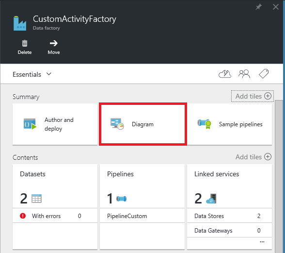
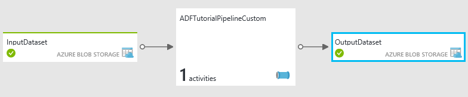
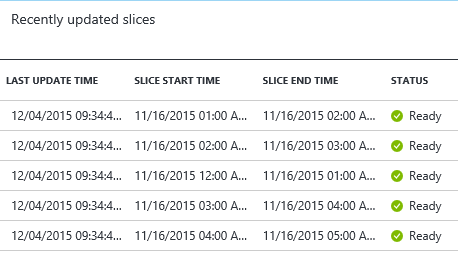

<properties
    pageTitle="Usare le attività personalizzate in una pipeline di Azure Data Factory"
    description="Informazioni su come creare attività personalizzate e utilizzarli in una pipeline di Azure Data Factory."
    services="data-factory"
    documentationCenter=""
    authors="spelluru"
    manager="jhubbard"
    editor="monicar"/>

<tags
    ms.service="data-factory"
    ms.workload="data-services"
    ms.tgt_pltfrm="na"
    ms.devlang="na"
    ms.topic="article"
    ms.date="10/17/2016"
    ms.author="spelluru"/>

# Usare le attività personalizzate in una pipeline di Azure Data Factory
> [AZURE.SELECTOR]
[Hive](data-factory-hive-activity.md)  
[Maialino](data-factory-pig-activity.md)  
[MapReduce](data-factory-map-reduce.md)  
[Streaming Hadoop](data-factory-hadoop-streaming-activity.md)
[Apprendimento](data-factory-azure-ml-batch-execution-activity.md) 
[Stored Procedure](data-factory-stored-proc-activity.md)
[Dati Lake Analitica U-SQL](data-factory-usql-activity.md)
[.NET personalizzato](data-factory-use-custom-activities.md)

Esistono due tipi di attività che è possibile utilizzare in una pipeline di Azure Data Factory.
 
- [Attività di spostamento dei dati](data-factory-data-movement-activities.md) da spostare i dati tra [archivi dati è supportato](data-factory-data-movement-activities.md#supported-data-stores).
- [Attività di trasformazione dati](data-factory-data-transformation-activities.md) a/processo di trasformazione dati tramite calcola ad esempio Azure HDInsight, Batch Azure e Azure apprendimento. Ad esempio: HDInsight Hive ed esecuzione Batch risorse nel computer.  

Se è necessario spostare i dati da/verso un archivio di dati che non è supportato dal produttore di dati di Azure, è possibile creare un'attività .NET personalizzata con la logica di spostamento dei dati e usare l'attività nella pipeline. 

Allo stesso modo, se è necessario elaborare/Trasforma i dati in modo che non è supportato dal produttore di dati, è possibile creare un'attività personalizzata con la logica di elaborazione dei dati e utilizzare l'attività nella pipeline.

> [AZURE.NOTE] Gateway di gestione dati attualmente supporta solo la copia e stored procedure attività nella Data Factory. Non è possibile utilizzare il gateway da un'attività personalizzata per accedere a origini dati locali.
 
È possibile configurare l'attività .NET personalizzato per l'esecuzione tramite un servizio di **Azure Batch** o un cluster di **Azure HDInsight** .   

Per istruzioni dettagliate per la creazione di un'attività personalizzata .NET e l'utilizzo di un'attività personalizzata in una pipeline, la procedura riportata di seguito. Procedura dettagliata utilizza il servizio di **Azure Batch** collegato. Usare Azure HDInsight collegato servizio se, tuttavia, si crea un servizio collegato di tipo **HDInsight** (se si usa il proprio cluster HDInsight) o **HDInsightOnDemand** (se si vuole Factory di dati per creare un cluster di HDInsight su richiesta) e usarlo nell'area attività della pipeline JSON (**linkedServiceName**). Vedere la sezione [uso Azure HDInsight collegato servizi](#use-azure-hdinsight-linked-services) per informazioni dettagliate sull'uso di Azure HDInsight per l'esecuzione di un'attività personalizzata.

> [AZURE.IMPORTANT] Versione set 4.5.2 di .NET Framework come framework di destinazione per un progetto di un'attività personalizzata .NET in Visual Studio. Dati Factory non supporta le attività personalizzate compilate con le versioni di .NET Framework oltre 4.5.2.   

## Procedura dettagliata 

### Prerequisiti

- Visual Studio 2012/2013/2015
- Scaricare e installare [Azure.NET SDK][azure-developer-center]

### Prerequisiti Batch Azure
Nella procedura dettagliata, eseguire le attività .NET personalizzate con una risorsa di elaborazione Batch di Azure. Vedere [Nozioni fondamentali sulla Azure Batch] [ batch-technical-overview] per una panoramica del Batch di Azure service e vedere [Guida introduttiva di Azure Batch raccolta per .NET] [ batch-get-started] per iniziare rapidamente con il servizio di Azure Batch.

Per l'esercitazione, è necessario creare un account Azure Batch con un pool di macchine virtuali. Ecco i passaggi:

1. Creare un **Batch di Azure account** tramite il [portale di Azure](http://manage.windowsazure.com). Vedere [creare e gestire un account Azure Batch] [ batch-create-account] articolo per istruzioni. Nota premuto il tasto di account e nome account Azure Batch.

    È inoltre possibile utilizzare [Nuovo AzureBatchAccount] [ new-azure-batch-account] cmdlet per creare un account Azure Batch. Vedere [Uso di Azure PowerShell per gestire Account Batch Azure] [ azure-batch-blog] per informazioni dettagliate sull'uso di questo cmdlet.
2. Creare un **Batch di Azure pool**.
    1. Nel [portale di Azure](https://portal.azure.com), fare clic su **Sfoglia** nel menu a sinistra e fare clic su **Account Batch**. 
    2. Selezionare il proprio account Azure Batch per aprire e il **Batch di Account** . 
    3. Fare clic su riquadro **pool** .
    4. Selezionare il pulsante Aggiungi sulla barra degli strumenti per aggiungere un pool e il **pool** .
        1. Immettere un ID per il pool (**ID pool di applicazioni**). Nota l' **ID del pool**. necessarie per creare la soluzione Factory dati. 
        2. Specificare l'impostazione nei sistemi operativi **Windows Server 2012 R2** .
        3. Selezionare un **livello di nodo prezzi**. 
        3. Immettere **2** come valore rispetto all'impostazione della **Destinazione dedicato** .
        4. Immettere **2** come valore per l'impostazione di **attività Max per nodo** .
    5. Fare clic su **OK** per creare il pool. 
 
    È anche possibile utilizzare cmdlet [New-AzureBatchPool](https://msdn.microsoft.com/library/mt628690.aspx) per creare un pool di Azure Batch.    

### Passaggi di alto livello 
1.  Usare una pipeline Factory dati, **creare un'attività personalizzata** . L'attività personalizzata in questo esempio contiene la logica di trasformazione/elaborazione di dati. 
    1.  In Visual Studio, creare un progetto libreria di classi .NET, aggiungere il codice per elaborare dati di input e compilare il progetto. 
    2.  Comprimere tutti i file binari e il file PDB (facoltativo) nella cartella di output.  
    3.  Caricare il file zip in archiviazione blob Azure. La procedura dettagliata è in crea la sezione di un'attività personalizzata. 
2. **Creare una factory di dati di Azure che utilizza un'attività personalizzata**:
    1. Creare una factory di dati di Azure.
    2. Creare servizi collegati.
        1. AzureStorageLinkedService: Fornisce le credenziali di spazio di archiviazione per l'accesso a BLOB.
        2. AzureBatchLinkedService: specifica Azure Batch come calcolare.
    3. Creare set di dati.
        1. InputDataset: specifica contenitore dello spazio di archiviazione e la cartella per i BLOB inpui.
        1. OuputDataset: specifica contenitore dello spazio di archiviazione e la cartella per i BLOB di output.
    2. Creare una pipeline che utilizza un'attività personalizzata.
    3. Eseguire e testare la pipeline.
    4. Eseguire il debug la pipeline.

## Creare un'attività personalizzata
Per creare un'attività personalizzata .NET, creare un progetto **Libreria di classi .NET** con una classe implementata da tale interfaccia **IDotNetActivity** . Questa interfaccia dispone di uno dei metodi: [esecuzione](https://msdn.microsoft.com/library/azure/mt603945.aspx) e la firma è:

    public IDictionary<string, string> Execute(
            IEnumerable<LinkedService> linkedServices, 
            IEnumerable<Dataset> datasets, 
            Activity activity, 
            IActivityLogger logger)
        

Il metodo accetta quattro parametri:

- **linkedServices**. Questa proprietà è un elenco enumerabile servizi collegati che collegare origini dati di input/output (ad esempio: archiviazione Blob Azure) su factory dati. In questo esempio è disponibile solo un servizio collegato del tipo di archiviazione di Azure utilizzato per l'input e output. 
- **set di dati**. Questa proprietà è un elenco enumerabile di set di dati. È possibile utilizzare questo parametro per ottenere i percorsi e gli schemi definiti set di dati di input e di output.
- **attività**. Questa proprietà rappresenta l'elaborazione entità corrente, in questo caso un Batch di Azure.
- **logger**. Questo oggetto consente di scrivere i commenti di debug tale superficie come log di "Utente" per la pipeline. 

Viene restituito un dizionario che può essere utilizzato per concatenare attività personalizzate in futuro. Questa caratteristica non ancora implementata, pertanto restituire un dizionario vuoto dal metodo.  

### Procedura 
1.  Creare un progetto **Libreria di classi .NET** .
    <ol type="a">
        <li>Avviare <b>Visual Studio 2015</b> o <b>Visual Studio 2013</b> oppure <b>Visual Studio 2012</b>.</li>
        <li>Fare clic su <b>File</b>, scegliere <b>Nuovo</b>e fare clic su <b>progetto</b>.</li>
        <li>Espandere <b>modelli</b>e selezionare <b>Visual c#</b>. In questa procedura dettagliata, si utilizza c#, ma è possibile utilizzare qualsiasi linguaggio .NET per sviluppare l'attività personalizzata.</li>
        <li>Selezionare <b>Libreria di classi</b> dall'elenco dei tipi di progetto a destra.</li>
        <li>Immettere <b>MyDotNetActivity</b> per <b>nome</b>.</li>
        <li>Selezionare <b>C:\ADFGetStarted</b> relativa al <b>percorso</b>.</li>
        <li>Fare clic su <b>OK</b> per creare il progetto.</li>
    </ol>
2.  Fare clic su **Strumenti**, scegliere **Gestione pacchetti NuGet**e fare clic su **Gestione pacchetti Console**.
3.  Nella Console di gestione pacchetti, eseguire il seguente comando per importare **Microsoft.Azure.Management.DataFactories**.

        Install-Package Microsoft.Azure.Management.DataFactories

4. Importare il pacchetto di NuGet **Archiviazione Azure** al progetto.

        Install-Package Azure.Storage

5. Aggiungere le seguenti istruzioni **using** al file di origine nel progetto.

        using System.IO;
        using System.Globalization;
        using System.Diagnostics;
        using System.Linq;

        using Microsoft.Azure.Management.DataFactories.Models;
        using Microsoft.Azure.Management.DataFactories.Runtime;

        using Microsoft.WindowsAzure.Storage;
        using Microsoft.WindowsAzure.Storage.Blob;

6. Modificare il nome dello spazio dei **nomi** in **MyDotNetActivityNS**.

        namespace MyDotNetActivityNS

7. Modificare il nome della classe in **MyDotNetActivity** e derivano dall'interfaccia **IDotNetActivity** come illustrato nel frammento di codice seguenti:

        public class MyDotNetActivity : IDotNetActivity

8. Implementare (Aggiungi) **Execute** metodo dell'interfaccia **IDotNetActivity** per la classe **MyDotNetActivity** e copiare il metodo di esempio riportato di seguito.

    Nell'esempio seguente viene contato il numero di occorrenze del termine di ricerca ("Microsoft") in ogni blob associato a una sezione di dati. 

        /// 

        /// Execute method is the only method of IDotNetActivity interface you must implement. 
        /// In this sample, the method invokes the Calculate method to perform the core logic.  
        /// 

        public IDictionary<string, string> Execute(
            IEnumerable<LinkedService> linkedServices,
            IEnumerable<Dataset> datasets,
            Activity activity,
            IActivityLogger logger)
        {
            // to get extended properties (for example: SliceStart)
            DotNetActivity dotNetActivity = (DotNetActivity)activity.TypeProperties;
            string sliceStartString = dotNetActivity.ExtendedProperties["SliceStart"];

            // to log all extended properties           
            IDictionary<string, string> extendedProperties = dotNetActivity.ExtendedProperties;
            logger.Write("Logging extended properties if any...");
            foreach (KeyValuePair<string, string> entry in extendedProperties)
            {
                logger.Write("<key:{0}> <value:{1}>", entry.Key, entry.Value);
            }
        
            // declare types for input and output data stores
            AzureStorageLinkedService inputLinkedService;

            // declare dataset types
            CustomDataset inputLocation;
            AzureBlobDataset outputLocation;

            Dataset inputDataset = datasets.Single(dataset => dataset.Name == activity.Inputs.Single().Name);
            inputLocation = inputDataset.Properties.TypeProperties as CustomDataset;

            foreach (LinkedService ls in linkedServices)
                logger.Write("linkedService.Name {0}", ls.Name);

            // using First method instead of Single since we are using the same 
            // Azure Storage linked service for input and output. 
            inputLinkedService = linkedServices.First(
                linkedService =>
                linkedService.Name ==
                inputDataset.Properties.LinkedServiceName).Properties.TypeProperties
                as AzureStorageLinkedService;

            string connectionString = inputLinkedService.ConnectionString; 

            // To create an input storage client.
            string folderPath = GetFolderPath(inputDataset);
            string output = string.Empty; // for use later.

            // create storage client for input. Pass the connection string.
            CloudStorageAccount inputStorageAccount = CloudStorageAccount.Parse(connectionString);
            CloudBlobClient inputClient = inputStorageAccount.CreateCloudBlobClient();

            // initialize the continuation token before using it in the do-while loop.
            BlobContinuationToken continuationToken = null;
            do
            {   // get the list of input blobs from the input storage client object.
                BlobResultSegment blobList = inputClient.ListBlobsSegmented(folderPath,
                                         true,
                                         BlobListingDetails.Metadata,
                                         null,
                                         continuationToken,
                                         null,
                                         null);
                
                // Calculate method returns the number of occurrences of 
                // the search term (“Microsoft”) in each blob associated
                // with the data slice. definition of the method is shown in the next step.
 
                output = Calculate(blobList, logger, folderPath, ref continuationToken, "Microsoft");

            } while (continuationToken != null);

            // get the output dataset using the name of the dataset matched to a name in the Activity output collection.
            Dataset outputDataset = datasets.Single(dataset => dataset.Name == activity.Outputs.Single().Name);
            // convert to blob location object.
            outputLocation = outputDataset.Properties.TypeProperties as AzureBlobDataset;

            folderPath = GetFolderPath(outputDataset);

            logger.Write("Writing blob to the folder: {0}", folderPath);

            // create a storage object for the output blob.
            CloudStorageAccount outputStorageAccount = CloudStorageAccount.Parse(connectionString);
            // write the name of the file. 
            Uri outputBlobUri = new Uri(outputStorageAccount.BlobEndpoint, folderPath + "/" + GetFileName(outputDataset));

            logger.Write("output blob URI: {0}", outputBlobUri.ToString());
            // create a blob and upload the output text.
            CloudBlockBlob outputBlob = new CloudBlockBlob(outputBlobUri, outputStorageAccount.Credentials);
            logger.Write("Writing {0} to the output blob", output);
            outputBlob.UploadText(output);

            // The dictionary can be used to chain custom activities together in the future.
            // This feature is not implemented yet, so just return an empty dictionary.  

            return new Dictionary<string, string>();
        }

9. Aggiungere i metodi di supporto seguenti. Il metodo **Execute** richiama questi metodi di supporto. Il metodo **GetConnectionString** recupera la stringa di connessione di archiviazione Azure e il metodo **GetFolderPath** recupera la posizione blob. In particolare, il metodo **Calculate** isola il codice che scorre ogni blob.

        /// 

        /// Gets the folderPath value from the input/output dataset.
        /// 

        private static string GetFolderPath(Dataset dataArtifact)
        {
            if (dataArtifact == null || dataArtifact.Properties == null)
            {
                return null;
            }

            AzureBlobDataset blobDataset = dataArtifact.Properties.TypeProperties as AzureBlobDataset;
            if (blobDataset == null)
            {
                return null;
            }

            return blobDataset.FolderPath;
        }

        /// 

        /// Gets the fileName value from the input/output dataset.   
        /// 

        private static string GetFileName(Dataset dataArtifact)
        {
            if (dataArtifact == null || dataArtifact.Properties == null)
            {
                return null;
            }

            AzureBlobDataset blobDataset = dataArtifact.Properties.TypeProperties as AzureBlobDataset;
            if (blobDataset == null)
            {
                return null;
            }

            return blobDataset.FileName;
        }

        /// 

        /// Iterates through each blob (file) in the folder, counts the number of instances of search term in the file, 
        /// and prepares the output text that is written to the output blob. 
        /// 

        public static string Calculate(BlobResultSegment Bresult, IActivityLogger logger, string folderPath, ref BlobContinuationToken token, string searchTerm)
        {
            string output = string.Empty;
            logger.Write("number of blobs found: {0}", Bresult.Results.Count<IListBlobItem>());
            foreach (IListBlobItem listBlobItem in Bresult.Results)
            {
                CloudBlockBlob inputBlob = listBlobItem as CloudBlockBlob;
                if ((inputBlob != null) && (inputBlob.Name.IndexOf("$$$.$$$") == -1))
                {
                    string blobText = inputBlob.DownloadText(Encoding.ASCII, null, null, null);
                    logger.Write("input blob text: {0}", blobText);
                    string[] source = blobText.Split(new char[] { '.', '?', '!', ' ', ';', ':', ',' }, StringSplitOptions.RemoveEmptyEntries);
                    var matchQuery = from word in source
                                     where word.ToLowerInvariant() == searchTerm.ToLowerInvariant()
                                     select word;
                    int wordCount = matchQuery.Count();
                    output += string.Format("{0} occurrences(s) of the search term \"{1}\" were found in the file {2}.\r\n", wordCount, searchTerm, inputBlob.Name);
                }
            }
            return output;
        }

    Il metodo GetFolderPath restituisce il percorso per la cartella in cui il set di dati di puntamento e il metodo GetFileName restituisce il nome del file blob/che indichi il set di dati. Se si havefolderPath definisce l'utilizzo di variabili, ad esempio {anno}, {mese}, {Day} e così via, il metodo restituisce il valore string che senza sostituirli con valori di runtime. Vedere la sezione [accesso proprietà estese](#access-extended-properties) per informazioni dettagliate sull'accesso ai SliceStart, SliceEnd e così via.    
    
            "name": "InputDataset",
            "properties": {
                "type": "AzureBlob",
                "linkedServiceName": "AzureStorageLinkedService",
                "typeProperties": {
                    "fileName": "file.txt",
                    "folderPath": "adftutorial/inputfolder/",
    
    Il metodo Calculate calcola il numero di istanze della parola chiave Microsoft nei file di input (BLOB nella cartella). Al termine di ricerca ("Microsoft") è hardcoded nel codice.

10. Compilare il progetto. Fare clic su **Compila** dal menu di scelta e fare clic su **Compila soluzione**.

    > [AZURE.IMPORTANT] Versione del set 4.5.2 di .NET Framework di destinazione per il progetto: fare clic sul progetto e fare clic su **proprietà** per impostare il framework di destinazione. Dati Factory non supporta le attività personalizzate compilate con le versioni di .NET Framework oltre 4.5.2. 
11. Avviare **Esplora risorse**e passare alla cartella **bin\debug** o **bin\release** a seconda del tipo di compilazione.
12. Creare un file zip **MyDotNetActivity.zip** contenente tutti i file binari nel <project folder>cartella \bin\Debug. Può essere necessario includere il file **MyDotNetActivity.pdb** in modo da ottenere ulteriori dettagli, ad esempio il numero di riga nel codice sorgente che generano il problema, se si è verificato un errore. Tutti i file in file zip per un'attività personalizzata devono essere di **livello superiore** con senza sottocartelle.

    
13. Caricare **MyDotNetActivity.zip** come blob al contenitore di blob: **customactivitycontainer** in archiviazione blob Azure che **AzureStorageLinkedService** collegato servizio in **ADFTutorialDataFactory** ottimali.  Creare il contenitore blob **customactivitycontainer** se non esiste già.

> [AZURE.NOTE] Se si aggiunge il progetto di attività .NET a una soluzione in Visual Studio che contiene un progetto Factory dati e aggiunta un riferimento a .NET attività progetto dal progetto di applicazione Factory dati, non è necessario eseguire gli ultimi due passaggi di manualmente la creazione del file zip e caricarlo in archiviazione blob Azure. Quando si pubblicano entità Factory dati utilizzando Visual Studio, la procedura seguente vengono eseguita automaticamente dal processo di pubblicazione. Vedere gli articoli [creare il prima pipeline utilizzando Visual Studio](data-factory-build-your-first-pipeline-using-vs.md) e [copiare i dati dalla Blob Azure di SQL Azure](data-factory-copy-activity-tutorial-using-visual-studio.md) per imparare a creare e pubblicare le entità Factory dati utilizzando Visual Studio.  

### Eseguire metodo

In questa sezione fornisce ulteriori dettagli e le note relative al codice nel metodo **Execute** .
 
1. I membri per scorrere l'insieme di input si trovano nello spazio dei nomi [Microsoft.WindowsAzure.Storage.Blob](https://msdn.microsoft.com/library/azure/microsoft.windowsazure.storage.blob.aspx) . Scorrere l'insieme di blob richiede l'utilizzo della classe **BlobContinuationToken** . In pratica, è necessario utilizzare un'-durante il ciclo del token come meccanismo per uscire dal ciclo. Per ulteriori informazioni, vedere [come utilizzare l'archiviazione Blob da .NET](../storage/storage-dotnet-how-to-use-blobs.md). Un ciclo di base è illustrato di seguito:

        // Initialize the continuation token.
        BlobContinuationToken continuationToken = null;
        do
        {   
            // Get the list of input blobs from the input storage client object.
            BlobResultSegment blobList = inputClient.ListBlobsSegmented(folderPath,
                                      true,
                                      BlobListingDetails.Metadata,
                                      null,
                                      continuationToken,
                                      null,
                                      null);
            // Return a string derived from parsing each blob.
            output = Calculate(blobList, logger, folderPath, ref continuationToken, "Microsoft");
        } while (continuationToken != null);

    Vedere la documentazione per il metodo [ListBlobsSegmented](https://msdn.microsoft.com/library/jj717596.aspx) per informazioni dettagliate.

2.  Il codice per l'utilizzo in modo logico all'interno del set di BLOB viene inserito all'interno di si-durante il ciclo. Nel metodo **Execute** si-mentre ciclo passa l'elenco dei BLOB a un metodo denominato **Calculate**. Il metodo restituisce la variabile di **output** è il risultato di visto scorrere tutti i BLOB segmento stringa. 

    Restituisce il numero di occorrenze del termine di ricerca (**Microsoft**) BLOB passato al metodo di **calcolo** . 

            output += string.Format("{0} occurrences of the search term \"{1}\" were found in the file {2}.\r\n", wordCount, searchTerm, inputBlob.Name);

3.  Dopo il metodo **Calculate** ha eseguito le operazioni, devono essere scritte in un nuovo blob. In modo che per ogni set di BLOB elaborate, è possibile scrivere un nuovo blob con i risultati. Per scrivere un nuovo blob, è prima necessario individuare il set di dati di output. 

            // Get the output dataset using the name of the dataset matched to a name in the Activity output collection.
            Dataset outputDataset = datasets.Single(dataset => dataset.Name == activity.Outputs.Single().Name);

            // Convert to blob location object.
            outputLocation = outputDataset.Properties.TypeProperties as AzureBlobDataset;

4.  Il codice chiama anche un metodo di supporto: **GetFolderPath** per recuperare il percorso della cartella (il nome del contenitore dello spazio di archiviazione).
 
            folderPath = GetFolderPath(outputDataset);

    **GetFolderPath** viene eseguito il cast oggetto set di dati da un AzureBlobDataSet, che include una proprietà denominata FolderPath.
            
            AzureBlobDataset blobDataset = dataArtifact.Properties.TypeProperties as AzureBlobDataset;
            
            return blobDataset.FolderPath;

5.  Il codice chiama il metodo **GetFileName** per recuperare il nome del file (nome blob).  

            AzureBlobDataset blobDataset = dataArtifact.Properties.TypeProperties as AzureBlobDataset;

            return blobDataset.FileName;

6.  Il nome del file è scritto mediante la creazione di un oggetto URI. Costruttore URI utilizza la proprietà **BlobEndpoint** per restituire il nome del contenitore. Il percorso e il nome della cartella vengono aggiunti per costruire il blob di output URI.  

            // Write the name of the file. 
            Uri outputBlobUri = new Uri(outputStorageAccount.BlobEndpoint, folderPath + "/" + GetFileName(outputDataset));

7.  Il nome del file è stato scritto e a questo punto è possibile scrivere la stringa di output il metodo di calcolo in un nuovo blob:

            // Create a blob and upload the output text.
            CloudBlockBlob outputBlob = new CloudBlockBlob(outputBlobUri, outputStorageAccount.Credentials);
            logger.Write("Writing {0} to the output blob", output);
            outputBlob.UploadText(output);

## Creare la factory di dati tramite il portale di Azure

Nella sezione **creare un'attività personalizzata** creata un'attività personalizzata e caricare il file zip con file binari e il file PDB a un contenitore di blob Azure. In questa sezione, creata una Azure **factory dati** con una **pipeline** che utilizza **un'attività personalizzata**.
 
Il set di dati di input per un'attività personalizzata rappresenta BLOB (file) nella cartella input (adftutorial\inputfolder) nell'archiviazione blob. Il set di dati di output per l'attività rappresenta BLOB output nella cartella di output (adftutorial\outputfolder) in archiviazione blob. 

Creare un file denominato **file. txt** con il seguente contenuto e caricarlo in **adftutorial\inputfolder** (adftutorial è il nome del contenitore di blob Azure e CartellaInput è il nome della cartella in tale contenitore).

    test custom activity Microsoft test custom activity Microsoft

La cartella di input corrisponde a una sezione nella Factory di dati di Azure, anche se la cartella dispone di due o più file. Durante l'elaborazione di ogni sezione dalla pipeline di un'attività personalizzata scorre tutti i BLOB la cartella di input per tale sezione. 

Viene visualizzato un file con nella cartella adftutorial\output di output con una o più righe (come numero di BLOB nella cartella di input):
 
    2 occurrences(s) of the search term "Microsoft" were found in the file inputfolder/2015-11-16-00/file.txt.

Ecco i passaggi da che eseguire in questa sezione:

1. Creare una **factory di dati**.
2. **Servizi collegato** per il pool di Azure Batch di macchine virtuali in cui è in esecuzione di un'attività personalizzata e l'archiviazione di Azure che contiene i BLOB di ingresso/uscita. 
2. Input e di output **set di dati** che rappresentano input e output di un'attività personalizzata. 
3. **Pipeline** che utilizza un'attività personalizzata.
4. **Factory dati**. È crearne uno quando si pubblicano questi entità in Azure. 

> [AZURE.NOTE] Creare il **file. txt** e caricarlo in un contenitore di blob se non è già stato fatto. Vedere le istruzioni precedenti.  

### Passaggio 1: Creare la factory di dati

1.  Dopo avere effettuato l'accesso al portale di Azure, eseguire la procedura seguente:
    1.  Nel menu a sinistra, fare clic su **Nuovo** .
    2.  Fare clic su **dati + Analitica** e il **Nuovo** .
    3.  Fare clic su **Factory dati** nella e **analitica di dati** .
2.  Per il nome e il **Nuovo factory di dati** , utilizzare **CustomActivityFactory** . Il nome della factory dati Azure deve essere univoco globale. Se viene visualizzato l'errore: **dati factory nome "CustomActivityFactory" è non disponibile**, modificare il nome di dati (ad esempio **yournameCustomActivityFactory**) e provare a creare di nuovo.
3.  Fare clic sul **Nome del gruppo di risorse**e selezionare un gruppo di risorse esistente oppure creare un gruppo di risorse. 
4.  Verificare che venga usato corretto **abbonamento** e **area geografica** in cui si desidera factory dati da creare. 
5.  Fare clic su **Crea** in e il **Nuovo factory di dati** .
6.  Viene visualizzato il produttore dati viene creato nel **Dashboard** del portale di Azure.
7.  Dopo la factory di dati è stata creata correttamente, viene visualizzato e il Data Factory, che mostra il contenuto della factory dati.

### Passaggio 2: Creare servizi collegati

Servizi collegati collegamento archivi dati o servizi a un factory Azure dati di elaborazione. In questo passaggio si collegare l'account di archiviazione Azure e account Azure Batch factory i dati.

#### Creare il servizio di archiviazione di Azure collegato

1.  Fare clic sul **autore e distribuire** riquadro in e il **Produttore di dati** per **CustomActivityFactory**. Viene visualizzato l'Editor di Factory dei dati.
2.  Fare clic su **nuovo archivio dati** sulla barra dei comandi e scegliere **lo spazio di archiviazione Azure**. Verrà visualizzato lo script JSON per la creazione di un servizio di archiviazione di Azure collegato nell'editor.
3.  Sostituire **nome dell'account** con il nome dell'account Azure dello spazio di archiviazione e la **chiave account** con il tasto di scelta dell'account di archiviazione Azure. Per informazioni su come ottenere il codice di accesso di spazio di archiviazione, vedere [visualizzare, copia e lo spazio di archiviazione rigenera i tasti di scelta](../storage/storage-create-storage-account.md#view-copy-and-regenerate-storage-access-keys).
4.  Fare clic su **Distribuisci** della barra dei comandi per distribuire il servizio collegato.

#### Creare il Batch di Azure collegato servizio

2. Nell'Editor di dati Factory fare clic su **nuovo il calcolo** della barra dei comandi e selezionare **Il Batch di Azure** dal menu.
3. Per lo script JSON, apportare le modifiche seguenti:
    1. Specificare il nome account Azure Batch per la proprietà **nome account** . L' **URL** da **blade account Azure Batch** è nel formato seguente: http://**nome account**. region.batch.azure.com. Per la proprietà **batchUri** il JSON, è necessario **rimuovere "nome account."** dalla URL e usare il **nome account** per la proprietà JSON **nome account** .
    2. Specificare la chiave account Azure Batch per la proprietà **accessKey** . 
    3. Specificare il nome del pool di creata come parte dei prerequisiti per la proprietà **poolName** . È inoltre possibile specificare l'ID del pool di anziché il nome del pool.
    4. Specificare Azure Batch URI per la proprietà **batchUri** . Vedere le note in precedenza per proprietà **nome account** . Esempio: https://westus.batch.azure.com.  
    5. Specificare **AzureStorageLinkedService** per la proprietà **linkedServiceName** .
        
            {
              "name": "AzureBatchLinkedService",
              "properties": {
                "type": "AzureBatch",
                "typeProperties": {
                  "accountName": "myazurebatchaccount",
                  "batchUri": "https://westus.batch.azure.com",
                  "accessKey": "<yourbatchaccountkey>",
                  "poolName": "myazurebatchpool",
                  "linkedServiceName": "AzureStorageLinkedService"
                }
              }
            }

        Per la proprietà **poolName** , è possibile specificare anche l'ID del pool di anziché il nome del pool.

    > [AZURE.NOTE] Il servizio Factory dati non supporta un'opzione su richiesta per il Batch di Azure come avviene per HDInsight. È possibile utilizzare solo un Batch di Azure pool di in una factory di dati di Azure.
    
### Passaggio 3: Creare set di dati
In questo passaggio si crea set di dati per rappresentare dati di input e di output.

#### Creare set di dati input
1.  **Nell'Editor** Factory dati, fare clic sul pulsante **nuovo set di dati** sulla barra degli strumenti e fare clic su **archiviazione Blob Azure** dal menu a discesa.
2.  Sostituire JSON nel riquadro destro, con il frammento di JSON seguente:

            {
                "name": "InputDataset",
                "properties": {
                    "type": "AzureBlob",
                    "linkedServiceName": "AzureStorageLinkedService",
                    "typeProperties": {
                        "folderPath": "adftutorial/customactivityinput/",
                        "format": {
                            "type": "TextFormat"
                        }
                    },
                    "availability": {
                        "frequency": "Hour",
                        "interval": 1
                    },
                    "external": true,
                    "policy": {}
                }
            }

    Si crea una pipeline più avanti in questa procedura dettagliata con ora di inizio: 2015-11-ora 16T00:00:00Z e di fine: 2015-11-16T05:00:00Z. È programmata per produrre dati ogni ora, pertanto non esistono 5 ingresso/uscita sezioni (compresa tra **00**: 00:00 -> **05**: 00:00). 

    La **frequenza** e l' **intervallo** per il set di dati di input è impostata su **ora** e **1**, in modo che la sezione input sia disponibile ogni ora. In questo esempio è lo stesso file (file. txt) nel intputfolder. 

    Ecco le ore di inizio per ogni sezione, viene rappresentato dalla variabile di sistema SliceStart frammento JSON sopra. 

    
3.  Fare clic su **Distribuisci** sulla barra degli strumenti per creare e distribuire **InputDataset**. Verificare che viene visualizzato il messaggio **Tabella CREATA correttamente** sulla barra del titolo dell'Editor.

#### Creare un set di dati di output

1. Nell' **editor Factory dati**, fare clic su **nuovo set di dati**e quindi fare clic su **archiviazione Blob Azure** della barra dei comandi.
2. Sostituire lo script JSON nel riquadro destro, con il seguente script JSON:

        {
            "name": "OutputDataset",
            "properties": {
                "type": "AzureBlob",
                "linkedServiceName": "AzureStorageLinkedService",
                "typeProperties": {
                    "fileName": "{slice}.txt",
                    "folderPath": "adftutorial/customactivityoutput/",
                    "partitionedBy": [
                        {
                            "name": "slice",
                            "value": {
                                "type": "DateTime",
                                "date": "SliceStart",
                                "format": "yyyy-MM-dd-HH"
                            }
                        }
                    ]
                },
                "availability": {
                    "frequency": "Hour",
                    "interval": 1
                }
            }
        }

    Percorso di output è **adftutorial/customactivityoutput/** e nome file di output è aaaa-MM-dd-HH.txt dove yyyy-MM-dd-HH è l'anno, mese, data e ora della sezione realizzata. Vedere [Informazioni di riferimento per sviluppatori] [ adf-developer-reference] per informazioni dettagliate.

    Per ogni sezione input viene generato un file o un blob output. Ecco come un file di output denominato per ogni sezione. Tutti i file di output vengono generati in una cartella di output: **adftutorial\customactivityoutput**.

  	| Sezione | Ora di inizio | File di output |
  	| :---- | :--------- | :---------- | 
  	| 1 | 2015-11-16T00:00:00 | 2015-11-16-00.txt |
  	| 2 | 2015-11-16T01:00:00 | 2015-11-16-01.txt |
  	| 3 | 2015-11-16T02:00:00 | 2015-11-16-02.txt |
  	| 4 | 2015-11-16T03:00:00 | 2015-11-16-03.txt |
  	| 5 | 2015-11-16T04:00:00 | 2015-11-16-04.txt |

    Tenere presente che tutti i file in una cartella di input fanno parte di una sezione con le ore di inizio indicati in precedenza. Durante l'elaborazione di questa sezione, un'attività personalizzata esamina ogni file e genera una riga nel file di output con il numero di occorrenze del termine di ricerca ("Microsoft"). Se sono presenti tre file nel CartellaInput, sono disponibili tre righe nel file di output per ogni sezione oraria: 2015-11-16-00.txt 2015-11-16:01:00:00.txt, e così via. 

2. Fare clic su **Distribuisci** della barra dei comandi per la distribuzione **OutputDataset**.

### Creare ed eseguire una pipeline che utilizza un'attività personalizzata

1. Editor Factory di dati, fare clic su **nuova pipeline di** barra dei comandi. Se il comando non è disponibile, fare clic su **... (Puntini di sospensione)** per visualizzarlo.
2. Sostituire JSON nel riquadro destro, con il seguente script JSON. 

        {
          "name": "ADFTutorialPipelineCustom",
          "properties": {
            "description": "Use custom activity",
            "activities": [
              {
                "Name": "MyDotNetActivity",
                "Type": "DotNetActivity",
                "Inputs": [
                  {
                    "Name": "InputDataset"
                  }
                ],
                "Outputs": [
                  {
                    "Name": "OutputDataset"
                  }
                ],
                "LinkedServiceName": "AzureBatchLinkedService",
                "typeProperties": {
                  "AssemblyName": "MyDotNetActivity.dll",
                  "EntryPoint": "MyDotNetActivityNS.MyDotNetActivity",
                  "PackageLinkedService": "AzureStorageLinkedService",
                  "PackageFile": "customactivitycontainer/MyDotNetActivity.zip",
                  "extendedProperties": {
                    "SliceStart": "$$Text.Format('{0:yyyyMMddHH-mm}', Time.AddMinutes(SliceStart, 0))"
                  }
                },
                "Policy": {
                  "Concurrency": 2,
                  "ExecutionPriorityOrder": "OldestFirst",
                  "Retry": 3,
                  "Timeout": "00:30:00",
                  "Delay": "00:00:00"
                }
              }
            ],
            "start": "2015-11-16T00:00:00Z",
            "end": "2015-11-16T05:00:00Z",
            "isPaused": false
          }
        }

    Noti quanto segue:

    - **Concorrenza** è impostato su **2** in modo da due sezioni vengono elaborate in parallelo 2 macchine virtuali nel pool di Azure Batch.
    - Nella sezione attività è presente un'attività ed è di tipo: **DotNetActivity**.
    - **AssemblyName** è impostato su nome della DLL: **MyDotnetActivity.dll**.
    - **Il punto di ingresso** è impostato su **MyDotNetActivityNS.MyDotNetActivity**.
    - **PackageLinkedService** è impostato su **AzureStorageLinkedService** che punta all'archiviazione blob che contiene il file zip di un'attività personalizzata. Se si utilizza account Azure archiviazione diversi per i file di ingresso/uscita e il file zip di un'attività personalizzata, verrà creato un altro servizio di archiviazione di Azure collegato. In questo articolo si presuppone che si usa lo stesso account di archiviazione Azure.
    - **PackageFile** è impostato su **customactivitycontainer/MyDotNetActivity.zip**. È in formato: containerforthezip/nameofthezip.zip.
    - L'attività personalizzata accetta **InputDataset** come input e **OutputDataset** come output.
    - La proprietà linkedServiceName di un'attività personalizzata punti **AzureBatchLinkedService**, che indica Azure Data Factory che un'attività personalizzata deve essere eseguito in macchine virtuali Batch Azure.
    - proprietà **isPaused** è impostato su **false** per impostazione predefinita. La pipeline esegue immediatamente in questo esempio perché le sezioni iniziare in passato. È possibile impostare questa proprietà su true per sospendere la pipeline e impostarla su false per riavviare. 
    - Ora di **inizio** e ora di **Fine** è **cinque** ore Dividi e le sezioni vengono eseguite ogni ora, in modo che le cinque sezioni sono prodotto dalla pipeline. 

4. Fare clic su **Distribuisci** sulla barra di comando per distribuire la pipeline.

### Monitorare il gadget pipeline
 
8. In e il produttore dati nel portale di Azure, fare clic su **diagramma**.
    
    
 
9. Nella visualizzazione Diagramma, fare clic sul OutputDataset.
 
    

10. Verrà visualizzato che le sezioni di cinque output sono nello stato pronto se sono già stati prodotti.

    
    
12. Verificare che i file di output vengono generati nell'archiviazione blob nel contenitore **adftutorial** .

    ![output di un'attività personalizzata][image-data-factory-ouput-from-custom-activity]

9. Se si apre il file di output, verrà visualizzato l'output simile al seguente:

    2 occorrenze (s) del termine di ricerca "Microsoft" sono state trovate inputfolder/2015-11-16-00/file.txt file.

10. Usare il [portale di Azure] [ azure-preview-portal] o i cmdlet di PowerShell Azure per controllare il factory dati, tubazioni e set di dati. È possibile visualizzare i messaggi provenienti da **ActivityLogger** nel codice di un'attività personalizzata nei log (specificamente utente 0.log) che può essere scaricato dal portale di o mediante i cmdlet.

    ![scaricare i registri da un'attività personalizzata][image-data-factory-download-logs-from-custom-activity]

Per istruzioni dettagliate per il monitoraggio di set di dati e pipeline, vedere [monitorare e gestire pipeline](data-factory-monitor-manage-pipelines.md) .      

### Integrazione di dati Factory e Batch
Il servizio Factory dati crea un processo in Batch Azure con il nome: **alimentatore automatico-poolname:job-xxx**. 

Viene creata un'attività per ogni esecuzione di attività di una sezione. Se sono presenti 10 sezioni pronte per essere eseguito, questo processo 10 attività. È possibile impostare più di una sezione in esecuzione in parallelo se si dispongano di più nodi di elaborazione del pool. È anche possibile più di una sezione in esecuzione in calcolo stesso se il numero massimo di attività per nodo di calcolo è impostato su 1 >. 

Il diagramma seguente illustra la relazione tra attività Azure Data Factory e Batch. 

## Eseguire il debug la pipeline
Il debug è costituito da alcune tecniche di base:

1.  Se viene visualizzato il seguente messaggio di errore, verificare che il nome della classe nel file CS corrisponda al nome specificato per la proprietà del **punto di ingresso** della pipeline JSON. Nella procedura precedente, nome della classe è: MyDotNetActivity e il punto di ingresso di JSON è: MyDotNetActivityNS. **MyDotNetActivity**. 

            MyDotNetActivity assembly does not exist or doesn't implement the type Microsoft.DataFactories.Runtime.IDotNetActivity properly

    Se i nomi corrispondono, verificare che tutti i file binari nella **cartella radice** del file zip. Vale a dire quando si apre il file zip, è necessario visualizzare tutti i file nella cartella radice e non tutte le relative sottocartelle.   
2.  Se la sezione input non è impostata su **Pronto**, verificare che la struttura delle cartelle input sia corretta e **file. txt** è presente nelle cartelle di input. 
2.  Nel metodo **Execute** dell'attività personalizzata, utilizzare l'oggetto **IActivityLogger** per registrare le informazioni che consente di risolvere i problemi. Scaricare i messaggi registrati nei file di registro utente (uno o più file denominati: utente 0.log, 1.log utente, utente 2.log, ecc.). 

    In e il **OutputDataset** , fare clic sulla sezione per visualizzare e il **Sezione di dati** per tale sezione. Viene visualizzato l' **attività viene eseguita** per tale sezione. Verrà visualizzata un'attività eseguire per la sezione. Se si fa clic su Esegui nella barra dei comandi, è possibile avviare un'altra attività eseguita per la sezione stessa. 

    Quando si fa clic su Esegui attività, viene visualizzato e il **Dettagli eseguire attività** con un elenco dei file di log. Viene visualizzato messaggi registrati nel file user_0.log. Quando si verifica un errore, viene visualizzato tre attività esecuzioni perché il numero di tentativi è impostato su 3 nella pipeline/attività JSON. Quando si fa clic su Esegui attività, viene visualizzato i file di log è possibile esaminare per risolvere l'errore. 

    Nell'elenco dei file di log, fare clic su **utente 0.log**. Nel Pannello di destra sono i risultati dell'utilizzo del metodo **IActivityLogger.Write** . Se tutti i messaggi non è visibile, verificare la presenza di altri file di log denominati: user_1.log, user_2.log e così via. In caso contrario, il codice potrebbe non essere riuscita dopo l'ultimo messaggio.

    Controllare inoltre **0.log di sistema** per tutti i messaggi di errore di sistema ed eccezioni.

3.  Includere il file **PDB** nel file zip in modo che i dettagli dell'errore abbiano informazioni, ad esempio **stack di** quando si verifica un errore.
4.  Tutti i file in file zip per un'attività personalizzata devono essere di **livello superiore** con senza sottocartelle.
5.  Assicurarsi che siano impostati **assemblyName** (MyDotNetActivity.dll), **il punto di ingresso**(MyDotNetActivityNS.MyDotNetActivity), **packageFile** (customactivitycontainer/MyDotNetActivity.zip) e **packageLinkedService** (deve fare riferimento all'archiviazione blob Azure che contiene il file zip) valori corretti. 
6.  Se si desidera rielaborare la sezione corretto un errore, rapida della sezione e il **OutputDataset** e fare clic su **Esegui**. 
7.  L'attività personalizzata non utilizza il file di **App** del pacchetto di in modo che il codice legge qualsiasi stringa di connessione dal file di configurazione, non funziona in fase di esecuzione. Procedure consigliate quando si usa il Batch di Azure consiste nel tenere le informazioni riservate in un **KeyVault di Azure**, utilizzare un'entità servizio basato su certificato per la protezione **keyvault**e distribuire il certificato al pool di Azure Batch. L'attività personalizzata .NET quindi accedere a informazioni riservate da KeyVault in fase di esecuzione. Questa soluzione è una soluzione generica e ridurre a qualsiasi tipo di segreto, non solo stringa di connessione.

    Esiste una soluzione più semplice (ma non consigliata): è possibile creare un **SQL Azure collegato servizio** con connessione le impostazioni della stringa, creare un set di dati che utilizza il servizio collegato e per bicicletta il set di dati come una fittizio set di dati di input per l'attività .NET personalizzata. È quindi possibile accedere stringa di connessione del servizio collegata nel codice di un'attività personalizzata e dovrebbe funzionare in fase di esecuzione.  

## Aggiornare un'attività personalizzata
Se si aggiorna il codice per un'attività personalizzata, compilarlo e caricare il file zip che contiene i nuovi file binari a archiviazione blob.

## Copiare o spostare dati 
Attività Copia consente di copiare dati da un archivio di dati di **origine** in un archivio di dati **sink** . Vedere [archivi di dati supportati](data-factory-data-movement-activities.md#supported-data-stores) per l'elenco degli archivi di dati supportati come origini e sink per l'attività di copia. 

Se è necessario spostare i dati da/verso un archivio di dati che non è supportato da **Copia attività**, è possibile utilizzare **un'attività personalizzata** nella Factory dati con la propria logica per la copia o spostamento dei dati. Vedere [esempio Downloader dati HTTP](https://github.com/Azure/Azure-DataFactory/tree/master/Samples/HttpDataDownloaderSample) su GitHub.  

## Isolamento dei domini 
Vedere [Incrociato dominio applicazione esempio](https://github.com/Azure/Azure-DataFactory/tree/master/Samples/CrossAppDomainDotNetActivitySample) che illustra come creare un'attività .NET personalizzata per Azure Data Factory che non è vincolato a versioni di assembly utilizzato sul pulsante di visualizzazione di Azure Data Factory (ad esempio WindowsAzure.Storage v4.3.0, Newtonsoft.Json v6.0.x e così via).

## Accesso proprietà estese
È possibile dichiarare proprietà estese nell'attività di JSON come illustrato di seguito: 

    "typeProperties": {
      "AssemblyName": "MyDotNetActivity.dll",
      "EntryPoint": "MyDotNetActivityNS.MyDotNetActivity",
      "PackageLinkedService": "AzureStorageLinkedService",
      "PackageFile": "customactivitycontainer/MyDotNetActivity.zip",
      "extendedProperties": {
        "SliceStart": "$$Text.Format('{0:yyyyMMddHH-mm}', Time.AddMinutes(SliceStart, 0))",
        "DataFactoryName": "CustomActivityFactory"
      }
    },

Nel codice, sono disponibili due proprietà estese: **SliceStart** e **DataFactoryName**. Il valore di SliceStart si basa su variabile di sistema SliceStart. Per un elenco di variabili di sistema supportati, vedere [Le variabili di sistema](data-factory-scheduling-and-execution.md#data-factory-system-variables) . Il valore di DataFactoryName è hard-coded "CustomActivityFactory". 

Per accedere a queste proprietà estese nel metodo **Execute** , utilizzare codice simile al seguente: 

    // to get extended properties (for example: SliceStart)
    DotNetActivity dotNetActivity = (DotNetActivity)activity.TypeProperties;
    string sliceStartString = dotNetActivity.ExtendedProperties["SliceStart"];

    // to log all extended properties                               
    IDictionary<string, string> extendedProperties = dotNetActivity.ExtendedProperties;
    logger.Write("Logging extended properties if any...");
    foreach (KeyValuePair<string, string> entry in extendedProperties)
    {
        logger.Write("<key:{0}> <value:{1}>", entry.Key, entry.Value);
    }

## Caratteristica di adattamento automatico del Batch di Azure
È anche possibile creare un pool di Azure Batch con **autoscale** caratteristica. Ad esempio, è possibile creare un pool di azure batch con 0 macchine virtuali dedicate e una formula in forma autoscale in base al numero di attività in sospeso:

Una macchina virtuale per in sospeso attività alla volta (ad esempio: cinque attività in sospeso -> cinque macchine virtuali):

    pendingTaskSampleVector=$PendingTasks.GetSample(600 * TimeInterval_Second);
    $TargetDedicated = max(pendingTaskSampleVector);

Numero massimo macchine uno Virtuali alla volta indipendentemente dal numero di attività in sospeso:

    pendingTaskSampleVector=$PendingTasks.GetSample(600 * TimeInterval_Second);
    $TargetDedicated = (max(pendingTaskSampleVector)>0)?1:0;

Per informazioni dettagliate, vedere [nodi in un pool di Azure Batch di calcolo scala automaticamente](../batch/batch-automatic-scaling.md) . 

Se il pool utilizza l' impostazione predefinita [autoScaleEvaluationInterval](https://msdn.microsoft.com/library/azure/dn820173.aspx), il servizio Batch potrebbe richiedere 15-30 minuti per preparare la macchina virtuale prima di eseguire un'attività personalizzata.  Se il pool Usa un autoScaleEvaluationInterval diversi, servizio Batch potrebbe richiedere autoScaleEvaluationInterval + 10 minuti.

## Usare i servizi di Azure HDInsight collegato
Nella procedura dettagliata elaborazione Batch Azure è utilizzato per eseguire un'attività personalizzata. È anche possibile usare il proprio cluster HDInsight o avere Factory dati creare un cluster di HDInsight su richiesta in modo che un'attività personalizzata sul cluster HDInsight. Ecco la procedura generale per l'uso di un cluster di HDInsight.  

1. Creare un servizio di Azure HDInsight collegato.   
2. Utilizzare il servizio HDInsight collegato al posto di **AzureBatchLinkedService** nella pipeline JSON. 

È consigliabile modificare gli orari di **inizio** e **Fine** per la pipeline in modo che è possibile verificare lo scenario con il servizio di Azure HDInsight.

#### Creare il servizio di Azure HDInsight collegato 
Il servizio di Azure Data Factory supporta la creazione di un cluster su richiesta e usarlo per l'elaborazione di input per generare l'output dei dati. È anche possibile utilizzare il proprio cluster per eseguire la stessa. Quando si utilizza cluster HDInsight su richiesta, viene creato un cluster per ogni sezione. Considerando che, se si usa il proprio cluster HDInsight, il cluster è pronto per l'elaborazione della sezione immediatamente. Di conseguenza, quando si utilizza cluster su richiesta, potrebbe non essere visualizzato i dati di output minor quando si utilizza il proprio cluster.

> [AZURE.NOTE] In fase di esecuzione un'istanza di un'attività .NET viene eseguita solo su un nodo di lavoro nel cluster HDInsight. essa non possa architetture per l'esecuzione su più nodi. Più istanze di attività .NET possono eseguire in parallelo su diversi nodi del cluster HDInsight.

##### Usare un cluster di HDInsight su richiesta

1. Nel **portale di Azure**, fare clic su **autore e la distribuzione** nella pagina home Factory dati.
2. Editor Factory di dati, fare clic su **nuovo il calcolo** della barra dei comandi e selezionare **cluster HDInsight su richiesta** dal menu di scelta.
2. Per lo script JSON, apportare le modifiche seguenti:
    1. Per la proprietà **clusterSize** , specificare la dimensione del cluster HDInsight.
    3. Per la proprietà **timeToLive** , specificare quanto tempo il cliente può essere inattivo prima dell'eliminazione.
    4. Per la proprietà di **versione** , specificare la versione di HDInsight da usare. Se si esclude questa proprietà, viene utilizzata la versione più recente.  
    5. Per **linkedServiceName**, specificare **AzureStorageLinkedService** già create in Guida introduttiva esercitazione.

            {
                "name": "HDInsightOnDemandLinkedService",
                "properties": {
                    "type": "HDInsightOnDemand",
                    "typeProperties": {
                        "clusterSize": 4,
                        "timeToLive": "00:05:00",
                        "osType": "Windows",
                        "linkedServiceName": "AzureStorageLinkedService",
                    }
                }
            }

2. Fare clic su **Distribuisci** della barra dei comandi per distribuire il servizio collegato.

##### Per utilizzare il proprio cluster HDInsight:

1. Nel **portale di Azure**, fare clic su **autore e la distribuzione** nella pagina home Factory dati.
2. Nell' **Editor di Factory dei dati**, fare clic su **nuovo il calcolo** della barra dei comandi e selezionare **cluster HDInsight** dal menu.
2. Per lo script JSON, apportare le modifiche seguenti:
    1. Per la proprietà **clusterUri** , immettere l'URL per il HDInsight. Ad esempio: https://<clustername>.azurehdinsight.net/     
    2. Per la proprietà di **nome utente** , immettere il nome dell'utente che acceda al cluster HDInsight.
    3. Per la proprietà **Password** immettere la password per l'utente.
    4. Per la proprietà **LinkedServiceName** , immettere **AzureStorageLinkedService**. Questo servizio collegato già create nell'esercitazione introduttiva Get.

2. Fare clic su **Distribuisci** della barra dei comandi per distribuire il servizio collegato.

Per informazioni dettagliate, vedere [calcolare servizi collegati](data-factory-compute-linked-services.md) . 

**Pipeline JSON**, utilizzare HDInsight (su richiesta o personalizzato) collegato servizio: 

    {
      "name": "ADFTutorialPipelineCustom",
      "properties": {
        "description": "Use custom activity",
        "activities": [
          {
            "Name": "MyDotNetActivity",
            "Type": "DotNetActivity",
            "Inputs": [
              {
                "Name": "InputDataset"
              }
            ],
            "Outputs": [
              {
                "Name": "OutputDataset"
              }
            ],
            "LinkedServiceName": "HDInsightOnDemandLinkedService",
            "typeProperties": {
              "AssemblyName": "MyDotNetActivity.dll",
              "EntryPoint": "MyDotNetActivityNS.MyDotNetActivity",
              "PackageLinkedService": "AzureStorageLinkedService",
              "PackageFile": "customactivitycontainer/MyDotNetActivity.zip",
              "extendedProperties": {
                "SliceStart": "$$Text.Format('{0:yyyyMMddHH-mm}', Time.AddMinutes(SliceStart, 0))"
              }
            },
            "Policy": {
              "Concurrency": 2,
              "ExecutionPriorityOrder": "OldestFirst",
              "Retry": 3,
              "Timeout": "00:30:00",
              "Delay": "00:00:00"
            }
          }
        ],
        "start": "2015-11-16T00:00:00Z",
        "end": "2015-11-16T05:00:00Z",
        "isPaused": false
      }
    }

## Esempi

Esempio | Quali attività personalizzato 
------ | ----------- 
[Dati HTTP Downloader](https://github.com/Azure/Azure-DataFactory/tree/master/Samples/HttpDataDownloaderSample). | Scarica dati da un HTTP Endpoint a archiviazione Blob Azure con un'attività personalizzata c# nella Factory dati.
[Esempio di analisi di valutazione in Twitter](https://github.com/Azure/Azure-DataFactory/tree/master/Samples/TwitterAnalysisSample-CustomC%23Activity) | Richiama un modello di Azure ML ed eseguire analisi di valutazione in punteggio, previsione e così via.
[Eseguire Script R](https://github.com/Azure/Azure-DataFactory/tree/master/Samples/RunRScriptUsingADFSample). | Richiama script R eseguendo RScript.exe il cluster HDInsight che è già installato R su di esso. 
[Cross dominio applicazione .NET attività](https://github.com/Azure/Azure-DataFactory/tree/master/Samples/CrossAppDomainDotNetActivitySample) | Utilizza le versioni di assembly diverse da quelle utilizzate dall'icona di avvio delle Factory dati  
 

## Vedere anche

[Factory gli aggiornamenti dei dati di azure: attività eseguire alimentatore automatico personalizzate .NET utilizzando Azure Batch](https://azure.microsoft.com/blog/2015/05/01/azure-data-factory-updates-execute-adf-custom-net-activities-using-azure-batch/).

[batch-net-library]: ../batch/batch-dotnet-get-started.md
[batch-create-account]: ../batch/batch-account-create-portal.md
[batch-technical-overview]: ../batch/batch-technical-overview.md
[batch-get-started]: ../batch/batch-dotnet-get-started.md
[use-custom-activities]: data-factory-use-custom-activities.md
[troubleshoot]: data-factory-troubleshoot.md
[data-factory-introduction]: data-factory-introduction.md
[azure-powershell-install]: https://github.com/Azure/azure-sdk-tools/releases

[developer-reference]: http://go.microsoft.com/fwlink/?LinkId=516908
[cmdlet-reference]: http://go.microsoft.com/fwlink/?LinkId=517456

[new-azure-batch-account]: https://msdn.microsoft.com/library/mt125880.aspx
[new-azure-batch-pool]: https://msdn.microsoft.com/library/mt125936.aspx
[azure-batch-blog]: http://blogs.technet.com/b/windowshpc/archive/2014/10/28/using-azure-powershell-to-manage-azure-batch-account.aspx

[nuget-package]: http://go.microsoft.com/fwlink/?LinkId=517478
[azure-developer-center]: http://azure.microsoft.com/develop/net/
[adf-developer-reference]: http://go.microsoft.com/fwlink/?LinkId=516908
[azure-preview-portal]: https://portal.azure.com/

[adfgetstarted]: data-factory-copy-data-from-azure-blob-storage-to-sql-database.md
[hivewalkthrough]: data-factory-data-transformation-activities.md

[image-data-factory-ouput-from-custom-activity]: ./media/data-factory-use-custom-activities/OutputFilesFromCustomActivity.png

[image-data-factory-download-logs-from-custom-activity]: ./media/data-factory-use-custom-activities/DownloadLogsFromCustomActivity.png
