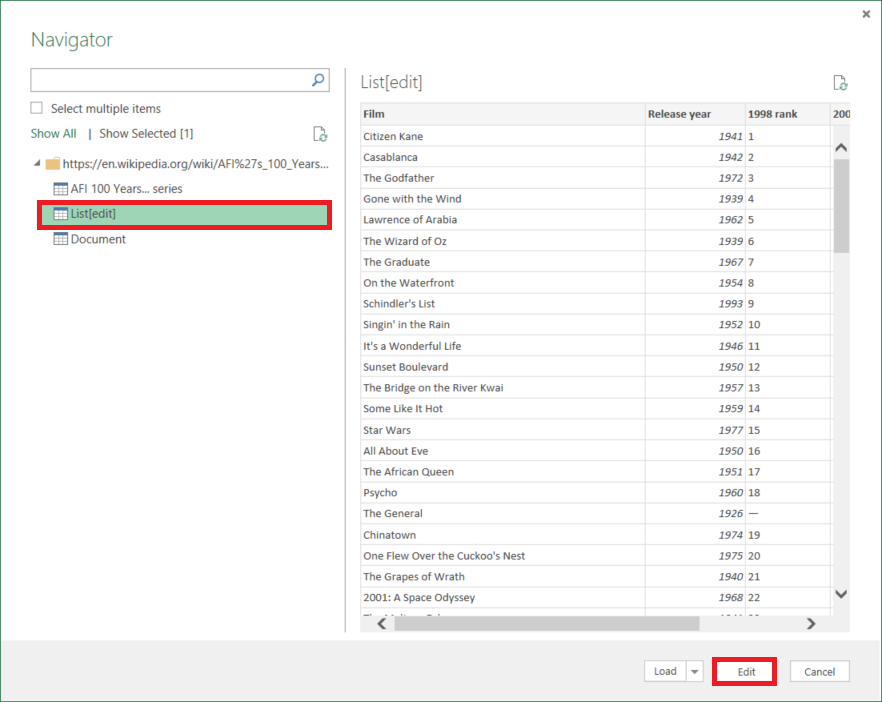

<properties 
    pageTitle="Spostare i dati dalla tabella Web | Dati di Azure Factory" 
    description="Informazioni su come spostare i dati locali una tabella in una pagina Web utilizzando Azure Data Factory." 
    services="data-factory" 
    documentationCenter="" 
    authors="linda33wj" 
    manager="jhubbard" 
    editor="monicar"/>

<tags 
    ms.service="data-factory" 
    ms.workload="data-services" 
    ms.tgt_pltfrm="na" 
    ms.devlang="na" 
    ms.topic="article" 
    ms.date="09/26/2016" 
    ms.author="jingwang"/>

# Spostare i dati da un'origine di tabella Web usando Factory di dati di Azure
Questo articolo illustra come è possibile utilizzare l'attività di copia di una factory di dati di Azure per copiare i dati da una tabella in una pagina Web in un altro archivio dati. In questo articolo si basa su articolo [le attività di spostamento dei dati](data-factory-data-movement-activities.md) , che viene fornita una panoramica generale di spostamento con attività di copia e le combinazioni di archivio di dati supportati.

Dati factory supporta attualmente solo i dati di spostamento da una tabella Web agli altri archivi di dati, ma non spostare dati da altri dati vengono archiviati in una tabella di destinazione Web.

> [AZURE.NOTE] Il connettore Web è attualmente supporta solo estrazione contenuto della tabella da una pagina HTML.

## Esempio: Copiare i dati dalla tabella Web a Blob Azure

Nell'esempio seguente viene illustrato:

1.  Servizio collegato del tipo di [Web](#web-linked-service-properties).
2.  Servizio collegato di tipo [AzureStorage](data-factory-azure-blob-connector.md#azure-storage-linked-service-properties).
3.  Un input [set di dati](data-factory-create-datasets.md) di tipo [WebTable](#WebTable-dataset-properties).
4.  Un output [set di dati](data-factory-create-datasets.md) di tipo [AzureBlob](data-factory-azure-blob-connector.md#azure-blob-dataset-type-properties).
4.  [Pipeline](data-factory-create-pipelines.md) con attività di copia che utilizza [WebSource](#websource-copy-activity-type-properties) e [BlobSink](data-factory-azure-blob-connector.md#azure-blob-copy-activity-type-properties).

Nell'esempio di copiare dati da una tabella Web blob Azure ogni ora. Le proprietà JSON utilizzate in questi esempi sono descritti nelle sezioni seguenti gli esempi. 

Nell'esempio seguente viene illustrato come copiare dati da una tabella Web a un archivio blob Azure. Tuttavia, dati possono essere copiati direttamente uno dei sink indicato nell'articolo [Le attività di spostamento dei dati](data-factory-data-movement-activities.md) utilizzando l'attività di copia in Azure Data Factory. 

**Web collegati servizio** In questo esempio viene utilizzato il servizio Web collegati con l'autenticazione anonima. Vedere la sezione [Web collegati servizio](#web-linked-service-properties) per diversi tipi di autenticazione è possibile utilizzare. 

    {
        "name": "WebLinkedService",
        "properties":
        {
            "type": "Web",
            "typeProperties":
            {
                "authenticationType": "Anonymous",
                "url" : "https://en.wikipedia.org/wiki/"
            }
        }
    }

**Servizio di archiviazione collegato di Azure**

    {
      "name": "AzureStorageLinkedService",
      "properties": {
        "type": "AzureStorage",
        "typeProperties": {
          "connectionString": "DefaultEndpointsProtocol=https;AccountName=<accountname>;AccountKey=<accountkey>"
        }
      }
    }

**Set di dati input WebTable** Impostando **esterni** su **true** si informa il servizio Factory dati che il set di dati esterno su factory dati e non viene generato da un'attività nell'ambiente di produzione di dati.

> [AZURE.NOTE] Vedere la sezione [ottenere indice di una tabella in una pagina HTML](#get-index-of-a-table-in-an-html-page) per la procedura per ottenere l'indice di una tabella in una pagina HTML.  

    
    {
        "name": "WebTableInput",
        "properties": {
            "type": "WebTable",
            "linkedServiceName": "WebLinkedService",
            "typeProperties": {
                "index": 1,
                "path": "AFI's_100_Years...100_Movies"
            },
            "external": true,
            "availability": {
                "frequency": "Hour",
                "interval":  1
            }
        }
    }

**Set di dati di output Blob Azure**

I dati vengono scritti in un nuovo blob ogni ora (frequenza: ora, intervallo: 1). 

    {
        "name": "AzureBlobOutput",
        "properties":
        {
            "type": "AzureBlob",
            "linkedServiceName": "AzureStorageLinkedService",
            "typeProperties":
            {
                "folderPath": "adfgetstarted/Movies"
            },
            "availability":
            {
                "frequency": "Hour",
                "interval": 1
            }
        }
    }

**Pipeline con attività di copia**

La pipeline contiene un'attività di copia è configurato per utilizzare l'input sopra e set di dati di output e pianificato per l'esecuzione di ogni ora. Pipeline definizione JSON, il tipo di **origine** è impostato su **WebSource** e tipo **sink** è impostato su **BlobSink**. 

Visualizzare [le proprietà di tipo WebSource](#websource-copy-activity-type-properties) per l'elenco delle proprietà supportate dalla WebSource. 
    
    {  
        "name":"SamplePipeline",
        "properties":{  
        "start":"2014-06-01T18:00:00",
        "end":"2014-06-01T19:00:00",
        "description":"pipeline with copy activity",
        "activities":[  
          {
            "name": "WebTableToAzureBlob",
            "description": "Copy from a Web table to an Azure blob",
            "type": "Copy",
            "inputs": [
              {
                "name": "WebTableInput"
              }
            ],
            "outputs": [
              {
                "name": "AzureBlobOutput"
              }
            ],
            "typeProperties": {
              "source": {
                "type": "WebSource"
              },
              "sink": {
                "type": "BlobSink"
              }
            },
           "scheduler": {
              "frequency": "Hour",
              "interval": 1
            },
            "policy": {
              "concurrency": 1,
              "executionPriorityOrder": "OldestFirst",
              "retry": 0,
              "timeout": "01:00:00"
            }
          }
          ]
       }
    }

## Proprietà collegate servizio Web

Nella tabella seguente fornisce una descrizione per gli elementi JSON specifici di collegate servizio Web.

| Proprietà | Descrizione | Obbligatorio |
| -------- | ----------- | -------- | 
| tipo | Impostare la proprietà tipo: **Web** | Sì | 
| URL | URL per l'origine Web | Sì |
| authenticationType | Anonima o di base. | Sì |
| nome utente | Nome utente per l'autenticazione di base. | Sì (per l'autenticazione di base)
| password | Password per l'autenticazione di base. | Sì (per l'autenticazione di base)

### Utilizza l'autenticazione anonima

    {
        "name": "web",
        "properties":
        {
            "type": "Web",
            "typeProperties":
            {
                "authenticationType": "Anonymous",
                "url" : "https://en.wikipedia.org/wiki/"
            }
        }
    }

### Mediante l'autenticazione di base
    
    {
        "name": "web",
        "properties":
        {
            "type": "Web",
            "typeProperties":
            {
                "authenticationType": "basic",
                "url" : "http://myit.mycompany.com/",
                "userName": "Administrator",
                "password": "password"
            }
        }
    }

## Proprietà set di dati WebTable

Per un elenco completo delle sezioni e le proprietà disponibili per la definizione di set di dati, vedere l'articolo [Creazione set di dati](data-factory-create-datasets.md) . Le sezioni, ad esempio struttura, disponibilità e criteri di un set di dati JSON sono simili per tutti i tipi di set di dati (SQL di Azure, blob Azure, tabelle Azure, ecc.).

La sezione **typeProperties** è diversa per ogni tipo di set di dati e fornisce informazioni sulla posizione dei dati nell'archivio dati. La sezione typeProperties di set di dati di tipo **WebTable** include le proprietà seguenti

Proprietà | Descrizione | Obbligatorio
:-------- | :----------- | :--------
tipo    | tipo del set di dati. deve essere impostata su **WebTable** | Sì
percorso | Un URL relativo alla risorsa che contiene la tabella. | No. Quando non viene specificato percorso, viene utilizzato solo l'URL specificato nella definizione del servizio collegata. 
indice | L'indice di tabella della risorsa. Vedere la sezione [ottenere indice di una tabella in una pagina HTML](#get-index-of-a-table-in-an-html-page) per la procedura per ottenere l'indice di una tabella in una pagina HTML. | Sì

**Esempio:**

    {
        "name": "WebTableInput",
        "properties": {
            "type": "WebTable",
            "linkedServiceName": "WebLinkedService",
            "typeProperties": {
                "index": 1,
                "path": "AFI's_100_Years...100_Movies"
            },
            "external": true,
            "availability": {
                "frequency": "Hour",
                "interval":  1
            }
        }
    }

## WebSource - proprietà del tipo di attività di copia

Per un elenco completo delle sezioni e le proprietà disponibili per la definizione di attività, vedere l'articolo [Creare pipeline](data-factory-create-pipelines.md) . Proprietà, ad esempio nome, descrizione, input e output tabelle e criteri sono disponibili per tutti i tipi di attività. 

Le proprietà disponibili nella sezione typeProperties dell'attività possono essere invece a ogni tipo di attività. Per l'attività di copia, variano in base ai tipi di origini e sink.

Quando l'origine in attività di copia è di tipo **WebSource**, nessuna proprietà aggiuntive sono attualmente supportati. 

## Ottenere l'indice di una tabella in una pagina HTML

1. Avviare **Excel 2016** e passare alla scheda **dati** .  
2. Fare clic su **Nuova Query** sulla barra degli strumenti e quindi **Da altre origini** fare clic su **Da Web**.
    
     
3. Nella finestra di dialogo **Dal Web** immettere l' **URL** che si utilizzerebbero nel servizio collegato JSON (ad esempio: https://en.wikipedia.org/wiki/) insieme a percorso specificate per il set di dati (ad esempio: AFI % 27s_100_Years... 100_Movies), fare clic su **OK**. 

     

    URL utilizzati in questo esempio: https://en.wikipedia.org/wiki/AFI%27s_100_Years...100_Movies 
4.  Se viene visualizzato nella finestra di dialogo **contenuto Web Access** , selezionare la destra **URL**, **autenticazione**, quindi fare clic su **Connetti**. 

    
5.  Fare clic su un elemento di **tabella** nella visualizzazione struttura per visualizzare il contenuto della tabella e quindi sul pulsante **Modifica** nella parte inferiore.  

     

5. Nella finestra **Dell'Editor di Query** fare clic su **Editor avanzato** pulsante sulla barra degli strumenti.

    

6. Nella finestra di dialogo Editor avanzato, il numero accanto a "Origine" è l'indice.

     

Se si usa Excel 2013, utilizzare [Microsoft Power Query per Excel](https://www.microsoft.com/download/details.aspx?id=39379) per ottenere l'indice. Vedere l'articolo di [connettersi a una pagina web](https://support.office.com/article/Connect-to-a-web-page-Power-Query-b2725d67-c9e8-43e6-a590-c0a175bd64d8) per informazioni dettagliate. I passaggi sono simili se si usa [Microsoft Power BI per il Desktop](https://powerbi.microsoft.com/desktop/). 

[AZURE.INCLUDE [data-factory-column-mapping](../../includes/data-factory-column-mapping.md)]

[AZURE.INCLUDE [data-factory-structure-for-rectangualr-datasets](../../includes/data-factory-structure-for-rectangualr-datasets.md)]

## L'ottimizzazione delle prestazioni  
Vedere [le prestazioni di attività di copia e Tuning Guide](data-factory-copy-activity-performance.md) per informazioni sui fattori che impatto sulle prestazioni di spostamento dei dati (copia attività) in diversi modi per ottimizzare la e Azure Data Factory.
