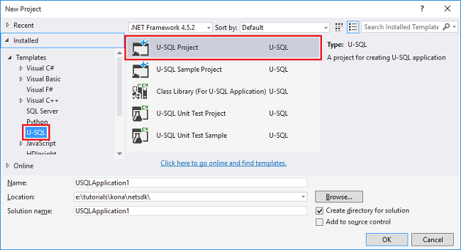
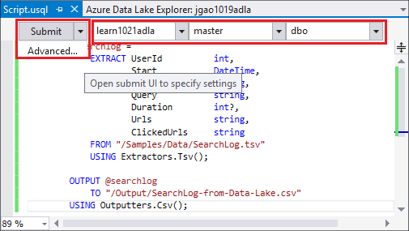

<properties
   pageTitle="Sviluppare script U SQL mediante dati Lake Tools per Visual Studio | Azure"
   description="Informazioni su come installare dati Lake Tools per Visual Studio, come sviluppare e gli script di test U-SQL. "
   services="data-lake-analytics"
   documentationCenter=""
   authors="edmacauley"
   manager="jhubbard"
   editor="cgronlun"/>

<tags
   ms.service="data-lake-analytics"
   ms.devlang="na"
   ms.topic="get-started-article"
   ms.tgt_pltfrm="na"
   ms.workload="big-data"
   ms.date="05/16/2016"
   ms.author="edmaca"/>

# Esercitazione: sviluppare script U SQL mediante dati Lake Tools per Visual Studio

[AZURE.INCLUDE [get-started-selector](../../includes/data-lake-analytics-selector-get-started.md)]

Informazioni su come installare Lake Data Tools per Visual Studio e utilizzare dati Lake Tools per Visual Studio per scrivere e testare script U-SQL.

U-SQL è un linguaggio caratterizzato hyper scalabilità per la preparazione, la trasformazione e l'analisi tutti i dati in lake dati e versioni successive. Per ulteriori informazioni, vedere [U SQL riferimento] (http://go.microsoft.com/fwlink/p/?LinkId=691348).

##Prerequisiti

- **Visual Studio 2015, Visual Studio 2013 aggiornare 4 o Visual Studio 2012. Enterprise (Ultimate/Premium), Professional, Community edizioni; Edizione Express non è supportata. Visual Studio "15" non è attualmente supportato e stiamo lavorando a cui.**
- **Microsoft Azure SDK per .NET versione 2.7.1 o versione successiva**.  Installare Office tramite [installazione guidata piattaforma Web](http://www.microsoft.com/web/downloads/platform.aspx).
- **[Dati Lake Tools per Visual Studio](http://aka.ms/adltoolsvs)**.

    Dopo aver installato dati Lake Tools per Visual Studio, si vedrà un nodo "Dati Lake Analitica" in Esplora Server sotto il nodo "Azure" (è possibile aprire Esplora Server premendo Ctrl + Alt + S).

- **Passare tra le due sezioni seguenti in [Guida introduttiva di Azure dati Lake Analitica portale Azure](data-lake-analytics-get-started-portal.md)**.

    - [Creare un account Azure dati Lake Analitica](data-lake-analytics-get-started-portal.md#create_adl_analytics_account).
    - [Caricare SearchLog.tsv per l'account di archiviazione dei dati Lake predefinito](data-lake-analytics-get-started-portal.md#update-data-to-the-default-adl-storage-account).

    Per comodità, uno script di PowerShell di esempio per la creazione di un servizio dati Lake analitico e caricamento di file di dati di origine sono disponibili [Appx-A PowerShell di esempio per la preparazione l'esercitazione](data-lake-analytics-data-lake-tools-get-started.md#appx-a-powershell-sample-for-preparing-the-tutorial).

    Gli strumenti di Lake dati non supporta la creazione di account di dati Lake Analitica. Pertanto è necessario crearlo tramite il portale di Azure, Azure PowerShell, .NET SDK o CLI Azure. Per eseguire un processo dati Lake Analitica, sarà necessario alcuni dati. Anche se gli strumenti di Lake dati supporta il caricamento di dati, utilizzare il portale per caricare i dati di esempio per rendere più semplice da seguire questa esercitazione.

## Connettersi a Azure

**Per connettersi a dati Lake Analitica**

1. Aprire Visual Studio.
2. Dal menu **Visualizza** fare clic su **Esplora Server** per aprire Esplora Server. Oppure premere **[CTRL] + [ALT] + S**.
3. Pulsante destro del mouse **Azure**, fare clic su "Connettersi a Microsoft Azure abbonamento" e quindi seguire le istruzioni.
4. Da **Esplora Server**espandere **Azure**e quindi espandere **Dati Lake Analitica**. Si deve visualizzare un elenco degli account dati Lake Analitica se presenti. Non è possibile creare gli account dati Lake Analitica da Visual Studio. Per creare un account, vedere [Guida introduttiva di Azure dati Lake Analitica portale Azure](data-lake-analytics-get-started-portal.md) o [Inizia con Azure dati Lake Analitica tramite PowerShell Azure](data-lake-analytics-get-started-powershell.md).

## Caricare il file di dati di origine

È stato caricato alcuni dati nella sezione **Prerequisiti** precedenza nell'esercitazione.  

Nel caso in cui si desidera utilizzare i propri dati, ecco le procedure per caricare i dati da strumenti di Lake dei dati.

**Per caricare i file nell'account Azure dati Lake dipendenti**

1. Da **Esplora Server**espandere **Azure** **Dati Lake Analitica**, espandere account dati Lake Analitica, espandere **Gli account di archiviazione**. Si devono vedere account lo spazio di archiviazione di dati Lake predefinito e account lo spazio di archiviazione di dati Lake collegati e account Azure lo spazio di archiviazione collegati. L'account di Lake dati predefinito sia presente un'etichetta "Account di archiviazione predefinito".
2. Destro l'account di archiviazione dei dati Lake predefinito e quindi fare clic su **Esplora risorse**.  Apre gli strumenti di Lake dati per il riquadro di Visual Studio Explorer.  Nella parte sinistra che mostra una visualizzazione albero, che la visualizzazione del contenuto è posizionato a destra.
3. Passare alla cartella in cui si desidera caricare i file,
4. Fare clic su qualsiasi area vuota e quindi fare clic su **Carica**.

    

**Caricare file in un account di archiviazione Blob Azure collegato**

1. Da **Esplora Server**espandere **Azure** **Dati Lake Analitica**, espandere account dati Lake Analitica, espandere **Gli account di archiviazione**. Si devono vedere account lo spazio di archiviazione di dati Lake predefinito e account lo spazio di archiviazione di dati Lake collegati e account Azure lo spazio di archiviazione collegati.
2. Espandere l'Account di archiviazione Azure.
3. Destro il contenitore in cui si desidera caricare i file e quindi fare clic su **Esplora risorse**. Se non si dispone di un contenitore, è necessario creare uno tramite il portale di Azure, PowerShell Azure o altri strumenti.
4. Passare alla cartella in cui si desidera caricare i file,
5. Fare clic su qualsiasi area vuota e quindi fare clic su **Carica**.

## Sviluppare script U SQL

I processi di dati Lake Analitica scritte in linguaggio U-SQL. Per ulteriori informazioni su U-SQL, vedere [Guida introduttiva a linguaggio SQL U](data-lake-analytics-u-sql-get-started.md) e [riferimento al linguaggio SQL U](http://go.microsoft.com/fwlink/?LinkId=691348).

**Per creare e inviare un processo dati Lake Analitica**

1. Dal menu **File** fare clic su **Nuovo**e quindi fare clic su **progetto**.
2. Selezionare il tipo di **Progetto U-SQL** .

    

3. Fare clic su **OK**. Visual studio crea una soluzione con un file **Script.usql** .
4. Inserire il seguente script **Script.usql**:

        @searchlog =
            EXTRACT UserId          int,
                    Start           DateTime,
                    Region          string,
                    Query           string,
                    Duration        int?,
                    Urls            string,
                    ClickedUrls     string
            FROM "/Samples/Data/SearchLog.tsv"
            USING Extractors.Tsv();

        @res =
            SELECT *
            FROM @searchlog;        

        OUTPUT @res   
            TO "/Output/SearchLog-from-Data-Lake.csv"
        USING Outputters.Csv();

    Questo script SQL U legge il file di dati di origine utilizzando **Extractors.Tsv()**e quindi viene creato un file csv tramite **Outputters.Csv()**.

    Non modificare due percorsi, a meno che non sono stati copiati i file di origine in una posizione diversa.  Dati Lake Analitica creerà la cartella di output se non esiste.

    È semplice utilizzare percorsi relativi per i file memorizzati predefiniti dati account Lake. È anche possibile utilizzare percorsi assoluti.  Per esempio

        adl://<Data LakeStorageAccountName>.azuredatalakestore.net:443/Samples/Data/SearchLog.tsv

    È necessario utilizzare percorsi assoluti per accedere ai file nell'account di archiviazione collegati.  La sintassi per i file memorizzati in account di archiviazione Azure collegato è:

        wasb://<BlobContainerName>@<StorageAccountName>.blob.core.windows.net/Samples/Data/SearchLog.tsv

    >[AZURE.NOTE] Contenitore di Blob Azure con BLOB pubblico o le autorizzazioni di accesso contenitori pubblico non sono attualmente supportati.  

    Notare le caratteristiche seguenti:

    - **IntelliSense**

        Completamento automatico di nome e i membri verranno visualizzati per set di righe, classi, database, schemi e gli oggetti definiti dall'utente (UDOs).

        IntelliSense per entità del catalogo (database, schemi, tabelle, UDOs e così via) è correlata al proprio account di calcolo. È possibile controllare l'account attiva calcolo corrente, database e schema nella barra superiore e modificarli tramite gli elenchi a discesa.

    - **Espandi* colonne**

        Fare clic su a destra del *, deve visualizzare una sottolineatura di colore blu sotto il *. Posizionare il puntatore del mouse sulla sottolineatura di colore blu e quindi fare clic sulla freccia in giù.
        

        Fare clic su **Espandi colonna**, lo strumento sostituirà il * con i nomi delle colonne.

    - **Formattazione automatica**

        Gli utenti possono modificare il rientro dello script U SQL in base al codice struttura sotto Modifica -> avanzate:

        - Formato documento (Ctrl + A, D): Formati nell'intero documento   
        - Selezione di formato (Ctrl + K, Ctrl + F): Applicato alla selezione. Se è stata effettuata alcuna selezione, il collegamento formatta la riga che il cursore si trova.  

        Tutta la formattazione di regole possono essere configurati in Strumenti -> Opzioni -> Editor di testo - > SIP -> formattazione.  
    - **Rientro smart**

        Dati Lake Tools per Visual Studio è in grado di applicare un rientro a espressioni automaticamente durante la scrittura di script. Questa caratteristica è disattivata per impostazione predefinita, gli utenti devono abilitarla tramite il controllo U-SQL -> Opzioni e impostazioni -> Opzioni -> Attiva Smart rientro.

    - **Passare alla definizione e trovare tutti i riferimenti**

        Facendo clic sul nome di un set di righe/parametro/colonna/UDO ECC e facendo clic su Vai a definizione (F12) consente di spostarsi alla definizione. Facendo clic su Trova tutti i riferimenti (MAIUSC + F12), verranno visualizzati tutti i riferimenti.

    - **Inserisci percorso Azure**

        Invece di ricordare percorso del file Azure e digitare manualmente la scrittura di script, Data Lake Tools per Visual Studio offre un modo semplice: rapida nell'editor fare clic su Inserisci tracciato Azure. Individuare il file nella finestra del Browser Blob Azure. Fare clic su **OK**. il percorso del file verrà inserito il codice.

5. Specificare l'account dati Lake Analitica, Database e Schema. È possibile selezionare **(locale)** per eseguire lo script in locale per lo scopo di testing. Per ulteriori informazioni, vedere [Eseguire U-SQL in locale](#run-u-sql-locally).

    

    Per ulteriori informazioni, vedere [usare U-SQL catalogo](data-lake-analytics-use-u-sql-catalog.md).

5. Da **Esplora**destro **Script.usql**e quindi fare clic su **Creazione di Script**. Verificare il risultato nel riquadro di Output.
6. Da **Esplora**destro **Script.usql**e quindi fare clic su **Invia Script**. Facoltativamente, è possibile anche fare clic su **Invia** dal riquadro Script.usql.  Visualizzare la schermata precedente.  Fare clic sulla freccia in giù accanto al pulsante Invia per inviare usando le opzioni avanzate:
7. Specificare **Il nome del processo**, verificare l' **Account Analitica**e quindi fare clic su **Invia**. Risultati invio e collegamento processo sono disponibili negli strumenti Lake di dati per finestra Risultati Visual Studio al termine della presentazione.

    

8. È necessario fare clic sul pulsante Aggiorna per visualizzare lo stato del processo più recente e aggiornare la schermata. Quando successi processo verrà visualizzato è il **Grafico di processo**, **Operazioni sui dati di metadati**, **Cronologia dello stato**, **diagnostica**:

    

    * Riepilogo. Visualizzare le informazioni di riepilogo del processo corrente, ad esempio: stato, lo stato di avanzamento, esecuzione, nome Runtime e così via mittente.   
    * Dettagli dei processi. Informazioni dettagliate su questo processo viene fornite, tra cui script, risorsa, visualizzazione di esecuzione vertice.
    * Grafico di processo. Sono disponibili quattro grafici per visualizzare le informazioni del processo: lo stato di avanzamento, lettura di dati, scrivere i dati, il tempo di esecuzione, medio tempo di esecuzione Per nodo, velocità di Input, velocità di Output.
    * Operazioni dei metadati. Mostra tutte le operazioni di metadati.
    * Stato della cronologia.
    * Diagnostica. Dati Lake Tools per Visual Studio verrà diagnosticare automaticamente esecuzione del processo. Si riceveranno gli avvisi quando sono presenti alcuni errori o problemi di prestazioni per la propria attività. Processo diagnostica (collegamento da definire) parte per ulteriori informazioni, vedere.

**Per controllare lo stato di processo**

1. Da Esplora Server, espandere **Azure**, **Dati Lake Analitica**, il nome dell'account Analitica Lake dati
2. Fare doppio clic su **processi** per elencare i processi.
2. Fare clic su un processo per visualizzare lo stato.

**Per visualizzare l'output di processo**

1. Da **Esplora Server**espandere **Azure**, espandere **Dati Lake Analitica**, espandere account dati Lake Analitica, espandere **Gli account di archiviazione**, rapida l'account di archiviazione dei dati Lake predefinito e quindi fare clic su **Esplora risorse**.
2.  Fare doppio clic su **output** per aprire la cartella
3.  Fare doppio clic su **SearchLog da adltools.csv**.

###Riproduzione di processo

Riproduzione di processo consente di controllare lo stato di avanzamento di processo esecuzione e visivamente rileva bottiglia e alterazioni prestazioni. Questa funzionalità può essere utilizzata prima che il processo di completamento dell'esecuzione (ad esempio durante il periodo che il processo è in esecuzione), nonché una volta completata l'esecuzione. Per consentire all'utente per riprodurre l'avanzamento fino all'ora corrente, eseguire la riproduzione durante l'esecuzione del processo.

**Per visualizzare lo stato di avanzamento di processo esecuzione**  

1. Fare clic su **Profilo di carico** in alto a destra. Visualizzare la schermata precedente riportata di seguito.
2. Fare clic sul pulsante Riproduci nell'angolo inferiore sinistro per verificare l'avanzamento di esecuzione del processo.
3. Durante la riproduzione, fare clic su **Sospendi** per interrompere o direttamente trascinare la barra di stato di avanzamento in posizioni specifiche.

###Mappa termica

Dati Lake Tools per Visual Studio fornisce sovrapposizioni di colore selezionabili dall'utente nella visualizzazione processo per indicare lo stato di avanzamento, dati i/o, esecuzione, velocità i/o di ogni fase. In questo modo gli utenti possono determinare potenziali problemi e distribuzione proprietà dei processi direttamente e intuitivo. È possibile scegliere un'origine dati da visualizzare nell'elenco a discesa.  

## Eseguire localmente U-SQL

Usa locale U SQL eseguire esperienza in Visual Studio, è possibile:

- Eseguire script SQL U in locale, insieme a c# assembly.
- Eseguire il debug c# assembly locale.
- Crea/Elimina/visualizzazione database locali, assiemi, schemi e tabelle in Esplora Server nello stesso modo in cui è possibile eseguire per il servizio di Azure dati Lake Analitica.

Verrà visualizzato un account *locale* in Visual Studio e il programma di installazione crea un *DataRoot* *C:\LocalRunRoot*cartella. Verrà utilizzata la cartella DataRoot:

- Archivio dei metadati tra le tabelle, DBs, le TVF e così via.
- Per un determinato script: se un percorso relativo viene fatto riferimento in ingresso/uscita percorsi, esamineremo alto il DataRoot (così come percorso di script se input it)
- La cartella DataRoot non essere fa se si sta tentando di registrare un assembly e utilizzare un percorso relativo (vedere per altri dettagli:/ / Office.microsoft.com "Usa assembly quando eseguendo esecuzione locale")

Il video seguente viene illustrata la funzionalità di esecuzione locale di SQL U:

>[AZURE.VIDEO usql-localrun]

### Limitazioni e problemi noti

- Non è possibile creare tabella/DB ECC in Esplora Server per l'account locale.
- Se si fa riferimento un percorso relativo:

    - In script input (estrarre * FROM "/ percorso/abc")-il percorso DataRoot e il percorso dello script viene eseguita una ricerca.
    - Nell'output di script (OUTPUT in "percorso/abc"): percorso DataRoot da utilizzare come cartella di output.
    - In registrazione assembly (xyz CREATE ASSEMBLY da "/ percorso/abc"): il percorso dello script viene eseguita una ricerca, ma non il DataRoot.
    - In registered TVF/visualizzazione o altre entità di metadati: percorso DataRoot viene eseguita una ricerca, ma non il percorso di script.

    Per gli script viene eseguito sul servizio dati Lake, l'account di archiviazione predefinito da utilizzare come cartella radice e viene eseguita una ricerca di conseguenza.

### Verificare gli script di U SQL localmente
Per istruzioni su come sviluppare script U SQL, vedere [script sviluppare U-SQL](#develop-and-test-u-sql-scripts). Per creare ed eseguire U SQL script in locale, selezionare **(locale)** nell'elenco a discesa cluster e quindi fare clic su **Invia**. Assicurarsi che sia installato i dati appropriati a cui fa riferimento - il riferimento al percorso assoluto o inserire i dati nella cartella DataRoot.

È possibile anche rapida uno script e quindi fare clic su **Esegui pianificare locale** nel menu di scelta rapida oppure premere **CTRL + F5** per esecuzione locale trigger.

### Utilizzare gli assembly in esecuzione locale

Esistono due modi per eseguire i file c# personalizzati:

- Scrivere gli assembly di code-behind file e le verrà automaticamente registrato ed eliminati dopo avere eseguito lo script.
- Creare un progetto di assembly c# e registrare la dll di output per l'account locale tramite uno script simile di sotto. Si noti che il percorso è relativo dello script anziché la cartella DataRoot.

### Eseguire il debug di script e c# assembly localmente

È possibile eseguire il debug c# assembly senza l'invio e la registrazione al servizio Azure dati Lake Analitica. È possibile impostare i punti di interruzione in entrambi i file code-behind e in un progetto c# cui viene fatto riferimento.

**Per eseguire il debug codice locale nel file code-behind**
1.  Impostare i punti di interruzione nel file code-behind.
2.  Premere **F5** per eseguire il debug lo script in locale.

La procedura seguente funziona solo in Visual Studio 2015. In Visual Studio precedente potrebbe essere necessario aggiungere manualmente i file pdb.

**Per eseguire il debug codice locale in un progetto di riferimento c#**
1.  Creare un progetto di Assembly c# e compilarlo per generare la dll di output.
2.  Registrare la dll utilizzando un'istruzione SQL U:

        CREATE ASSEMBLY assemblyname FROM @"..\..\path\to\output\.dll";
3.  Impostare i punti di interruzione nel codice c#.
4.  Premere **F5** per eseguire il debug dello script con riferimento dll c# in locale.  

##Vedere anche

Per iniziare a utilizzare dati Lake Analitica utilizzando strumenti diversi, vedere:

- [Guida introduttiva a Analitica Lake dati tramite il portale di Azure](data-lake-analytics-get-started-portal.md)
- [Guida introduttiva a Analitica Lake dati tramite PowerShell Azure](data-lake-analytics-get-started-powershell.md)
- [Guida introduttiva a dati Lake Analitica utilizzando .NET SDK](data-lake-analytics-get-started-net-sdk.md)
- [Eseguire il debug del codice c# in processi U SQL](data-lake-analytics-debug-u-sql-jobs.md)

Per visualizzare altri argomenti di sviluppo:

- [Analizzare informazioni sui blog mediante dati Lake Analitica](data-lake-analytics-analyze-weblogs.md)
- [Sviluppare script U SQL mediante dati Lake Tools per Visual Studio](data-lake-analytics-data-lake-tools-get-started.md)
- [Guida introduttiva a linguaggio Azure dati Lake Analitica U-SQL](data-lake-analytics-u-sql-get-started.md)
- [Sviluppare operatori definiti dall'utente U SQL per i processi di dati Lake Analitica](data-lake-analytics-u-sql-develop-user-defined-operators.md)

##Esempio di PowerShell AppX risposte per la preparazione l'esercitazione

Il seguente script di PowerShell prepara un account Azure dati Lake Analitica e i dati di origine, in modo che è possibile passare al [script sviluppare U-SQL](data-lake-analytics-data-lake-tools-get-started.md#develop-u-sql-scripts).

    #region - used for creating Azure service names
    $nameToken = "<Enter an alias>"
    $namePrefix = $nameToken.ToLower() + (Get-Date -Format "MMdd")
    #endregion

    #region - service names
    $resourceGroupName = $namePrefix + "rg"
    $dataLakeStoreName = $namePrefix + "adas"
    $dataLakeAnalyticsName = $namePrefix + "adla"
    $location = "East US 2"
    #endregion

    # Treat all errors as terminating
    $ErrorActionPreference = "Stop"

    #region - Connect to Azure subscription
    Write-Host "`nConnecting to your Azure subscription ..." -ForegroundColor Green
    try{Get-AzureRmContext}
    catch{Login-AzureRmAccount}
    #endregion

    #region - Create an Azure Data Lake Analytics service account
    Write-Host "Create a resource group ..." -ForegroundColor Green
    New-AzureRmResourceGroup `
        -Name  $resourceGroupName `
        -Location $location

    Write-Host "Create a Data Lake account ..."  -ForegroundColor Green
    New-AzureRmDataLakeStoreAccount `
        -ResourceGroupName $resourceGroupName `
        -Name $dataLakeStoreName `
        -Location $location

    Write-Host "Create a Data Lake Analytics account ..."  -ForegroundColor Green
    New-AzureRmDataLakeAnalyticsAccount `
        -Name $dataLakeAnalyticsName `
        -ResourceGroupName $resourceGroupName `
        -Location $location `
        -DefaultDataLake $dataLakeStoreName

    Write-Host "The newly created Data Lake Analytics account ..."  -ForegroundColor Green
    Get-AzureRmDataLakeAnalyticsAccount `
        -ResourceGroupName $resourceGroupName `
        -Name $dataLakeAnalyticsName  
    #endregion

    #region - prepare the source data
    Write-Host "Import the source data ..."  -ForegroundColor Green
    $localFolder = "C:\Tutorials\Downloads\" # A temp location for the file.
    $storageAccount = "adltutorials"  # Don't modify this value.
    $container = "adls-sample-data"  #Don't modify this value.

    # Create the temp location  
    New-Item -Path $localFolder -ItemType Directory -Force

    # Download the sample file from Azure Blob storage
    $context = New-AzureStorageContext -StorageAccountName $storageAccount -Anonymous
    $blobs = Azure\Get-AzureStorageBlob -Container $container -Context $context
    $blobs | Get-AzureStorageBlobContent -Context $context -Destination $localFolder

    # Upload the file to the default Data Lake Store account    
    Import-AzureRmDataLakeStoreItem -AccountName $dataLakeStoreName -Path $localFolder"SearchLog.tsv" -Destination "/Samples/Data/SearchLog.tsv"

    Write-Host "List the source data ..."  -ForegroundColor Green
    Get-AzureRmDataLakeStoreChildItem -Account $dataLakeStoreName -Path  "/Samples/Data/"
    #endregion
