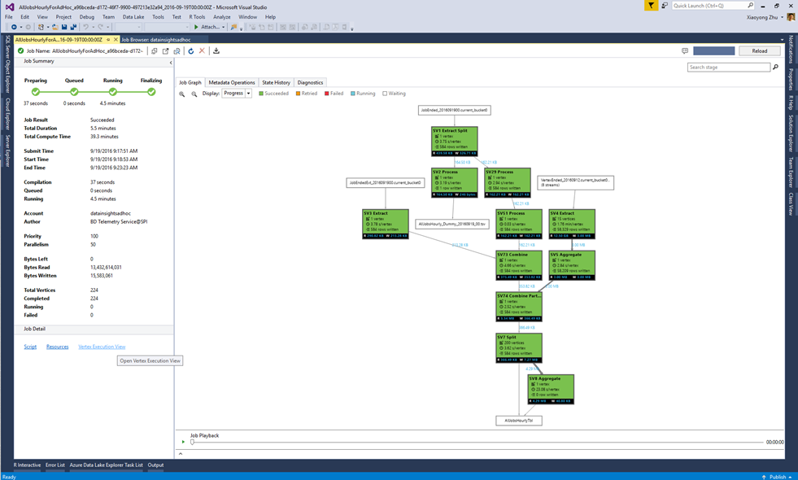
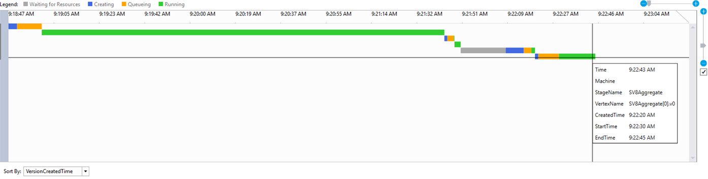

<properties 
   pageTitle="Utilizzare la visualizzazione di esecuzione vertice in Data Lake Tools per Visual Studio | Microsoft Azure" 
   description="Informazioni su come usare la visualizzazione di esecuzione vertice ai processi di esame dati Lake Analitica." 
   services="data-lake-analytics" 
   documentationCenter="" 
   authors="mumian" 
   manager="jhubbard" 
   editor="cgronlun"/>
 
<tags
   ms.service="data-lake-analytics"
   ms.devlang="na"
   ms.topic="article"
   ms.tgt_pltfrm="na"
   ms.workload="big-data" 
   ms.date="10/13/2016"
   ms.author="jgao"/>

# Utilizzare la visualizzazione di esecuzione vertice in Data Lake Tools per Visual Studio

Informazioni su come usare la visualizzazione di esecuzione vertice ai processi di esame dati Lake Analitica.

## Prerequisiti

- Conoscenza di base dell'uso di dati Lake Tools per Visual Studio per lo sviluppo di script U-SQL.  Vedere [Esercitazione: sviluppare script U SQL mediante dati Lake Tools per Visual Studio](data-lake-analytics-data-lake-tools-get-started.md).

## Aprire la visualizzazione di esecuzione vertice

Per un determinato incarico, è possibile fare clic sul collegamento "Vertice esecuzione Visualizza" nell'angolo inferiore sinistro. È possibile che venga chiesto di caricare i profili e può richiedere del tempo a seconda la connettività di rete.

## Comprendere vertice esecuzione visualizzazione

Dopo aver immesso la visualizzazione di esecuzione vertice, sono disponibili tre elementi:

- Selettore di vertice: sul lato sinistro è il selettore vertice.  È possibile selezionare i vertici dalle caratteristiche (ad esempio primi 10 dati letti o scegliere dalla fase).

    Uno dei filtri di usati più comuni è vertici nel percorso critico. Percorso critico è il percorso più lungo di un processo U-SQL. È utile per ottimizzare i processi selezionando il vertice richiede tempi.

- Riquadro alto al centro:

    

    È possibile visualizzarne lo stato di esecuzione di tutti i vertici. Converte il tempo di conseguenza al computer locale e Mostra lo stato diversi in colori diversi.

- Riquadro centrale nella parte inferiore:

    

    - Nome processo: Il nome dell'istanza vertice. È composto da diverse parti StageName | VertexName | VertexRunInstance. Ad esempio, il vertice .v1 [62] SV7_Split acronimo la seconda istanza in esecuzione (.v1, indice inizia da 0) del numero di vertice 62 nella fase SV7_Split.
    - Totale dati lettura/scrittura: I dati è stato letto/scritto da questo vertice.
    - Stato stato/uscita: Lo stato finale al termine il vertice.
    - Tipo di codice/errore Esci: L'errore durante il vertice non è riuscita.
    - Motivo di creazione: Perché il vertice è stato creato.
    - Risorsa latenza/processo latenza/NP coda latenza: il tempo necessario per il vertice in attesa per le risorse, per elaborare i dati e per rimanere nella coda.
    - GUID processo/creatore: GUID per il vertice in esecuzione corrente o l'autore.
    - Versione: N-esimo istanza del vertice in esecuzione (pianificazione del sistema potrebbe nuove istanze di un vertice per diverse ragioni, ad esempio failover, calcolano la ridondanza, ecc.)
    - Versione creata.
    - Elaborare crea Start ora/processo in coda ora/processo Start ora/processo completamento ora: quando si avvia il processo di vertice creazione; avvio del processo di vertice accodare; avvio del processo di vertice determinati; una volta completato il vertice determinati.

## Passaggi successivi

- Per ottenere una panoramica dei dati Lake Analitica, vedere [Panoramica di Azure dati Lake Analitica](data-lake-analytics-overview.md).
- Per iniziare a applicazioni U SQL, vedere [gli script di sviluppare U-SQL utilizzando dati Lake Tools per Visual Studio](data-lake-analytics-data-lake-tools-get-started.md).
- Per informazioni su U-SQL, vedere [Guida introduttiva a linguaggio Azure dati Lake Analitica U-SQL](data-lake-analytics-u-sql-get-started.md).
- Per le attività di gestione, vedere [gestire Azure dati Lake Analitica tramite il portale di Azure](data-lake-analytics-manage-use-portal.md).
- Per registrare le informazioni di diagnostica, vedere [accesso ai registri di diagnostica per Azure dati Lake Analitica](data-lake-analytics-diagnostic-logs.md)
- Per una query più complessa, vedere [registri di sito Web analizza mediante Azure dati Lake Analitica](data-lake-analytics-analyze-weblogs.md).
- Per visualizzare i dettagli dei processi, vedere [uso processo Browser e visualizzazione di processo per i processi di Azure dati lake Analitica](data-lake-analytics-data-lake-tools-view-jobs.md)