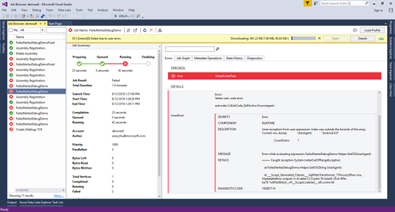
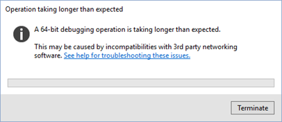

<properties 
   pageTitle="Eseguire il debug processi U SQL | Microsoft Azure" 
   description="Informazioni su come eseguire il debug SQL U vertice non riuscito utilizzando Visual Studio. " 
   services="data-lake-analytics" 
   documentationCenter="" 
   authors="mumian" 
   manager="jhubbard" 
   editor="cgronlun"/>
 
<tags
   ms.service="data-lake-analytics"
   ms.devlang="na"
   ms.topic="article"
   ms.tgt_pltfrm="na"
   ms.workload="big-data" 
   ms.date="09/02/2016"
   ms.author="jgao"/>

#Eseguire il debug codice c# U SQL per i processi di dati Lake Analitica 

Informazioni su come usare gli strumenti Azure dati Lake Visual Studio per eseguire il debug processi U-SQL non riusciti a causa di bug all'interno di codice utente. 

Lo strumento di Visual Studio consente di scaricare codice compilato e i dati necessari vertice da cluster di analisi e il debug di processi non riusciti.

Sistemi di dati in genere forniscono modello di estensibilità tramite lingue, ad esempio linguaggio c#, Python, e così via. Molti questi sistemi forniscono informazioni che rendono difficile il debug degli errori di runtime nel codice personalizzato di debug runtime limitato. Strumenti di Visual Studio più recente viene fornito con la funzione "Non è riuscita vertice Debug". Questa caratteristica, è possibile scaricare i dati di runtime da Azure workstation locale in modo che è possibile eseguire il debug non riuscito c# codice personalizzato con lo stesso runtime e dati di input esatti dal cloud.  Dopo i problemi sono corretti, è possibile eseguire nuovamente il codice rivisto in Azure strumenti.

Per una presentazione video di questa caratteristica, vedere [il Debug del codice personalizzato in Azure dati Lake Analitica](https://mix.office.com/watch/1bt17ibztohcb).

>[AZURE.NOTE] Visual Studio potrebbe bloccarsi o arrestarsi in modo anomalo se non si dispone di aggiornamenti di due windows seguenti: [Microsoft Visual C++ 2015 Redistributable Update 2](https://www.microsoft.com/download/details.aspx?id=51682), [Universale C Runtime per Windows](https://www.microsoft.com/download/details.aspx?id=50410&wa=wsignin1.0).

##Prerequisiti
-   Ha effettuato l'articolo [Introduzione](data-lake-analytics-data-lake-tools-get-started.md) .

## Creare e configurare i progetti di debug

Quando si apre un processo non riuscito nello strumento dati Lake Visual Studio, verrà visualizzato un avviso. Informazioni sugli errori dettagliate verranno visualizzati nella scheda errori e avvisi barra gialla nella parte superiore finestra. 

**Per scaricare vertice e creare una soluzione di debug**

1.  Aprire un processo U SQL non riuscito in Visual Studio.
2.  Fare clic su **Download** per scaricare tutte le risorse necessarie e flussi di input. Se il download non è riuscita, fare clic su **Riprova** .
3.  Una volta completato il download per creare un progetto di debug locale, fare clic su **Apri** . Verrà creata una nuova soluzione di Visual Studio denominata **VertexDebug** con un progetto vuoto denominato **LocalVertexHost** .

Operatori definiti dall'utente vengono utilizzati nel codice SQL U dietro (Script.usql.cs), è necessario creare un progetto c# classe raccolta con il codice di operatori definite dall'utente e includere il progetto in soluzione VertexDebug.

Se è stato registrato assembly DLL al database di dati Lake Analitica, è necessario aggiungere il codice sorgente degli assembly alla soluzione VertexDebug.
 
Se è stato creato una distinta c# libreria di classi per il codice SQL U e assembly DLL registrati al database di dati Lake Analitica, è necessario aggiungere un progetto c# di origine degli assembly alla soluzione VertexDebug.

In alcuni casi, usare gli operatori definite dall'utente in SQL U file code-behind (Script.usql.cs) della soluzione originale. Se si desidera personalizzare, è necessario creare una raccolta c# contenente il codice sorgente e modificare il nome di assembly a quello registrato nel cluster. È possibile ottenere il nome di assembly registrato in cluster selezionando lo script in esecuzione nel cluster. È possibile eseguire questa operazione aprendo il processo di U SQL e fare clic su "script" nel Pannello di processo. 

**Per configurare la soluzione**

1.  In Esplora soluzioni destro progetto c# che appena creato e quindi fare clic su **proprietà**.
2.  Impostare il percorso di Output come progetto LocalVertexHost percorso cartella. È possibile ottenere percorso cartella di lavoro di progetto LocalVertexHost tramite le proprietà LocalVertexHost.
3.  Compilare il progetto c# per inserire il file PDB nel progetto LocalVertexHost cartella di lavoro oppure è possibile copiare il file PDB in questa cartella manualmente.
4.  Nelle **Impostazioni di eccezione**, controllare eccezioni Common Language Runtime:

 
##Eseguire il debug del processo

Dopo aver creato una soluzione di debug scaricando il vertice e avere configurato l'ambiente, è possibile avviare il debug del codice U-SQL.

1.  In Esplora soluzioni fare clic sul progetto **LocalVertexHost** che appena creato, scegliere **Debug**e quindi fare clic su **Avvia nuova istanza**. Il LocalVertexHost devono essere impostate come progetto di avvio. Si può vedere il seguente messaggio per la prima volta che è possibile ignorare. Può essere necessaria fino a un minuto per visualizzare la schermata di debug.
 
    

4.  Utilizzare Visual Studio in base a esperienza di debug (espressioni di controllo, variabili, ecc.) per risolvere il problema. 
5.  Dopo aver identificato un problema, correggere il codice e quindi rigenerare il progetto c# prima di provare il nuovo fino a quando non tutti i problemi risolti. Dopo il debug è stato completato correttamente, nella finestra di output con il seguente messaggio 

        The Program ‘LocalVertexHost.exe’ has exited with code 0 (0x0).
 
##Inviare di nuovo il processo

Dopo avere completato il debug del codice SQL U, è possibile inviare nuovamente il processo non riuscito.

1. Registrare nuovi assembly DLL al database ADLA.

    1.  Da Esplora soluzioni/Cloud Server nello strumento di dati Lake Visual Studio, espandere il nodo **database** 
    2.  Pulsante destro del mouse assembly agli assembly registro. 
    3.  Registrare il nuovo assembly DLL al database ADLA.
 
2.  O copiare il codice c# script.usql.cs - c# file code-behind.
3.  Inviare di nuovo il processo.

##Passaggi successivi

- [Esercitazione: Introduzione a linguaggio Azure dati Lake Analitica U-SQL](data-lake-analytics-u-sql-get-started.md)
- [Esercitazione: sviluppare script U SQL mediante dati Lake Tools per Visual Studio](data-lake-analytics-data-lake-tools-get-started.md)
- [Sviluppare operatori definite dall'utente U SQL per i processi di Azure dati Lake Analitica](data-lake-analytics-u-sql-develop-user-defined-operators.md)

