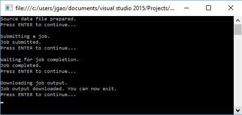

<properties 
   pageTitle="Guida introduttiva di Azure dati Lake Analitica utilizzando .NET SDK | Azure" 
   description="Informazioni su come utilizzare .NET SDK per creare gli account archivio Lake dati, creare processi dati Lake Analitica e inviare processi scritti in U-SQL. " 
   services="data-lake-analytics" 
   documentationCenter="" 
   authors="edmacauley" 
   manager="jhubbard" 
   editor="cgronlun"/>
 
<tags
   ms.service="data-lake-analytics"
   ms.devlang="na"
   ms.topic="hero-article"
   ms.tgt_pltfrm="na"
   ms.workload="big-data" 
   ms.date="10/26/2016"
   ms.author="edmaca"/>

# Esercitazione: Introduzione a Azure dati Lake Analitica utilizzando .NET SDK

[AZURE.INCLUDE [get-started-selector](../../includes/data-lake-analytics-selector-get-started.md)]

Informazioni su come usare Azure .NET SDK per inviare i processi di scrittura in [SQL U](data-lake-analytics-u-sql-get-started.md) dati Lake Analitica. Per ulteriori informazioni sui dati Lake Analitica, vedere [Panoramica di Azure dati Lake Analitica](data-lake-analytics-overview.md).

In questa esercitazione, si verrà sviluppare un'applicazione console c# per inviare un processo U-SQL che legge una scheda separati da file con valori (TSV) e lo converte in un file con valori separati (CSV). Per passare all'interno dell'esercitazione stessa usare altri strumenti supportati, selezionare le schede nella parte superiore di questo articolo.

##Prerequisiti

Prima di iniziare questa esercitazione, è necessario disporre le operazioni seguenti:

- **Visual Studio 2015, Visual Studio 2013 aggiornare 4, o Visual Studio 2012 con installato Visual C++**.
- **Microsoft Azure SDK per .NET versione 2.5 o versione successiva**.  Installare Office tramite [installazione guidata piattaforma Web](http://www.microsoft.com/web/downloads/platform.aspx).
- **Account di Azure dati Lake Analitica**. Vedere [Gestire dati Lake Analitica utilizzando Azure .NET SDK](data-lake-analytics-manage-use-dotnet-sdk.md).

##Creare l'applicazione console

In questa esercitazione si elaborare alcuni log di ricerca.  Il log di ricerca può essere archiviato in archivio dati Lake o archiviazione Blob Azure. 

Un file di log di ricerca di esempio sono disponibili in un contenitore di Blob Azure pubblico. Nell'applicazione, si verrà scaricare il file workstation in uso e quindi caricare il file all'account di archivio di dati Lake predefinito del proprio account dati Lake Analitica.

**Per creare uno script SQL U**

Processi Analitica Lake dati vengono salvati nella lingua U-SQL. Per ulteriori informazioni su U-SQL, vedere [Guida introduttiva a linguaggio SQL U](data-lake-analytics-u-sql-get-started.md) e [riferimento al linguaggio SQL U](http://go.microsoft.com/fwlink/?LinkId=691348).

Creare un file **SampleUSQLScript.txt** con il seguente script U SQL e inserire il file nel **C:\temp\* * percorso.  Il percorso è hardcoded nell'applicazione di .NET creato nella procedura successiva.  

    @searchlog =
        EXTRACT UserId          int,
                Start           DateTime,
                Region          string,
                Query           string,
                Duration        int?,
                Urls            string,
                ClickedUrls     string
        FROM "/Samples/Data/SearchLog.tsv"
        USING Extractors.Tsv();
    
    OUTPUT @searchlog   
        TO "/Output/SearchLog-from-Data-Lake.csv"
    USING Outputters.Csv();

Questo script SQL U legge il file di dati di origine utilizzando **Extractors.Tsv()**e quindi viene creato un file csv tramite **Outputters.Csv()**. 

Nell'applicazione di c#, è necessario preparare il file **/Samples/Data/SearchLog.tsv** e la cartella **/Output/** .    

È semplice utilizzare percorsi relativi per i file memorizzati predefiniti dati account Lake. È anche possibile utilizzare percorsi assoluti.  Per esempio 

    adl://<Data LakeStorageAccountName>.azuredatalakestore.net:443/Samples/Data/SearchLog.tsv
    
È necessario utilizzare percorsi assoluti per accedere ai file nell'account di archiviazione collegati.  La sintassi per i file memorizzati in account di archiviazione di Azure collegate è:

    wasb://<BlobContainerName>@<StorageAccountName>.blob.core.windows.net/Samples/Data/SearchLog.tsv

>[AZURE.NOTE] Esiste al momento un problema noto con il servizio di Lake dati di Azure.  Se l'applicazione di esempio è interrotta o si verifica un errore, potrebbe essere necessario eliminare manualmente gli account di archivio di dati Lake & dati Lake Analitica che lo script crea.  Se non si ha familiarità con il portale di Azure, la Guida di [gestire Azure dati Lake Analitica Azure portale](data-lake-analytics-manage-use-portal.md) per iniziare.       

**Per creare un'applicazione**

1. Aprire Visual Studio.
2. Creare un'applicazione console c#.
3. Aprire NuGet pacchetto Management console ed eseguire i comandi seguenti:

        Install-Package Microsoft.Azure.Management.DataLake.Analytics -Pre
        Install-Package Microsoft.Azure.Management.DataLake.Store -Pre
        Install-Package Microsoft.Azure.Management.DataLake.StoreUploader -Pre
        Install-Package Microsoft.Rest.ClientRuntime.Azure.Authentication -Pre
        Install-Package WindowsAzure.Storage

       
5. In Program.cs, incollare il codice seguente:

        using System;
        using System.IO;
        using System.Collections.Generic;
        using System.Threading;
        using Microsoft.Rest;
        using Microsoft.Rest.Azure.Authentication;
        using Microsoft.Azure.Management.DataLake.Store;
        using Microsoft.Azure.Management.DataLake.StoreUploader;
        using Microsoft.Azure.Management.DataLake.Analytics;
        using Microsoft.Azure.Management.DataLake.Analytics.Models;
        using Microsoft.WindowsAzure.Storage.Blob;

        namespace SdkSample
        {
          class Program
          {
            private const string SUBSCRIPTIONID = "<Enter Your Azure Subscription ID>";
            private const string CLIENTID = "1950a258-227b-4e31-a9cf-717495945fc2";
            private const string DOMAINNAME = "common"; // Replace this string with the user's Azure Active Directory tenant ID or domain name, if needed.

            private static string _adlaAccountName = "<Enter an Existing Data Lake Analytics Account Name>";
            private static string _adlsAccountName = "<Enter the default Data Lake Store Account Name>";

            private static DataLakeAnalyticsAccountManagementClient _adlaClient;
            private static DataLakeStoreFileSystemManagementClient _adlsFileSystemClient;
            private static DataLakeAnalyticsJobManagementClient _adlaJobClient;
        
            private static void Main(string[] args)
            {
                string localFolderPath = @"c:\temp\";

                // Connect to Azure
                var creds = AuthenticateAzure(DOMAINNAME, CLIENTID);

                SetupClients(creds, SUBSCRIPTIONID);

                // Transfer the source file from a public Azure Blob container to Data Lake Store.
                CloudBlockBlob blob = new CloudBlockBlob(new Uri("https://adltutorials.blob.core.windows.net/adls-sample-data/SearchLog.tsv"));
                blob.DownloadToFile(localFolderPath + "SearchLog.tsv", FileMode.Create); // from WASB
                UploadFile(localFolderPath + "SearchLog.tsv", "/Samples/Data/SearchLog.tsv"); // to ADLS
                WaitForNewline("Source data file prepared.", "Submitting a job.");

                // Submit the job
                Guid jobId = SubmitJobByPath(localFolderPath + "SampleUSQLScript.txt", "My First ADLA Job");
                WaitForNewline("Job submitted.", "Waiting for job completion.");

                // Wait for job completion
                WaitForJob(jobId);
                WaitForNewline("Job completed.", "Downloading job output.");

                // Download job output
                DownloadFile(@"/Output/SearchLog-from-Data-Lake.csv", localFolderPath + "SearchLog-from-Data-Lake.csv");
        
                WaitForNewline("Job output downloaded. You can now exit.");
            }
        
            public static ServiceClientCredentials AuthenticateAzure(
                string domainName,
                string nativeClientAppCLIENTID)
            {
                // User login via interactive popup
                SynchronizationContext.SetSynchronizationContext(new SynchronizationContext());
                // Use the client ID of an existing AAD "Native Client" application.
                var activeDirectoryClientSettings = ActiveDirectoryClientSettings.UsePromptOnly(nativeClientAppCLIENTID, new Uri("urn:ietf:wg:oauth:2.0:oob"));
                return UserTokenProvider.LoginWithPromptAsync(domainName, activeDirectoryClientSettings).Result;
            }

            public static void SetupClients(ServiceClientCredentials tokenCreds, string subscriptionId)
            {
                _adlaClient = new DataLakeAnalyticsAccountManagementClient(tokenCreds);
                _adlaClient.SubscriptionId = subscriptionId;

                _adlaJobClient = new DataLakeAnalyticsJobManagementClient(tokenCreds);

                _adlsFileSystemClient = new DataLakeStoreFileSystemManagementClient(tokenCreds);
            }

            public static void UploadFile(string srcFilePath, string destFilePath, bool force = true)
            {
                var parameters = new UploadParameters(srcFilePath, destFilePath, _adlsAccountName, isOverwrite: force);
                var frontend = new DataLakeStoreFrontEndAdapter(_adlsAccountName, _adlsFileSystemClient);
                var uploader = new DataLakeStoreUploader(parameters, frontend);
                uploader.Execute();
            }

            public static void DownloadFile(string srcPath, string destPath)
            {
                var stream = _adlsFileSystemClient.FileSystem.Open(_adlsAccountName, srcPath);
                var fileStream = new FileStream(destPath, FileMode.Create);

                stream.CopyTo(fileStream);
                fileStream.Close();
                stream.Close();
            }

            // Helper function to show status and wait for user input
            public static void WaitForNewline(string reason, string nextAction = "")
            {
                Console.WriteLine(reason + "\r\nPress ENTER to continue...");

                Console.ReadLine();

                if (!String.IsNullOrWhiteSpace(nextAction))
                    Console.WriteLine(nextAction);
            }

            // List all Data Lake Analytics accounts within the subscription
            public static List<DataLakeAnalyticsAccount> ListADLAAccounts()
            {
                var response = _adlaClient.Account.List();
                var accounts = new List<DataLakeAnalyticsAccount>(response);

                while (response.NextPageLink != null)
                {
                    response = _adlaClient.Account.ListNext(response.NextPageLink);
                    accounts.AddRange(response);
                }

                Console.WriteLine("You have %i Data Lake Analytics account(s).", accounts.Count);
                for (int i = 0; i < accounts.Count; i++)
                {
                    Console.WriteLine(accounts[i].Name);
                }

                return accounts;
            }
            public static Guid SubmitJobByPath(string scriptPath, string jobName)
            {
                var script = File.ReadAllText(scriptPath);

                var jobId = Guid.NewGuid();
                var properties = new USqlJobProperties(script);
                var parameters = new JobInformation(jobName, JobType.USql, properties, priority: 1, degreeOfParallelism: 1, jobId: jobId);
                var jobInfo = _adlaJobClient.Job.Create(_adlaAccountName, jobId, parameters);

                return jobId;
            }

            public static JobResult WaitForJob(Guid jobId)
            {
                var jobInfo = _adlaJobClient.Job.Get(_adlaAccountName, jobId);
                while (jobInfo.State != JobState.Ended)
                {
                    jobInfo = _adlaJobClient.Job.Get(_adlaAccountName, jobId);
                }
                return jobInfo.Result.Value;
            }
          }
        }

6. Premere **F5** per eseguire l'applicazione. L'output è ad esempio:

    

7. Selezionare il file di output.  Il nome di file e percorso predefinito è c:\Temp\SearchLog-from-Data-Lake.csv.

## Vedere anche

- Per visualizzare l'esercitazione stessa usare altri strumenti, fare clic su selettori scheda nella parte superiore della pagina.
- Per una query più complessa, vedere [registri di sito Web analizza mediante Azure dati Lake Analitica](data-lake-analytics-analyze-weblogs.md).
- Per iniziare a applicazioni U SQL, vedere [gli script di sviluppare U-SQL utilizzando dati Lake Tools per Visual Studio](data-lake-analytics-data-lake-tools-get-started.md).
- Per informazioni su U-SQL, vedere [Guida introduttiva a linguaggio Azure dati Lake Analitica U-SQL](data-lake-analytics-u-sql-get-started.md)e [riferimento al linguaggio SQL U](http://go.microsoft.com/fwlink/?LinkId=691348).
- Per le attività di gestione, vedere [gestire Azure dati Lake Analitica tramite il portale di Azure](data-lake-analytics-manage-use-portal.md).
- Per ottenere una panoramica dei dati Lake Analitica, vedere [Panoramica di Azure dati Lake Analitica](data-lake-analytics-overview.md).
