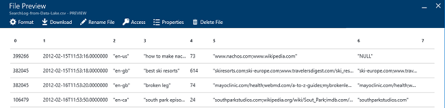

<properties 
   pageTitle="Guida introduttiva di Azure dati Lake Analitica portale Azure | Azure" 
   description="Informazioni su come usare il portale di Azure per creare un account di dati Lake Analitica, creare un processo dati Lake Analitica utilizzando U SQL e inviare il processo. " 
   services="data-lake-analytics" 
   documentationCenter="" 
   authors="edmacauley" 
   manager="jhubbard" 
   editor="cgronlun"/>
 
<tags
   ms.service="data-lake-analytics"
   ms.devlang="na"
   ms.topic="hero-article"
   ms.tgt_pltfrm="na"
   ms.workload="big-data" 
   ms.date="10/06/2016"
   ms.author="edmaca"/>

# Esercitazione: Introduzione a Azure dati Lake Analitica tramite il portale di Azure

[AZURE.INCLUDE [get-started-selector](../../includes/data-lake-analytics-selector-get-started.md)]

Informazioni su come utilizzare il portale Azure per creare gli account Azure dati Lake Analitica, definire processi dati Lake Analitica in [U SQL](data-lake-analytics-u-sql-get-started.md)e inviare i processi al servizio dati Lake Analitica. Per ulteriori informazioni sui dati Lake Analitica, vedere [Panoramica di Azure dati Lake Analitica](data-lake-analytics-overview.md).

In questa esercitazione si sviluppa un processo che legge i file con valori (TSV) separati da una scheda e lo converte in un file CSV con valori separati da virgola. Per passare all'interno dell'esercitazione stessa usare altri strumenti supportati, selezionare le schede nella parte superiore di questa sezione. Dopo il primo processo ha avuto esito positivo, è possibile iniziare a scrivere trasformazioni di dati più complesse con U-SQL.

##Prerequisiti

Prima di iniziare questa esercitazione, è necessario disporre gli elementi seguenti:

- **Azure un abbonamento**. Vedere [ottenere Azure versione di valutazione gratuita](https://azure.microsoft.com/pricing/free-trial/).

##Creare account Analitica Lake dati

Devono avere un account Analitica Lake dati prima di poter eseguire tutti i processi.

Ogni account dati Lake Analitica ha una relazione di account [Azure dati Lake Store]() .  L'account è definito come account predefinito archivio Lake dati.  È possibile creare l'account di archivio di dati Lake in anticipo o quando si crea l'account di dati Lake Analitica. In questa esercitazione, è necessario creare l'account di archivio Lake dati con l'account di dati Lake Analitica.

**Per creare un account di dati Lake Analitica**

1. Accedere al [portale di Azure](https://portal.azure.com).
2. Fare clic su **Nuovo**, fare clic su **Intelligence + analitica**e quindi fare clic su **Dati Lake Analitica**.
3. Digitare o selezionare i valori seguenti:

    

    - **Nome**: nome account dati Lake Analitica.
    - **Abbonamento**: scegliere l'abbonamento Azure utilizzato per il conto Analitica.
    - **Gruppo di risorse**. Selezionare un gruppo di risorse Azure esistente o crearne uno nuovo. Gestione risorse di Azure consente di gestire le risorse dell'applicazione come un gruppo. Per ulteriori informazioni, vedere [Panoramica di gestione risorse Azure](resource-group-overview.md). 
    - **Posizione**. Selezionare un'area di dati di Azure per l'account di dati Lake Analitica. 
    - **Archivio dati Lake**: account di ogni dati Lake Analitica ha un account di archivio di dati Lake dipendente. L'account di dati Lake Analitica e conto archivio dati Lake dipendente deve trovarsi nella stessa Azure data center dei. Seguire le istruzioni per creare un nuovo account di archivio di dati Lake oppure selezionarne uno esistente.

8. Fare clic su **Crea**. Visualizzata la schermata iniziale del portale. Un nuovo riquadro viene aggiunto al StartBoard con l'etichetta con "Distribuzione di Azure dati Lake Analitica". Bastano pochi minuti per creare un account di dati Lake Analitica. Quando si crea l'account, il portale si apre l'account in una nuova pala.

Dopo la creazione di un account di dati Lake Analitica, è possibile aggiungere altri account di archivio di dati Lake e gli account di archiviazione di Azure. Per ulteriori informazioni, vedere [gestire dati lake Analitica account origini dati](data-lake-analytics-manage-use-portal.md#manage-account-data-sources).

##Preparare i dati di origine

In questa esercitazione si elaborare alcuni log di ricerca.  Il log di ricerca può essere archiviato in archivio dData Lake o archiviazione Blob Azure. 

Portale di Azure offre un'interfaccia utente per la copia di alcuni file di dati di esempio per l'account predefinito di archivio di dati Lake, che includono un file di log di ricerca.

**Per copiare il file di dati di esempio**

1. Dal [portale di Azure](https://portal.azure.com), aprire l'account di dati Lake Analitica.  Vedere [gli account di gestione dati Lake Analitica](data-lake-analytics-get-started-portal.md#manage-accounts) per crearne uno e aprire l'account nel portale.
3. Espandere il riquadro **Nozioni di base** e quindi fare clic su **Esplora script di esempio**. Si apre un'altra blade chiamato **Script di esempio**.

    

4. Fare clic su **Dati di esempio mancanti** per copiare i file di dati di esempio. Al termine, il portale viene **aggiornati correttamente i dati di esempio**.
7. Da e il conto analitica Lake dati, fare clic su **Esplora dati** nella parte superiore. 

    

    Viene aperta due pale. Uno è **Data Explorer**e l'altra è l'account di archivio Lake dati predefinito.
8. In e il conto archivio Lake dati predefinito, fare clic su **campioni** per espandere la cartella e fare clic su **dati** per espandere la cartella. Sono visualizzati i file e cartelle seguenti:

    - AmbulanceData /
    - AdsLog.tsv
    - SearchLog.tsv
    - Version. txt
    - WebLog.log
    
    In questa esercitazione verrà usato SearchLog.tsv.

In pratica, uno programmare le applicazioni per scrivere dati in un account di archiviazione collegato oppure caricare dati. Per caricare i file, vedere [caricare dati dati Lake Store](data-lake-analytics-manage-use-portal.md#upload-data-to-adls) oppure [caricare dati a archiviazione Blob](data-lake-analytics-manage-use-portal.md#upload-data-to-wasb).

##Creare e inviare i dati Lake Analitica processi

Dopo aver selezionato l'origine dati, è possibile avviare lo sviluppo di uno script U-SQL.  

**Per inviare un processo**

1. Da e del conto l'analitica di Lake dati nel portale di, fare clic su **Nuovo processo**. 

    

    Se non è visibile e il, vedere [aprire un account di dati Lake Analitica dal portale](data-lake-analytics-manage-use-portal.md#access-adla-account).
2. Immettere **Il nome del processo**e lo script U SQL seguente:

        @searchlog =
            EXTRACT UserId          int,
                    Start           DateTime,
                    Region          string,
                    Query           string,
                    Duration        int?,
                    Urls            string,
                    ClickedUrls     string
            FROM "/Samples/Data/SearchLog.tsv"
            USING Extractors.Tsv();
        
        OUTPUT @searchlog   
            TO "/Output/SearchLog-from-Data-Lake.csv"
        USING Outputters.Csv();

    

    Questo script SQL U legge il file di dati di origine utilizzando **Extractors.Tsv()**e quindi viene creato un file csv tramite **Outputters.Csv()**. 
    
    Non modificare due percorsi, a meno che non si copia il file di origine in una posizione diversa.  Dati Lake Analitica creata la cartella di output se non esiste.  In questo caso, si utilizza percorsi semplici e relativi.  
    
    È semplice utilizzare percorsi relativi per i file memorizzati in account Lake dati predefiniti. È anche possibile utilizzare percorsi assoluti.  Per esempio 
    
        adl://<Data LakeStorageAccountName>.azuredatalakestore.net:443/Samples/Data/SearchLog.tsv
      

    Per ulteriori informazioni su U-SQL, vedere [Guida introduttiva a linguaggio Azure dati Lake Analitica U-SQL](data-lake-analytics-u-sql-get-started.md) e [riferimento al linguaggio SQL U](http://go.microsoft.com/fwlink/?LinkId=691348).
     
3. Fare clic su **Invia processo** nella parte superiore.   
4. Attendere finché non viene modificato lo stato del processo per **completato**. È possibile visualizzare che il processo ha circa un minuto per completare.
    
    In caso di errore del processo, vedere [Monitor e risolvere i processi di dati Lake Analitica](data-lake-analytics-monitor-and-troubleshoot-jobs-tutorial.md).

5. Nella parte inferiore della stessa e, fare clic sulla scheda **Output** e quindi fare clic su **SearchLog da dati Lake.csv**. È possibile visualizzare in anteprima, scaricare, rinominare ed eliminare il file di output.

    

##Vedere anche

- Per una query più complessa, vedere [registri di sito Web analizza mediante Azure dati Lake Analitica](data-lake-analytics-analyze-weblogs.md).
- Per iniziare a applicazioni U SQL, vedere [gli script di sviluppare U-SQL utilizzando dati Lake Tools per Visual Studio](data-lake-analytics-data-lake-tools-get-started.md).
- Per informazioni su U-SQL, vedere [Guida introduttiva a linguaggio Azure dati Lake Analitica U-SQL](data-lake-analytics-u-sql-get-started.md).
- Per le attività di gestione, vedere [gestire Azure dati Lake Analitica tramite il portale di Azure](data-lake-analytics-manage-use-portal.md).
- Per ottenere una panoramica dei dati Lake Analitica, vedere [Panoramica di Azure dati Lake Analitica](data-lake-analytics-overview.md).
- Per visualizzare l'esercitazione stessa usare altri strumenti, fare clic su selettori scheda nella parte superiore della pagina.
- Per registrare le informazioni di diagnostica, vedere [accesso ai registri di diagnostica per Azure dati Lake Analitica](data-lake-analytics-diagnostic-logs.md)
