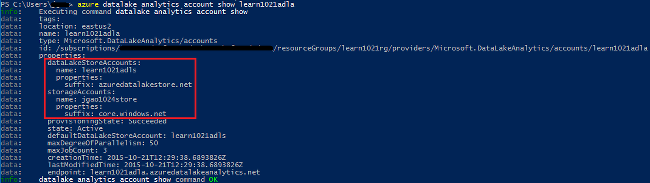

<properties 
   pageTitle="Gestire Azure dati Lake Analitica tramite l'interfaccia della riga di comando Azure | Azure" 
   description="Informazioni su come gestire account dati Lake Analitica, origini dati, processi e gli utenti che utilizzano CLI Azure" 
   services="data-lake-analytics" 
   documentationCenter="" 
   authors="edmacauley" 
   manager="jhubbard" 
   editor="cgronlun"/>
 
<tags
   ms.service="data-lake-analytics"
   ms.devlang="na"
   ms.topic="article"
   ms.tgt_pltfrm="na"
   ms.workload="big-data" 
   ms.date="05/16/2016"
   ms.author="edmaca"/>

# Gestire Azure dati Lake Analitica utilizzando Azure interfaccia riga di comando (CLI)

[AZURE.INCLUDE [manage-selector](../../includes/data-lake-analytics-selector-manage.md)]

Informazioni su come gestire gli account Azure dati Lake Analitica, origini dati, gli utenti e processi utilizzando la Azure. Per vedere l'argomento relativo alla gestione usare altri strumenti, fare clic su Seleziona la scheda precedente.

**Prerequisiti**

Prima di iniziare questa esercitazione, è necessario disporre le operazioni seguenti:

- **Azure un abbonamento**. Vedere [ottenere Azure versione di valutazione gratuita](https://azure.microsoft.com/pricing/free-trial/).
- **Azure CLI**. Vedere [installare e configurare Azure CLI](../xplat-cli-install.md).
    - Scaricare e installare la **versione non definitiva** [Azure CLI strumenti](https://github.com/MicrosoftBigData/AzureDataLake/releases) per poter completare questa demo.
- **L'autenticazione**, utilizzando il comando seguente:

        azure login
    Per ulteriori informazioni sull'autenticazione tramite un account aziendale o dell'istituto di istruzione, vedere [connettersi a un abbonamento Azure da CLI Azure](../xplat-cli-connect.md).
- **Passare alla modalità di gestione risorse di Azure**, utilizzando il comando seguente:

        azure config mode arm

**Per visualizzare un elenco di comandi Lake archivio dati e Analitica Lake dati:**

    azure datalake store
    azure datalake analytics

<!-- ################################ -->
<!-- ################################ -->
## Gestire gli account

Prima di eseguire qualsiasi processi dati Lake Analitica, è necessario disporre di un account di dati Lake Analitica. Diversamente da quanto succede Azure HDInsight non pagare per un account Analitica quando non è un processo.  Pagando per volta quando viene eseguito un processo.  Per ulteriori informazioni, vedere [Panoramica di Azure dati Lake Analitica](data-lake-analytics-overview.md).  

###Creare gli account

    azure datalake analytics account create "<Data Lake Analytics Account Name>" "<Azure Location>" "<Resource Group Name>" "<Default Data Lake Account Name>"

###Aggiornare gli account

Il comando seguente aggiorna le proprietà di un Account di Analitica Lake dati esistente
    
    azure datalake analytics account set "<Data Lake Analytics Account Name>"

###Elenco conti

Account Analitica Lake di dati di elenco 

    azure datalake analytics account list

Account Analitica Lake dati elenco all'interno di un determinato gruppo di risorse

    azure datalake analytics account list -g "<Azure Resource Group Name>"

Ottenere i dettagli di un account Analitica Lake dati specifico

    azure datalake analytics account show -g "<Azure Resource Group Name>" -n "<Data Lake Analytics Account Name>"

###Eliminare dati Lake Analitica account

    azure datalake analytics account delete "<Data Lake Analytics Account Name>"

<!-- ################################ -->
<!-- ################################ -->
## Gestire le origini dati di account

Dati Lake Analitica supporta al momento le origini dati seguenti:

- [Archivio Lake dati di Azure](../data-lake-store/data-lake-store-overview.md)
- [Spazio di archiviazione Azure](../storage/storage-introduction.md)

Quando si crea un account Analitica, è necessario designare un account Azure dati Lake archiviazione l'account di archiviazione predefinito. L'account di archiviazione predefinito ADL viene utilizzato per archiviare processo metadati e processo i log di controllo. Dopo aver creato un account Analitica, è possibile aggiungere altri account di archiviazione dei dati Lake e/o account Azure archiviazione. 

### Trovare l'account di archiviazione ADL predefinito

    azure datalake analytics account show "<Data Lake Analytics Account Name>"

Il valore viene elencato in proprietà: datalakeStoreAccount:name.

### Aggiungere altri account di archiviazione Blob Azure

    azure datalake analytics account datasource add -n "<Data Lake Analytics Account Name>" -b "<Azure Blob Storage Account Short Name>" -k "<Azure Storage Account Key>"

>[AZURE.NOTE] Sono supportati solo Blob breve i nomi di archiviazione.  Non usare FQDN, ad esempio "myblob.blob.core.windows.net".

### Aggiungere altri account di archivio di dati Lake

    azure datalake analytics account datasource add -n "<Data Lake Analytics Account Name>" -l "<Data Lake Store Account Name>" [-d]

[-d] è un parametro facoltativo che indica se l'account predefinito di dati Lake Lake dati da aggiungere. 

### Aggiornare l'origine dati esistente

Per impostare un account di archivio di dati Lake esistente come predefinito:

    azure datalake analytics account datasource set -n "<Data Lake Analytics Account Name>" -l "<Azure Data Lake Store Account Name>" -d
      
Per aggiornare una chiave di account di archiviazione Blob esistente:

    azure datalake analytics account datasource set -n "<Data Lake Analytics Account Name>" -b "<Blob Storage Account Name>" -k "<New Blob Storage Account Key>"

### Origini dati di elenco:

    azure datalake analytics account show "<Data Lake Analytics Account Name>"
    

### Eliminare le origini dati:

Per eliminare un account di archivio Lake dati:

    azure datalake analytics account datasource delete "<Data Lake Analytics Account Name>" "<Azure Data Lake Store Account Name>"

Per eliminare un account di archiviazione Blob:

    azure datalake analytics account datasource delete "<Data Lake Analytics Account Name>" "<Blob Storage Account Name>"

## Gestione dei processi

Avere un account Analitica Lake dati prima di creare un processo.  Per ulteriori informazioni, vedere [gestire dati Lake Analitica account](#manage-accounts).

### Elenca i processi

    azure datalake analytics job list -n "<Data Lake Analytics Account Name>"

### Visualizzare i dettagli dei processi

    azure datalake analytics job show -n "<Data Lake Analytics Account Name>" -j "<Job ID>"
    
### Inviare i processi

> [AZURE.NOTE] La priorità predefinita di un processo è 1000 e il grado di predefinito di parallelismo per un processo è 1.

    azure datalake analytics job create  "<Data Lake Analytics Account Name>" "<Job Name>" "<Script>"

### Annullare processi

Usare il comando elenco per trovare l'id di processo e quindi utilizzare Annulla per annullare il processo.

    azure datalake analytics job list -n "<Data Lake Analytics Account Name>"
    azure datalake analytics job cancel "<Data Lake Analytics Account Name>" "<Job ID>"

## Gestione del catalogo

Viene utilizzato il catalogo U SQL per strutturare i dati e il codice in modo che possano essere condivisi da script U-SQL. Il catalogo consente le massime prestazioni possibili con dati di Azure dati Lake. Per ulteriori informazioni, vedere [usare U-SQL catalogo](data-lake-analytics-use-u-sql-catalog.md).
 
###Voci di elenco catalogo

    #List databases
    azure datalake analytics catalog list -n "<Data Lake Analytics Account Name>" -t database

    #List tables
    azure datalake analytics catalog list -n "<Data Lake Analytics Account Name>" -t table
    
I tipi includono database, schema, assembly, origine dati esterna, tabella, funzione valutata di tabella o le statistiche delle tabelle.

###Creare segreto catalogo

    azure datalake analytics catalog secret create -n "<Data Lake Analytics Account Name>" <databaseName> <hostUri> <secretName>

### Modificare il segreto del catalogo

    azure datalake analytics catalog secret set -n "<Data Lake Analytics Account Name>" <databaseName> <hostUri> <secretName>

###Eliminare segreto catalogo

    azure datalake analytics catalog secrete delete -n "<Data Lake Analytics Account Name>" <databaseName> <hostUri> <secretName>

<!-- ################################ -->
<!-- ################################ -->
## Utilizzare i gruppi di ARM

Le applicazioni sono in genere costituite da molti componenti, ad esempio un'app web, database, server di database, lo spazio di archiviazione e 3 ° servizi di terze parti. Manager delle risorse Azure (ARM) consente di gestire le risorse dell'applicazione come un gruppo, indicato come un gruppo di risorse Azure. È possibile distribuire, aggiornare, monitorare o eliminare tutte le risorse per l'applicazione in un'operazione su una singola e coordinata. Si usa un modello per la distribuzione e il modello è possibile utilizzare per ambienti diversi, ad esempio test di prova e di produzione. È possibile rendere più chiara la fatturazione per l'organizzazione visualizzando i costi di ricalcolo per l'intero gruppo. Per ulteriori informazioni, vedere [Panoramica di gestione risorse Azure](../azure-resource-manager/resource-group-overview.md). 

Un servizio dati Lake Analitica può includere i componenti seguenti:

- Account Analitica Lake di dati di Azure
- Account di archiviazione di Azure dati Lake predefinito necessari
- Account di archiviazione aggiuntivo Azure dati Lake
- Altri account di archiviazione Azure

È possibile creare tutti questi componenti in un unico gruppo ARM per renderli più semplice da gestire.

Un account di dati Lake Analitica e gli account di archiviazione dipendenti devono essere inseriti nell'interfaccia di dati di Azure stesso.
Gruppo ARM tuttavia può trovarsi in un centro di dati diversi.  

##Vedere anche 

- [Panoramica di Microsoft Azure dati Lake Analitica](data-lake-analytics-overview.md)
- [Guida introduttiva a Analitica Lake dati nel portale di Azure](data-lake-analytics-get-started-portal.md)
- [Gestire Azure dati Lake Analitica nel portale di Azure](data-lake-analytics-manage-use-portal.md)
- [Monitorare e risolvere i processi di Azure dati Lake Analitica nel portale di Azure](data-lake-analytics-monitor-and-troubleshoot-jobs-tutorial.md)

