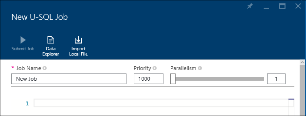
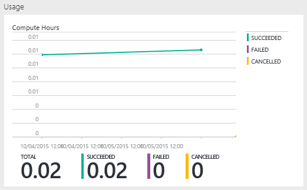

<properties 
   pageTitle="Gestire Azure dati Lake Analitica tramite il portale di Azure | Azure" 
   description="Informazioni su come gestire acounts dati Lake Analitica, origini dati, gli utenti e processi." 
   services="data-lake-analytics" 
   documentationCenter="" 
   authors="edmacauley" 
   manager="jhubbard" 
   editor="cgronlun"/>
 
<tags
   ms.service="data-lake-analytics"
   ms.devlang="na"
   ms.topic="article"
   ms.tgt_pltfrm="na"
   ms.workload="big-data" 
   ms.date="10/06/2016"
   ms.author="edmaca"/>

# Gestire Azure dati Lake Analitica tramite il portale di Azure

[AZURE.INCLUDE [manage-selector](../../includes/data-lake-analytics-selector-manage.md)]

Informazioni su come gestire gli account Azure dati Lake Analitica, origini dati di account, gli utenti e processi tramite il portale di Azure. Per visualizzare gli argomenti della gestione usare altri strumenti, fare clic sul selettore di tabulazione nella parte superiore della pagina.

**Prerequisiti**

Prima di iniziare questa esercitazione, è necessario disporre gli elementi seguenti:

- **Azure un abbonamento**. Vedere [ottenere Azure versione di valutazione gratuita](https://azure.microsoft.com/pricing/free-trial/).

<!-- ################################ -->
<!-- ################################ -->
## Gestire gli account

Prima di eseguire qualsiasi processi dati Lake Analitica, è necessario disporre di un account di dati Lake Analitica. Diversamente da quanto succede Azure HDInsight di pagare solo un account Analitica Lake dati quando si esegue un processo.  Pagando per volta quando viene eseguito un processo.  Per ulteriori informazioni, vedere [Panoramica di Azure dati Lake Analitica](data-lake-analytics-overview.md).  

**Per creare un account di dati Lake Analitica**

1. Accedere al [portale di Azure](https://portal.azure.com).
2. Fare clic su **Nuovo**, fare clic su **Intelligence + analitica**e quindi fare clic su **Dati Lake Analitica**.
3. Digitare o selezionare i valori seguenti:

    

    - **Nome**: nome account dati Lake Analitica.
    - **Abbonamento**: scegliere l'abbonamento Azure utilizzato per il conto Analitica.
    - **Gruppo di risorse**. Selezionare un gruppo di risorse Azure esistente o crearne uno nuovo. Gestione risorse di Azure consente di gestire le risorse dell'applicazione come un gruppo. Per ulteriori informazioni, vedere [Panoramica di gestione risorse Azure](resource-group-overview.md). 
    - **Posizione**. Selezionare un'area di dati di Azure per l'account di dati Lake Analitica. 
    - **Archivio dati Lake**: account di ogni dati Lake Analitica ha un account di archivio di dati Lake dipendente. L'account di dati Lake Analitica e conto archivio dati Lake dipendente deve trovarsi nella stessa Azure data center dei. Seguire le istruzioni per creare un nuovo account di archivio di dati Lake oppure selezionarne uno esistente.

8. Fare clic su **Crea**. Visualizzata la schermata iniziale del portale. Un nuovo riquadro viene aggiunto al StartBoard con l'etichetta con "Distribuzione di Azure dati Lake Analitica". Bastano pochi minuti per creare un account di dati Lake Analitica. Quando si crea l'account, il portale si apre l'account in una nuova pala.

Dopo la creazione di un account di dati Lake Analitica, è possibile aggiungere altri account di archivio di dati Lake e gli account di archiviazione di Azure. Per ulteriori informazioni, vedere [gestire dati lake Analitica account origini dati](data-lake-analytics-manage-use-portal.md#manage-account-data-sources).

**Per l'accesso o aprire un account di dati Lake Analitica**

1. Accedere al [portale di Azure](https://portal.azure.com/).
2. Fare clic su **Dati Lake Analitica** nel menu a sinistra.  Se non è visualizzata, fare clic su **altri servizi**e quindi fare clic su **Dati Lake Analitica** in **Intelligence + Analitica**.
3. Fare clic sull'account Analitica Lake dati che si desidera accedere. L'account viene aperto in una nuova pala.

**Per eliminare un account di dati Lake Analitica**

1. Aprire l'account Analitica Lake dati che si desidera eliminare. Per ulteriori informazioni, vedere [account di accesso dati Lake Analitica](#access-adla-account).
2. Scegliere **Elimina** dal menu del pulsante nella parte superiore e il.
3. Digitare il nome dell'account e quindi fare clic su **Elimina**.

Eliminazione di un account di dati Lake Analitica, gli account di archivio di dati Lake dipendenti non viene eliminato. Per istruzioni di eliminazione degli account di archiviazione Lake dei dati, vedere [eliminare dati Lake archivio account](data-lake-store-get-started-portal.md#delete-azure-data-lake-store-account).

<!-- ################################ -->
<!-- ################################ -->
## Gestire le origini dati di account

Dati Lake Analitica supporta al momento le origini dati seguenti:

- [Archivio Lake dati di Azure](../data-lake-store/data-lake-store-overview.md)
- [Spazio di archiviazione Azure](../storage/storage-introduction.md)

Quando si crea un account di dati Lake Analitica, è necessario designare un account Azure dati Lake Store l'account di archiviazione predefinito. L'account di archivio di dati Lake predefinito viene utilizzato per archiviare processo metadati e processo i log di controllo. Dopo aver creato un account di dati Lake Analitica, è possibile aggiungere altri account di archivio di dati Lake e/o account Azure archiviazione. 

**Per trovare l'account di archiviazione dati Lake predefinito**

- Aprire l'account Analitica Lake dati che si vuole gestire. Per ulteriori informazioni, vedere [account di accesso dati Lake Analitica](#access-adla-account). Archivio di dati Lake predefinito è illustrata nella **essenziali**:

    

**Per aggiungere altre origini dati**

1. Aprire l'account Analitica Lake dati che si vuole gestire. Per ulteriori informazioni, vedere [account di accesso dati Lake Analitica](#access-adla-account).
2. Fare clic su **Impostazioni** e quindi fare clic su **Origini dati**. Risulta l'account di archivio di dati Lake predefinito è elencato. 
3. Fare clic su **Aggiungi origine dati**.

    

    Per aggiungere un account Azure dati Lake Store, è necessario l'account nome e l'accesso all'account per poter eseguire una query.
    Per aggiungere un'archiviazione Blob Azure, è necessario disporre di account di archiviazione e la chiave account, sono disponibili all'account di archiviazione nel portale.

**Per esplorare origini dati**  

1. Aprire l'account Analitica che si vuole gestire. Per ulteriori informazioni, vedere [account di accesso dati Lake Analitica](#access-adla-account).
2. Fare clic su **Impostazioni** e quindi fare clic su **Esplora dati**. 
 
    
    
3. Fare clic su un account di archivio Lake dati per aprire l'account.

    
    
    Per ogni account archivio Lake dati, è possibile
    
    - **Nuova cartella**: aggiungere una nuova cartella.
    - **Caricare**: caricare file in account di archiviazione dalla workstation.
    - **Access**: configurare l'accesso autorizzazioni.
    - **Rinomina cartella**: rinominare una cartella.
    - **Proprietà delle cartelle**: visualizzare le proprietà di file o una cartella, ad esempio percorso di WASB, di WEBHDFS ora dell'ultima modifica e così via.
    - **Elimina cartella**: eliminare una cartella.

**Per caricare i file all'archivio dati Lake account**

1. Dal portale, fare clic su **Sfoglia** nel menu a sinistra e quindi fare clic su **Archivio Lake dati**.
2. Fare clic sull'account di archivio Lake dati che si desidera caricare dati in. Per individuare l'account di archiviazione dei dati Lake predefinito, vedere [di seguito](#default-adl-account).
3. Fare clic su **Data Explorer** dal menu superiore.
4. Fare clic su **Nuova Directory** per creare una nuova cartella oppure fare clic su un nome per la cartella per cambiare cartella.
6. Fare clic su **Carica** dal menu superiore per caricare file.

**Per caricare i file all'account di archiviazione Blob Azure**

Vedere [caricare dati per i processi di Hadoop in HDInsight](../hdinsight/hdinsight-upload-data.md).  Le informazioni si applicano a dati Lake Analitica.

## Gestire gli utenti

Dati Lake Analitica utilizza il controllo dell'accesso basato sui ruoli con Azure Active Directory. Quando si crea un account di dati Lake Analitica, per l'account viene aggiunto un ruolo "Amministratori abbonamento". È possibile aggiungere altri utenti e gruppi di sicurezza con i ruoli seguenti:

|Ruolo|Descrizione|
|----|-----------|
|Proprietario|Consentono di gestire tutti gli elementi, tra cui l'accesso alle risorse.|
|Per i collaboratori|Accedere al portale; inviare e monitorare i processi. Per inviare i processi, un collaboratore richiede l'autorizzazione di lettura o di scrittura per gli account di archivio di dati Lake.|
|DataLakeAnalyticsDeveloper | Inviare, monitorare e annullare processi.  Questi utenti è possono annullare solo i processi personali. Che non è possibile gestire il proprio account, ad esempio, aggiungere utenti, modificare le autorizzazioni o eliminare l'account. Per poter eseguire processi hanno bisogno di accesso in lettura o scrittura per gli account di archivio di dati Lake     | 
|Utilità per la lettura|Consente di visualizzare tutti gli elementi, ma non apportare le modifiche.|  
|Utente esercitazioni DevTest|Consente di visualizzare tutti gli elementi e connettersi, inizio, riavvio e arresto macchine virtuali.|  
|Amministratore di accesso utente|Consente di gestire l'accesso alle risorse di Azure.|  

Per informazioni sulla creazione di Azure Active Directory utenti e gruppi di sicurezza, vedere [Novità Azure Active Directory](../active-directory/active-directory-whatis.md).

**Per aggiungere utenti o gruppi di sicurezza a un account di dati Lake Analitica**

1. Aprire l'account Analitica che si vuole gestire. Per ulteriori informazioni, vedere [account di accesso dati Lake Analitica](#access-adla-account).
2. Fare clic su **Impostazioni**e quindi fare clic su **utenti**. Fare clic su **accesso** sulla barra del titolo **Nozioni di base** , come illustrato nella schermata seguente:

    
3. Da e **l'utente** , fare clic su **Aggiungi**.
4. Selezionare un ruolo e aggiungere un utente e quindi fare clic su **OK**.

**Nota: Se è necessario inviare i processi di questo utente o gruppo di sicurezza, devono essere concessa l'autorizzazione sull'archivio di Lake dati. Per ulteriori informazioni, vedere [la protezione dei dati archiviati in archivio Lake dati](../data-lake-store/data-lake-store-secure-data.md).**

<!-- ################################ -->
<!-- ################################ -->
## Gestione dei processi

Avere un account Analitica Lake dati prima di eseguire qualsiasi processi U-SQL.  Per ulteriori informazioni, vedere [gestire dati Lake Analitica account](#manage-data-lake-analytics-accounts).

**Per creare un processo**

1. Aprire l'account Analitica che si vuole gestire. Per ulteriori informazioni, vedere [account di accesso dati Lake Analitica](#access-adla-account).
2. Fare clic su **nuovo processo**.

    

    Risulta una nuova pala simile a:

    

    Per ogni processo, è possibile configurare

  	|Nome|Descrizione|
  	|----|-----------|
  	|Nome del processo|Immettere il nome del processo.|
  	|Priorità|Numero più basso ha priorità più alta. Se sono due processi sia in coda, uno con minore priorità viene eseguito prima di tutto|
  	|Parallelismo |Numero massimo di processi di calcolo che possono verificarsi nello stesso momento. Aumentare il numero di migliorare le prestazioni, ma aumenta anche costo.|
  	|Script|Immettere lo script U SQL per il processo.|

    Utilizzando la stessa interfaccia, è possibile anche esplorare le origini dati dei collegamenti e aggiungere altri file per le origini dati collegate. 
3. Se si desidera inviare il processo, fare clic su **Invia processo** .

**Per inviare un processo**

Vedere [creare dati Lake Analitica processi](#create-job).

**Per monitorare i processi**

1. Aprire l'account Analitica che si vuole gestire. Per ulteriori informazioni, vedere [account di accesso dati Lake Analitica](#access-adla-account). Il pannello di gestione dei processi Mostra le informazioni sul processo di base:

    

3. Come illustrato nella figura precedente, fare clic su **Gestione del processo** .

    

4. Fare clic su un processo negli elenchi. Oppure fare clic su **filtro** per informazioni su come trovare i processi:

    

    È possibile filtrare processi **dall'Intervallo di tempo**, **Il nome del processo**e **autore**.
5. Se si desidera inviare di nuovo il processo, fare clic su **Nuovo invio** .

**Per inviare nuovamente un processo**

Vedere [processi Monitor dati Lake Analitica](#monitor-jobs).

##Monitorare l'utilizzo di account

**Per monitorare l'utilizzo di account**

1. Aprire l'account Analitica che si vuole gestire. Per ulteriori informazioni, vedere [account di accesso dati Lake Analitica](#access-adla-account). Il pannello di utilizzo mostra l'utilizzo:

    

2. Fare doppio clic sul riquadro per visualizzare ulteriori dettagli.

##Visualizza catalogo U SQL

Viene utilizzato il [catalogo U SQL](data-lake-analytics-use-u-sql-catalog.md) per strutturare i dati e il codice in modo che possano essere condivisi da script U-SQL. Il catalogo consente le massime prestazioni possibili con dati di Azure dati Lake. Dal portale di Azure, in grado di visualizzare catalogo U-SQL.

**Per esplorare catalogo U SQL**

1. Aprire l'account Analitica che si vuole gestire. Per ulteriori informazioni, vedere [account di accesso dati Lake Analitica](#access-adla-account).
2. Fare clic su **Data Explorer** dal menu superiore.
3. Espandere **catalogo**, **master**, **tabelle, o **funzioni con valori tabella**, o **assembly * *. La figura seguente illustra una funzione di valori di tabella.

    

<!-- ################################ -->
<!-- ################################ -->
## Utilizzare i gruppi di Manager delle risorse di Azure

Le applicazioni sono in genere costituite da molti componenti, ad esempio un'app web, database, server di database, lo spazio di archiviazione e i servizi di terze parti. Gestione risorse di Azure consente di gestire le risorse dell'applicazione come un gruppo, indicato come un gruppo di risorse Azure. Si distribuire, aggiornare, monitorare o eliminare tutte le risorse per l'applicazione in un'operazione su una singola e coordinata. Si usa un modello per la distribuzione e il modello è possibile utilizzare per ambienti diversi, ad esempio test, gestione temporanea e di produzione. È possibile rendere più chiara la fatturazione per l'organizzazione visualizzando i costi di ricalcolo per l'intero gruppo. Per ulteriori informazioni, vedere [Panoramica di gestione risorse Azure](../azure-resource-manager/resource-group-overview.md). 

Un servizio dati Lake Analitica può includere i componenti seguenti:

- Account Analitica Lake di dati di Azure
- Predefiniti necessari account Azure dati Lake archivio
- Account aggiuntivi Azure dati Lake archivio
- Altri account di archiviazione Azure

È possibile creare tutti questi componenti in un unico gruppo di gestione delle risorse per renderli più semplice da gestire.

Un account di dati Lake Analitica e gli account di archiviazione dipendenti devono essere inseriti nell'interfaccia di dati di Azure stesso.
Il gruppo di gestione delle risorse, tuttavia può trovarsi in un centro di dati diversi.  

##Vedere anche 

- [Panoramica di Microsoft Azure dati Lake Analitica](data-lake-analytics-overview.md)
- [Guida introduttiva a Analitica Lake dati tramite il portale di Azure](data-lake-analytics-get-started-portal.md)
- [Gestire Azure dati Lake Analitica tramite PowerShell Azure](data-lake-analytics-manage-use-powershell.md)
- [Monitorare e risolvere i processi di Azure dati Lake Analitica tramite il portale di Azure](data-lake-analytics-monitor-and-troubleshoot-jobs-tutorial.md)

