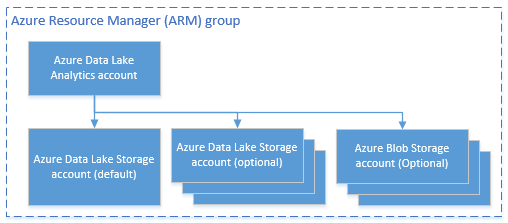

<properties 
   pageTitle="Gestire Azure dati Lake Analitica tramite PowerShell Azure | Azure" 
   description="Informazioni su come gestire i processi di dati Lake Analitica, origini dati, gli utenti. " 
   services="data-lake-analytics" 
   documentationCenter="" 
   authors="edmacauley" 
   manager="jhubbard" 
   editor="cgronlun"/>
 
<tags
   ms.service="data-lake-analytics"
   ms.devlang="na"
   ms.topic="article"
   ms.tgt_pltfrm="na"
   ms.workload="big-data" 
   ms.date="05/16/2016"
   ms.author="edmaca"/>

# Gestire Azure dati Lake Analitica tramite PowerShell Azure

[AZURE.INCLUDE [manage-selector](../../includes/data-lake-analytics-selector-manage.md)]

Informazioni su come gestire gli account Azure dati Lake Analitica, origini dati, gli utenti e processi tramite PowerShell Azure. Per visualizzare gli argomenti della gestione usare altri strumenti, fare clic su Seleziona la scheda precedente.

**Prerequisiti**

Prima di iniziare questa esercitazione, è necessario disporre le operazioni seguenti:

- **Azure un abbonamento**. Vedere [ottenere Azure versione di valutazione gratuita](https://azure.microsoft.com/pricing/free-trial/).

<!-- ################################ -->
<!-- ################################ -->

##Installare Azure PowerShell 1.0 o versione successiva

Vedere la sezione Prerequisita di [PowerShell di Azure tramite Gestione risorse Azure](powershell-azure-resource-manager.md#prerequisites).
    
## Gestire gli account

Prima di eseguire qualsiasi processi dati Lake Analitica, è necessario disporre di un account di dati Lake Analitica. Diversamente da quanto succede Azure HDInsight non pagare per un account Analitica quando non è un processo.  Pagando per volta quando viene eseguito un processo.  Per ulteriori informazioni, vedere [Panoramica di Azure dati Lake Analitica](data-lake-analytics-overview.md).  

###Creare gli account

    $resourceGroupName = "<ResourceGroupName>"
    $dataLakeStoreName = "<DataLakeAccountName>"
    $dataLakeAnalyticsAccountName = "<DataLakeAnalyticsAccountName>"
    $location = "<Microsoft Data Center>"
    
    Write-Host "Create a resource group ..." -ForegroundColor Green
    New-AzureRmResourceGroup `
        -Name  $resourceGroupName `
        -Location $location
    
    Write-Host "Create a Data Lake account ..."  -ForegroundColor Green
    New-AzureRmDataLakeStoreAccount `
        -ResourceGroupName $resourceGroupName `
        -Name $dataLakeStoreName `
        -Location $location 
    
    Write-Host "Create a Data Lake Analytics account ..."  -ForegroundColor Green
    New-AzureRmDataLakeAnalyticsAccount `
        -Name $dataLakeAnalyticsAccountName `
        -ResourceGroupName $resourceGroupName `
        -Location $location `
        -DefaultDataLake $dataLakeStoreName
    
    Write-Host "The newly created Data Lake Analytics account ..."  -ForegroundColor Green
    Get-AzureRmDataLakeAnalyticsAccount `
        -ResourceGroupName $resourceGroupName `
        -Name $dataLakeAnalyticsAccountName  

È anche possibile usare un modello di gruppo di risorse Azure. Un modello per la creazione di un account di dati Lake Analitica mentre l'account di archivio di dati Lake dipendente è [nell'Appendice](#appendix-a). Salvare il modello in un file con .json modello e quindi usare il seguente script di PowerShell per chiamarlo:

    $AzureSubscriptionID = "<Your Azure Subscription ID>"
    
    $ResourceGroupName = "<New Azure Resource Group Name>"
    $Location = "EAST US 2"
    $DefaultDataLakeStoreAccountName = "<New Data Lake Store Account Name>"
    $DataLakeAnalyticsAccountName = "<New Data Lake Analytics Account Name>"
    
    $DeploymentName = "MyDataLakeAnalyticsDeployment"
    $ARMTemplateFile = "E:\Tutorials\ADL\ARMTemplate\azuredeploy.json"  # update the Json template path 
    
    Login-AzureRmAccount
    
    Select-AzureRmSubscription -SubscriptionId $AzureSubscriptionID
    
    # Create the resource group
    New-AzureRmResourceGroup -Name $ResourceGroupName -Location $Location
    
    # Create the Data Lake Analytics account with the default Data Lake Store account.
    $parameters = @{"adlAnalyticsName"=$DataLakeAnalyticsAccountName; "adlStoreName"=$DefaultDataLakeStoreAccountName}
    New-AzureRmResourceGroupDeployment -Name $DeploymentName -ResourceGroupName $ResourceGroupName -TemplateFile $ARMTemplateFile -TemplateParameterObject $parameters 

 
###Account di elenco

Account Analitica Lake dati elenco all'interno della sottoscrizione corrente

    Get-AzureRmDataLakeAnalyticsAccount
    
L'output:

    Id         : /subscriptions/xxxxxxxxxxxxxxxxxxxxxxxxxxxxxxxxxxxx/resourceGroups/learn1021rg/providers/Microsoft.DataLakeAnalytics/accounts/learn1021adla
    Location   : eastus2
    Name       : learn1021adla
    Properties : Microsoft.Azure.Management.DataLake.Analytics.Models.DataLakeAnalyticsAccountProperties
    Tags       : {}
    Type       : Microsoft.DataLakeAnalytics/accounts

Account Analitica Lake dati elenco all'interno di un determinato gruppo di risorse

    Get-AzureRmDataLakeAnalyticsAccount -ResourceGroupName $resourceGroupName

Ottenere i dettagli di un account Analitica Lake dati specifico

    Get-AzureRmDataLakeAnalyticsAccount -Name $adlAnalyticsAccountName

Verificare l'esistenza di un account di dati Lake Analitica specifico

    Test-AzureRmDataLakeAnalyticsAccount -Name $adlAnalyticsAccountName

Il cmdlet verrà restituito **True** o **False**.

###Eliminare dati Lake Analitica account

    $resourceGroupName = "<ResourceGroupName>"
    $dataLakeAnalyticsAccountName = "<DataLakeAnalyticsAccountName>"
    
    Remove-AzureRmDataLakeAnalyticsAccount -Name $dataLakeAnalyticsAccountName 

Account Analitica Elimina dati Lake non verrà eliminato l'account di archiviazione dei dati Lake dipendente. Nell'esempio seguente consente di eliminare l'account di dati Lake Analitica e l'account di archivio di dati Lake predefinito

    $resourceGroupName = "<ResourceGroupName>"
    $dataLakeAnalyticsAccountName = "<DataLakeAnalyticsAccountName>"
    $dataLakeStoreName = (Get-AzureRmDataLakeAnalyticsAccount -ResourceGroupName $resourceGroupName -Name $dataLakeAnalyticAccountName).Properties.DefaultDataLakeAccount

    Remove-AzureRmDataLakeAnalyticsAccount -ResourceGroupName $resourceGroupName -Name $dataLakeAnalyticAccountName 
    Remove-AzureRmDataLakeStoreAccount -ResourceGroupName $resourceGroupName -Name $dataLakeStoreName

<!-- ################################ -->
<!-- ################################ -->
## Gestire le origini dati di account

Dati Lake Analitica supporta al momento le origini dati seguenti:

- [Archivio Lake dati di Azure](../data-lake-store/data-lake-store-overview.md)
- [Spazio di archiviazione Azure](storage-introduction.md)

Quando si crea un account Analitica, è necessario designare un account Azure dati Lake archiviazione l'account di archiviazione predefinito. L'account di archivio di dati Lake predefinito viene utilizzato per archiviare processo metadati e processo i log di controllo. Dopo aver creato un account Analitica, è possibile aggiungere altri account di archiviazione dei dati Lake e/o account Azure archiviazione. 

### Trovare l'account di archivio di dati Lake predefinito

    $resourceGroupName = "<ResourceGroupName>"
    $dataLakeAnalyticsAccountName = "<DataLakeAnalyticsAccountName>"
    $dataLakeStoreName = (Get-AzureRmDataLakeAnalyticsAccount -ResourceGroupName $resourceGroupName -Name $dataLakeAnalyticAccountName).Properties.DefaultDataLakeAccount

### Aggiungere altri account di archiviazione Blob Azure

    $resourceGroupName = "<ResourceGroupName>"
    $dataLakeAnalyticsAccountName = "<DataLakeAnalyticsAccountName>"
    $AzureStorageAccountName = "<AzureStorageAccountName>"
    $AzureStorageAccountKey = "<AzureStorageAccountKey>"
    
    Add-AzureRmDataLakeAnalyticsDataSource -ResourceGroupName $resourceGroupName -Account $dataLakeAnalyticAccountName -AzureBlob $AzureStorageAccountName -AccessKey $AzureStorageAccountKey

### Aggiungere altri account di archivio di dati Lake

    $resourceGroupName = "<ResourceGroupName>"
    $dataLakeAnalyticsAccountName = "<DataLakeAnalyticsAccountName>"
    $AzureDataLakeName = "<DataLakeStoreName>"
    
    Add-AzureRmDataLakeAnalyticsDataSource -ResourceGroupName $resourceGroupName -Account $dataLakeAnalyticAccountName -DataLake $AzureDataLakeName 

### Origini dati di elenco:

    $resourceGroupName = "<ResourceGroupName>"
    $dataLakeAnalyticsAccountName = "<DataLakeAnalyticsAccountName>"

    (Get-AzureRmDataLakeAnalyticsAccount -ResourceGroupName $resourceGroupName -Name $dataLakeAnalyticAccountName).Properties.DataLakeStoreAccounts
    (Get-AzureRmDataLakeAnalyticsAccount -ResourceGroupName $resourceGroupName -Name $dataLakeAnalyticAccountName).Properties.StorageAccounts
    

<!-- ################################ -->
<!-- ################################ -->
## Gestione dei processi

Avere un account Analitica Lake dati prima di creare un processo.  Per ulteriori informazioni, vedere [gestire dati Lake Analitica account](#manage-data-lake-analytics-accounts).

### Elenca i processi

    $dataLakeAnalyticsAccountName = "<DataLakeAnalyticsAccountName>"
    
    Get-AzureRmDataLakeAnalyticsJob -Account $dataLakeAnalyticAccountName
    
    Get-AzureRmDataLakeAnalyticsJob -Account $dataLakeAnalyticAccountName -State Running, Queued
    #States: Accepted, Compiling, Ended, New, Paused, Queued, Running, Scheduling, Starting
    
    Get-AzureRmDataLakeAnalyticsJob -Account $dataLakeAnalyticAccountName -Result Cancelled
    #Results: Cancelled, Failed, None, Successed 
    
    Get-AzureRmDataLakeAnalyticsJob -Account $dataLakeAnalyticAccountName -Name <Job Name>
    Get-AzureRmDataLakeAnalyticsJob -Account $dataLakeAnalyticAccountName -Submitter <Job submitter>

    # List all jobs submitted on January 1 (local time)
    Get-AzureRmDataLakeAnalyticsJob -Account $dataLakeAnalyticAccountName `
        -SubmittedAfter "2015/01/01"
        -SubmittedBefore "2015/01/02"   

    # List all jobs that succeeded on January 1 after 2 pm (UTC time)
    Get-AzureRmDataLakeAnalyticsJob -Account $dataLakeAnalyticAccountName `
        -State Ended
        -Result Succeeded
        -SubmittedAfter "2015/01/01 2:00 PM -0"
        -SubmittedBefore "2015/01/02 -0"

    # List all jobs submitted in the past hour
    Get-AzureRmDataLakeAnalyticsJob -Account $dataLakeAnalyticAccountName `
        -SubmittedAfter (Get-Date).AddHours(-1)

### Visualizzare i dettagli dei processi

    $dataLakeAnalyticsAccountName = "<DataLakeAnalyticsAccountName>"
    Get-AzureRmDataLakeAnalyticsJob -Account $dataLakeAnalyticAccountName -JobID <Job ID>
    
### Inviare i processi

    $dataLakeAnalyticsAccountName = "<DataLakeAnalyticsAccountName>"

    #Pass script via path
    Submit-AzureRmDataLakeAnalyticsJob -Account $dataLakeAnalyticAccountName `
        -Name $jobName `
        -ScriptPath $scriptPath

    #Pass script contents
    Submit-AzureRmDataLakeAnalyticsJob -Account $dataLakeAnalyticAccountName `
        -Name $jobName `
        -Script $scriptContents

> [AZURE.NOTE] La priorità predefinita di un processo è 1000 e il grado di predefinito di parallelismo per un processo è 1.

### Annullare processi

    Stop-AzureRmDataLakeAnalyticsJob -Account $dataLakeAnalyticAccountName `
        -JobID $jobID

## Gestire gli elementi del catalogo

Viene utilizzato il catalogo U SQL per strutturare i dati e il codice in modo che possano essere condivisi da script U-SQL. Il catalogo consente le massime prestazioni possibili con dati di Azure dati Lake. Per ulteriori informazioni, vedere [usare U-SQL catalogo](data-lake-analytics-use-u-sql-catalog.md).

###Voci di elenco catalogo

    #List databases
    Get-AzureRmDataLakeAnalyticsCatalogItem `
        -Account $adlAnalyticsAccountName `
        -ItemType Database
    
    
    
    #List tables
    Get-AzureRmDataLakeAnalyticsCatalogItem `
        -Account $adlAnalyticsAccountName `
        -ItemType Table `
        -Path "master.dbo"

###Visualizzare i dettagli degli elementi catalogo 

    #Get a database
    Get-AzureRmDataLakeAnalyticsCatalogItem `
        -Account $adlAnalyticsAccountName `
        -ItemType Database `
        -Path "master"
    
    #Get a table
    Get-AzureRmDataLakeAnalyticsCatalogItem `
        -Account $adlAnalyticsAccountName `
        -ItemType Table `
        -Path "master.dbo.mytable"

###Verificare l'esistenza dell'elemento catalogo

    Test-AzureRmDataLakeAnalyticsCatalogItem  `
        -Account $adlAnalyticsAccountName `
        -ItemType Database `
        -Path "master"

###Creare segreto catalogo
    New-AzureRmDataLakeAnalyticsCatalogSecret  `
            -Account $adlAnalyticsAccountName `
            -DatabaseName "master" `
            -Secret (Get-Credential -UserName "username" -Message "Enter the password")

### Modificare il segreto del catalogo
    Set-AzureRmDataLakeAnalyticsCatalogSecret  `
            -Account $adlAnalyticsAccountName `
            -DatabaseName "master" `
            -Secret (Get-Credential -UserName "username" -Message "Enter the password")

###Eliminare segreto catalogo
    Remove-AzureRmDataLakeAnalyticsCatalogSecret  `
            -Account $adlAnalyticsAccountName `
            -DatabaseName "master"

## Utilizzare i gruppi di Manager delle risorse di Azure

Le applicazioni sono in genere costituite da molti componenti, ad esempio un'app web, database, server di database, lo spazio di archiviazione e 3 ° servizi di terze parti. Manager delle risorse Azure (ARM) consente di gestire le risorse dell'applicazione come un gruppo, indicato come un gruppo di risorse Azure. È possibile distribuire, aggiornare, monitorare o eliminare tutte le risorse per l'applicazione in un'operazione su una singola e coordinata. Si usa un modello per la distribuzione e il modello è possibile utilizzare per ambienti diversi, ad esempio test di prova e di produzione. È possibile rendere più chiara la fatturazione per l'organizzazione visualizzando i costi di ricalcolo per l'intero gruppo. Per ulteriori informazioni, vedere [Panoramica di gestione risorse Azure](../azure-resource-manager/resource-group-overview.md). 

Un servizio dati Lake Analitica può includere i componenti seguenti:

- Account Analitica Lake di dati di Azure
- Account di archiviazione di Azure dati Lake predefinito necessari
- Account di archiviazione aggiuntivo Azure dati Lake
- Altri account di archiviazione Azure

È possibile creare tutti questi componenti in un unico gruppo ARM per renderli più semplice da gestire.

Un account di dati Lake Analitica e gli account di archiviazione dipendenti devono essere inseriti nell'interfaccia di dati di Azure stesso.
Gruppo ARM tuttavia può trovarsi in un centro di dati diversi.  

##Vedere anche 

- [Panoramica di Microsoft Azure dati Lake Analitica](data-lake-analytics-overview.md)
- [Guida introduttiva a Analitica Lake dati nel portale di Azure](data-lake-analytics-get-started-portal.md)
- [Gestire Azure dati Lake Analitica nel portale di Azure](data-lake-analytics-manage-use-portal.md)
- [Monitorare e risolvere i processi di Azure dati Lake Analitica nel portale di Azure](data-lake-analytics-monitor-and-troubleshoot-jobs-tutorial.md)

##Appendice a-modello di dati Lake Analitica ARM

Il modello ARM seguente utilizzabili per distribuire un account di dati Lake Analitica e il relativo account archivio Lake dati dipendenti.  Salvare come file json e quindi utilizzare script di PowerShell per chiamare il modello. Per ulteriori informazioni, vedere [distribuire un'applicazione con il modello di gestione risorse di Azure](../resource-group-template-deploy.md#deploy-with-powershell) e [modelli di creazione condivisa Manager delle risorse di Azure](../resource-group-authoring-templates.md).

    {
      "$schema": "http://schema.management.azure.com/schemas/2015-01-01/deploymentTemplate.json#",
      "contentVersion": "1.0.0.0",
      "parameters": {
        "adlAnalyticsName": {
          "type": "string",
          "metadata": {
            "description": "The name of the Data Lake Analytics account to create."
          }
        },
        "adlStoreName": {
          "type": "string",
          "metadata": {
            "description": "The name of the Data Lake Store account to create."
          }
        }
      },
      "resources": [
        {
          "name": "[parameters('adlStoreName')]",
          "type": "Microsoft.DataLakeStore/accounts",
          "location": "East US 2",
          "apiVersion": "2015-10-01-preview",
          "dependsOn": [ ],
          "tags": { }
        },
        {
          "name": "[parameters('adlAnalyticsName')]",
          "type": "Microsoft.DataLakeAnalytics/accounts",
          "location": "East US 2",
          "apiVersion": "2015-10-01-preview",
          "dependsOn": [ "[concat('Microsoft.DataLakeStore/accounts/',parameters('adlStoreName'))]" ],
          "tags": { },
          "properties": {
            "defaultDataLakeStoreAccount": "[parameters('adlStoreName')]",
            "dataLakeStoreAccounts": [
              { "name": "[parameters('adlStoreName')]" }
            ]
          }
        }
      ],
      "outputs": {
        "adlAnalyticsAccount": {
          "type": "object",
          "value": "[reference(resourceId('Microsoft.DataLakeAnalytics/accounts',parameters('adlAnalyticsName')))]"
        },
        "adlStoreAccount": {
          "type": "object",
          "value": "[reference(resourceId('Microsoft.DataLakeStore/accounts',parameters('adlStoreName')))]"
        }
      }
    }

