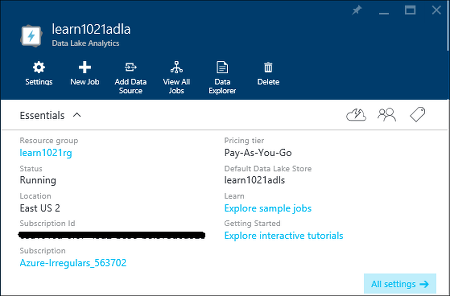

<properties 
   pageTitle="Informazioni su dati Lake Analitica e U-SQL utilizzando le esercitazioni Azure portale interattivi | Azure" 
   description="Guida introduttiva di formazione dati Lake Analitica e U-SQL. " 
   services="data-lake-analytics" 
   documentationCenter="" 
   authors="edmacauley" 
   manager="jhubbard" 
   editor="cgronlun"/>
 
<tags
   ms.service="data-lake-analytics"
   ms.devlang="na"
   ms.topic="get-started-article"
   ms.tgt_pltfrm="na"
   ms.workload="big-data" 
   ms.date="05/16/2016"
   ms.author="edmaca"/>

# Utilizzare Tutorial interattivi Analitica Lake dati di Azure

Il portale di Azure rappresenta un'esercitazione interattiva per poter iniziare a utilizzare dati Lake Analitica. In questo articolo viene illustrato come eseguire l'esercitazione per l'analisi dei registri di sito Web.

>[AZURE.NOTE]Se si desidera passare all'interno dell'esercitazione stessa utilizzando Visual Studio, vedere [i registri di sito Web analizza mediante dati Lake Analitica](data-lake-analytics-analyze-weblogs.md).
>Più interattive esercitazioni da aggiungere al portale.

Per altre esercitazioni, vedere:

- [Guida introduttiva a Analitica Lake dati nel portale di Azure](data-lake-analytics-get-started-portal.md)
- [Guida introduttiva a Analitica Lake dati tramite PowerShell Azure](data-lake-analytics-get-started-powershell.md)
- [Guida introduttiva a dati Lake Analitica utilizzando .NET SDK](data-lake-analytics-get-started-net-sdk.md)
- [Sviluppare script U SQL mediante dati Lake Tools per Visual Studio](data-lake-analytics-data-lake-tools-get-started.md) 

**Prerequisiti**

Prima di iniziare questa esercitazione, è necessario disporre le operazioni seguenti:

- **Account A dati Lake Analitica**.  Vedere [Guida introduttiva di Azure dati Lake Analitica nel portale di Azure](data-lake-analytics-get-started-portal.md).

##Creare account Analitica Lake dati 

Devono avere un account Analitica Lake dati prima di poter eseguire tutti i processi.

Ogni account dati Lake Analitica ha una relazione di account [Azure dati Lake Store](../data-lake-store/data-lake-store-overview.md) .  L'account è definito come account predefinito archivio Lake dati.  È possibile creare l'account di archivio di dati Lake in anticipo o quando si crea l'account di dati Lake Analitica. In questa esercitazione si creerà l'account di archivio Lake dati con l'account Analitica

**Per creare un account di dati Lake Analitica**

1. Accedere al [portale di Azure](https://portal.azure.com/signin/index/?Microsoft_Azure_Kona=true&Microsoft_Azure_DataLake=true&hubsExtension_ItemHideKey=AzureDataLake_BigStorage%2cAzureKona_BigCompute).
2. Fare clic su **Microsoft Azure** nell'angolo superiore sinistro per aprire la StartBoard.
3. Fare clic sul riquadro **Marketplace** .  
3. Digitare **Azure dati Lake Analitica** nella casella di ricerca e il **tutto** , quindi premere **INVIO**. **Azure dati Lake Analitica** sono visualizzati nell'elenco.
4. Fare clic su **Azure dati Lake Analitica** dall'elenco.
5. Fare clic su **Crea** nella parte inferiore della stessa e.
6. Digitare o selezionare le opzioni seguenti:

    

    - **Nome**: nome account Analitica.
    - **Archivio dati Lake**: account di ogni dati Lake Analitica ha un account di archivio di dati Lake dipendente. L'account di dati Lake Analitica e conto archivio dati Lake dipendente deve trovarsi nella stessa Azure data center dei. Seguire le istruzioni per creare un nuovo account di archivio di dati Lake oppure selezionarne uno esistente.
    - **Abbonamento**: scegliere l'abbonamento Azure utilizzato per il conto Analitica.
    - **Gruppo di risorse**. Selezionare un gruppo di risorse Azure esistente o crearne uno nuovo. Le applicazioni sono in genere costituite da molti componenti, ad esempio un'app web, database, server di database, lo spazio di archiviazione e 3 ° servizi di terze parti. Manager delle risorse Azure (ARM) consente di gestire le risorse dell'applicazione come un gruppo, indicato come un gruppo di risorse Azure. È possibile distribuire, aggiornare, monitorare o eliminare tutte le risorse per l'applicazione in un'operazione su una singola e coordinata. Si usa un modello per la distribuzione e il modello è possibile utilizzare per ambienti diversi, ad esempio test di prova e di produzione. È possibile rendere più chiara la fatturazione per l'organizzazione visualizzando i costi di ricalcolo per l'intero gruppo. Per ulteriori informazioni, vedere [Panoramica di gestione risorse Azure](azure-resource-manager/resource-group-overview.md). 
    - **Posizione**. Selezionare un'area di dati di Azure per l'account di dati Lake Analitica. 
7. Selezionare **Aggiungi a Startboard**. Questa operazione è necessaria seguendo l'esercitazione.
8. Fare clic su **Crea**. Essa consente di accedere al portale di StartBoard. Un nuovo riquadro viene aggiunta alla Home page con l'etichetta con "Distribuzione di Azure dati Lake Analitica". Bastano pochi minuti per creare un account di dati Lake Analitica. Quando si crea l'account, il portale si apre l'account in una nuova pala.

    

##Esegui esercitazione interattiva di analisi dei registri di sito Web

**Per aprire l'esercitazione interattiva Analitica Log sito Web**

1. Dal portale, fare clic su **Microsoft Azure** dal menu a sinistra per aprire la StartBoard.
2. Fare clic sul riquadro collegato al proprio account dati Lake Analitica.
3. Fare clic su **Esplora Tutorial interattivi** dalla barra **Nozioni di base** .

    

4. Se viene visualizzato un dire avviso arancione "esempi non configurare, fare clic su...", fare clic su **Copia dei dati di esempio** per copiare i dati di esempio per l'account di archivio Lake dati predefinito. Esercitazione interattiva necessario selezionare i dati per l'esecuzione.
5. Da e il **Tutorial interattivi** , fare clic su **Sito Web Log Analitica**. Il portale si apre l'esercitazione in una nuova pala portale.
5. Fare clic su **1 Introduzione** e quindi seguire le istruzioni

##Vedere anche

- [Panoramica di Microsoft Azure dati Lake Analitica](data-lake-analytics-overview.md)
- [Guida introduttiva a Analitica Lake dati nel portale di Azure](data-lake-analytics-get-started-portal.md)
- [Guida introduttiva a Analitica Lake dati tramite PowerShell Azure](data-lake-analytics-get-started-powershell.md)
- [Sviluppare script U SQL mediante dati Lake Tools per Visual Studio](data-lake-analytics-data-lake-tools-get-started.md)
- [Analizzare i registri di sito Web usando Analitica Lake dati di Azure](data-lake-analytics-analyze-weblogs.md)
