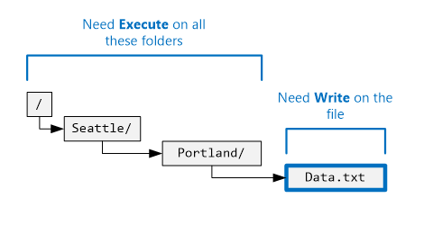
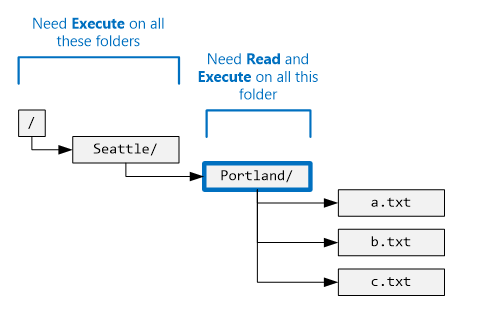
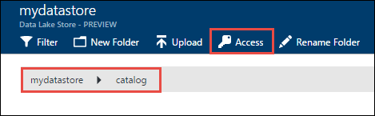
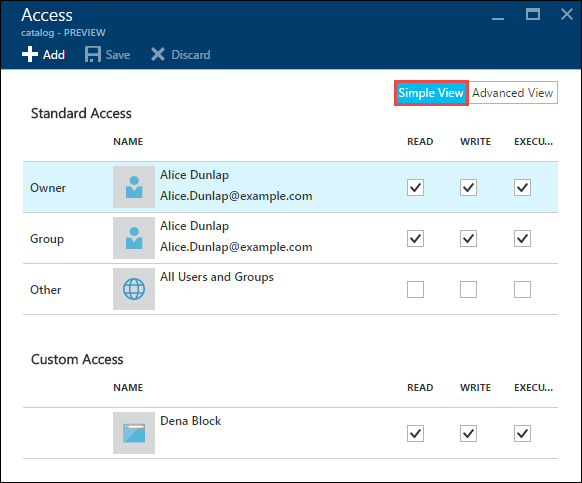
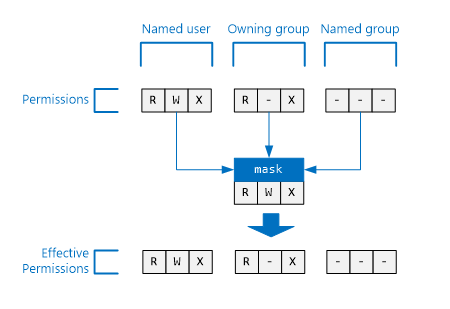

<properties
   pageTitle="Panoramica del controllo di accesso nell'archivio dati Lake | Microsoft Azure"
   description="Capire come accedere a controllo nell'archivio Lake dati di Azure"
   services="data-lake-store"
   documentationCenter=""
   authors="nitinme"
   manager="jhubbard"
   editor="cgronlun"/>

<tags
   ms.service="data-lake-store"
   ms.devlang="na"
   ms.topic="get-started-article"
   ms.tgt_pltfrm="na"
   ms.workload="big-data"
   ms.date="09/06/2016"
   ms.author="nitinme"/>

# Controllo dell'accesso nell'archivio Lake dati di Azure

Archivio dati Lake implementato un modello di controllo di accesso che deriva da HDFS e a sua volta, dal modello di controllo di accesso POSIX. In questo articolo sono riepilogate le nozioni di base del modello di controllo di accesso per archivio Lake dati. Per ulteriori informazioni HDFS il controllo dell'accesso modello vedere [Guida alle autorizzazioni HDFS](https://hadoop.apache.org/docs/current/hadoop-project-dist/hadoop-hdfs/HdfsPermissionsGuide.html).

## Elenchi di controllo di accesso di file e cartelle

Esistono due tipi di accesso elenchi di controllo () - **ACL Access** e **ACL predefinito**.

* **Accesso ACL** – queste controllano l'accesso a un oggetto. File e cartelle dispongono degli ACL di Access.

* **ACL predefinito** : "Modello" degli ACL associato a una cartella che determinano gli elenchi di controllo di accesso per tutti gli elementi figlio creati in tale cartella. File non dispone di ACL predefinito.

Accesso ACL e ACL predefinito hanno la stessa struttura.

>[AZURE.NOTE] Modifica dell'ACL predefinito per un elemento padre non ha alcun effetto l'accesso o ACL predefinita degli elementi figlio già esistenti.

## Utenti e le identità

Tutti i file e cartella dispone delle autorizzazioni distinte per tali identità:

* L'utente proprietario del file
* Il gruppo proprietario
* Nomi degli utenti
* Gruppi denominati
* Tutti gli altri utenti

Le identità di utenti e gruppi sono identità di Azure Active Directory (AAD) in modo se non diversamente specificato un "utente", nel contesto di archivio di dati Lake, possibile uno che un utente AAD o un gruppo di sicurezza AAD.

## Autorizzazioni

Le autorizzazioni per un oggetto file System sono **lettura**, **scrittura**, ed **esecuzione** e possono essere utilizzati per file e cartelle, come illustrato nella tabella seguente.

|            |    File     |   Cartella |
|------------|-------------|----------|
| **Read (R)** | Leggere il contenuto di un file | È necessario **lettura** ed **esecuzione** elencare il contenuto della cartella.|
| **Scrittura (W)** | Possibile scrivere o aggiungere a un file | È necessario **scrittura ed esecuzione** creare figlio di elementi in una cartella. |
| **Esecuzione (X)** | Non è significativo nel contesto di archivio di dati Lake | Richiesto per scorrere gli elementi figlio di una cartella. |

### Forme brevi per le autorizzazioni

**RWX**viene utilizzata per indicare **leggere + scrivere + eseguire**. In cui è presente un formato numerico più limitato **lettura = 4**, **scrivere = 2**, e **Execute = 1** e la relativa somma rappresenta le autorizzazioni. Di seguito sono riportati alcuni esempi.

| Formato numerico | Forma abbreviata |      Significato     |
|--------------|------------|------------------------|
| 7            | RWX        | Leggere + scrivere + eseguire |
| 5            | R-X        | Lettura + eseguire         |
| 4            | R:        | Lettura                   |
| 0            | ---        | Nessuna autorizzazione         |

### Non eredita le autorizzazioni

Nel modello di tipo POSIX utilizzato dall'archivio Lake dati, le autorizzazioni per un elemento sono archiviate nell'articolo stesso. In altre parole, le autorizzazioni per un elemento non possono essere ereditate dagli elementi padre.

## Scenari comuni relativi alle autorizzazioni

Ecco alcuni scenari comuni per capire quali autorizzazioni sono necessari per eseguire alcune operazioni su un account di archivio di dati Lake.

### Autorizzazioni necessarie per leggere un file

* Per il file da leggere - il chiamante deve disporre di autorizzazioni di **lettura**
* Per tutte le cartelle la struttura delle cartelle che contengono file - il chiamante deve disporre di autorizzazioni **Execute**

### Autorizzazioni necessarie per accodare a un file

* Per il file da aggiungere alla - il chiamante necessita di autorizzazioni di **scrittura**
* Per tutte le cartelle che contengono file - il chiamante deve disporre di autorizzazioni **Execute**

### Autorizzazioni necessarie per eliminare un file

* Per la cartella principale - il chiamante deve disporre di autorizzazioni di **scrittura eseguire**
* Per tutte le cartelle il percorso del file - il chiamante deve disporre di autorizzazioni **Execute**

>[AZURE.NOTE] Scrivere le autorizzazioni del file non è necessario eliminare il file come sopra due condizioni sono vere.

### Autorizzazioni necessarie per enumerare una cartella

* Per la cartella da cui enumerare - il chiamante deve disporre di autorizzazioni **lettura + Execute**
* Per tutte le cartelle predecessore - il chiamante deve disporre di autorizzazioni **Execute**

## Visualizzazione delle autorizzazioni nel portale di Azure

Da blade **Data Explorer** dell'account archivio Lake dati, fare clic su **accesso** per visualizzare gli elenchi di controllo per un file o una cartella. Nella schermata, fare clic su accesso per visualizzare gli elenchi di controllo per la cartella di **catalogo** con l'account **mydatastore** .

In seguito, da e il **Access** , fare clic su **Visualizzazione semplice** per visualizzare più semplice.

Fare clic su **Visualizzazione avanzata** per visualizzare più avanzate.

## L'utente con privilegi avanzati

Un utente con privilegi avanzati diritti il maggior numero di tutti gli utenti nell'archivio Lake dati. Un utente con privilegi avanzati:

* dispone delle autorizzazioni RWX per **tutti** i file e cartelle
* cambiare le autorizzazioni per un file o una cartella.
* cambiare l'appartenenza utente o gruppo proprietario di un file o una cartella.

In Azure, un account di archivio di dati Lake sono disponibili diversi ruoli Azure:

* Proprietari
* Collaboratori
* Lettori
* E così via.

Tutti gli utenti il ruolo di **proprietari** di un account di archivio di dati Lake viene automaticamente un utente avanzato per tale account. Per ulteriori informazioni su Azure ruolo in base a Access controllo (RBAC) vedere [controllo di accesso basato sui ruoli](../active-directory/role-based-access-control-configure.md).

## L'utente proprietario

L'utente che ha creato l'elemento è automaticamente l'utente proprietario dell'elemento. Un utente proprietario può:

* Modificare le autorizzazioni di un file di proprietà
* Modificare il gruppo proprietario di un file di proprietà, come l'utente proprietario è anche un membro del gruppo di destinatari.

>[AZURE.NOTE] L'utente proprietario **non può** modificare l'utente proprietario di un altro file secondario. Solo gli utenti avanzato è possono modificare l'utente proprietario di un file o una cartella.

## Il gruppo proprietario

In ACL POSIX ogni utente è associata a un gruppo"principale". Ad esempio, utente "alice" può appartenere al gruppo "note". Alice può appartenere a più gruppi, ma un gruppo è sempre designato come gruppo principale. In POSIX, quando Alice crea un file, il gruppo proprietario di tale file è impostato nel proprio gruppo principale, in questo caso è "note".
 
Quando viene creato un nuovo elemento del file System, archivio dati Lake assegna un valore per il gruppo di appartenenza. 

* **Maiuscole/minuscole 1** - la cartella principale "/". Questa cartella viene creata quando viene creato un account di archivio di dati Lake. In questo caso il proprietario gruppo all'utente che ha creato l'account.
* **Maiuscole/minuscole 2** (tutte le altre maiuscole/minuscole) - quando viene creato un nuovo elemento, il gruppo di appartenenza viene copiato dalla cartella padre.

Il gruppo proprietario può essere modificato dagli:
* Gli utenti avanzato
* L'utente proprietario, se l'utente proprietario è anche un membro del gruppo di destinatari.

## Algoritmo di controllo di accesso

Nella figura seguente rappresenta l'algoritmo di controllo di accesso per gli account di archivio di dati Lake.

## La maschera e "autorizzazioni"

La **maschera** è un valore RWX utilizzato per limitare l'accesso per **denominato utenti**, il **proprietario gruppo**e **gruppi denominati** quando si esegue l'algoritmo di controllare l'accesso. Ecco i concetti fondamentali per la maschera. 

* La maschera crea "autorizzazioni", vale a dire viene modificato le autorizzazioni in fase di controllare l'accesso.
* La maschera può essere modificata direttamente dal proprietario del file e agli utenti di avanzato.
* La maschera è in grado di rimuovere le autorizzazioni per creare l'autorizzazione valida. La maschera **non può** aggiungere le autorizzazioni per l'autorizzazione valida. 

Analizzate alcuni esempi. Di seguito, la maschera è impostata su **RWX**, il che significa che la maschera non rimuove le autorizzazioni. Si noti che le autorizzazioni valide per nome utente, gruppo proprietario e gruppo denominato non vengono modificate durante il controllo di accesso.

Nell'esempio seguente, la maschera è impostata su **R-X**. Pertanto, **consente di disattivare l'autorizzazione di scrittura** per **nome utente**, **proprietario gruppo**e **gruppo denominato** al momento dell'accesso controllare.

Per riferimento, ecco nel punto in cui la maschera per un file o una cartella viene visualizzata nel portale di Azure.

>[AZURE.NOTE] Per un nuovo account di archivio di dati Lake, la maschera per l'accesso e ACL predefinita della cartella radice ("/") vengono automaticamente impostati su RWX.

## Autorizzazioni per i nuovi file e cartelle

Creazione di un nuovo file o una cartella in una cartella esistente, ACL predefinita per la cartella principale determina:

* Una cartella figlio ACL predefinita e accesso
* Finestra di accesso di un file figlio (file non è un ACL predefinito)

### Un file figlio o accesso della cartella

Quando viene creato un file figlio o una cartella, viene copiato ACL predefinito dell'elemento padre accesso della cartella o un file figlio. Inoltre, se un **altro** utente dispone delle autorizzazioni RWX in ACL predefinito dell'elemento padre, viene completamente rimosso dall'accesso dell'elemento figlio.

Nella maggior parte dei casi delle suddette informazioni è costituita da tutti che è necessario conoscere determinazione accesso dell'elemento figlio. Tuttavia, se si ha familiarità con i sistemi POSIX e per comprendere in modo completo come si ottiene la trasformazione, vedere la sezione [ruolo del Umask di creazione di accesso per i nuovi file e cartelle](#umasks-role-in-creating-the-access-acl-for-new-files-and-folders) più avanti in questo articolo.
 

### ACL predefinito della cartella figlio

Creazione di una cartella figlio in una cartella padre, ACL predefinita della cartella padre viene copiato, in quanto è ACL predefinito della cartella figlio.

## Argomenti avanzati per informazioni sulle ACL nell'archivio dati Lake

Ecco un paio di argomenti avanzati per scoprire come ACL sono determinati per i file di archivio di dati Lake o cartelle.

### Ruolo di umask di creazione di accesso per i nuovi file e cartelle

In un sistema compatibile POSIX, il concetto generale è che umask è un valore bit 9 per la cartella principale utilizzato per trasformare l'autorizzazione per **l'utente proprietario**, **proprietario gruppo**e **altri** in un nuovo file figlio o di accesso della cartella. I bit di un umask identificano i bit per disattivare la finestra di accesso dell'elemento figlio. In questo modo è utilizzato per impedire la propagazione delle autorizzazioni per utente, proprietario gruppo, proprietario e altri.
  
In un sistema HDFS, il umask è in genere un'opzione di configurazione a livello di sito che verrà controllata dagli amministratori. Archivio dati Lake utilizza un **account a livello umask** che non possono essere modificate. Nella tabella seguente mostra umask dell'archivio di dati Lake.

| Gruppo di utenti  | Impostazione | Effetto nella finestra di accesso dell'elemento figlio nuovo |
|------------ |---------|---------------------------------------|
| Utente proprietario | ---     | Alcun effetto                             |
| Gruppo appartenenza| ---     | Alcun effetto                             |
| Altri       | RWX     | Rimuovere lettura + scrittura eseguire         | 

L'illustrazione seguente mostra questo umask in azione. Il risultato finale consiste nel rimuovere **leggere + scrivere + eseguire** per un **altro** utente. Poiché il umask non ha specificato bit per **utente proprietario** e **proprietario gruppo**, le autorizzazioni non vengono trasformate.

 

### Bit permanenti

Bit permanenti è una funzionalità più avanzata di un file System POSIX. Nel contesto dell'archivio Lake dati, è poco probabile che saranno necessarie bit permanenti.

Nella tabella seguente mostra come funziona il bit permanenti nell'archivio Lake dati.

| Gruppo di utenti         | File    | Cartella |
|--------------------|---------|-------------------------|
| Bit permanenti **OFF** | Alcun effetto   | Alcun effetto           |
| Bit permanenti **via**  | Alcun effetto   | Consente di evitare ad eccezione di **utenti avanzato** e l' **utente proprietario** di un elemento figlio da eliminazione o ridenominazione di tale elemento figlio.               |

Bit permanenti non viene visualizzato nel portale di Azure.

## Domande frequenti per ACL nell'archivio dati Lake

Ecco alcune domande sorgono spesso per quanto riguarda ACL nell'archivio Lake dati.

### È necessario attivare il supporto per ACL?

No. Controllo dell'accesso tramite ACL è sempre attivato per un account di archivio di dati Lake.

### Quali autorizzazioni sono necessari per eliminare in modo ricorsivo una cartella e il relativo contenuto?

* La cartella padre deve avere **scrittura eseguire**.
* La cartella da eliminare e ogni cartella il suo interno, è necessario **leggere + scrivere + eseguire**.
>[AZURE.NOTE] Eliminazione di file nelle cartelle non è necessario scrittura tali file. Inoltre, la cartella principale "/" **non** possono essere eliminati.

### Chi è impostato come proprietario della cartella o file?

Creazione di un file o una cartella diventa il proprietario.

### Chi è impostato come gruppo proprietario della cartella o file al momento della creazione?

Viene copiata dal gruppo proprietario della cartella padre in cui viene creato il nuovo file o la cartella.

### È l'utente proprietario di un file ma non si dispone delle autorizzazioni RWX che sono necessarie. Cosa si fare?

L'utente proprietario semplicemente cambiare le autorizzazioni del file per assegnare se stessi autorizzazioni RWX che hanno bisogno.

### Archivio dati Lake supporta l'ereditarietà degli ACL?

No.

### Che cos'è la differenza tra maschera e umask?

| maschera | umask|
|------|------|
| La proprietà **maschera** è disponibile in tutti i file e cartella. | **Umask** è una proprietà dell'account archivio Lake dati. Pertanto, sia presente un singolo umask nell'archivio Lake dati.    |
| La proprietà maschera in un file o una cartella può essere modificata dall'utente proprietario o gruppo proprietario di un file o un utente avanzato. | La proprietà umask non possa essere modificata da qualsiasi utente, anche un utente con privilegi avanzati. È un valore costante e non modificabile.|
| La proprietà maschera è utilizzata per durante l'algoritmo di controllare l'accesso in fase di esecuzione per determinare se un utente ha il diritto di eseguire operazioni con un file o una cartella. Il ruolo della maschera consiste nel creare "autorizzazioni" in fase di controllo di accesso. | Il umask non viene usata tutto durante il controllo di accesso. Il umask viene utilizzata per determinare l'accesso dei nuovi elementi figlio di una cartella. |
| La maschera è un valore RWX 3 bit che si applica a nome utente, gruppo denominato e utente proprietario al momento del controllo di accesso.| Il umask è un valore bit 9 che si applica all'utente proprietario, gruppo di appartenenza e di un nuovo elemento figlio.| 

### Dove sono disponibili altre informazioni sul modello di controllo accesso POSIX?

* [http://www.vanemery.com/Linux/ACL/POSIX_ACL_on_Linux.HTML](http://www.vanemery.com/Linux/ACL/POSIX_ACL_on_Linux.html)

* [Guida di autorizzazione HDFS](http://hadoop.apache.org/docs/current/hadoop-project-dist/hadoop-hdfs/HdfsPermissionsGuide.html) 

* [DOMANDE FREQUENTI SU POSIX](http://www.opengroup.org/austin/papers/posix_faq.html)

* [POSIX 1003.1 2008](http://standards.ieee.org/findstds/standard/1003.1-2008.html)

* [POSIX 1003.1e 1997](http://users.suse.com/~agruen/acl/posix/Posix_1003.1e-990310.pdf)

* [ACL POSIX su Linux](http://users.suse.com/~agruen/acl/linux-acls/online/)

* [ACL utilizzando elenchi di controllo su Linux](http://bencane.com/2012/05/27/acl-using-access-control-lists-on-linux/)

## Vedere anche

* [Panoramica dell'archivio Lake dati di Azure](data-lake-store-overview.md)

* [Guida introduttiva a dati di Azure Lake Analitica](../data-lake-analytics/data-lake-analytics-get-started-portal.md)

