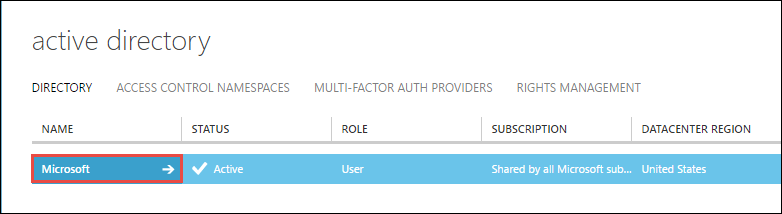
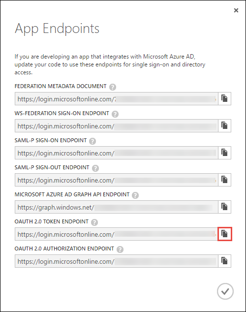

<properties
   pageTitle="Eseguire l'autenticazione con archivio Lake utilizzando Active Directory | Microsoft Azure"
   description="Informazioni su come eseguire l'autenticazione con archivio Lake utilizzando Active Directory"
   services="data-lake-store"
   documentationCenter=""
   authors="nitinme"
   manager="jhubbard"
   editor="cgronlun"/>

<tags
   ms.service="data-lake-store"
   ms.devlang="na"
   ms.topic="article"
   ms.tgt_pltfrm="na"
   ms.workload="big-data"
   ms.date="10/17/2016"
   ms.author="nitinme"/>

# Assistenza al Servizio autenticazione con archivio Lake Azure Active Directory

> [AZURE.SELECTOR]
- [Servizio di autenticazione](data-lake-store-authenticate-using-active-directory.md)
- [Autenticazione degli utenti finali](data-lake-store-end-user-authenticate-using-active-directory.md)

Archivio Lake dati di Azure utilizza Azure Active Directory per l'autenticazione. Prima di creazione di un'applicazione che funziona con Azure dati Lake Store o Azure dati Lake Analitica, è necessario decidere come eseguire l'autenticazione dell'applicazione con Azure Active Directory (Azure Active Directory). Le due opzioni principale disponibili sono:

* L'autenticazione degli utenti finali, e 
* Servizio di autenticazione. 

Entrambe le opzioni campo implica l'applicazione viene fornita con un token OAuth 2.0 ottiene associato a ogni richiesta effettuata all'archivio Lake dati di Azure o Azure dati Lake Analitica.

Si esprime in questo articolo su come creare un'applicazione web di Azure Active Directory per l'autenticazione al servizio. Per istruzioni sulla configurazione dell'applicazione di Azure Active Directory per l'autenticazione dell'utente finale vedere [autenticazione degli utenti finali con archivio Lake dati tramite Azure Active Directory](data-lake-store-end-user-authenticate-using-active-directory.md).

## Prerequisiti

* Un abbonamento Azure. Vedere [ottenere Azure versione di valutazione gratuita](https://azure.microsoft.com/pricing/free-trial/).
* L'ID di sottoscrizione. È possibile recuperare dal portale di Azure. Ad esempio, è disponibile da e il conto dati Lake Store.

    

* Il nome di dominio Active Directory Azure. È possibile recuperare passando il puntatore del mouse nell'angolo superiore destro del portale di Azure. Dalla schermata riportata di seguito, il nome di dominio è **contoso.microsoft.com**e GUID racchiusi tra parentesi quadre è l'ID del tenant. 

    

## Servizio di autenticazione

Si consiglia di utilizzare questa opzione se si desidera che l'applicazione automaticamente per l'autenticazione con Azure Active Directory, senza la necessità di un utente finale fornire le proprie credenziali. L'applicazione sarà possibile per l'autenticazione per tempo le proprie credenziali vengono, che può essere personalizzata per essere in ordine di anni.

### Che cos'è necessario usare questo approccio?

* Nome di dominio di Azure Active Directory. Questo è già elencate nella sezione dei prerequisiti di questo articolo.

* Azure Active Directory l' **applicazione web**.

* ID client per l'applicazione web di Azure Active Directory.

* Segreto del client per l'applicazione web di Azure Active Directory.

* Token endpoint per l'applicazione web di Azure Active Directory.

* Abilitare l'accesso per l'applicazione web di Azure Active Directory nell'archivio dati Lake file/cartella oppure con l'account Analitica Lake dati che si desidera utilizzare.

Per istruzioni su come creare un'applicazione web di Azure Active Directory e configurarlo per ai requisiti elencati sopra, vedere la sezione [creare un'applicazione di Active Directory](#create-an-active-directory-application) riportata di seguito.

>[AZURE.NOTE] Per impostazione predefinita dell'applicazione di Azure Active Directory è configurato per utilizzare il segreto client, è possibile recuperare dall'applicazione Azure Active Directory. Tuttavia, se si desidera l'applicazione di Azure Active Directory per utilizzare un certificato invece, è necessario creare l'applicazione web di Azure Active Directory tramite PowerShell di Azure, come descritto in [creare un servizio dell'entità con certificato](../resource-group-authenticate-service-principal.md#create-service-principal-with-certificate).

## Creare un'applicazione di Active Directory

In questa sezione sono informazioni su come creare e configurare un'applicazione web di Azure Active Directory per l'autenticazione del servizio di assistenza con l'archivio Lake dati di Azure con Azure Active Directory. 

### Passaggio 1: Creare un'applicazione di Azure Active Directory

>[AZURE.NOTE] La procedura seguente usa il portale di Azure. È anche possibile creare un'applicazione di Azure Active Directory tramite [PowerShell Azure](../resource-group-authenticate-service-principal.md) o [CLI Azure](../resource-group-authenticate-service-principal-cli.md).

1. Accedere al proprio Account Azure tramite il [portale classica](https://manage.windowsazure.com/).

2. Selezionare **Active Directory** dal riquadro di sinistra.

     
     
3. Selezionare il servizio Active Directory che si desidera utilizzare per creare la nuova applicazione. Se si dispone di più Active Directory, in genere si desidera creare l'applicazione nella cartella in cui si trova l'abbonamento. È possibile concedere l'accesso alla risorsa solo nell'abbonamento, Applications Edition nella stessa directory l'abbonamento.  

     
    
    
3. Per visualizzare le applicazioni nella directory, fare clic su **applicazioni**.

     

4. Se si sono stati creati un'applicazione all'interno della directory prima dovrebbero essere visualizzati simile all'immagine seguente. Fare clic su **Aggiungi un'applicazione**

     

     In alternativa, fare clic su **Aggiungi** nel riquadro inferiore.

     

6. Specificare un nome per l'applicazione e selezionare il tipo di applicazione che si desidera creare. Per questa esercitazione, creare un' **API WEB e/o di applicazione WEB** e fare clic sul pulsante Avanti.

     

7. Compilare le proprietà per un'app. Per **Accedere via URL**, fornire URI a un sito web che descrive l'applicazione. L'esistenza del sito web non viene convalidata. Per **APP ID URI**, fornire URI che identifica l'applicazione.

     

    Fare clic sul segno di spunta per completare la procedura guidata e creare l'applicazione.

### Passaggio 2: Ottenere id client, segreto del client ed endpoint token

Quando si accede a livello di programmazione, è necessario l'id dell'applicazione. Se l'applicazione viene eseguita con le proprie credenziali, sarà necessario anche una chiave di autenticazione.

1. Fare clic sulla scheda **Configura** per configurare la password dell'applicazione.

     

2. Copiare l' **ID CLIENT**.
  
     

3. Se l'applicazione verrà eseguita con le proprie credenziali, scorrere fino alla sezione **chiavi** e selezionare quanto tempo si preferisce la password siano validi.

     

4. Selezionare **Salva** per creare la chiave.

    

    Viene visualizzata la chiave salvata ed è possibile copiare. Non sarà possibile recuperare la chiave in un secondo momento, in modo necessario copiare ora.

    

5. Recuperare l'endpoint di token selezionando **i punti finali visualizzazione** nella parte inferiore dello schermo e il recupero del valore per campo **OAuth 2.0 Token Endpoint** , come illustrato di seguito.  

    

### Passaggio 3: Assegnare l'applicazione di Azure Active Directory per il file dell'account Azure dati Lake archivio o la cartella (solo per l'autenticazione al servizio)

1. Accedere al nuovo [Portale Azure](https://portal.azure.com) e aprire l'account Azure dati Lake archivio che si desidera associare all'applicazione di Azure Active Directory creata in precedenza.

1. In blade l'account archivio Lake dati, fare clic su **Esplora dati**.

    ![Crea directory nell'archivio dati Lake account] (./media/data-lake-store-authenticate-using-active-directory/adl.start.data.explorer.png "Directory di creare account Lake dati")

2. In e il **Data Explorer** , fare clic su file o sulla cartella per il quale si desidera fornire l'accesso all'applicazione di Azure Active Directory e quindi fare clic su **accesso**. Per configurare l'accesso a un file, è necessario fare clic su **accesso** da e il **File di anteprima** .

    ![Impostare ACL Lake dati file System] (./media/data-lake-store-authenticate-using-active-directory/adl.acl.1.png "Impostare ACL Lake dati file System")

3. E **l'accesso** Elenca l'accesso standard e personalizzati già stata assegnata alla radice. Fare clic sull'icona **Aggiungi** per aggiungere ACL livello personalizzato.

    ![Accesso standard e personalizzato di elenco] (./media/data-lake-store-authenticate-using-active-directory/adl.acl.2.png "Accesso standard e personalizzato di elenco")

4. Fare clic sull'icona **Aggiungi** per aprire e **l'Aggiungere Access personalizzata** . In questo blade, fare clic su **Seleziona utente o gruppo**e quindi in **Seleziona utente o gruppo** blade, cercare il gruppo di sicurezza creato in precedenza in Azure Active Directory. Se si dispone di moltissimi gruppi eseguire la ricerca, utilizzare la casella di testo nella parte superiore per filtrare sul nome del gruppo. Fare clic sul gruppo che si desidera aggiungere e quindi fare clic su **Seleziona**.

    ![Aggiungere un gruppo] (./media/data-lake-store-authenticate-using-active-directory/adl.acl.3.png "Aggiungere un gruppo")

5. Fare clic su **Selezionare autorizzazioni**selezionare le autorizzazioni e se si desidera assegnare le autorizzazioni per impostazione predefinita ACL, accedere a ACL o entrambe. Fare clic su **OK**.

    ![Assegnare autorizzazioni a gruppo] (./media/data-lake-store-authenticate-using-active-directory/adl.acl.4.png "Assegnare autorizzazioni a gruppo")

    Per ulteriori informazioni sulle autorizzazioni in Lake archivio di dati e ACL/accesso predefinito, vedere [Controllo di accesso nell'archivio Lake dati](data-lake-store-access-control.md).

6. In e **l'Aggiungere Access personalizzata** , fare clic su **OK**. Gruppo appena aggiunto, con le autorizzazioni associate a questo punto essere elencato nel e **Access** .

    ![Assegnare autorizzazioni a gruppo] (./media/data-lake-store-authenticate-using-active-directory/adl.acl.5.png "Assegnare autorizzazioni a gruppo") 

## Passaggi successivi

In questo articolo creata un'applicazione web di Azure Active Directory e raccogliere le informazioni che necessarie nelle applicazioni client autore utilizzando .NET SDK, linguaggio SDK e così via. È ora possibile procedere per gli articoli seguenti parlare con le informazioni sull'utilizzo dell'applicazione web di Azure Active Directory per eseguire l'autenticazione con archivio Lake dati e quindi eseguire altre operazioni l'archivio.

- [Guida introduttiva a archivio Lake Azure utilizzando .NET SDK](data-lake-store-get-started-net-sdk.md)
- [Guida introduttiva a archivio Lake Azure utilizzando SDK Java](data-lake-store-get-started-java-sdk.md)
