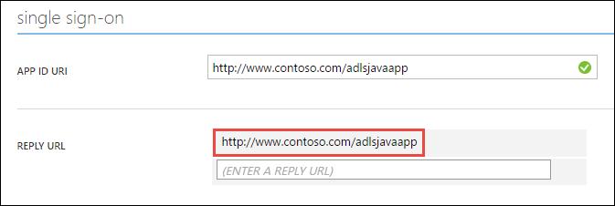

<properties
   pageTitle="Eseguire l'autenticazione con archivio Lake utilizzando Active Directory | Microsoft Azure"
   description="Informazioni su come eseguire l'autenticazione con archivio Lake utilizzando Active Directory"
   services="data-lake-store"
   documentationCenter=""
   authors="nitinme"
   manager="jhubbard"
   editor="cgronlun"/>

<tags
   ms.service="data-lake-store"
   ms.devlang="na"
   ms.topic="article"
   ms.tgt_pltfrm="na"
   ms.workload="big-data"
   ms.date="10/17/2016"
   ms.author="nitinme"/>

# Autenticazione dell'utente finale con archivio Lake Azure Active Directory

> [AZURE.SELECTOR]
- [Servizio di autenticazione](data-lake-store-authenticate-using-active-directory.md)
- [Autenticazione degli utenti finali](data-lake-store-end-user-authenticate-using-active-directory.md)

Archivio Lake dati di Azure utilizza Azure Active Directory per l'autenticazione. Prima di creazione di un'applicazione che funziona con Azure dati Lake Store o Azure dati Lake Analitica, è necessario decidere come eseguire l'autenticazione dell'applicazione con Azure Active Directory (Azure Active Directory). Le due opzioni principale disponibili sono:

* L'autenticazione degli utenti finali, e 
* Servizio di autenticazione. 

Entrambe le opzioni campo implica l'applicazione viene fornita con un token OAuth 2.0 ottiene associato a ogni richiesta effettuata all'archivio Lake dati di Azure o Azure dati Lake Analitica.

Si esprime in questo articolo su come creare un'applicazione web di Azure Active Directory per l'autenticazione degli utenti finali. Per istruzioni sulla configurazione dell'applicazione di Azure Active Directory per l'autenticazione del servizio per vedere [servizio di autenticazione con archivio Lake dati tramite Azure Active Directory](data-lake-store-authenticate-using-active-directory.md).

## Prerequisiti

* Un abbonamento Azure. Vedere [ottenere Azure versione di valutazione gratuita](https://azure.microsoft.com/pricing/free-trial/).
* L'ID di sottoscrizione. È possibile recuperare dal portale di Azure. Ad esempio, è disponibile da e il conto dati Lake Store.

    

* Il nome di dominio Active Directory Azure. È possibile recuperare passando il puntatore del mouse nell'angolo superiore destro del portale di Azure. Dalla schermata riportata di seguito, il nome di dominio è **contoso.microsoft.com**e GUID racchiusi tra parentesi quadre è l'ID del tenant. 

    

## Autenticazione degli utenti finali

Si consiglia di utilizzare questa opzione se si desidera che un utente finale agli utenti di accedere all'applicazione tramite Azure Active Directory. L'applicazione saranno in grado di accedere alle risorse Azure con lo stesso livello di accesso come utente finale che eseguito l'accesso. L'utente finale sarà necessario fornire le proprie credenziali periodicamente nell'ordine di applicazione per mantenere l'accesso.

Il risultato di avere l'utente finale di effettuare l'accesso è che l'applicazione viene fornito un token di accesso e un token di aggiornamento. Il token di accesso Ottiene associato a ogni richiesta effettuata all'archivio Lake dati o dati Lake Analitica e è valido per un'ora per impostazione predefinita. Token aggiornamento può essere utilizzato per ottenere un nuovo token di accesso e è valido per fino a due settimane per impostazione predefinita, se utilizzato regolarmente. È possibile utilizzare due diversi approcci per l'accesso degli utenti finali.

### Tramite la finestra popup OAuth 2.0

L'applicazione consente di attivare una OAuth 2.0 autorizzazione finestra popup in cui l'utente finale può immettere le credenziali. Questa finestra popup funziona anche con il processo di autenticazione a due fattori Azure Active Directory (2FA), se necessario. 

>[AZURE.NOTE] Questo metodo non è ancora supportato in una raccolta di autenticazione di Active Directory Azure (ADAL) per Python o linguaggio.

### Passare direttamente le credenziali utente

L'applicazione può fornire direttamente le credenziali utente per Azure Active Directory. Questo metodo funziona solo con account utente ID dell'organizzazione. non è compatibile con personal / gli account utente "live ID", compresi quelli che terminano in @outlook.com o @live.com. Inoltre, questo metodo non è compatibile con gli account utente che richiedono l'autenticazione a due fattori Azure Active Directory (2FA).

### Che cos'è necessario usare questo approccio?

* Nome di dominio di Azure Active Directory. Questo è già elencate nella sezione dei prerequisiti di questo articolo.

* Azure Active Directory **applicazione web**

* ID client per l'applicazione web di Azure Active Directory

* Risposta URI per l'applicazione web di Azure Active Directory

* Impostare delegati le autorizzazioni

Per istruzioni su come creare un'applicazione web di Azure Active Directory e configurarlo per ai requisiti elencati sopra, vedere la sezione [creare un'applicazione di Active Directory](#create-an-active-directory-application) riportata di seguito. 

## Creare un'applicazione di Active Directory

In questa sezione sono informazioni su come creare e configurare un'applicazione web di Azure Active Directory per l'autenticazione degli utenti finali con archivio Lake dati di Azure con Azure Active Directory.

### Passaggio 1: Creare un'applicazione di Azure Active Directory

>[AZURE.NOTE] La procedura seguente usa il portale di Azure. È anche possibile creare un'applicazione di Azure Active Directory tramite [PowerShell Azure](../resource-group-authenticate-service-principal.md) o [CLI Azure](../resource-group-authenticate-service-principal-cli.md).

1. Accedere al proprio Account Azure tramite il [portale classica](https://manage.windowsazure.com/).

2. Selezionare **Active Directory** dal riquadro di sinistra.

     
     
3. Selezionare il servizio Active Directory che si desidera utilizzare per creare la nuova applicazione. Se si dispone di più Active Directory, in genere si desidera creare l'applicazione nella cartella in cui si trova l'abbonamento. È possibile concedere l'accesso alla risorsa solo nell'abbonamento, Applications Edition nella stessa directory l'abbonamento.  

     
    
    
3. Per visualizzare le applicazioni nella directory, fare clic su **applicazioni**.

     

4. Se si sono stati creati un'applicazione all'interno della directory prima dovrebbero essere visualizzati simile all'immagine seguente. Fare clic su **Aggiungi un'applicazione**

     

     In alternativa, fare clic su **Aggiungi** nel riquadro inferiore.

     

6. Specificare un nome per l'applicazione e selezionare il tipo di applicazione che si desidera creare. Per questa esercitazione, creare un' **API WEB e/o di applicazione WEB** e fare clic sul pulsante Avanti.

     

7. Compilare le proprietà per un'app. Per **Accedere via URL**, fornire URI a un sito web che descrive l'applicazione. L'esistenza del sito web non viene convalidata. Per **APP ID URI**, fornire URI che identifica l'applicazione.

     

    Fare clic sul segno di spunta per completare la procedura guidata e creare l'applicazione.

### Passaggio 2: Ottenere id client, rispondere URI e impostare le autorizzazioni delegate

1. Fare clic sulla scheda **Configura** per configurare la password dell'applicazione.

     

2. Copiare l' **ID CLIENT**.
  
     

3. Nella sezione **servizio Single sign-on** copiare **URI risposta**.

    

4. In **autorizzazioni per le altre applicazioni**, fare clic su **Aggiungi applicazione**

    

5. Nella creazione guidata **le autorizzazioni per le altre applicazioni** , selezionare **Lake di dati di Azure** e **Windows** **Azure API di gestione di servizio**e fare clic sul segno di spunta.

6. Per impostazione predefinita le **Autorizzazioni di delega** per i servizi appena aggiunti è impostato su zero. Fare clic su **Delega autorizzazioni** elenco a discesa per Lake di dati di Azure e servizio di gestione di Windows Azure e selezionare le caselle di controllo disponibili per impostare i valori da 1. Il risultato dovrebbe risultare analoga alla seguente.

     

7. Fare clic su **Salva**.

## Passaggi successivi

In questo articolo creata un'applicazione web di Azure Active Directory e raccogliere le informazioni che necessarie nelle applicazioni client autore utilizzando .NET SDK, linguaggio SDK e così via. È ora possibile procedere per gli articoli seguenti parlare con le informazioni sull'utilizzo dell'applicazione web di Azure Active Directory per eseguire l'autenticazione con archivio Lake dati e quindi eseguire altre operazioni l'archivio.

- [Guida introduttiva a archivio Lake Azure utilizzando .NET SDK](data-lake-store-get-started-net-sdk.md)
- [Guida introduttiva a archivio Lake Azure utilizzando SDK Java](data-lake-store-get-started-java-sdk.md)
