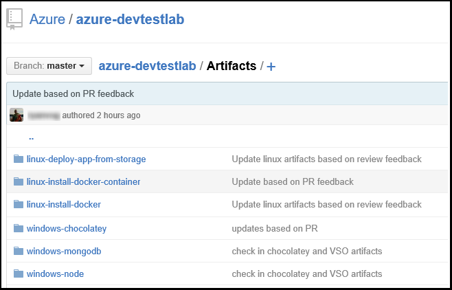

<properties
    pageTitle="Aggiungere un archivio di elementi fra un laboratorio di Azure DevTest esercitazioni | Microsoft Azure"
    description="Aggiungere un repository GitHub o servizi operazioni del Team di Visual Studio per l'origine di elementi personalizzati nei DevTest Azure"
    services="devtest-lab,virtual-machines,visual-studio-online"
    documentationCenter="na"
    authors="tomarcher"
    manager="douge"
    editor=""/>

<tags
    ms.service="devtest-lab"
    ms.workload="na"
    ms.tgt_pltfrm="na"
    ms.devlang="na"
    ms.topic="article"
    ms.date="09/06/2016"
    ms.author="tarcher"/>

# Aggiungere un archivio di elementi fra un laboratorio di Azure DevTest esercitazioni

> [AZURE.VIDEO how-to-add-your-private-artifacts-repository-in-a-devtest-lab]

In serie di esercitazioni DevTest Azure, gli elementi sono *Azioni* - ad esempio l'installazione del software o esecuzione script e i comandi - creazione di una macchina virtuale. Per impostazione predefinita, un laboratorio include gli elementi dal repository elemento Azure DevTest esercitazioni ufficiale. È possibile aggiungere un archivio di elementi fra per l'esercitazione per includere gli elementi creati dal team. Repository può essere ospitato in [GitHub](https://github.com) o in [Visual Studio Team Services (VSTS)](https://visualstudio.com).

- Per informazioni su come creare un archivio di GitHub, vedere [GitHub Bootcamp](https://help.github.com/categories/bootcamp/).
- Per informazioni su come creare un progetto Team Services con un Repository fra, vedere [connettersi a Visual Studio Team Services](https://www.visualstudio.com/get-started/setup/connect-to-visual-studio-online).

Lo screenshot seguente mostra un esempio di come potrebbe apparire un repository contenente gli elementi in GitHub:  

## Ottenere le informazioni dell'archivio e le credenziali

Per aggiungere un archivio all'elemento per l'esercitazione, è prima necessario ottenere determinate informazioni dal repository. Nelle sezioni seguenti sono fasi per ottenere queste informazioni per archivi elemento ospitati in GitHub e Visual Studio Team Services.

### Ottenere la GitHub repository Clona URL e accesso personale token

Per ottenere la copia di archivio GitHub URL e token di accesso personale, procedere come segue:

1. Passare alla home page dell'archivio GitHub che contiene le definizioni di elemento.

1. Selezionare **Clona o il download**.

1. Selezionare il pulsante per copiare **HTTPS duplicare url** negli Appunti e salvare l'URL per successivi utilizzi.

1. Selezionare l'immagine del profilo nell'angolo superiore destro della GitHub e selezionare **Impostazioni**.

1. Nel menu **impostazioni personali** a sinistra, selezionare **i token di accesso personale**.

1. Selezionare **nuovo token genera**.

1. Nella pagina **nuovo token di accesso personali** immettere una **descrizione di Token**, accettare le voci predefinite **Selezionare ambiti**e quindi scegliere **Genera Token**.

1. Salvare il token generato in base alle esigenze in un secondo momento.

1. È possibile chiudere GitHub ora.   

1. Passare alla sezione [Connetti ambiente archivio di elementi](#connect-your-lab-to-the-artifact-repository) .

### Ottenere l'URL di Clona archivio di Visual Studio Team Services e accesso personale token

Per ottenere l'URL di Clona archivio di Visual Studio Team Services e token di accesso personale, procedere come segue:

1. Aprire la home page della raccolta del team (ad esempio `https://contoso-web-team.visualstudio.com`) e quindi selezionare il progetto elemento.

1. Nella pagina home del progetto, selezionare **codice**.

1. Per visualizzare l'URL duplicato, nella pagina di **codice** del progetto, selezionare **duplicato**.

1. Salvare l'URL che è necessario più avanti in questa esercitazione.

1. Per creare un Token di accesso personali, selezionare **il profilo** dal menu a discesa account utente.

1. Nella pagina informazioni del profilo, selezionare **protezione**.

1. Nella scheda **protezione** , selezionare **Aggiungi**.

1. Nella pagina **Crea un token di accesso personali** :

    - Immettere una **Descrizione** per il token.
    - Selezionare **180 giorni** **Scade** nell'elenco.
    - Scegliere **tutti gli account accessibili** dall'elenco degli **account** .
    - Scegliere l'opzione **tutti gli ambiti** .
    - Scegliere **Crea Token**.

1. Al termine, il nuovo token visualizzato nell'elenco **Personale token di accesso** . Selezionare **Copia Token**e quindi salvare il valore del token per successivi utilizzi.

1. Passare alla sezione [Connetti ambiente archivio di elementi](#connect-your-lab-to-the-artifact-repository) .

##Connettere il laboratorio di archivio di elementi

1. Accedere al [portale di Azure](http://go.microsoft.com/fwlink/p/?LinkID=525040).

1. Selezionare **Altri servizi**e quindi selezionare **Esercitazioni DevTest** dall'elenco.

1. Selezionare il laboratorio desiderato dall'elenco di esercitazioni.   

1. In blade del laboratorio, selezionare **la configurazione**.

1. Blade di **configurazione** dell'ambiente di test, selezionare **Gli elementi archivi**.

1. Scegliere **Aggiungi +**e il **Repository elementi** .

    
 
1. Nella secondo e **Repository elementi** , specificare quanto segue:

    - **Nome** - immettere un nome per l'archivio.
    - **Url Clona fra** - immettere l'URL di Clona Git HTTPS copiato in precedenza da GitHub o Visual Studio Team Services. 
    - **Percorso della cartella** - immettere il percorso della cartella rispetto all'URL duplicato che contiene le definizioni di elemento.
    - **Ramo** - immettere il ramo per ottenere le definizioni di elemento.
    - **Personale Token di accesso** , immettere il token di accesso personali è stato acquistato in precedenza da GitHub o Visual Studio Team Services. 
     
    

1. Selezionare **Salva**.

[AZURE.INCLUDE [devtest-lab-try-it-out](../../includes/devtest-lab-try-it-out.md)]

## Post di blog correlati
- [Come risolvere i problemi non funziona elementi AzureDevTestLabs](http://www.visualstudiogeeks.com/blog/DevOps/How-to-troubleshoot-failing-artifacts-in-AzureDevTestLabs)
- [Partecipare a una macchina virtuale di dominio Active Directory esistente tramite modello ARM in laboratorio Dev Azure](http://www.visualstudiogeeks.com/blog/DevOps/Join-a-VM-to-existing-AD-domain-using-ARM-template-AzureDevTestLabs)