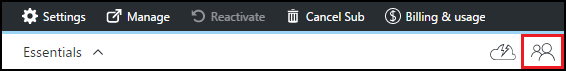

<properties
    pageTitle="Aggiungere proprietari e i relativi utenti in Azure DevTest esercitazioni | Microsoft Azure"
    description="Aggiungere proprietari e i relativi utenti in Azure DevTest esercitazioni tramite il portale di Azure e PowerShell"
    services="devtest-lab,virtual-machines"
    documentationCenter="na"
    authors="tomarcher"
    manager="douge"
    editor=""/>

<tags
    ms.service="devtest-lab"
    ms.workload="na"
    ms.tgt_pltfrm="na"
    ms.devlang="na"
    ms.topic="article"
    ms.date="09/12/2016"
    ms.author="tarcher"/>

# Aggiungere proprietari e i relativi utenti in Azure DevTest esercitazioni

> [AZURE.VIDEO how-to-set-security-in-your-devtest-lab]

L'accesso di Azure DevTest esercitazioni dipende dalle [Azure Role-Based accesso controllo (RBAC)](../active-directory/role-based-access-control-what-is.md). Usa RBAC, è possibile isolare il compiti all'interno del team in *ruoli* in cui si concessa solo la quantità di accesso necessario per gli utenti per eseguire le operazioni. Tre di questi ruoli RBAC sono *proprietario*, *DevTest esercitazioni utente*e *per i collaboratori*. In questo articolo informazioni su quali operazioni possono essere eseguite in ognuna delle tre ruoli RBAC principali. A questo punto, si informazioni su come aggiungere utenti a un laboratorio - tramite il portale e tramite uno script di PowerShell e come aggiungere utenti a livello di sottoscrizione.

## Azioni che possono essere eseguite in ogni ruolo

Esistono tre ruoli principali che è possibile assegnare un utente:

- Proprietario
- Utente esercitazioni DevTest
- Per i collaboratori

Nella tabella seguente illustra le azioni che possono essere eseguite dagli utenti in ognuna di questi ruoli:

| **Gli utenti di azioni in questo ruolo possono eseguire** | **Utente esercitazioni DevTest**            | **Proprietario** | **Per i collaboratori** |
|---|---|---|---|
| **Attività laboratorio**                          |                              |       |             |
| Aggiungere utenti a un ambiente di lavoro                     | No                           | Sì   | No          |
| Aggiornare le impostazioni di costo                   | No                           | Sì   | Sì         |
| **Attività di base macchine Virtuali**                      |                              |       |             |
| Aggiungere e rimuovere immagini personalizzate           | No                           | Sì   | Sì         |
| Aggiungere, aggiornare ed eliminare le formule       | Sì                          | Sì   | Sì         |
| Immagini di proprietà consentite Azure Marketplace     | No                           | Sì   | Sì         |
| **Attività di macchine Virtuali**                           |                              |       |             |
| Creare macchine virtuali                             | Sì                          | Sì   | Sì         |
| Iniziare, interrompere ed eliminare macchine virtuali            | Solo macchine virtuali create dall'utente | Sì   | Sì         |
| Aggiornare i criteri di macchine Virtuali                     | No                           | Sì   | Sì         |
| Aggiunta/rimozione dischi dati verso/dalle macchine virtuali      | Solo macchine virtuali create dall'utente | Sì   | Sì         |
| **Attività di elementi**                     |                              |       |             |
| Aggiungere e rimuovere archivi elemento   | No                           | Sì   | Sì         |
| Applicare elementi                        | Sì                          | Sì   | Sì         |

> [AZURE.NOTE] Quando si crea una macchina virtuale, tale utente viene assegnata automaticamente al ruolo **proprietario** della macchina virtuale creato.

## Aggiungere un utente o un proprietario a livello di laboratorio

I proprietari e i relativi utenti possono essere aggiunti a livello di laboratorio tramite il portale Azure. Sono inclusi gli utenti esterni con un [account Microsoft (MSA)](devtest-lab-faq.md#what-is-a-microsoft-account)valido.
I passaggi seguenti per il processo di aggiunta di un utente o un proprietario di un laboratorio di Azure DevTest esercitazioni:

1. Accedere al [portale di Azure](http://go.microsoft.com/fwlink/p/?LinkID=525040).

1. Selezionare **altri servizi**e quindi selezionare **Esercitazioni DevTest** dall'elenco.

1. Selezionare il laboratorio desiderato dall'elenco di esercitazioni.

1. In blade del laboratorio, selezionare **la configurazione**. 

1. Scegliere **utenti**e il **configurazione** .

1. Scegliere **Aggiungi +**e **l'utenti** .

    

1. Scegliere il ruolo desiderato e **Selezionare un ruolo** il. La sezione [azioni che possono essere eseguite in ogni ruolo](#actions-that-can-be-performed-in-each-role) Elenca le varie azioni che possono essere eseguite da utenti nella proprietario, DevTest utenti e ruoli per i collaboratori.

1. Nella e **aggiungere utenti** , immettere l'indirizzo di posta elettronica o il nome dell'utente che si desidera aggiungere al ruolo specificato. Se l'utente non viene trovato, un messaggio di errore viene descritto il problema. Se l'utente viene trovata, l'utente è elencato e selezionato. 

1. Selezionare **Selezionare**.

1. Fare clic su **OK** per chiudere e il **componente accesso** .

1. Quando si torna a e **l'utenti** , l'utente è stato aggiunto.  

## Aggiungere un utente esterno a un laboratorio tramite PowerShell

Oltre ad aggiungere gli utenti nel portale di Azure, è possibile aggiungere un utente esterno per l'esercitazione utilizzando uno script di PowerShell. Nell'esempio seguente, è sufficiente modificare i valori dei parametri sotto il commento di **valori da modificare** .
È possibile recuperare il `subscriptionId`, `labResourceGroup`, e `labName` valori e il laboratorio nel portale di Azure.

> [AZURE.NOTE]
> Script di esempio si presuppone che l'utente specificato è stato aggiunto come guest Active Directory e avrà esito negativo se non sono le maiuscole/minuscole. Per aggiungere un utente non in Active Directory per un ambiente di lavoro, usare il portale di Azure per assegnare all'utente in un ruolo come illustrato nella sezione [Aggiungi un proprietario o l'utente a livello di laboratorio](#add-an-owner-or-user-at-the-lab-level).   

    # Add an external user in DevTest Labs user role to a lab
    # Ensure that guest users can be added to the Azure Active directory:
    # https://azure.microsoft.com/en-us/documentation/articles/active-directory-create-users/#set-guest-user-access-policies

    # Values to change
    $subscriptionId = "<Enter Azure subscription ID here>"
    $labResourceGroup = "<Enter lab's resource name here>"
    $labName = "<Enter lab name here>"
    $userDisplayName = "<Enter user's display name here>"

    # Log into your Azure account
    Login-AzureRmAccount
    
    # Select the Azure subscription that contains the lab. 
    # This step is optional if you have only one subscription.
    Select-AzureRmSubscription -SubscriptionId $subscriptionId
    
    # Retrieve the user object
    $adObject = Get-AzureRmADUser -SearchString $userDisplayName
    
    # Create the role assignment. 
    $labId = ('subscriptions/' + $subscriptionId + '/resourceGroups/' + $labResourceGroup + '/providers/Microsoft.DevTestLab/labs/' + $labName)
    New-AzureRmRoleAssignment -ObjectId $adObject.Id -RoleDefinitionName 'DevTest Labs User' -Scope $labId

## Aggiungere un utente o un proprietario a livello di abbonamento

Le autorizzazioni di Azure vengono distribuite dal ambito padre all'ambito figlio di Azure. Di conseguenza, i proprietari di un abbonamento Azure contenente esercitazioni vengono automaticamente i proprietari di tali esercitazioni. Sono inoltre proprietari macchine virtuali e altre risorse creati da utenti del laboratorio e il servizio di Azure DevTest esercitazioni. 

È possibile aggiungere ulteriori proprietari per un ambiente di lavoro tramite blade del laboratorio nel [portale di Azure](http://go.microsoft.com/fwlink/p/?LinkID=525040). Ambito del proprietario aggiunto dell'amministrazione invece più limitato di ambito del proprietario della sottoscrizione. Ad esempio, i proprietari aggiunti non dispone di accesso completo alle alcune delle risorse che vengono create nella sottoscrizione dal servizio DevTest esercitazioni. 

Per aggiungere un proprietario a un abbonamento a Azure, procedere come segue:

1. Accedere al [portale di Azure](http://go.microsoft.com/fwlink/p/?LinkID=525040).

1. Selezionare **Altri servizi**e quindi selezionare **le sottoscrizioni** dall'elenco.

1. Selezionare l'abbonamento desiderato.

1. Selezionare **l'icona dell'applicazione** . 

    

1. Scegliere **Aggiungi**e **l'utenti** .

    

1. Selezionare e **Selezionare un ruolo** il **proprietario**.

1. Nella e **aggiungere utenti** , immettere l'indirizzo di posta elettronica o il nome dell'utente che si desidera aggiungere come proprietario. Se l'utente non viene trovato, viene visualizzato un messaggio di errore che indica il problema. Se l'utente si trova, tale utente viene elencato sotto la casella di testo **utente** .

1. Selezionare il nome utente si trova.

1. Selezionare **Selezionare**.

1. Fare clic su **OK** per chiudere e il **componente accesso** .

1. Quando si torna a e **l'utenti** , l'utente è stato aggiunto come un proprietario. L'utente è ora un proprietario di qualsiasi esercitazioni creata in questo abbonamento e quindi essere in grado di eseguire attività proprietario. 

[AZURE.INCLUDE [devtest-lab-try-it-out](../../includes/devtest-lab-try-it-out.md)]
