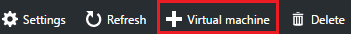
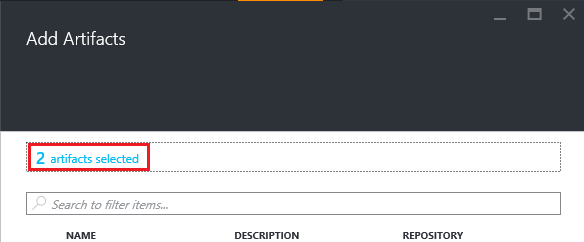

<properties
    pageTitle="Aggiungere una macchina virtuale con gli elementi a un laboratorio di Azure DevTest esercitazioni | Microsoft Azure"
    description="Informazioni su come aggiungere una macchina virtuale con gli elementi in Azure DevTest esercitazioni"
    services="devtest-lab,virtual-machines"
    documentationCenter="na"
    authors="tomarcher"
    manager="douge"
    editor=""/>

<tags
    ms.service="devtest-lab"
    ms.workload="na"
    ms.tgt_pltfrm="na"
    ms.devlang="na"
    ms.topic="article"
    ms.date="08/30/2016"
    ms.author="tarcher"/>

# Aggiungere una macchina virtuale con gli elementi a un laboratorio di Azure DevTest esercitazioni

> [AZURE.VIDEO how-to-create-vms-with-artifacts-in-a-devtest-lab]

Creare una macchina virtuale in un ambiente di lavoro da una *base* di [un'immagine personalizzata](./devtest-lab-create-template.md), una [formula](./devtest-lab-manage-formulas.md)o una [immagine Marketplace](./devtest-lab-configure-marketplace-images.md).

Esercitazioni DevTest *elementi* consentono di specificare *le azioni* eseguite quando viene creata la macchina virtuale. 

Azioni elemento eseguire operazioni, ad esempio in esecuzione script di Windows PowerShell, eseguire i comandi Bash e installare software. 

Elemento *parametri* consentono di personalizzare l'elemento per lo scenario specifico.

In questo articolo viene illustrato come creare una macchina virtuale nell'ambiente con gli elementi.

## Aggiungere una macchina virtuale con gli elementi

1. Accedere al [portale di Azure](http://go.microsoft.com/fwlink/p/?LinkID=525040).

1. Selezionare **Altri servizi**e quindi selezionare **Esercitazioni DevTest** dall'elenco.

1. Nell'elenco di esercitazioni, selezionare il laboratorio in cui si desidera creare la macchina virtuale.  

1. Blade **Panoramica** dell'ambiente di test, selezionare **+ macchina virtuale**.  
    

1. Scegliere una base e lo **Scegli una base** per la macchina virtuale.

1. Nella e **computer virtuale** , immettere un nome per la nuova macchina virtuale nella casella di testo **nome macchina virtuale** .

    

1. Immettere un **Nome utente** che dispone di privilegi di amministratore sul computer virtuale.  

1. Se si desidera utilizzare una password memorizzata nel tuo *archivio segreto*, selezionare **Usa informazioni riservate dall'archivio personale segreta**e specificare un valore di chiave che corrisponde al segreto (password). Nel campo di testo etichettato **digitare un valore**in caso contrario, è sufficiente immettere una password.
 
1. Selezionare **le dimensioni del computer virtuale** e selezionare uno degli elementi predefiniti che specificano il core, le dimensioni di RAM e le dimensioni del disco rigido della macchina virtuale per creare.

1. Selezionare **rete virtuale** e selezionare la rete virtuale desiderata.

1. Selezionare **Subnet** e subnet.

1. Se il criterio di laboratorio è impostato su Consenti indirizzi IP per subnet selezionata, specificare se si desidera che l'indirizzo IP di tipo public selezionando **Sì** o **No**. In caso contrario, questa opzione è disattivata e selezionata come **n**. 

1. Selezionare **gli elementi** e - dall'elenco degli elementi, selezionare e configurare gli elementi che si desidera aggiungere l'immagine di base. 
**Nota:** Se si conosce esercitazioni DevTest o gli elementi di configurazione, passare alla sezione [aggiungere un elemento per una macchina virtuale esistente](#add-an-existing-artifact-to-a-vm) e quindi tornare in questa posizione al termine.

1. Se si desidera visualizzare o copiare il modello di gestione risorse di Azure, passare alla sezione [Gestione risorse di Azure Salva modello](#save-arm-template) e tornare in questa posizione al termine.

1. Selezionare **Crea** per aggiungere la macchina virtuale specificata per l'esercitazione.

1. E il laboratorio consente di visualizzare lo stato di creazione della macchina virtuale. prima di tutto come **creazione**, quindi come **eseguire** dopo la macchina virtuale è stata avviata.

1. Passare alla sezione [Passaggi successivi](#next-steps) . 

## Aggiungere un elemento esistente a una macchina virtuale

Durante la creazione di una macchina virtuale, è possibile aggiungere elementi esistenti. Ogni esercitazione include gli elementi da pubblico DevTest esercitazioni elemento archivio, nonché gli elementi che è stato creato e aggiunto al Repository elemento.
Per scoprire come creare elementi, vedere l'articolo [informazioni su come creare propri elementi per l'utilizzo con DevTest esercitazioni](devtest-lab-artifact-author.md).

1. Selezionare **gli elementi**e il **computer virtuale** . 

1. Selezionare l'elemento desiderato e **l'Aggiungi elementi** .  

    

1. Immettere i valori dei parametri necessari e tutti i parametri facoltativi è necessario.  

1. Selezionare **Aggiungi** per aggiungere l'elemento e tornare alla e **Aggiungere elementi** .

1. Continuare ad aggiungere elementi in base alle esigenze per la macchina virtuale.

1. Dopo aver aggiunto gli elementi, è possibile [modificare l'ordine in cui vengono eseguiti gli elementi](#change-the-order-in-which-artifacts-are-run). È anche possibile tornare indietro per [visualizzare o modificare un elemento](#view-or-modify-an-artifact).

## Modificare l'ordine in cui vengono eseguiti gli elementi

Per impostazione predefinita, vengono eseguite le azioni degli elementi nell'ordine in cui vengono aggiunti alla macchina virtuale. La procedura seguente viene illustrato come cambiare l'ordine in cui vengono eseguiti gli elementi.

1. Nella parte superiore della stessa e **Aggiungere elementi** , selezionare il collegamento che indica il numero di elementi che sono state aggiunte a macchina virtuale.

    

1. Per specificare l'ordine in cui vengono eseguiti gli elementi, trascinare e rilasciare gli elementi nell'ordine desiderato. **Nota:** Nel caso di problemi, trascinare l'elemento, assicurarsi che si sta trascinando dal lato sinistro dell'elemento. 

1. Fare clic su **OK** al termine.  

## Visualizzare o modificare un elemento

La procedura seguente viene illustrato come visualizzare o modificare i parametri di un elemento:

1. Nella parte superiore della stessa e **Aggiungere elementi** , selezionare il collegamento che indica il numero di elementi che sono state aggiunte a macchina virtuale.

    

1. Selezionare l'elemento che si desidera visualizzare o modificare e **l'Elementi selezionati** .  

1. Scegliere e **l'Aggiungi elemento** , apportare le modifiche necessarie e fare clic su **OK** per chiudere e **l'Aggiungi elemento** .

1. Fare clic su **OK** per chiudere e **l'Elementi selezionati** .

## Salvare il modello di gestione risorse di Azure

Un modello di gestione di risorse Azure offre un modo dichiarativo per definire una distribuzione ripetibile. La procedura seguente viene descritto come salvare il modello di gestione di risorse Azure per la macchina virtuale da creare.
Dopo aver salvato, è possibile utilizzare il modello di gestione risorse Azure per [distribuire nuove macchine virtuali con PowerShell Azure](../azure-resource-manager/resource-group-overview.md#template-deployment).

1. Scegliere **Modello di visualizzazione ARM**e il **computer virtuale** .

1. Nel **modello di visualizzazione del Manager delle risorse Azure blade**, selezionare il testo del modello.

1. Copiare il testo selezionato negli Appunti.

1. Fare clic su **OK** per chiudere il **modello di visualizzazione del Manager delle risorse Azure blade**.

1. Aprire un editor di testo.

1. Incollare il testo del modello dagli Appunti.

1. Salvare il file per successivi utilizzi.

[AZURE.INCLUDE [devtest-lab-try-it-out](../../includes/devtest-lab-try-it-out.md)]

## Passaggi successivi

- Dopo aver creata la macchina virtuale, è possibile connettersi a macchina virtuale, scegliendo **Connetti** blade della macchina virtuale.
- Informazioni su come [creare elementi personalizzati per la macchina virtuale esercitazioni DevTest](devtest-lab-artifact-author.md).
- Esplorare la [raccolta di modelli di Guida introduttiva di ARM esercitazioni DevTest](https://github.com/Azure/azure-devtestlab/tree/master/ARMTemplates)