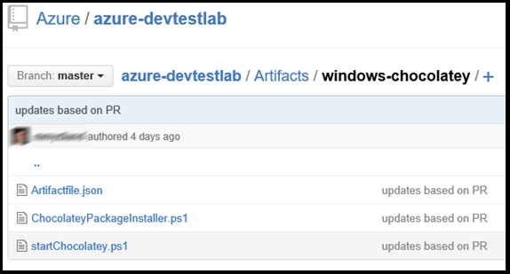

<properties 
    pageTitle="Creare elementi personalizzati per la macchina virtuale esercitazioni DevTest | Microsoft Azure"
    description="Informazioni su come creare propri elementi per l'utilizzo con esercitazioni DevTest"
    services="devtest-lab,virtual-machines"
    documentationCenter="na"
    authors="tomarcher"
    manager="douge"
    editor=""/>

<tags
    ms.service="devtest-lab"
    ms.workload="na"
    ms.tgt_pltfrm="na"
    ms.devlang="na"
    ms.topic="article"
    ms.date="08/25/2016"
    ms.author="tarcher"/>

#Creare elementi personalizzati per la macchina virtuale esercitazioni DevTest

> [AZURE.VIDEO how-to-author-custom-artifacts] 

## Panoramica
**Gli elementi** vengono utilizzati per distribuire e configurare un'applicazione dopo una macchina virtuale viene eseguito il provisioning. Un elemento è costituito da un file di definizione dell'elemento e altri file di script vengono memorizzati in una cartella in un archivio di operazioni. File di definizione dell'elemento è costituito da JSON ed espressioni che è possibile utilizzare per specificare quali si desidera installare in una macchina virtuale. Ad esempio, è possibile definire il nome dell'elemento, comando da eseguire e i parametri che vengono resi disponibili quando si esegue il comando. È possibile fare riferimento ad altri file di script all'interno del file di definizione di elementi in base al nome.

##Formato di file di definizione dell'elemento
Nell'esempio seguente mostra le sezioni che costituiscono la struttura di base di un file di definizione.

    {
      "$schema": "https://raw.githubusercontent.com/Azure/azure-devtestlab/master/schemas/2015-01-01/dtlArtifacts.json",
      "title": "",
      "description": "",
      "iconUri": "",
      "targetOsType": "",
      "parameters": {
        "<parameterName>": {
          "type": "",
          "displayName": "",
          "description": ""
        }
      },
      "runCommand": {
        "commandToExecute": ""
      }
    }

| Nome dell'elemento | Obbligatorio? | Descrizione
| ------------ | --------- | -----------
| $schema      | No        | Posizione del file di schema JSON che consente di testing la validità del file di definizione.
| titolo        | Sì       | Nome dell'elemento visualizzato in laboratorio.
| Descrizione  | Sì       | Descrizione degli elementi visualizzati nel laboratorio.
| iconUri      | No        | URI dell'icona visualizzata in laboratorio.
| targetOsType | Sì       | Sistema operativo di macchine Virtuali in cui verrà installato all'elemento. Sono supportati: Windows e Linux.
| parametri   | No        | Valori che sono disponibili quando viene eseguito il comando install elemento in un computer. In questo modo per personalizzare l'elemento.
| EseguiComando   | Sì       | Elemento installare comando che viene eseguito su una macchina virtuale.

###Parametri di elementi

Nella sezione parametri del file di definizione specificare quali valori di un utente può immettere durante l'installazione di un elemento. È possibile fare riferimento a questi valori nel comando di installazione dell'elemento.

Definire i parametri verranno la struttura seguente.

    "parameters": {
        "<parameterName>": {
          "type": "<type-of-parameter-value>",
          "displayName": "<display-name-of-parameter>",
          "description": "<description-of-parameter>"
        }
      }

| Nome dell'elemento | Obbligatorio? | Descrizione
| ------------ | --------- | -----------
| tipo         | Sì       | Tipo di valore del parametro. Visualizzare l'elenco seguente per i tipi di consentiti:
| displayName Sì       | Nome del parametro che verrà visualizzato per un utente in laboratorio.
| Descrizione  | Sì       | Descrizione del parametro che viene visualizzato in laboratorio.

I tipi consentiti sono:

- stringa-qualsiasi stringa JSON valida
- int-un intero JSON valido
- booleano: qualsiasi booleana JSON valido
- matrice: qualsiasi valido JSON

##Elemento espressioni e funzioni

È possibile utilizzare espressioni e funzioni per la creazione dell'elemento installare comando.
Le espressioni sono racchiusi tra parentesi quadre ([e]) e vengono valutate quando l'elemento è installato. Espressioni essere visualizzati in un punto qualsiasi in un valore stringa JSON e sempre restituire un altro valore JSON. Se è necessario utilizzare una stringa che inizia con una parentesi [, è necessario utilizzare due parentesi quadre [[.
In genere, usare le espressioni con le funzioni per creare un valore. Proprio come in JavaScript, chiamate di funzione formattate come functionName(arg1,arg2,arg3)

L'elenco seguente include funzioni comuni.

- Parameters(ParameterName) - restituisce un valore di parametro fornito quando si esegue il comando elemento.
- CONCATENA (arg1, arg2, arg3,...) - combina più valori stringa. Questa funzione può richiedere qualsiasi numero di argomenti.

Nell'esempio seguente viene illustrato come utilizzare espressioni e funzioni per creare un valore.

    runCommand": {
         "commandToExecute": "[concat('powershell.exe -File startChocolatey.ps1'
    , ' -RawPackagesList ', parameters('packages')
    , ' -Username ', parameters('installUsername')
    , ' -Password ', parameters('installPassword'))]"
    }

##Creare un elemento personalizzato

Creare l'elemento personalizzato eseguendo i passaggi seguenti:

1. Installare un editor di JSON, è necessario un editor di JSON per lavorare con i file di definizione dell'elemento. È consigliabile utilizzare [Il codice Visual Studio](https://code.visualstudio.com/), che è disponibile per Windows, Linux e OS X.

1. Ottenere un artifactfile.json di esempio: estrazione gli elementi creati dal team di Azure DevTest esercitazioni presso il nostro [archivio GitHub](https://github.com/Azure/azure-devtestlab) nel punto in cui è stata creata una libreria completa di elementi che consentono di creare propri elementi. Scaricare un file di definizione dell'elemento e apportarvi modifiche per creare propri elementi.

1. Verificare l'utilizzo di IntelliSense - utilizzare IntelliSense per visualizzare gli elementi validi che possono essere usati per creare un file di definizione dell'elemento. È anche possibile visualizzare le diverse opzioni per i valori di un elemento. Ad esempio, IntelliSense mostra due opzioni di Windows o Linux con quando si modifica l'elemento **targetOsType** .

1. Archiviare l'elemento in un repository fra
    1. Creare una directory separata per ogni elemento nel punto in cui il nome della directory è lo stesso nome dell'elemento.
    1. Archiviare il file di definizione dell'elemento (artifactfile.json) nella directory che è stato creato.
    1. Archiviare gli script che fanno riferimento rispetto al comando di installazione dell'elemento.

    Ecco un esempio di come potrebbe apparire una cartella di elemento:

    

1. Aggiungere l'archivio di elementi per laboratorio - consultare l'articolo [aggiungere un repository elemento fra per un ambiente di lavoro](devtest-lab-add-artifact-repo.md).

[AZURE.INCLUDE [devtest-lab-try-it-out](../../includes/devtest-lab-try-it-out.md)]

## Post di blog correlati
- [Come risolvere i problemi non funziona elementi AzureDevTestLabs](http://www.visualstudiogeeks.com/blog/DevOps/How-to-troubleshoot-failing-artifacts-in-AzureDevTestLabs)
- [Partecipare a una macchina virtuale di dominio Active Directory esistente tramite modello ARM in laboratorio Dev Azure](http://www.visualstudiogeeks.com/blog/DevOps/Join-a-VM-to-existing-AD-domain-using-ARM-template-AzureDevTestLabs)

## Passaggi successivi

- Informazioni su come [aggiungere un repository elemento fra per un ambiente di lavoro](devtest-lab-add-artifact-repo.md).
