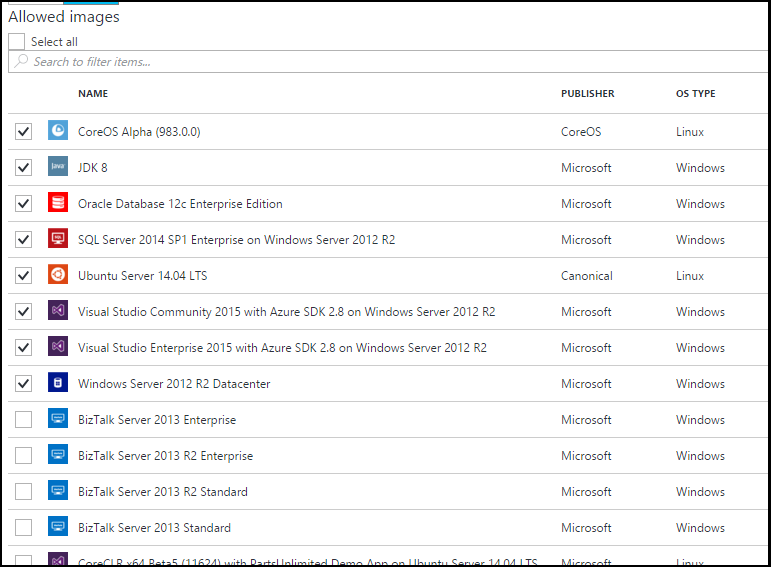

<properties
    pageTitle="Configurare le impostazioni delle immagini di Azure Marketplace in Azure DevTest esercitazioni | Microsoft Azure"
    description="Configurare le immagini di Azure Marketplace possono essere utilizzate quando si crea una macchina virtuale in Azure DevTest esercitazioni"
    services="devtest-lab,virtual-machines"
    documentationCenter="na"
    authors="tomarcher"
    manager="douge"
    editor=""/>

<tags
    ms.service="devtest-lab"
    ms.workload="na"
    ms.tgt_pltfrm="na"
    ms.devlang="na"
    ms.topic="article"
    ms.date="09/06/2016"
    ms.author="tarcher"/>

# Configurare le impostazioni delle immagini di Azure Marketplace in Azure DevTest esercitazioni

Esercitazioni DevTest supporta la creazione macchine virtuali basate su immagini di Azure Marketplace in base alla configurazione immagini di Azure Marketplace da utilizzare nell'ambiente. In questo articolo viene illustrato come specificare che, se presenti, le immagini di Azure Marketplace possono essere utilizzato per la creazione di macchine virtuali in un ambiente di lavoro.

## Selezionare le immagini di Azure Marketplace sono consentite quando si crea una macchina virtuale

1. Accedere al [portale di Azure](http://go.microsoft.com/fwlink/p/?LinkID=525040).

1. Selezionare **Altri servizi**e quindi selezionare **Esercitazioni DevTest** dall'elenco.

1. Selezionare il laboratorio desiderato dall'elenco di esercitazioni. 

1. In blade del laboratorio, selezionare **la configurazione**.
    
1. Scegliere **immagini Marketplace** blade di **configurazione** dell'ambiente di test,

1. Specificare se si desidera che tutte le immagini di Azure Marketplace completo sia disponibile da usare come base di una nuova macchina virtuale. Se si seleziona **Sì**, tutte le immagini di Azure Marketplace che soddisfano i criteri seguenti sono consentite nel laboratorio:

    - L'immagine viene creata una macchina virtuale singola **e**
    - L'immagine utilizza Gestione risorse di Azure effettuare il provisioning di macchine virtuali **e**
    - L'immagine non richiede l'acquisto di un piano di ulteriori licenza
    
    Se si desidera che nessun immagini da consentire o si desidera specificare quali immagini possono essere utilizzate, selezionare **No**.
 
    
 
1. Se si seleziona **No** al passaggio precedente, la casella di controllo **Consentiti immagini/Select all** sia abilitata. È possibile utilizzare questa opzione con la casella di ricerca per selezionare o deselezionare tutti gli elementi visualizzati nell'elenco rapidamente.
È inoltre possibile selezionare le immagini di Azure Marketplace che si desidera consentire per la creazione di macchine Virtuali singolarmente selezionando la casella di controllo corrispondente per l'immagine.
Seleziona alcun elemento dall'elenco se non si desidera consentire a tutte le immagini di Azure Marketplace da utilizzare in laboratorio.

    

[AZURE.INCLUDE [devtest-lab-try-it-out](../../includes/devtest-lab-try-it-out.md)]

## Passaggi successivi

Dopo aver configurato come immagini di Azure Marketplace sono consentite quando si crea una macchina virtuale, il passaggio successivo consiste [nell'aggiungere una macchina virtuale per l'esercitazione](./devtest-lab-add-vm-with-artifacts.md).