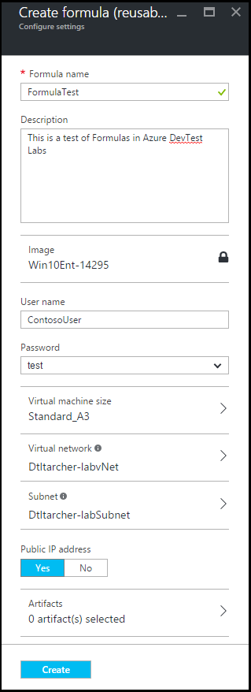

<properties
    pageTitle="Gestire le formule in Azure DevTest esercitazioni per creare macchine virtuali | Microsoft Azure"
    description="Informazioni su come creare, aggiornare e rimuovere le formule di Azure DevTest esercitazioni e consente di creare nuove macchine virtuali."
    services="devtest-lab,virtual-machines"
    documentationCenter="na"
    authors="tomarcher"
    manager="douge"
    editor=""/>

<tags
    ms.service="devtest-lab"
    ms.workload="na"
    ms.tgt_pltfrm="na"
    ms.devlang="na"
    ms.topic="article"
    ms.date="08/30/2016"
    ms.author="tarcher"/>

# Gestire le formule DevTest esercitazioni per creare macchine virtuali

Una formula in Azure DevTest esercitazioni è un elenco di valori di proprietà predefinito utilizzato per creare una macchine (). Quando si crea una macchina virtuale da una formula, i valori predefiniti da utilizzare come-viene o modificato. Ad esempio [immagini personalizzate](./devtest-lab-create-template.md) e [Marketplace immagini](./devtest-lab-configure-marketplace-images.md), formule consentono di rapidamente il provisioning di macchine Virtuali.  

In questo articolo verrà imparerà a eseguire le operazioni seguenti:

- [Creare una formula](#create-a-formula)
- [Utilizzare una formula per effettuare il provisioning di una macchina virtuale](#use-a-formula-to-provision-a-vm)
- [Modificare una formula](#modify-a-formula)
- [Eliminare una formula](#delete-a-formula)

> [AZURE.NOTE] Formule - ad esempio [immagini personalizzate](./devtest-lab-create-template.md) - consentono di creare un'immagine di base da un file disco rigido virtuale. L'immagine di base può quindi essere utilizzato per effettuare il provisioning di una nuova macchina virtuale. Per capire che più adatta alle esigenze dell'organizzazione, consultare l'articolo [immagini personalizzate di confronto e le formule in esercitazioni DevTest](./devtest-lab-comparing-vm-base-image-types.md).

## Creare una formula
Chiunque disponga delle autorizzazioni DevTest esercitazioni *utenti* è possibile creare macchine virtuali utilizzando una formula come base. Esistono due modi per creare formule: 

- Da una base - usare quando si desidera definire tutte le caratteristiche della formula.
- Da un laboratorio esistente macchine Virtuali - utilizzare questa opzione quando si desidera creare una formula in base alle impostazioni di una macchina virtuale esistente.

### Creare una formula di base
I passaggi seguenti per il processo di creazione di una formula da un'immagine personalizzata, immagine Marketplace o un'altra formula.

1. Accedere al [portale di Azure](http://go.microsoft.com/fwlink/p/?LinkID=525040).

1. Selezionare **Altri servizi**e quindi selezionare **Esercitazioni DevTest** dall'elenco.

1. Selezionare il laboratorio desiderato dall'elenco di esercitazioni.  

1. Blade del laboratorio, selezionare **formule (riutilizzabile basi)**.

    

1. Scegliere **Aggiungi +**e il **formule laboratorio** .

    

1. Scegliere la base (immagine personalizzata, immagine Marketplace o formula) da cui si desidera creare la formula e lo **Scegli una base** .

    

1. Nella e **formula crea** , specificare i valori seguenti:

    - **Nome della formula** , immettere un nome per la formula. Questo valore verrà visualizzato nell'elenco delle immagini di base quando si crea una macchina virtuale. Il nome viene convalidato durante la digitazione, e se non è valido, un messaggio che indica i requisiti per un valore valido.
    - **Descrizione** - immettere una descrizione significativa per la formula. Questo valore è disponibile dal menu di scelta rapida della formula quando si crea una macchina virtuale.
    - **Nome utente** , immettere un nome utente che dispone di privilegi di amministratore.
    - **Password** - immettere - o selezionare nell'elenco a discesa - un valore associato il segreto (password) che si desidera utilizzare per l'utente specificato.  
    - **Immagine** - questo campo Visualizza nome dell'immagine di base selezionato nel e precedente. 
    - **Le dimensioni del computer virtuale** - selezionare una delle voci predefinite che specificano il core, le dimensioni di RAM e le dimensioni del disco rigido della macchina virtuale per creare.
    - **Rete virtuale** - specificare la rete virtuale desiderata.
    - **Subnet** - specificare subnet desiderata.
    - **Indirizzo IP pubblico** - se il criterio di laboratorio è impostato per consentire a indirizzi IP per subnet selezionata, specificare se si desidera che l'indirizzo IP di tipo public selezionando **Sì** o **No**. In caso contrario, questa opzione è disattivata e selezionata come **n**.
    - **Gli elementi** , selezionare e configurare gli elementi che si desidera aggiungere l'immagine di base. Proteggere stringa di valori non vengono salvati con la formula. Di conseguenza, non vengono visualizzati parametri di elementi che sono stringhe di sicure. 

        

1. Selezionare **Crea** per creare la formula.

### Creare una formula da una macchina virtuale
I passaggi seguenti per il processo di creazione di una formula in base a una macchina virtuale esistente. 

> [AZURE.NOTE] Per creare una formula da una macchina virtuale, la macchina virtuale deve essere stata creata dopo il 30 marzo 2016. 

1. Accedere al [portale di Azure](http://go.microsoft.com/fwlink/p/?LinkID=525040).

1. Selezionare **Altri servizi**e quindi selezionare **Esercitazioni DevTest** dall'elenco.

1. Selezionare il laboratorio desiderato dall'elenco di esercitazioni.  

1. Blade **Panoramica** dell'ambiente di test, selezionare la macchina virtuale da cui si desidera creare la formula.

    

1. Scegliere blade di Virtual Machine, **creare formula (base riutilizzabile)**.

    

1. In e il **formula crea** , immettere un **nome** e una **Descrizione** per la nuova formula.

    

1. Fare clic su **OK** per creare la formula.

## Utilizzare una formula per effettuare il provisioning di una macchina virtuale
Dopo aver creato una formula, è possibile creare una macchina virtuale in base a tale formula. La sezione [aggiungere una macchina virtuale con gli elementi](devtest-lab-add-vm-with-artifacts.md#add-a-vm-with-artifacts) sono illustrati i passaggi.

## Modificare una formula
Per modificare una formula, procedere come segue:

1. Accedere al [portale di Azure](http://go.microsoft.com/fwlink/p/?LinkID=525040).

1. Selezionare **Altri servizi**e quindi selezionare **Esercitazioni DevTest** dall'elenco.

1. Selezionare il laboratorio desiderato dall'elenco di esercitazioni.  

1. Blade del laboratorio, selezionare **formule (riutilizzabile basi)**.

    

1. Scegliere la formula che si desidera modificare e il **formule laboratorio** .

1. Scegliere e **l'Aggiorna formula** , apportare le modifiche desiderate e selezionare **Aggiorna**.

## Eliminare una formula 
Per eliminare una formula, procedere come segue:

1. Accedere al [portale di Azure](http://go.microsoft.com/fwlink/p/?LinkID=525040).

1. Selezionare **Altri servizi**e quindi selezionare **Esercitazioni DevTest** dall'elenco.

1. Selezionare il laboratorio desiderato dall'elenco di esercitazioni.  

1. Scegliere **le formule**e **l'Impostazioni** laboratorio.

    

1. Scegliere i puntini di sospensione a destra della formula che si desidera eliminare e il **formule laboratorio** .

    

1. Nel menu di scelta rapida della formula, selezionare **Elimina**.

    

1. Selezionare **Sì** per la finestra di dialogo di conferma dell'eliminazione.

[AZURE.INCLUDE [devtest-lab-try-it-out](../../includes/devtest-lab-try-it-out.md)]

## Post di blog correlati

- [Immagini personalizzate o formule?](https://blogs.msdn.microsoft.com/devtestlab/2016/04/06/custom-images-or-formulas/)

## Passaggi successivi
Dopo aver creato una formula per l'utilizzo durante la creazione di una macchina virtuale, il passaggio successivo consiste [nell'aggiungere una macchina virtuale per l'esercitazione](./devtest-lab-add-vm-with-artifacts.md).