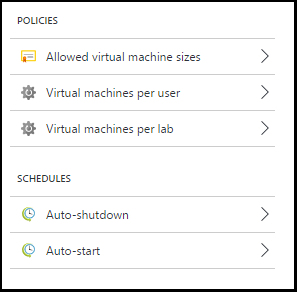
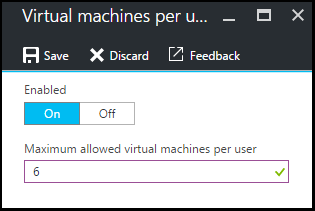
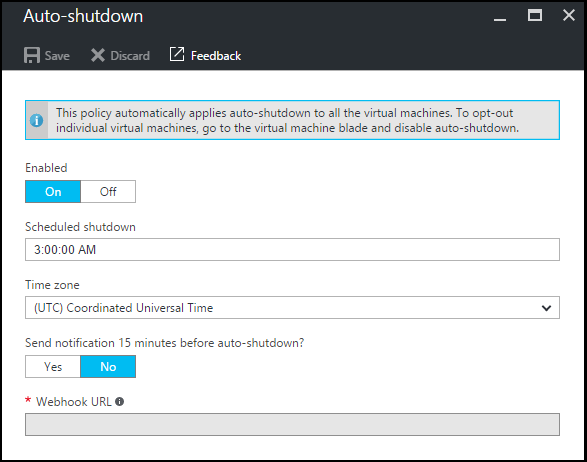

<properties
    pageTitle="Definire i criteri di laboratorio in Azure DevTest esercitazioni | Microsoft Azure"
    description="Informazioni su come definire i criteri di laboratorio, ad esempio le dimensioni di macchine Virtuali, massime macchine virtuali per ogni utente e automazione di chiusura."
    services="devtest-lab,virtual-machines"
    documentationCenter="na"
    authors="tomarcher"
    manager="douge"
    editor=""/>

<tags
    ms.service="devtest-lab"
    ms.workload="na"
    ms.tgt_pltfrm="na"
    ms.devlang="na"
    ms.topic="article"
    ms.date="09/12/2016"
    ms.author="tarcher"/>

# Definire i criteri di laboratorio in Azure DevTest esercitazioni

> [AZURE.VIDEO how-to-set-vm-policies-in-a-devtest-lab]

Esercitazioni DevTest Azure consente di specificare criteri chiave che consentono di controllare costo e ridurre a icona rifiuti le esercitazioni. Questi criteri laboratorio includono il numero massimo di macchine virtuali creati per utente al laboratorio e varie opzioni spegnimento automatico e avvio automatico. 

## Accesso ai criteri del laboratorio di Azure DevTest esercitazioni

Nella procedura seguente consente di impostazione di criteri a un ambiente di Azure DevTest esercitazioni:

Per visualizzare e modificare i criteri per un ambiente di lavoro, procedere come segue:

1. Accedere al [portale di Azure](http://go.microsoft.com/fwlink/p/?LinkID=525040).

1. Selezionare **altri servizi**e quindi selezionare **Esercitazioni DevTest** dall'elenco.

1. Selezionare il laboratorio desiderato dall'elenco di esercitazioni.   

1. Selezionare **le impostazioni dei criteri**.

1. E il **impostazioni dei criteri** contiene un menu delle impostazioni che è possibile specificare: 

    

    Per ulteriori informazioni sull'impostazione di un criterio, selezionarlo nell'elenco seguente:

    - [Dimensioni macchina virtuale consentite](#set-allowed-virtual-machine-sizes) - selezionare l'elenco dei formati di macchine Virtuali consentito in laboratorio. Un utente può creare macchine virtuali solo dall'elenco.

    - [Macchine virtuali per utente](#set-virtual-machines-per-user) , specificare il numero massimo di macchine virtuali che possono essere creati da un utente. 

    - [Macchine virtuali per laboratorio](#set-virtual-machines-per-lab) - specificare il numero massimo di macchine virtuali che possono essere create per un ambiente di lavoro. 

    - [Spegnimento automatico](#set-auto-shutdown) - specificare l'ora quando laboratorio corrente di macchine virtuali arrestate automaticamente.

    - [Avvio automatico](#set-auto-start) - specificare l'ora in macchine virtuali dell'ambiente di test corrente avviare automaticamente.

## Impostare le dimensioni di macchina virtuale è consentito

I criteri per impostare le dimensioni di macchine Virtuali consentite consente di ridurre al minimo laboratorio rifiuti, che consente di specificare le dimensioni di macchine Virtuali consentite nel laboratorio. Se questo criterio è attivato, è possono utilizzare soltanto le dimensioni delle macchine Virtuali da questo elenco per creare macchine virtuali.

1. Blade **le impostazioni dei criteri** dell'ambiente di test, selezionare **dimensioni macchine virtuali consentite**.

    
 
1. Selezionare **su** per attivare questo criterio e **disattivare** per disattivarlo.

1. Se si abilita questo criterio, selezionare uno o più dimensioni macchine Virtuali che possono essere create nell'ambiente.

1. Selezionare **Salva**.

## Set di macchine virtuali per ogni utente

I criteri per **macchine virtuali per utente** consentono di specificare il numero massimo di macchine virtuali che possono essere creati da un singolo utente. Se si tenta di creare una macchina virtuale quando è stato raggiunto il limite di utenti, un messaggio di errore indica che non è possibile creare la macchina virtuale. 

1. Scegliere blade **le impostazioni dei criteri** dell'ambiente di test, **macchine virtuali per ogni utente**.

    

1. Selezionare **su** per attivare questo criterio e **disattivare** per disattivarlo.

1. Se si abilita questo criterio, immettere un valore numerico che indica il numero massimo di macchine virtuali che possono essere creati da un utente. Se si immette un numero che non è valido, l'interfaccia utente visualizza il numero massimo consentito per questo campo.

1. Selezionare **Salva**.

## Macchine virtuali set per laboratorio

I criteri per **macchine virtuali per laboratorio** consentono di specificare il numero massimo di macchine virtuali che possono essere create per il laboratorio corrente. Se si tenta di creare una macchina virtuale quando è stato raggiunto il limite di laboratorio, un messaggio di errore indica che non è possibile creare la macchina virtuale. 

1. Scegliere **macchine virtuali per laboratorio**blade **le impostazioni dei criteri** dell'ambiente di test.

    

1. Selezionare **su** per attivare questo criterio e **disattivare** per disattivarlo.

1. Se si abilita questo criterio, immettere un valore numerico che indica il numero massimo di macchine virtuali che possono essere create per il laboratorio corrente. Se si immette un numero che non è valido, l'interfaccia utente visualizza il numero massimo consentito per questo campo.

1. Selezionare **Salva**.

## Spegnimento automatico set

Il criterio di individuazione automatica consente di ridurre al minimo laboratorio rifiuti, che consente di specificare il periodo di tempo arrestare macchine virtuali di questa esercitazione.

1. Blade **le impostazioni dei criteri** dell'ambiente di test, selezionare **spegnimento automatico**.

    

1. Selezionare **su** per attivare questo criterio e **disattivare** per disattivarlo.

1. Se si abilita questo criterio, specificare l'ora locale per chiudere tutte le macchine virtuali di laboratorio corrente.

1. Selezionare **Salva**.

1. Per impostazione predefinita, dopo l'abilitazione, questo criterio si applica a tutte le macchine virtuali di laboratorio corrente. Per rimuovere questa impostazione da una macchina virtuale specifica, aprire blade della macchina virtuale e modificare l'impostazione di **spegnimento automatico** 

## Avvio automatico set

Il criterio di avvio automatico consente di specificare quando devono essere avviate macchine virtuali di laboratorio corrente.  

1. Nella blade **le impostazioni dei criteri** dell'ambiente di test, selezionare **avvio automatico**.

    

1. Selezionare **su** per attivare questo criterio e **disattivare** per disattivarlo.

1. Se si abilita questo criterio, specificare locale pianificato ora di inizio e i giorni della settimana per il quale si applica l'ora. 

1. Selezionare **Salva**.

1. Dopo l'abilitazione, il criterio non viene automaticamente applicato a qualsiasi macchine virtuali di laboratorio corrente. Per applicare questa impostazione a una macchina virtuale specifica, aprire blade della macchina virtuale e modificare l'impostazione di **avvio automatico** 

[AZURE.INCLUDE [devtest-lab-try-it-out](../../includes/devtest-lab-try-it-out.md)]

## Passaggi successivi

Dopo avere definito e applicare diverse impostazioni di criteri di macchine Virtuali per l'ambiente, di seguito sono riportate alcune operazioni da provare Avanti:

- [Gestione dei costi Configura](./devtest-lab-configure-cost-management.md) - viene illustrato come utilizzare il grafico **Mensile tendenza costo previsto**  
Per visualizzare il mese corrente del stimata costo alla data corrente e il costo previsto di fine del mese.
- [Immagine personalizzata crea](./devtest-lab-create-template.md) - quando si crea una macchina virtuale, specificare una base, che può essere un'immagine personalizzata o un'immagine Marketplace. In questo articolo viene illustrato come creare un'immagine personalizzata da un file disco rigido virtuale.
- [Configurare Marketplace immagini](./devtest-lab-configure-marketplace-images.md) - Azure DevTest esercitazioni supporta la creazione di macchine virtuali basate su immagini di Azure Marketplace. In questo articolo viene illustrato come specificare che, se presenti, le immagini di Azure Marketplace possono essere utilizzato per la creazione di macchine virtuali in un ambiente di lavoro.
- [Creare una macchina virtuale in un ambiente di lavoro](./devtest-lab-add-vm-with-artifacts.md) - viene illustrato come creare una macchina virtuale da un'immagine di base (uno personalizzato o il Marketplace) e su come lavorare con elementi di una macchina virtuale.
