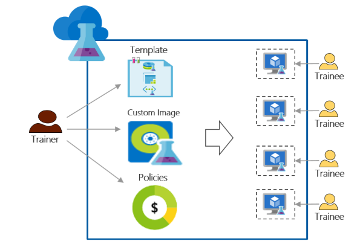

<properties
    pageTitle="Utilizzare Azure DevTest esercitazioni corsi di formazione | Microsoft Azure"
    description="Informazioni su come usare Azure DevTest esercitazioni per gli scenari di formazione."
    services="devtest-lab,virtual-machines"
    documentationCenter="na"
    authors="steved0x"
    manager="douge"
    editor=""/>

<tags
    ms.service="devtest-lab"
    ms.workload="na"
    ms.tgt_pltfrm="na"
    ms.devlang="na"
    ms.topic="article"
    ms.date="09/12/2016"
    ms.author="sdanie"/>

# Utilizzare Azure DevTest esercitazioni corsi di formazione

Esercitazioni DevTest Azure utilizzabili per implementare molti gli scenari principali oltre dev/test. Uno di questi scenari consiste nel configurare un ambiente di lavoro per la formazione. Esercitazioni DevTest Azure consente di creare un ambiente di lavoro in cui è possibile fornire i modelli personalizzati che ogni utente del training consente di creare ambienti identici e isolati corsi di formazione. È possibile assicurarsi che gli ambienti di formazione disponibili per ogni utente del training solo quando servono e contengono abbastanza risorse - ad esempio macchine virtuali - necessari per la formazione. Infine, è possibile condividere facilmente laboratorio con tirocinanti, che può accedere a un solo clic.   

Esercitazioni DevTest Azure soddisfa i seguenti requisiti necessari per formazione in qualsiasi ambiente virtuale: 

-   Tirocinanti non è possibile vedere macchine virtuali create da altre tirocinanti
-   Ogni computer formazione devono essere identici
-   Tirocinanti rapidamente possono effettuare il provisioning gli ambienti di formazione
-   Controllo dei costi assicurando che tirocinanti non è possibile ottenere altre macchine virtuali sono necessari per la formazione e arresto macchine virtuali anche quando vengono utilizzati
-   Condividere la formazione con ogni utente del training
-   Riutilizzare più volte la formazione

In questo articolo informazioni sulle varie caratteristiche di Azure DevTest esercitazioni che possono essere utilizzati per soddisfare le esigenze di formazione descritto in precedenza e la procedura dettagliata che è possibile eseguire per configurare un ambiente di lavoro per la formazione.  

## L'implementazione di formazione con Azure DevTest esercitazioni

1. **Creare l'ambiente di lavoro** 

    Esercitazioni sono il punto di partenza in Azure DevTest esercitazioni. Dopo aver creato un ambiente di lavoro, è possibile eseguire attività ad esempio come aggiungere utenti (tirocinanti) a esercitazione, impostare i criteri per controllare i costi, definire le immagini di macchine Virtuali che è possono creare rapidamente e altro ancora.   

    Ulteriori informazioni, fare clic sui collegamenti nella tabella riportata di seguito:

  	| Attività                                                            | Ciò che si apprende                                                    |
|-----------------------------------------------------------------|----------------------------------------------------------------------|
| [Creare un ambiente di lavoro in Azure DevTest esercitazioni](devtest-lab-create-lab.md) | Informazioni su come creare un ambiente di lavoro in Azure DevTest esercitazioni nel portale di Azure. |

2. **Creare macchine virtuali di formazione in minuti utilizzo di immagini già pronte marketplace e immagini personalizzate** 
    
    È possibile selezionare le immagini già pronte da una vasta gamma di immagini in Azure Marketplace e renderli disponibili per tirocinanti in laboratorio. Se le immagini già pronte non soddisfano i requisiti, è possibile creare un'immagine personalizzata mediante la creazione di un laboratorio macchine Virtuali con un'immagine già pronte da Azure Marketplace, installare il software è necessario per la formazione e il salvataggio della macchina virtuale come immagine personalizzata in laboratorio. 

    Ulteriori informazioni, fare clic sui collegamenti nella tabella riportata di seguito:

  	| Attività                                                                              | Ciò che si apprende                                                                                                                                  |
|-----------------------------------------------------------------------------------|-------------------------------------------------------------------------------------------------------------------------------------------------|
| [Configurare le immagini di Azure Marketplace](devtest-lab-configure-marketplace-images.md) | Informazioni su come è possibile immagini di Azure Marketplace proprietà consentite. rendere disponibili per la selezione solo le immagini desiderate per la formazione.                 |
| [Creare un'immagine personalizzata](devtest-lab-create-template.md)                           | Creare un'immagine personalizzata pre-installare il software che necessario per la formazione in modo che tirocinanti possono creare rapidamente una macchina virtuale utilizzando l'immagine personalizzata. |

3. **Creare un modello riutilizzabile per i computer di formazione** 

    Una formula in Azure DevTest esercitazioni è un elenco di valori di proprietà predefinito utilizzato per creare una macchina virtuale. È possibile creare una formula in laboratorio facendo clic su un'immagine, una dimensione di memoria virtuale (una combinazione di CPU e RAM) e una rete virtuale. Ogni utente del training può vedere la formula in laboratorio e usarlo per creare una macchina virtuale. 

    Ulteriori informazioni, fare clic sui collegamenti nella tabella riportata di seguito:

  	| Attività                                                                         | Ciò che si apprende                                                                                                          |
|------------------------------------------------------------------------------|-------------------------------------------------------------------------------------------------------------------------|
| [Gestire le formule DevTest esercitazioni per creare macchine virtuali](devtest-lab-manage-formulas.md) | Informazioni su come è possibile creare una formula facendo clic su un'immagine, la dimensione di memoria virtuale (combinazione di CPU e RAM) e una rete virtuale. |

4. **Controllare i costi**

    Esercitazioni DevTest Azure consente di impostare un criterio di laboratorio per specificare il numero massimo di macchine virtuali che possono essere create da un utente del training in laboratorio. 

    Se si sta partecipando a più giornata formazione e si vuole smettere di tutte le macchine virtuali in un determinato momento del giorno e riavviare automaticamente loro il giorno successivo, è possibile facilmente eseguire questa operazione mediante l'impostazione automatica arresto e i criteri di laboratorio di avvio automatico. 

    Infine, una volta completata la formazione è possibile eliminare tutte le macchine virtuali contemporaneamente eseguendo uno script di PowerShell singolo. 

    Ulteriori informazioni, fare clic sui collegamenti nella tabella riportata di seguito:

  	| Attività                                                                                                                                    | Ciò che si apprende                                                      |
|-----------------------------------------------------------------------------------------------------------------------------------------|---------------------------------------------------------------------|
| [Definire i criteri di laboratorio](devtest-lab-set-lab-policy.md)                                                                                    | Controllare i costi mediante l'impostazione di criteri in laboratorio.                       |
| [Eliminare tutti i laboratorio macchine virtuali utilizzando uno script di PowerShell](devtest-lab-faq.md#how-can-i-automate-the-process-of-deleting-all-the-vms-in-my-lab) | Eliminare tutte le esercitazioni in un'unica operazione una volta completata la formazione. |

5. **Condividere il laboratorio con ogni utente del training**

    Esercitazioni è possibile accedervi direttamente utilizzando un collegamento che si condivide con i tirocinanti. I tirocinanti anche non sono necessario disporre di un account Azure come hanno un [account Microsoft](devtest-lab-faq.md#what-is-a-microsoft-account). Tirocinanti non possono visualizzare macchine virtuali create da altre tirocinanti.  

    Ulteriori informazioni, fare clic sui collegamenti nella tabella riportata di seguito:

  	| Attività                                                                                                                                | Ciò che si apprende                                                   |
|-------------------------------------------------------------------------------------------------------------------------------------|------------------------------------------------------------------|
| [Aggiungere un utente del training a un laboratorio di Azure DevTest esercitazioni](devtest-lab-add-devtest-user.md)                                                     | Utilizzare il portale di Azure per aggiungere tirocinanti per la formazione.       |
| [Aggiungere tirocinanti laboratorio utilizzando uno script di PowerShell](devtest-lab-add-devtest-user.md#add-an-external-user-to-a-lab-using-powershell) | Usare PowerShell per automatizzare tirocinanti aggiunta per la formazione. |
| [Ottenere un collegamento per l'esercitazione](devtest-lab-faq.md#how-do-i-share-a-direct-link-to-my-lab)                                                  | Informazioni su come un laboratorio direttamente accessibile tramite un collegamento ipertestuale.        |

6. **Riutilizzare più volte laboratorio** 

    È possibile automatizzare la creazione di laboratorio, incluse le impostazioni personalizzate, creando un modello di Manager delle risorse e usarlo per creare più volte esercitazioni identiche. 

    Ulteriori informazioni, fare clic sui collegamenti nella tabella riportata di seguito:

  	| Attività                                                                                                                               | Ciò che si apprende                                                      |
|------------------------------------------------------------------------------------------------------------------------------------|---------------------------------------------------------------------|
| [Creare un ambiente di lavoro utilizzando un modello di Manager delle risorse](devtest-lab-faq.md#how-do-i-create-a-lab-from-an-azure-resource-manager-template) | Creare esercitazioni in Azure DevTest esercitazioni utilizzare i modelli di Manager delle risorse. |

[AZURE.INCLUDE [devtest-lab-try-it-out](../../includes/devtest-lab-try-it-out.md)]  

