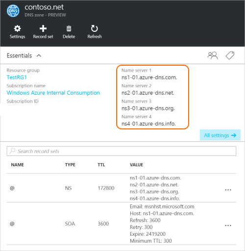

<properties
   pageTitle="Delega del dominio per DNS Azure | Microsoft Azure"
   description="Informazioni su come modificare la delega di dominio e utilizzare i server dei nomi di Azure DNS per fornire hosting del dominio."
   services="dns"
   documentationCenter="na"
   authors="sdwheeler"
   manager="carmonm"
   editor=""/>

<tags
   ms.service="dns"
   ms.devlang="na"
   ms.topic="get-started-article"
   ms.tgt_pltfrm="na"
   ms.workload="infrastructure-services"
   ms.date="06/30/2016"
   ms.author="sewhee"/>

# Delega di un dominio a DNS Azure

DNS Azure consente di ospitare una zona DNS e gestire i record DNS per un dominio in Azure. Per le query DNS per consentire un dominio raggiungere Azure DNS, il dominio deve essere delegata a Azure DNS del dominio padre. Tenere presente Azure DNS non è nel registrar. In questo articolo viene descritto il funzionamento di delega del dominio e delegare domini su Azure DNS.

## Funzionamento della delega DNS

### Domini e le aree

Domain Name System è una gerarchia di domini. Inizia in corrispondenza della gerarchia da dominio "principale", il cui nome è semplicemente**.**.  Di sotto si provenire domini di primo livello, ad esempio "com", "rete", 'org', 'uk' o 'jp'.  Sotto questi sono i domini di secondo livello, ad esempio 'org.uk' o 'co.jp'.  E così via. I domini nella gerarchia DNS sono ospitati utilizzando zone separate. Queste aree sono globalmente distribuite, ospitato da server dei nomi DNS in tutto il mondo.

**Zona DNS**

Un nome univoco in Domain Name System, ad esempio 'contoso.com' è un dominio. Una zona DNS viene utilizzata per ospitare i record DNS per un determinato dominio. Ad esempio, il dominio 'contoso.com' può contenere un numero di record DNS, ad esempio "mail.contoso.com" (per un server di posta elettronica) e "www.contoso.com" (per un sito Web).

**Registrar di dominio**

Un registrar è una società in grado di fornire nomi di dominio Internet. Si verificherà se il dominio Internet che si desidera utilizzare è disponibile e consentono di acquistarlo. Dopo il nome di dominio è registrato, sarà il proprietario legale per il nome di dominio. Se si dispone già di un dominio Internet, utilizzare il registrar corrente a delegare Azure DNS.

>[AZURE.NOTE] Per ulteriori informazioni sui responsabili un nome di dominio o per informazioni su come acquistare un dominio, vedere [gestione dei domini Internet Azure Active Directory](https://msdn.microsoft.com/library/azure/hh969248.aspx).

### Risoluzione e delega

Esistono due tipi di server DNS:

- Server DNS _autorevole_ ospita zone DNS. Fornita risposta alle query DNS per tali zone solo i record.
- Zone DNS non è ospitato da un server DNS _ricorsiva_ . Risponde a tutte le query DNS chiamando DNS autorevoli per raccogliere i dati che necessari.

>[AZURE.NOTE] Azure DNS offre un servizio DNS rilevanti.  Non viene fornito un servizio DNS ricorsiva.

> Servizi cloud e macchine virtuali di Azure vengono configurate automaticamente per utilizzare un provider di servizi DNS ricorsiva fornito separatamente come parte dell'infrastruttura di Azure.  Per informazioni su come modificare queste impostazioni DNS, vedere [Risoluzione dei nomi di Azure](../virtual-network/virtual-networks-name-resolution-for-vms-and-role-instances.md#name-resolution-using-your-own-dns-server).

In genere i client DNS nel PC o dispositivi mobili chiamare un server DNS ricorsive per eseguire le query DNS che necessitano applicazioni client.

Quando un server DNS ricorsive riceve una query per un record DNS, ad esempio "www.contoso.com", è prima di tutto necessario trovare il nome del server che ospita la zona relativa al dominio 'contoso.com'. A tale scopo, compreso il server dei nomi radice e da tale posizione consente di trovare il server dei nomi per l'area "com". Viene quindi query i server dei nomi "com" per trovare il server dei nomi per l'area 'contoso.com'.  Infine, è possibile eseguire query su questi server dei nomi per 'www.contoso.com'.

Questo comando si chiama la risoluzione del nome DNS. In senso stretto, la risoluzione DNS include i passaggi aggiuntivi, ad esempio record CNAME seguenti, ma che non è importante per la comprensione del funzionamento della delega DNS.

Come una zona padre 'punto' ai server dei nomi per una zona figlio? Esegue questa operazione utilizzando un particolare tipo di record DNS, chiamato un record NS (NS sta per 'server dei nomi'). Ad esempio, zona principale contiene i record NS "com" e vengono visualizzati i server dei nomi per l'area "com". A sua volta, l'area "com" contiene i record NS per 'contoso.com, che mostra i server dei nomi per l'area 'contoso.com'. Configurare i record NS per una zona figlio in un'area padre rappresenta la cosiddetta delega il dominio.

Ogni delega sono in effetti disponibili due copie di record NS. una zona padre che puntano alle figlio e un altro nell'area figlio stesso. L'area 'contoso.com' contiene il record NS 'contoso.com' (oltre i record NS "com"). Si tratta dei record NS rilevanti e si trovano in cima zona figlio.

## Delega di un dominio a DNS Azure

Dopo aver creato la zona DNS nel DNS Azure, è necessario impostare i record NS nella zona padre per verificare l'origine autorevole per la risoluzione dei nomi per l'area DNS Azure. Per i domini acquistati presso un registrar, registrar sarà disponibile l'opzione per configurare questi record NS.

>[AZURE.NOTE] Non è necessario per creare una zona DNS con il nome di dominio in DNS Azure disporre di un dominio. Tuttavia, è necessario il proprietario del dominio per impostare la delega di Azure DNS con il registrar.

Si supponga ad esempio, acquistare il dominio 'contoso.com' e creare un'area con nome 'contoso.com' in Azure DNS. Il proprietario del dominio di registrar offrirà l'opzione per configurare gli indirizzi di nome server (ovvero, i record NS) per il dominio. La registrazione verrà archiviata questi record NS del dominio padre, in questo caso "com". Client nel mondo quindi essere indirizzati al proprio dominio in zona DNS Azure quando si prova a risolvere i record DNS in 'contoso.com'.

### Trovare i nomi dei server

Per poter delegare zona DNS nel DNS Azure, è innanzitutto necessario conoscere i nomi di server nome per l'area. Azure DNS Assegna server dei nomi di un pool di ogni volta che viene creata una zona.

Il modo più semplice per visualizzare i server dei nomi assegnato all'area è tramite il portale Azure.  In questo esempio, 'contoso.net' area è stata assegnata i server dei nomi ' ns1-01.azure-dns.com', 'ns2 01.azure dns .net', ' ns3-01.azure-dns.org', e ' ns4-01.azure-dns.info':

 

DNS Azure crea automaticamente record NS rilevanti nell'area contenente i server dei nomi assegnate.  Per visualizzare i nomi dei server tramite PowerShell Azure o CLI Azure, è sufficiente recuperare questi record.

Utilizzo di PowerShell di Azure, i record NS rilevanti possono essere recuperati come indicato di seguito. Si noti che il nome del record “@” utilizzato per fare riferimento ai record in cima l'area.

    PS> $zone = Get-AzureRmDnsZone –Name contoso.net –ResourceGroupName MyResourceGroup
    PS> Get-AzureRmDnsRecordSet –Name “@” –RecordType NS –Zone $zone

    Name              : @
    ZoneName          : contoso.net
    ResourceGroupName : MyResourceGroup
    Ttl               : 3600
    Etag              : 5fe92e48-cc76-4912-a78c-7652d362ca18
    RecordType        : NS
    Records           : {ns1-01.azure-dns.com, ns2-01.azure-dns.net, ns3-01.azure-dns.org,
                        ns4-01.azure-dns.info}
    Tags              : {}

È anche possibile utilizzare CLI Azure multipiattaforma per recuperare i record NS rilevanti e quindi individuare i server dei nomi assegnato all'area:

    C:\> azure network dns record-set show MyResourceGroup contoso.net @ NS
    info:    Executing command network dns record-set show
        + Looking up the DNS Record Set "@" of type "NS"
    data:    Id                              : /subscriptions/.../resourceGroups/MyResourceGroup/providers/Microsoft.Network/dnszones/contoso.net/NS/@
    data:    Name                            : @
    data:    Type                            : Microsoft.Network/dnszones/NS
    data:    Location                        : global
    data:    TTL                             : 172800
    data:    NS records
    data:        Name server domain name     : ns1-01.azure-dns.com.
    data:        Name server domain name     : ns2-01.azure-dns.net.
    data:        Name server domain name     : ns3-01.azure-dns.org.
    data:        Name server domain name     : ns4-01.azure-dns.info.
    data:
    info:    network dns record-set show command OK

### Per impostare la delega

Ogni registrar sono propri strumenti di gestione DNS per modificare i record server dei nomi per un dominio. Nella pagina Gestione DNS del registrar, modificare i record NS e sostituire i record NS con quelli creati Azure DNS.

Durante la delega di un dominio a DNS Azure, è necessario utilizzare i nomi dei server di nome fornite da Azure DNS.  È necessario utilizzare sempre tutti 4 nome i nomi dei server, indipendentemente dal nome del dominio.  Delega del dominio non richiede il nome del server nome da utilizzare lo stesso dominio di primo livello come il dominio.

Non è consigliabile utilizzare 'associare record' in modo che puntino a Azure nomi DNS server indirizzi IP, dal momento che questi indirizzi IP possono cambiare in futuro. Deleghe utilizzando i nomi dei server nel proprio area, a volte chiamato anche 'Server dei nomi per l'orgoglio', non sono attualmente supportate in Azure DNS.

### Per verificare la risoluzione dei nomi funziona

Dopo aver completato la delega, è possibile verificare che la risoluzione dei nomi funziona utilizzando uno strumento, ad esempio "nslookup" per ottenere tramite query il record SOA per l'area (che viene creata automaticamente anche quando viene creato l'area).

Si noti che non è necessario specificare i server dei nomi di Azure DNS, poiché il processo di risoluzione DNS normale troverà automaticamente i server dei nomi se la delega è stata impostata correttamente.

    nslookup –type=SOA contoso.com

    Server: ns1-04.azure-dns.com
    Address: 208.76.47.4

    contoso.com
    primary name server = ns1-04.azure-dns.com
    responsible mail addr = msnhst.microsoft.com
    serial = 1
    refresh = 900 (15 mins)
    retry = 300 (5 mins)
    expire = 604800 (7 days)
    default TTL = 300 (5 mins)

## Delega sottodomini nel sistema DNS Azure

Se si desidera impostare una zona figlio separata, è possibile delegare un sottodominio in Azure DNS. Ad esempio, dopo aver creato una e delegata 'contoso.com' nel sistema DNS Azure, si supponga che si desidera impostare una zona figlio separata 'partner.contoso.com'.

Impostazione di un sottodominio segue un processo simile come una delega normale. L'unica differenza è che nel passaggio 3 che i record NS devono essere creati nell'area padre 'contoso.com' DNS Azure, anziché viene impostata tramite un registrar.

1. Creare l'area figlio 'partner.contoso.com' in Azure DNS.
2. Cercare i record NS rilevanti nell'area figlio per ottenere i server dei nomi che ospita la zona figlio in Azure DNS.
3. Delegare la zona figlio mediante la configurazione dei record NS nella zona padre che punta alla zona figlio.

### Al delegato un sottodominio

Nell'esempio di PowerShell seguente illustra il funzionamento. Gli stessi passaggi possono essere eseguiti tramite il portale di Azure, o CLI Azure multipiattaforma.

#### Passaggio 1. Creare le aree di padre e figlio

Innanzitutto, viene creata padre e figlio zone. Può trattarsi in stesso gruppo di risorse o gruppi di risorse diversi.

    $parent = New-AzureRmDnsZone -Name contoso.com -ResourceGroupName RG1
    $child = New-AzureRmDnsZone -Name partners.contoso.com -ResourceGroupName RG1

#### Passaggio 2. Recuperare record

Successivamente, si recuperano i record NS rilevanti da zona figlio come illustrato nell'esempio riportato di seguito.  Questa pagina contiene i server dei nomi assegnati all'area figlio.

    $child_ns_recordset = Get-AzureRmDnsRecordSet -Zone $child -Name "@" -RecordType NS

#### Passaggio 3. Delegato zona figlio

Creare record NS corrispondente impostata nell'area padre per completare la delega. Si noti che il nome del set di record nell'area padre corrisponda al nome di zona figlio, in questo caso "partner".

    $parent_ns_recordset = New-AzureRmDnsRecordSet -Zone $parent -Name "partners" -RecordType NS -Ttl 3600
    $parent_ns_recordset.Records = $child_ns_recordset.Records
    Set-AzureRmDnsRecordSet -RecordSet $parent_ns_recordset

### Per verificare la risoluzione dei nomi funziona

È possibile verificare che tutto sia configurato correttamente eseguendo la ricerca di record SOA della zona figlio.

    nslookup –type=SOA partners.contoso.com

    Server: ns1-08.azure-dns.com
    Address: 208.76.47.8

    partners.contoso.com
        primary name server = ns1-08.azure-dns.com
        responsible mail addr = msnhst.microsoft.com
        serial = 1
        refresh = 900 (15 mins)
        retry = 300 (5 mins)
        expire = 604800 (7 days)
        default TTL = 300 (5 mins)

## Passaggi successivi

[Gestire le aree DNS](dns-operations-dnszones.md)

[Gestire i record DNS](dns-operations-recordsets.md)

