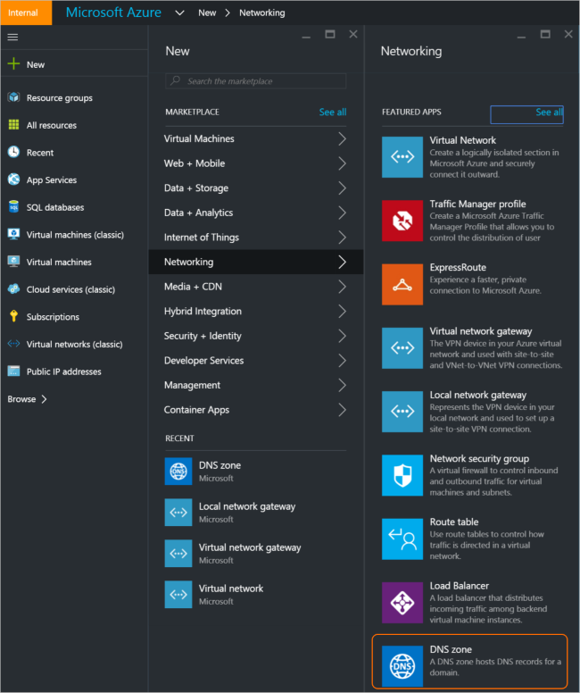
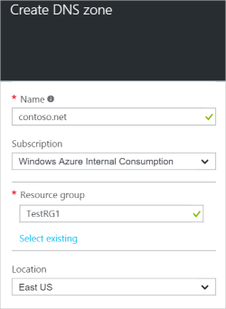
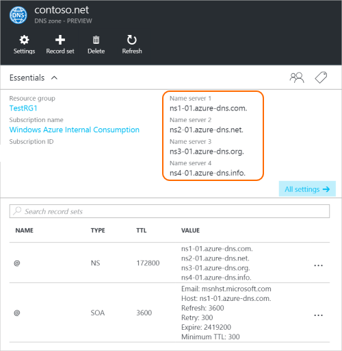

<properties
   pageTitle="Come creare e gestire una zona DNS nel portale di Azure | Microsoft Azure"
   description="Informazioni su come creare zone DNS per il DNS Azure. Si tratta di una Guida dettagliata per creare e gestire il DNS prima e iniziare l'hosting del dominio DNS tramite il portale di Azure."
   services="dns"
   documentationCenter="na"
   authors="sdwheeler"
   manager="carmonm"
   editor=""
   tags="azure-resource-manager"/>

<tags
   ms.service="dns"
   ms.devlang="na"
   ms.topic="article"
   ms.tgt_pltfrm="na"
   ms.workload="infrastructure-services"
   ms.date="08/16/2016"
   ms.author="sewhee"/>

# Creare una zona DNS nel portale di Azure

> [AZURE.SELECTOR]
- [Portale di Azure](dns-getstarted-create-dnszone-portal.md)
- [PowerShell](dns-getstarted-create-dnszone.md)
- [CLI Azure](dns-getstarted-create-dnszone-cli.md)

In questo articolo consentono all'utente la procedura per creare una zona DNS tramite il portale di Azure. È anche possibile creare una zona DNS tramite PowerShell o CLI.

[AZURE.INCLUDE [dns-create-zone-about](../../includes/dns-create-zone-about-include.md)]

### Informazioni sui tag per il DNS Azure

Tag sono un elenco di coppie di nome e vengono utilizzati da Gestione risorse di Azure alle risorse etichetta ai fini della fatturazione o di raggruppamento. Per ulteriori informazioni sui tag, vedere l'articolo [tramite tag per organizzare le risorse Azure](../resource-group-using-tags.md).

È possibile aggiungere tag nel portale di Azure utilizzando e **l'Impostazioni** per l'area DNS.

## Creare una zona DNS

1. Accedere al portale di Azure

2. Scegliere dal menu Hub e fare clic su **Nuovo > rete >** e quindi fare clic su **zona DNS** per aprire e lo zona DNS.

    

3. Scegliere **Crea** e lo **zona DNS** , nella parte inferiore. Verrà aperto e lo **zona DNS creare** .

    

4. In e lo **zona DNS creare** , assegnare un nome zona DNS. Ad esempio, *contoso.com*. Vedere [Sui nomi di zona DNS](#names) nella sezione precedente.

5. Successivamente, specificare il gruppo di risorse che si desidera utilizzare. È possibile creare un nuovo gruppo di risorse o selezionare un database esistente.

6. Nell'elenco a discesa **posizione** , specificare la posizione del gruppo di risorse. Si noti che questa impostazione indica la posizione del gruppo di risorse, non il percorso per zona DNS. La risorsa zona DNS effettiva automaticamente "globale" e non è quello che è possibile (o necessario) specificare nel portale.

7. È possibile lasciare la casella di controllo **Aggiungi a dashboard** selezionato se si desidera individuare facilmente il nuovo orario nel dashboard. Fare clic su **Crea**.

    

8. Dopo aver fatto clic crea, verrà visualizzato il nuovo orario viene configurato nel dashboard.

    

9. Una volta creato il nuovo orario e il per la nuova zona verrà aperto nel dashboard.

## Visualizzare i record

Creare una zona DNS comporta anche la creazione di record seguenti:

- Record "Di autorità" (SOA). La SOA è presenta nella radice di ogni zona DNS.
- I record server (dei nomi NS) nome rilevanti. Mostrano quali i server dei nomi sono hosting della zona. Azure DNS utilizza un pool di server dei nomi e i server dei nomi in modo diverso, è possibile applicare in aree diverse in Azure DNS. Per ulteriori informazioni, vedere [delegato un dominio di Azure DNS](dns-domain-delegation.md) .

È possibile visualizzare i record dal portale di Azure

1. Da blade la **zona DNS** , fare clic su **tutte le impostazioni** per aprire **blade impostazioni** per la zona DNS.

    

2. Nella parte inferiore del riquadro delle nozioni di base, è possibile visualizzare che il record imposta per zona DNS.

    

## Test

È possibile testare lo zona DNS utilizzando strumenti DNS, ad esempio nslookup, Scavare o il [cmdlet di PowerShell Risolvi DnsName](https://technet.microsoft.com/library/jj590781.aspx).

Se non hai ancora delega il dominio da utilizzare la nuova zona DNS Azure, sarà necessario indirizzare la query DNS direttamente a uno dei server dei nomi per l'area. I server dei nomi per l'area figurano nei record NS come indicato da `Get-AzureRmDnsRecordSet` sopra. Assicurarsi di sostituire i valori corretti per l'area nel comando riportato di seguito.

    nslookup
    > set type=SOA
    > server ns1-01.azure-dns.com
    > contoso.com

    Server: ns1-01.azure-dns.com
    Address:  208.76.47.1

    contoso.com
            primary name server = ns1-01.azure-dns.com
            responsible mail addr = msnhst.microsoft.com
            serial  = 1
            refresh = 900 (15 mins)
            retry   = 300 (5 mins)
            expire  = 604800 (7 days)
            default TTL = 300 (5 mins)

## Eliminare una zona DNS

È possibile eliminare l'area DNS direttamente dal portale. Prima di eliminare una zona DNS nel DNS Azure, sarà necessario eliminare tutti i set di record, fatta eccezione per i record NS e SOA nella radice della zona che sono stati creati automaticamente quando è stata creata l'area.

1. Individuare e lo **zona DNS** per l'area che si desidera eliminare, quindi fare clic su **Elimina** nella parte superiore e il.

2. Verrà visualizzato un messaggio informa che è necessario eliminare tutti i set di record, eccetto i record NS e SOA che vengono creati automaticamente. Se è stato eliminato il set di record, fare clic su **Sì**. Si noti che, quando si elimina una zona DNS dal portale, verranno eliminato non al gruppo di risorse associato alla zona DNS.

## Passaggi successivi

Dopo aver creato una zona DNS, creare [set di record e record](dns-getstarted-create-recordset-portal.md) per avviare la risoluzione dei nomi del dominio Internet.
