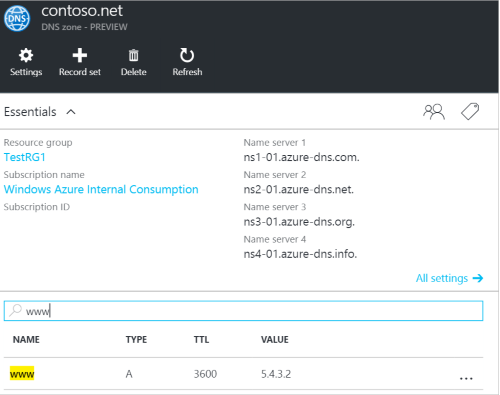

<properties
   pageTitle="Gestire set di record DNS e record tramite il portale di Azure | Microsoft Azure"
   description="La gestione DNS record imposta e record per l'hosting del dominio DNS Azure."
   services="dns"
   documentationCenter="na"
   authors="sdwheeler"
   manager="carmonm"
   editor=""
   tags="azure-resource-manager"/>

<tags
   ms.service="dns"
   ms.devlang="na"
   ms.topic="article"
   ms.tgt_pltfrm="na"
   ms.workload="infrastructure-services"
   ms.date="08/16/2016"
   ms.author="sewhee"/>

# Gestire i record DNS e set di record tramite il portale di Azure

> [AZURE.SELECTOR]
- [Portale di Azure](dns-operations-recordsets-portal.md)
- [CLI Azure](dns-operations-recordsets-cli.md)
- [PowerShell](dns-operations-recordsets.md)

In questo articolo viene illustrato come gestire set di record e record per l'area DNS tramite il portale di Azure.

È importante conoscere la differenza tra i set di record DNS e singoli record DNS. Un set di record è un insieme di record in un'area che hanno lo stesso nome e sono dello stesso tipo. Per ulteriori informazioni, vedere [set di record DNS di creare e record tramite il portale di Azure](dns-getstarted-create-recordset-portal.md).

## Creare un nuovo set di record e record

Per creare un record impostato nel portale di Azure, vedere [creare record DNS tramite il portale di Azure](dns-getstarted-create-recordset-portal.md).

## Visualizzare un set di record

1. Nel portale di Azure, passare a e lo **zona DNS** .

2. Cercare il set di record e selezionarlo. Verrà visualizzata la proprietà del set di record.

    

## Aggiungere un nuovo record a un set di record

È possibile aggiungere fino a 20 record a un set di record. Un set di record non può contenere due record identici. Set di record vuoto (con zero records) possono essere create, ma non vengono visualizzate nel server dei nomi di Azure DNS. Set di record di tipo CNAME può contenere al massimo un record.

1. Scegliere il set di record che si desidera aggiungere un record a blade **Record impostare le proprietà** per l'area DNS.

    

2. Specificare che il record impostata le proprietà di compilare i campi.

    

2. Fare clic su **Salva** nella parte superiore e il per salvare le impostazioni. Chiudere e il.

3. Nell'angolo, si noterà che il record è il salvataggio.

    

Dopo il record è stato salvato, i relativi valori e il **DNS zone** rifletteranno il nuovo record.

## Aggiornare un record

Quando si aggiorna un record in un set di record esistente, i campi che è possibile aggiornare dipendono dal tipo di record che si sta lavorando.

1. Sul blade **Record impostare le proprietà** per il set di record, cercare il record.

2. Modificare il record. Quando si modifica un record, è possibile modificare le impostazioni disponibili per il record. Nell'esempio seguente viene selezionato il campo **indirizzo IP** e l'indirizzo IP è in corso di modifica.

    

3. Fare clic su **Salva** nella parte superiore e il per salvare le impostazioni. Nell'angolo superiore destro, verrà visualizzato la notifica che informa che il record è stato salvato.

    

Dopo il record è stato salvato, i valori per il record impostare e il **DNS zone** rifletteranno record aggiornato.

## Rimuovere un record da un set di record

È possibile usare il portale di Azure per rimuovere i record da un set di record. Si noti che la rimozione dell'ultimo record da un set di record non viene eliminato il set di record.

1. Sul blade **Record impostare le proprietà** per il set di record, cercare il record.

2. Fare clic sul record che si desidera rimuovere. Quindi scegliere **Rimuovi**.

    

3. Fare clic su **Salva** nella parte superiore e il per salvare le impostazioni.

3. Dopo il record è stato rimosso, i valori per il record e il **DNS zone** rifletteranno la rimozione.

## Eliminare un set di record

1. Nel **Record impostare proprietà** blade per il record impostare, fare clic su **Elimina**.

    

2. Viene visualizzato un messaggio in cui viene chiesto se si desidera eliminare il set di record.

3. Verificare che il nome corrisponda set di record che si desidera eliminare e quindi fare clic su **Sì**.

4. Nella e **zona DNS** , verificare che il set di record non è più visibile.

## Usare i record NS e SOA

Record NS e SOA che vengono creati automaticamente vengono gestiti in modo leggermente diverso da altri tipi di record.

### Modificare i record SOA

Non è possibile aggiungere o rimuovere i record del record SOA creati automaticamente impostata su apice zona (nome = "@"). Tuttavia, è possibile modificare i parametri all'interno del record SOA (ad eccezione di "Host") e il record set TTL.

### Modificare i record NS all'apice zona

È possibile aggiungere, per rimuovere o modificare i record del record NS creati automaticamente impostata su apice zona (nome = "@"). L'unica differenza che sia consentito consiste nel modificare il set di record TTL.

### Eliminare i set di record SOA o NS

Non è possibile eliminare la SOA e set di record NS all'apice zona (nome = "@") che vengono creati automaticamente quando viene creato l'area. Vengono eliminati automaticamente quando si elimina l'area.

## Passaggi successivi

-   Per ulteriori informazioni su Azure DNS, vedere la [Panoramica del DNS Azure](dns-overview.md).
-   Per ulteriori informazioni sull'automazione DNS, vedere [creazione DNS zone e record imposta utilizzando .NET SDK](dns-sdk.md).
-   Per ulteriori informazioni sui record DNS inverso, vedere [come gestire i record DNS inverso per i servizi tramite PowerShell](dns-reverse-dns-record-operations-ps.md).
