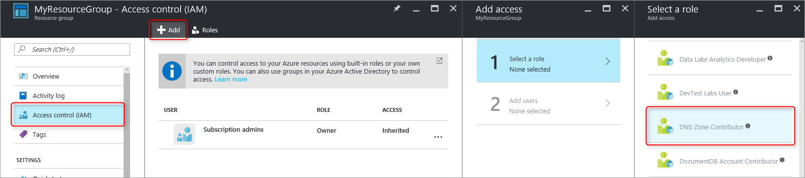

<properties 
   pageTitle="Protezione DNS zone e record | Microsoft Azure" 
   description="Informazioni su come proteggere zone DNS e set di record di Microsoft Azure DNS." 
   services="dns" 
   documentationCenter="na" 
   authors="jtuliani" 
   manager="carmonm" 
   editor=""/>

<tags
   ms.service="dns"
   ms.devlang="na"
   ms.topic="article"
   ms.tgt_pltfrm="na"
   ms.workload="infrastructure-services" 
   ms.date="10/20/2016"
   ms.author="jtuliani"/>

# Come proteggere i record e zone DNS

Record e zone DNS sono risorse critiche. Eliminazione di una zona DNS o anche solo un singolo record DNS causando un'interruzione del servizio totale.  Pertanto è importante che critiche zone e record protette dalla modifica non autorizzato o accidentale.

Questo articolo viene spiegato come DNS Azure consente di proteggere il DNS zone e ai record rispetto a tali modifiche.  Si applica due funzionalità di protezione potenti fornite da Gestione risorse di Azure: [controllo dell'accesso basato sui ruoli](../active-directory/role-based-access-control-what-is.md) e [blocchi di risorse](../resource-group-lock-resources.md).

## Controllo dell'accesso basato sui ruoli

Azure basato sui ruoli accesso controllo (RBAC) consente la gestione degli accessi diffusamente per Azure utenti, gruppi e risorse. Usa RBAC, è possibile concedere con precisione la quantità di access che gli utenti devono eseguire il proprio lavoro. Per ulteriori informazioni su come RBAC consente di gestire l'accesso, vedere [che cos'è controllo dell'accesso basato sui ruoli](../active-directory/role-based-access-control-what-is.md).

### ' DNS Zone collaboratore '

Il ruolo 'DNS Zone collaboratori' è un ruolo incorporato fornito da Azure per la gestione delle risorse DNS.  Assegnazione di autorizzazioni per i collaboratori zona DNS a un utente o gruppo consente al gruppo di gestire le risorse DNS, ma non le risorse di qualsiasi altro tipo.

Si supponga ad esempio che il gruppo di risorse 'myzones' contiene cinque aree Contoso Corporation. La concessione amministratore DNS autorizzazioni 'DNS Zone collaboratori' a tale gruppo di risorse, consente il controllo completo su tali zone DNS. Inoltre, non viene concessione di autorizzazioni non necessarie, ad esempio l'amministratore DNS non è possibile creare o interrompere macchine virtuali.

Il modo più semplice per assegnare le autorizzazioni RBAC è [tramite il portale Azure](../active-directory/role-based-access-control-configure.md).  Aprire e il 'Controllo di accesso (IAM)' per il gruppo di risorse, quindi fare clic su 'Aggiungi', quindi selezionare il ruolo 'DNS Zone collaboratori' e selezionare gli utenti richiesti o i gruppi per concedere le autorizzazioni.

Le autorizzazioni possono essere inoltre [concesse tramite PowerShell Azure](../active-directory/role-based-access-control-manage-access-powershell.md):

    # Grant 'DNS Zone Contributor' permissions to all zones in a resource group
    New-AzureRmRoleAssignment -SignInName <user email address> -RoleDefinitionName "DNS Zone Contributor" -ResourceGroupName <resource group name>

Il comando equivalente disponibile anche [tramite CLI Azure](../active-directory/role-based-access-control-manage-access-azure-cli.md):

    # Grant 'DNS Zone Contributor' permissions to all zones in a resource group
    azure role assignment create --signInName  <user email address> --roleName "DNS Zone Contributor" --resourceGroup <resource group name>

### Livello di zona RBAC

Azure RBAC regole possono essere applicate a una sottoscrizione di un gruppo di risorse o a una singola risorsa. In caso di Azure DNS, la risorsa può essere una zona DNS singoli o anche un singolo set di record.

Si supponga ad esempio che il gruppo di risorse 'myzones' contiene zone 'contoso.com' e un sottozona 'customers.contoso.com' in cui vengono creati i record CNAME per ogni account del cliente.  L'account usato per gestire i record CNAME deve essere assegnata le autorizzazioni per creare record nell'area 'customers.contoso.com' solo, non deve avere accesso alle altre aree.

È possibile concedere autorizzazioni a livello di zona RBAC tramite il portale Azure.  Aprire e il "Controllo di accesso (IAM)" per l'area, quindi fare clic su 'Aggiungi', quindi selezionare il ruolo 'DNS Zone collaboratori' e selezionare gli utenti richiesti o i gruppi per concedere le autorizzazioni.

Le autorizzazioni possono essere inoltre [concesse tramite PowerShell Azure](../active-directory/role-based-access-control-manage-access-powershell.md):

    # Grant 'DNS Zone Contributor' permissions to a specific zone
    New-AzureRmRoleAssignment -SignInName <user email address> -RoleDefinitionName "DNS Zone Contributor" -ResourceGroupName <resource group name> -ResourceName <zone name> -ResourceType Microsoft.Network/DNSZones

Il comando equivalente disponibile anche [tramite CLI Azure](../active-directory/role-based-access-control-manage-access-azure-cli.md):

    # Grant 'DNS Zone Contributor' permissions to a specific zone
    azure role assignment create --signInName <user email address> --roleName "DNS Zone Contributor" --resource-name <zone name> --resource-type Microsoft.Network/DNSZones --resource-group <resource group name>

### Livello RBAC set di record

È possibile procedere. Valutare la possibilità di amministratore di posta elettronica per Contoso Corporation cui concedere l'accesso ai record MX e TXT al vertice dell'area di 'contoso.com'.  Anna non è necessario accedere ad altri record MX o TXT o per qualsiasi record di qualsiasi altro tipo.  DNS Azure consente di assegnare autorizzazioni a livello del set di record a con precisione i record che l'amministratore di posta elettronica acceda.  L'amministratore di posta elettronica viene concesso con precisione il controllo Anna deve e non è possibile apportare altre modifiche.
  
Tramite il portale di Azure, utilizzare il pulsante "Utenti" e il set di record, è possono configurare le autorizzazioni a RBAC livello set di record:

Le autorizzazioni a RBAC livello set di record possono essere inoltre [concesse tramite PowerShell Azure](../active-directory/role-based-access-control-manage-access-powershell.md):

    # Grant permissions to a specific record set
    New-AzureRmRoleAssignment -SignInName <user email address> -RoleDefinitionName "DNS Zone Contributor" -Scope "/subscriptions/<subscription id>/resourceGroups/<resource group name>/providers/Microsoft.Network/dnszones/<zone name>/<record type>/<record name>" 

Il comando equivalente disponibile anche [tramite CLI Azure](../active-directory/role-based-access-control-manage-access-azure-cli.md):

    # Grant permissions to a specific record set
    azure role assignment create --signInName <user email address> --roleName "DNS Zone Contributor" --scope "/subscriptions/<subscription id>/resourceGroups/<resource group name>/providers/Microsoft.Network/dnszones/<zone name>/<record type>/<record name>"

### Ruoli personalizzati

Il ruolo 'DNS Zone collaboratori' incorporato consente il controllo completo su una risorsa DNS. È anche possibile creare il proprio cliente ruoli Azure, per un controllo ancora controllata.

Valutare la possibilità di nuovo l'esempio in cui viene creato un record CNAME nell'area 'customers.contoso.com' per ogni account del cliente Contoso Corporation.  L'account usato per gestire i record CNAME concedere l'autorizzazione per la gestione dei record CNAME.  È possibile modificare i record di altri tipi (ad esempio la modifica dei record MX) o eseguire operazioni a livello di zona, ad esempio eliminazione zona.

Nell'esempio seguente viene illustrata una definizione di ruolo personalizzato per la gestione dei record CNAME:

    {
        "Name": "DNS CNAME Contributor",
        "Id": "",
        "IsCustom": true,
        "Description": "Can manage DNS CNAME records only.",
        "Actions": [
            "Microsoft.Network/dnsZones/CNAME/*",
            "Microsoft.Network/dnsZones/read",
            "Microsoft.Authorization/*/read",
            "Microsoft.Insights/alertRules/*",
            "Microsoft.ResourceHealth/availabilityStatuses/read",
            "Microsoft.Resources/deployments/*",
            "Microsoft.Resources/subscriptions/resourceGroups/read",
            "Microsoft.Support/*"
        ],
        "NotActions": [
        ],
        "AssignableScopes": [
            "/subscriptions/ c276fc76-9cd4-44c9-99a7-4fd71546436e"
        ]
    }

Proprietà azioni consente di definire le autorizzazioni specifiche DNS seguenti:

- `Microsoft.Network/dnsZones/CNAME/*`il record CNAME concede controllo completo
- `Microsoft.Network/dnsZones/read`concede l'autorizzazione per leggere zone DNS, ma non modificarli, che consente di visualizzare l'area in cui viene creato il record CNAME.

Le azioni rimanenti vengono copiate dal [ruolo di collaboratore zona DNS incorporato](../active-directory/role-based-access-built-in-roles.md#dns-zone-contributor).

>[AZURE.NOTE] Utilizzare un ruolo RBAC personalizzato per impedire l'eliminazione di set di record mentre ancora in modo da aggiornarli, non è un controllo efficace. Impedisce l'eliminazione di set di record, ma non impedisce non vengano modificati.  Le modifiche ammesse includono l'aggiunta e rimozione di record da set di record, inclusa la rimozione di tutti i record per lasciare un set di record "empty". Questo è lo stesso effetto dell'eliminazione di set di record da un punto di vista di risoluzione DNS.

Attualmente non è possibile definire le definizioni di ruolo personalizzato tramite il portale Azure. Per creare un ruolo personalizzato in base a questa definizione del ruolo è possibile utilizzare Azure PowerShell:

    # Create new role definition based on input file
    New-AzureRmRoleDefinition -InputFile <file path>

Inoltre, possono essere creato tramite CLI Azure:

    # Create new role definition based on input file
    azure role create –inputfile <file path>

Quindi è possibile assegnare il ruolo nello stesso modo ruoli incorporati, come descritto in precedenza in questo articolo.

Per ulteriori informazioni su come creare, gestire e assegnare ruoli personalizzati, vedere [Ruoli personalizzati in RBAC Azure](../active-directory/role-based-access-control-custom-roles.md).

## Blocchi di risorse

Oltre a RBAC, Gestione risorse di Azure supporta un altro tipo di controllo di sicurezza, vale a dire la possibilità di risorse 'lock'. In regole RBAC consentono di controllare le azioni di utenti e gruppi specifici, blocchi di risorse vengono applicati alla risorsa e hanno effetto su tutti gli utenti e ruoli. Per ulteriori informazioni, vedere [risorse di blocco con Gestione risorse di Azure](../resource-group-lock-resources.md).

Esistono due tipi di blocco di risorsa: **DoNotDelete** e **sola lettura**. Possono essere applicate a una zona DNS o a un singolo set di record.  Nelle sezioni seguenti sono descrivono diversi scenari comuni e come li supportano utilizzando blocchi di risorse.

### Protezione contro tutte le revisioni

Per evitare che le modifiche, applicare un blocco di sola lettura all'area.  Questo impedisce nuovo set di record creato e di quelli esistenti set di record vengano modificati o eliminati.

Tramite il portale di Azure, è possono creare blocchi di risorse a livello di zona.  Da e lo zona DNS fare clic su "Blocchi", quindi "Aggiungi":

Livello di area risorse è inoltre possibile creare blocchi tramite PowerShell Azure:

    # Lock a DNS zone
    New-AzureRmResourceLock -LockLevel <lock level> -LockName <lock name> -ResourceName <zone name> -ResourceType Microsoft.Network/DNSZones -ResourceGroupName <resource group name> 

Configurazione di blocchi di risorse Azure non è attualmente supportata tramite CLI Azure.

### Protezione dei singoli record
Per evitare che un record DNS esistente impostare contro le modifiche, applicare un blocco di sola lettura per il set di record.

>[AZURE.NOTE] Applicazione di un lucchetto DoNotDelete a un set di record non è un controllo efficace. Impedisce il set di record da eliminare, ma non impedisce che venga modificato.  Le modifiche ammesse includono l'aggiunta e rimozione di record da set di record, inclusa la rimozione di tutti i record per lasciare un set di record "empty". Questo è lo stesso effetto dell'eliminazione di set di record da un punto di vista di risoluzione DNS.

Blocchi di risorse a livello di set di record possono attualmente essere configurate tramite PowerShell Azure.  Non supportate nel portale di Azure o CLI Azure.

    # Lock a DNS record set
    New-AzureRmResourceLock -LockLevel <lock level> -LockName <lock name> -ResourceName <zone name>/<record set name> -ResourceType Microsoft.Network/DNSZones/<record type> -ResourceGroupName <resource group name> 

### Protezione contro l'eliminazione di area

Quando una zona viene eliminata in Azure DNS, vengono eliminati anche tutti i set di record nell'area.  Questa operazione non può essere annullata.  Eliminazione accidentale di una zona critica è in grado di avere un impatto business significativa.  È quindi molto importante impedire l'eliminazione della zona accidentali.

L'applicazione di un lucchetto DoNotDelete in un'area impedisce l'area di eliminazione.  Tuttavia, dal momento che i blocchi vengono ereditati dalle risorse figlio, impedisce anche qualsiasi set di record nell'area venga eliminato, che possono essere indesiderati.  Inoltre, come descritto sopra, è anche inefficace poiché record ancora possono essere rimossa da un set di record esistenti.

In alternativa, è consigliabile l'applicazione di un lucchetto DoNotDelete a un set di record in zona, ad esempio il set di record SOA.  Poiché non è possibile eliminare l'area senza eliminare anche il set di record, si evita l'eliminazione di zona, consentendo al set di record all'interno dell'area da modificare liberamente. Se si è tentato di eliminare l'area, Gestione risorse di Azure rileva questo da eliminare il set di record SOA e blocca la chiamata perché il SOA è bloccata.  Nessun set di record vengono eliminati.

Il comando PowerShell seguente viene creato un blocco di DoNotDelete record SOA della zona specificato:

    # Protect against zone delete with DoNotDelete lock on the record set
    New-AzureRmResourceLock -LockLevel DoNotDelete -LockName <lock name> -ResourceName <zone name>/@ -ResourceType Microsoft.Network/DNSZones/SOA -ResourceGroupName <resource group name> 

È possibile impedire l'eliminazione zona accidentali utilizzando un ruolo personalizzato per garantire l'operatore e account del servizio usato per gestire le aree non dispone di area autorizzazioni di eliminazione. Quando è necessario eliminare un'area, è possibile applicare un'operazione di eliminazione in due passaggi, prima la concessione dell'area Elimina autorizzazioni (nell'ambito di zona, per impedire l'eliminazione di un'area errata) e i secondi per eliminare l'area.

Questo secondo approccio ha il vantaggio che funziona per tutte le aree accessibile per gli account, senza dover ricordare creare i blocchi. È tuttavia che tutti gli account con autorizzazioni di eliminazione area, ad esempio il proprietario della sottoscrizione, possono ancora Elimina per sbaglio una zona critica.

È possibile utilizzare entrambi gli approcci - blocchi di risorse e ruoli personalizzati - contemporaneamente, come un approccio di difesa per la protezione zona DNS.

## Passaggi successivi

- Per ulteriori informazioni sull'uso di RBAC, vedere [Introduzione a gestione degli accessi nel portale di Azure](../active-directory/role-based-access-control-what-is.md). 
- Per ulteriori informazioni sull'uso dei blocchi di risorse, vedere [risorse di blocco con Gestione risorse di Azure](../resource-group-lock-resources.md).
- Per ulteriori informazioni sulla protezione delle risorse Azure, vedere [Considerazioni sulla sicurezza per gestione di risorse di Azure](../best-practices-resource-manager-security.md).
