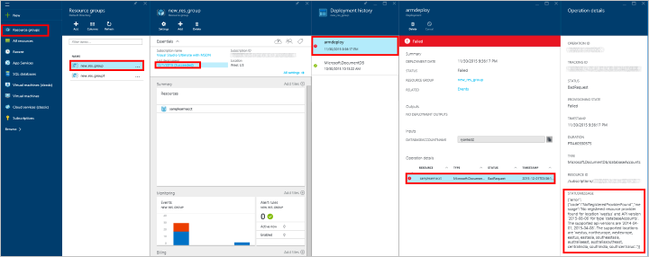

<properties
    pageTitle="Automazione DocumentDB - Gestione risorse - CLI | Microsoft Azure"
    description="Utilizzare i modelli di gestione di risorse Azure o CLI per distribuire un account di database DocumentDB. DocumentDB è un database di NoSQL basato su cloud per i dati JSON."
    services="documentdb"
    authors="mimig1"
    manager="jhubbard"
    editor=""
    tags="azure-resource-manager"
    documentationCenter=""/>

<tags 
    ms.service="documentdb" 
    ms.workload="data-services" 
    ms.tgt_pltfrm="na" 
    ms.devlang="na" 
    ms.topic="article" 
    ms.date="09/28/2016" 
    ms.author="mimig"/>

# Automatizzare la creazione di account DocumentDB utilizzando modelli CLI Azure e gestione di risorse di Azure 

> [AZURE.SELECTOR]
- [Portale di Azure](documentdb-create-account.md)
- [ARM e CLI azure](documentdb-automation-resource-manager-cli.md)

In questo articolo viene illustrato come creare un account Azure DocumentDB con i modelli di gestione di risorse Azure o direttamente con Azure interfaccia riga di comando (CLI). Per creare un account DocumentDB tramite il portale di Azure, vedere [creare un account di database DocumentDB tramite il portale di Azure](documentdb-create-account.md).

Account di database DocumentDB sono attualmente l'unica risorsa DocumentDB creato utilizzando i modelli di Manager delle risorse e CLI Azure.

## Operazioni preliminari

È possibile utilizzare CLI Azure con i gruppi di risorse Azure, è necessario disporre di destra versione CLI Azure e account Azure. Se non si dispone di CLI Azure, [installarlo](../xplat-cli-install.md).

### Aggiornare la versione di Azure CLI

Al prompt dei comandi digitare `azure --version` per verificare se è già stato installato versione 0.10.4 o versione successiva. Si potrebbe essere richiesto di prendere parte alla raccolta di dati di Microsoft Azure CLI in questa fase e selezionare y o n per consenso esplicito o al rifiuto esplicito.

    azure --version
    0.10.4 (node: 4.2.4)

Se la versione in uso non è 0.10.4 o in un secondo momento, è necessario [installare CLI Azure](../xplat-cli-install.md) uno o l'aggiornamento utilizzando uno dei programmi di installazione nativi o tramite **npm** digitando `npm update -g azure-cli` per aggiornare o `npm install -g azure-cli` per l'installazione.

### Configurare l'account Azure e la sottoscrizione

Se non si dispone già di un abbonamento a Azure ma si ha un abbonamento Visual Studio, è possibile attivare i [vantaggi dell'abbonato Visual Studio](https://azure.microsoft.com/pricing/member-offers/msdn-benefits-details/). Oppure è possibile iscriversi per una [versione di valutazione gratuita](https://azure.microsoft.com/pricing/free-trial/).

È necessario disporre di un lavoro o dell'istituto di istruzione account o un'identità di account di Microsoft utilizzo dei modelli di gestione delle risorse Azure. Se si dispone di uno di questi account, digitare il comando seguente:

    azure login

Che genera l'output seguente: 

    info:    Executing command login
  	|info:    To sign in, use a web browser to open the page https://aka.ms/devicelogin. 
    Enter the code E1A2B3C4D to authenticate.

> [AZURE.NOTE] Se non si dispone di un account Azure, viene visualizzato un messaggio di errore che indica che è necessario un altro tipo di account. Per creare uno dal proprio account Azure corrente, vedere [creazione di un lavoro o dell'istituto di istruzione identità di Azure Active Directory](../virtual-machines/virtual-machines-windows-create-aad-work-id.md).

Aprire [https://aka.ms/devicelogin](https://aka.ms/devicelogin) in un browser e immettere il codice specificato nell'output del comando.

Dopo aver immesso il codice, selezionare l'identità che si desidera utilizzare nel browser e specificare il nome utente e la password, se necessario.

Schermata di conferma seguente viene visualizzato quando è stato eseguito l'accesso ed è possibile chiudere la finestra del browser.

Shell di comando vengono forniti anche l'output seguente:

    /info:    Added subscription Visual Studio Ultimate with MSDN
    info:    Setting subscription "Visual Studio Ultimate with MSDN" as default
    +
    info:    login command OK

Oltre il metodo di accesso interattiva qui descritto, sono disponibili altri metodi di accesso CLI Azure. Per ulteriori informazioni sugli altri metodi e informazioni sulla gestione di più abbonamenti, vedere [connettersi a un abbonamento Azure dall'interfaccia della riga di comando Azure Azure CLI ()](../xplat-cli-connect.md).

### Passare alla modalità di gruppo di risorse CLI Azure

Per impostazione predefinita, CLI Azure avvia in modalità di gestione di servizio (modalità**asm** ). Digitare il comando seguente per passare alla modalità di gruppo di risorse.

    azure config mode arm

Che fornisce l'output seguente:

    info:    Executing command config mode
    info:    New mode is arm
    info:    config mode command OK

Se necessario, è possibile passare al gruppo di comandi predefinito digitando `azure config mode asm`.

### Creare o recuperare il gruppo di risorse

Per creare un account DocumentDB, è necessario innanzitutto un gruppo di risorse. Se si conosce il nome del gruppo di risorse che si desidera utilizzare, quindi andare al [passaggio 2](#create-documentdb-account-cli). 

Per esaminare l'elenco di tutti i gruppi di risorse corrente, eseguire il comando seguente e prendere nota del nome del gruppo di risorse si preferisce utilizzare: 

    azure group list

Per creare un gruppo di risorse, eseguire il comando seguente, specificare il nome del nuovo gruppo di risorse per creare e area geografica in cui creare il gruppo di risorse: 

    azure group create <resourcegroupname> <resourcegrouplocation>

 - `<resourcegroupname>`utilizzare solo caratteri alfanumerici, periodi e caratteri di sottolineatura, il '-' caratteri e parentesi e non può terminare con un periodo. 
 - `<resourcegrouplocation>`deve essere una delle aree in cui è in genere disponibile DocumentDB. Nella [pagina delle aree geografiche Azure](https://azure.microsoft.com/regions/#services)viene fornito l'elenco corrente delle aree geografiche.

Esempio input:

    azure group create new_res_group westus

Che genera l'output seguente:

    info:    Executing command group create
    + Getting resource group new_res_group
    + Creating resource group new_res_group
    info:    Created resource group new_res_group
    data:    Id:                  /subscriptions/xxxxxxxx-xxxx-xxxx-xxxx-xxxxxxxxxxxx/resourceGroups/new_res_group
    data:    Name:                new_res_group
    data:    Location:            westus
    data:    Provisioning State:  Succeeded
    data:    Tags: null
    data:
    info:    group create command OK

Se si verificano errori, vedere [risoluzione dei problemi](#troubleshooting). 

## Informazioni sui modelli di Manager delle risorse e gruppi di risorse

La maggior parte delle applicazioni sono costituite da una combinazione di tipi diversi di risorse (ad esempio uno o più account DocumentDB, gli account di archiviazione, una rete virtuale o una rete di distribuzione di contenuti). API di gestione di Azure servizio predefinito e il portale Azure rappresentato questi elementi tramite un approccio dal servizio. Questo approccio è necessario distribuire e gestire i singoli servizi (o trovare altri strumenti che farlo) e non come una singola unità logica di distribuzione.

*Modelli di gestione risorse di Azure* consentono di distribuire e gestire queste risorse diversi come unità di distribuzione logica in modo dichiarativo. Anziché imperativo avvisare Azure gli elementi da distribuire un comando dopo l'altra, descrivere intera distribuzione in un file JSON, ossia tutte le risorse e relativi parametri di configurazione e distribuzione, ossia e indicare Azure per distribuire le risorse come un gruppo.

È possibile ottenere molte altre informazioni sulla risorsa Azure gruppi e le operazioni consentite automaticamente nella [Panoramica di gestione di risorse Azure](../azure-resource-manager/resource-group-overview.md). Se si è interessati per la creazione di modelli, vedere [modelli di creazione condivisa Manager delle risorse di Azure](../resource-group-authoring-templates.md).

## Attività: Creare un account DocumentDB area singola

Usare le istruzioni in questa sezione per creare un account DocumentDB area singola. Questo risultato può essere ottenuto utilizzando CLI Azure con o senza modelli Manager delle risorse.

### Creare un account DocumentDB area singola tramite CLI Azure senza modelli Manager delle risorse

Creare un account DocumentDB nel gruppo di risorse nuovo o esistente, immettere il comando seguente al prompt dei comandi:

> [AZURE.TIP] Se si esegue il comando PowerShell Azure o Windows PowerShell viene visualizzato un errore relativo a un token imprevisto. Se, tuttavia, eseguire il comando Prompt dei comandi di Windows. 

    azure resource create -g <resourcegroupname> -n <databaseaccountname> -r "Microsoft.DocumentDB/databaseAccounts" -o 2015-04-08 -l <resourcegrouplocation> -p "{\"databaseAccountOfferType\":\"Standard\",\"locations\":["{\"locationName\":\"<databaseaccountlocation>\",\"failoverPriority\":\"<failoverPriority>\"}"]}"

 - `<resourcegroupname>`utilizzare solo caratteri alfanumerici, periodi e caratteri di sottolineatura, il '-' caratteri e parentesi e non può terminare con un periodo.
 - `<resourcegrouplocation>`è l'area del gruppo di risorse corrente.
 - `<databaseaccountname>`utilizzare solo lettere, numeri, il '-' caratteri e deve essere compreso tra 3 e 50 caratteri.
 - `<databaseaccountlocation>`deve essere una delle aree in cui è in genere disponibile DocumentDB. Nella [pagina delle aree geografiche Azure](https://azure.microsoft.com/regions/#services)viene fornito l'elenco corrente delle aree geografiche.

Esempio input: 

    azure resource create -g new_res_group -n samplecliacct -r "Microsoft.DocumentDB/databaseAccounts" -o 2015-04-08 -l westus -p "{\"databaseAccountOfferType\":\"Standard\",\"locations\":["{\"locationName\":\"westus\",\"failoverPriority\":\"0\"}"]}"

Come viene completato il provisioning del nuovo account, che genera l'output seguente:

    info:    Executing command resource create
    + Getting resource samplecliacct
    + Creating resource samplecliacct
    info:    Resource samplecliacct is updated
    data:
    data:    Id:        /subscriptions/xxxxxxxx-xxxx-xxxx-xxxx-xxxxxxxxxxxx/resourceGroups/new_res_group/providers/Microsoft.DocumentDB/databaseAccounts/samplecliacct
    data:    Name:      samplecliacct
    data:    Type:      Microsoft.DocumentDB/databaseAccounts
    data:    Parent:
    data:    Location:  West US
    data:    Tags:
    data:
    info:    resource create command OK

Se si verificano errori, vedere [risoluzione dei problemi](#troubleshooting). 

Dopo il comando restituisce, l'account verrà lo stato di **creazione** per alcuni minuti, prima che si trasforma nello stato **Online** in cui è pronto per l'utilizzo. È possibile controllare lo stato dell'account nel [portale di Azure](https://portal.azure.com), su e il **DocumentDB account** .

### Creare un account DocumentDB area singola tramite CLI Azure con i modelli di Manager delle risorse

Le istruzioni disponibili in questa sezione viene descritto come creare un account DocumentDB con un modello di gestione di risorse Azure e un file di parametri facoltativi, che sono file JSON. Utilizzo di un modello consente di descrivere esattamente ciò che desideri ripeterlo senza errori.

Creare un file di modello locale con il seguente contenuto. Nome azuredeploy.json file.

    {
        "$schema": "http://schema.management.azure.com/schemas/2015-01-01/deploymentTemplate.json#",
        "contentVersion": "1.0.0.0",
        "parameters": {
            "databaseAccountName": {
                "type": "string"
            },
            "locationName1": {
                "type": "string"
            }
        },
        "variables": {},
        "resources": [
            {
                "apiVersion": "2015-04-08",
                "type": "Microsoft.DocumentDb/databaseAccounts",
                "name": "[parameters('databaseAccountName')]",
                "location": "[resourceGroup().location]",
                "properties": {
                    "databaseAccountOfferType": "Standard",
                    "locations": [
                        {
                            "failoverPriority": 0,
                            "locationName": "[parameters('locationName1')]"
                        }
                    ]
                }
            }
        ]
    }

Il failoverPriority deve essere impostata su 0, poiché si tratta di un account singola area. FailoverPriority pari a 0 indica che quest'area verranno mantenuti come [scrivere l'area geografica per l'account DocumentDB][scaling-globally]. È possibile immettere il valore nella riga di comando o creare un file di parametri per specificare il valore.

Per creare un file di parametri, copiare il contenuto seguente in un nuovo file e assegnare un nome azuredeploy.parameters.json file. Se si prevede di specificare il nome dell'account database al prompt dei comandi, è possibile continuare senza creare il file.

    {
        "$schema": "http://schema.management.azure.com/schemas/2015-01-01/deploymentParameters.json#",
        "contentVersion": "1.0.0.0",
        "parameters": {
            "databaseAccountName": {
                "value": "samplearmacct"
            },
            "locationName1": {
                "value": "westus"
            }
        }
    }

Nel file azuredeploy.parameters.json, aggiornare il campo valore di `"samplearmacct"` al nome del database a cui si desidera utilizzare, quindi salvare il file. `"databaseAccountName"`utilizzare solo lettere, numeri, il '-' caratteri e deve essere compreso tra 3 e 50 caratteri. Aggiornare il campo valore di `"locationName1"` all'area in cui si desidera creare l'account DocumentDB.

Per creare un account DocumentDB nel gruppo di risorse, eseguire il comando seguente e specificare il percorso del file del modello, il percorso per il file di parametro o il valore del parametro, il nome del gruppo di risorse in cui si desidera distribuire e un nome di distribuzione (-n è facoltativa). 

Per usare un file di parametri:

    azure group deployment create -f <PathToTemplate> -e <PathToParameterFile> -g <resourcegroupname> -n <deploymentname>

 - `<PathToTemplate>`è il percorso del file azuredeploy.json creato nel passaggio 1. Se il nome del percorso contiene spazi, inserire le virgolette doppie questo parametro.
 - `<PathToParameterFile>`è il percorso del file azuredeploy.parameters.json creato nel passaggio 1. Se il nome del percorso contiene spazi, inserire le virgolette doppie questo parametro.
 - `<resourcegroupname>`è il nome del gruppo di risorse esistenti in cui si desidera aggiungere un account di database DocumentDB. 
 - `<deploymentname>`è il nome facoltativo della distribuzione.

Esempio input: 

    azure group deployment create -f azuredeploy.json -e azuredeploy.parameters.json -g new_res_group -n azuredeploy

O per specificare il parametro nome account di database senza un file di parametri e ottenere invece richiesto per il valore, eseguire il comando seguente:

    azure group deployment create -f <PathToTemplate> -g <resourcegroupname> -n <deploymentname>

Input di esempio che mostra il prompt dei comandi e la voce per un account di database denominato samplearmacct:

    azure group deployment create -f azuredeploy.json -g new_res_group -n azuredeploy
    info:    Executing command group deployment create
    info:    Supply values for the following parameters
    databaseAccountName: samplearmacct

Come viene completato il provisioning dell'account, si ricevano le informazioni seguenti: 

    info:    Executing command group deployment create
    + Initializing template configurations and parameters
    + Creating a deployment
    info:    Created template deployment "azuredeploy"
    + Waiting for deployment to complete
    + 
    + 
    info:    Resource 'new_res_group' of type 'Microsoft.DocumentDb/databaseAccounts' provisioning status is Running
    + 
    info:    Resource 'new_res_group' of type 'Microsoft.DocumentDb/databaseAccounts' provisioning status is Succeeded
    data:    DeploymentName     : azuredeploy
    data:    ResourceGroupName  : new_res_group
    data:    ProvisioningState  : Succeeded
    data:    Timestamp          : 2015-11-30T18:50:23.6300288Z
    data:    Mode               : Incremental
    data:    CorrelationId      : 4a5d4049-c494-4053-bad4-cc804d454700
    data:    DeploymentParameters :
    data:    Name                 Type    Value
    data:    -------------------  ------  ------------------
    data:    databaseAccountName  String  samplearmacct
    data:    locationName1        String  westus
    info:    group deployment create command OK

Se si verificano errori, vedere [risoluzione dei problemi](#troubleshooting).  

Dopo il comando restituisce, l'account verrà lo stato di **creazione** per alcuni minuti, prima che si trasforma nello stato **Online** in cui è pronto per l'utilizzo. È possibile controllare lo stato dell'account nel [portale di Azure](https://portal.azure.com), su e il **DocumentDB account** .

## Attività: Creare un account di DocumentDB più aree

DocumentDB è in grado di [distribuire i dati a livello globale] [ distribute-globally] tra diverse [aree geografiche Azure](https://azure.microsoft.com/regions/#services). Quando si crea un account DocumentDB, è possono specificare le aree in cui si desidera il servizio esiste. Usare le istruzioni in questa sezione per creare un account di DocumentDB più aree. Questo risultato può essere ottenuto utilizzando CLI Azure con o senza modelli Manager delle risorse.

### Creare un account di DocumentDB più aree tramite CLI Azure senza modelli Manager delle risorse

Creare un account DocumentDB nel gruppo di risorse nuovo o esistente, immettere il comando seguente al prompt dei comandi:

> [AZURE.TIP] Se si esegue il comando PowerShell Azure o Windows PowerShell viene visualizzato un errore relativo a un token imprevisto. Se, tuttavia, eseguire il comando Prompt dei comandi di Windows. 

    azure resource create -g <resourcegroupname> -n <databaseaccountname> -r "Microsoft.DocumentDB/databaseAccounts" -o 2015-04-08 -l <resourcegrouplocation> -p "{\"databaseAccountOfferType\":\"Standard\",\"locations\":["{\"locationName\":\"<databaseaccountlocation1>\",\"failoverPriority\":\"<failoverPriority1>\"},{\"locationName\":\"<databaseaccountlocation2>\",\"failoverPriority\":\"<failoverPriority2>\"}"]}"

 - `<resourcegroupname>`utilizzare solo caratteri alfanumerici, periodi e caratteri di sottolineatura, il '-' caratteri e parentesi e non può terminare con un periodo.
 - `<resourcegrouplocation>`è l'area del gruppo di risorse corrente.
 - `<databaseaccountname>`utilizzare solo lettere, numeri, il '-' caratteri e deve essere compreso tra 3 e 50 caratteri.
 - `<databaseaccountlocation1>`e `<databaseaccountlocation2>` deve essere aree in cui è in genere disponibile DocumentDB. Nella [pagina delle aree geografiche Azure](https://azure.microsoft.com/regions/#services)viene fornito l'elenco corrente delle aree geografiche.

Esempio input: 

    azure resource create -g new_res_group -n samplecliacct -r "Microsoft.DocumentDB/databaseAccounts" -o 2015-04-08 -l westus -p "{\"databaseAccountOfferType\":\"Standard\",\"locations\":["{\"locationName\":\"westus\",\"failoverPriority\":\"0\"},{\"locationName\":\"eastus\",\"failoverPriority\":\"1\"}"]}"

Come viene completato il provisioning del nuovo account, che genera l'output seguente:

    info:    Executing command resource create
    + Getting resource samplecliacct
    + Creating resource samplecliacct
    info:    Resource samplecliacct is updated
    data:
    data:    Id:        /subscriptions/xxxxxxxx-xxxx-xxxx-xxxx-xxxxxxxxxxxx/resourceGroups/new_res_group/providers/Microsoft.DocumentDB/databaseAccounts/samplecliacct
    data:    Name:      samplecliacct
    data:    Type:      Microsoft.DocumentDB/databaseAccounts
    data:    Parent:
    data:    Location:  West US
    data:    Tags:
    data:
    info:    resource create command OK

Se si verificano errori, vedere [risoluzione dei problemi](#troubleshooting). 

Dopo il comando restituisce, l'account verrà lo stato di **creazione** per alcuni minuti, prima che si trasforma nello stato **Online** in cui è pronto per l'utilizzo. È possibile controllare lo stato dell'account nel [portale di Azure](https://portal.azure.com), su e il **DocumentDB account** .

### Creare un account di DocumentDB più aree tramite CLI Azure con i modelli di Manager delle risorse

Le istruzioni disponibili in questa sezione viene descritto come creare un account DocumentDB con un modello di gestione di risorse Azure e un file di parametri facoltativi, che sono file JSON. Utilizzo di un modello consente di descrivere esattamente ciò che desideri ripeterlo senza errori.

Creare un file di modello locale con il seguente contenuto. Nome azuredeploy.json file.

    {
        "$schema": "http://schema.management.azure.com/schemas/2015-01-01/deploymentTemplate.json#",
        "contentVersion": "1.0.0.0",
        "parameters": {
            "databaseAccountName": {
                "type": "string"
            },
            "locationName1": {
                "type": "string"
            },
            "locationName2": {
                "type": "string"
            }
        },
        "variables": {},
        "resources": [
            {
                "apiVersion": "2015-04-08",
                "type": "Microsoft.DocumentDb/databaseAccounts",
                "name": "[parameters('databaseAccountName')]",
                "location": "[resourceGroup().location]",
                "properties": {
                    "databaseAccountOfferType": "Standard",
                    "locations": [
                        {
                            "failoverPriority": 0,
                            "locationName": "[parameters('locationName1')]"
                        },
                        {
                            "failoverPriority": 1,
                            "locationName": "[parameters('locationName2')]"
                        }
                    ]
                }
            }
        ]
    }

Il file del modello precedente può essere utilizzato per creare un account DocumentDB con due aree. Per creare l'account con più aree, aggiungere alla matrice "posizioni" e aggiungere parametri corrispondenti.

Una delle regioni deve essere presente un valore failoverPriority pari a 0 per indicare che quest'area verranno mantenuti come [scrivere l'area geografica per l'account DocumentDB][scaling-globally]. I valori di priorità di failover devono essere univoci tra le posizioni e il valore di priorità più alto failover deve essere inferiore al numero totale di aree geografiche. È possibile immettere il valore nella riga di comando o creare un file di parametri per specificare il valore.

Per creare un file di parametri, copiare il contenuto seguente in un nuovo file e assegnare un nome azuredeploy.parameters.json file. Se si prevede di specificare il nome dell'account database al prompt dei comandi, è possibile continuare senza creare il file.

    {
        "$schema": "http://schema.management.azure.com/schemas/2015-01-01/deploymentParameters.json#",
        "contentVersion": "1.0.0.0",
        "parameters": {
            "databaseAccountName": {
                "value": "samplearmacct"
            },
            "locationName1": {
                "value": "westus"
            },
            "locationName2": {
                "value": "eastus"
            }
        }
    }

Nel file azuredeploy.parameters.json, aggiornare il campo valore di `"samplearmacct"` al nome del database a cui si desidera utilizzare, quindi salvare il file. `"databaseAccountName"`utilizzare solo lettere, numeri, il '-' caratteri e deve essere compreso tra 3 e 50 caratteri. Aggiornare il campo valore di `"locationName1"` e `"locationName2"` all'area in cui si desidera creare l'account DocumentDB.

Per creare un account DocumentDB nel gruppo di risorse, eseguire il comando seguente e specificare il percorso del file del modello, il percorso per il file di parametro o il valore del parametro, il nome del gruppo di risorse in cui si desidera distribuire e un nome di distribuzione (-n è facoltativa). 

Per usare un file di parametri:

    azure group deployment create -f <PathToTemplate> -e <PathToParameterFile> -g <resourcegroupname> -n <deploymentname>

 - `<PathToTemplate>`è il percorso del file azuredeploy.json creato nel passaggio 1. Se il nome del percorso contiene spazi, inserire le virgolette doppie questo parametro.
 - `<PathToParameterFile>`è il percorso del file azuredeploy.parameters.json creato nel passaggio 1. Se il nome del percorso contiene spazi, inserire le virgolette doppie questo parametro.
 - `<resourcegroupname>`è il nome del gruppo di risorse esistenti in cui si desidera aggiungere un account di database DocumentDB. 
 - `<deploymentname>`è il nome facoltativo della distribuzione.

Esempio input: 

    azure group deployment create -f azuredeploy.json -e azuredeploy.parameters.json -g new_res_group -n azuredeploy

O per specificare il parametro nome account di database senza un file di parametri e ottenere invece richiesto per il valore, eseguire il comando seguente:

    azure group deployment create -f <PathToTemplate> -g <resourcegroupname> -n <deploymentname>

Input di esempio, che mostra il prompt dei comandi e la voce per un account di database denominato samplearmacct:

    azure group deployment create -f azuredeploy.json -g new_res_group -n azuredeploy
    info:    Executing command group deployment create
    info:    Supply values for the following parameters
    databaseAccountName: samplearmacct

Come viene completato il provisioning dell'account, si ricevano le informazioni seguenti: 

    info:    Executing command group deployment create
    + Initializing template configurations and parameters
    + Creating a deployment
    info:    Created template deployment "azuredeploy"
    + Waiting for deployment to complete
    + 
    + 
    info:    Resource 'new_res_group' of type 'Microsoft.DocumentDb/databaseAccounts' provisioning status is Running
    + 
    info:    Resource 'new_res_group' of type 'Microsoft.DocumentDb/databaseAccounts' provisioning status is Succeeded
    data:    DeploymentName     : azuredeploy
    data:    ResourceGroupName  : new_res_group
    data:    ProvisioningState  : Succeeded
    data:    Timestamp          : 2015-11-30T18:50:23.6300288Z
    data:    Mode               : Incremental
    data:    CorrelationId      : 4a5d4049-c494-4053-bad4-cc804d454700
    data:    DeploymentParameters :
    data:    Name                 Type    Value
    data:    -------------------  ------  ------------------
    data:    databaseAccountName  String  samplearmacct
    data:    locationName1        String  westus
    data:    locationName2        String  eastus
    info:    group deployment create command OK

Se si verificano errori, vedere [risoluzione dei problemi](#troubleshooting).  

Dopo il comando restituisce, l'account verrà lo stato di **creazione** per alcuni minuti, prima che si trasforma nello stato **Online** in cui è pronto per l'utilizzo. È possibile controllare lo stato dell'account nel [portale di Azure](https://portal.azure.com), su e il **DocumentDB account** .

## Risoluzione dei problemi

In caso di errori come `Deployment provisioning state was not successful` durante la creazione di account di gruppo o un database delle risorse, si dispone di alcune opzioni di risoluzione dei problemi. 

> [AZURE.NOTE] Fornire caratteri errati nel nome dell'account del database o fornire un percorso in cui non è disponibile DocumentDB causerà errori di distribuzione. Database account nomi è possono utilizzare solo lettere, numeri, il '-' caratteri e deve essere compreso tra 3 e 50 caratteri. Tutti i percorsi di account di database validi sono elencati nella [pagina delle aree geografiche Azure](https://azure.microsoft.com/regions/#services).

- Se l'output contiene le operazioni seguenti `Error information has been recorded to C:\Users\wendy\.azure\azure.err`, quindi esaminare le informazioni sugli errori nel file azure.err.

- Informazioni utili potrebbero risultare nel file di registro del gruppo di risorse. Per visualizzare il file di log, eseguire il comando seguente:

        azure group log show <resourcegroupname> --last-deployment

    Esempio input:

        azure group log show new_res_group --last-deployment

    Per ulteriori informazioni, vedere quindi [distribuzioni di gruppo di risorse di risoluzione dei problemi in Azure](../resource-manager-troubleshoot-deployments-cli.md) .

- Informazioni sugli errori disponibile anche nel portale di Azure come illustrato nella schermata seguente. Per passare a informazioni sugli errori: fare clic su gruppi di risorse di Jumpbar, selezionare il gruppo di risorse con l'errore, quindi in Essentials area della stessa e gruppo risorse fare clic sulla data dell'ultima distribuzione, quindi in e il cronologia distribuzione selezionare distribuzione non riuscita e infine nella distribuzione blade i dati di dettaglio operazione con il punto esclamativo rosso. Viene visualizzato il messaggio di stato per la distribuzione non riuscita in e dettagli il funzionamento. 

     

## Passaggi successivi

Dopo aver creato un account DocumentDB, il passaggio successivo consiste nel creare un database DocumentDB. È possibile creare un database utilizzando una delle operazioni seguenti:

- Il portale di Azure, come descritto in [creare un database DocumentDB tramite il portale di Azure](documentdb-create-database.md).
- Esempi di c# .NET nel progetto [DatabaseManagement](https://github.com/Azure/azure-documentdb-net/tree/master/samples/code-samples/DatabaseManagement) dell'archivio [dotnet di documentdb azure](https://github.com/Azure/azure-documentdb-net/tree/master/samples/code-samples) in GitHub.
- [DocumentDB SDK](https://msdn.microsoft.com/library/azure/dn781482.aspx). DocumentDB .NET, Java, Python, Node e SDK API JavaScript. 

Dopo aver creato il database, è necessario [aggiungere una o più raccolte](documentdb-create-collection.md) a un database, quindi [aggiungere i documenti](documentdb-view-json-document-explorer.md) per gli insiemi di file. 

Dopo avere documenti in una raccolta, è possibile utilizzare [DocumentDB SQL](documentdb-sql-query.md) per [eseguire query](documentdb-sql-query.md#executing-queries) in base ai propri documenti utilizzando [Query Esplora](documentdb-query-collections-query-explorer.md) il portale, l' [API REST](https://msdn.microsoft.com/library/azure/dn781481.aspx)o uno dei [SDK](https://msdn.microsoft.com/library/azure/dn781482.aspx).

Per ulteriori informazioni su DocumentDB, esplorare queste risorse:

-   [Percorso formativo per DocumentDB](https://azure.microsoft.com/documentation/learning-paths/documentdb/)
-   [Concetti e il modello di risorse DocumentDB](documentdb-resources.md)

Per altri modelli che utilizzabili, vedere [Guida introduttiva di Azure modelli](https://azure.microsoft.com/documentation/templates/).

<!--Reference style links - using these makes the source content way more readable than using inline links-->
[distribute-globally]: https://azure.microsoft.com/en-us/documentation/articles/documentdb-distribute-data-globally
[scaling-globally]: https://azure.microsoft.com/en-us/documentation/articles/documentdb-distribute-data-globally/#scaling-across-the-planet