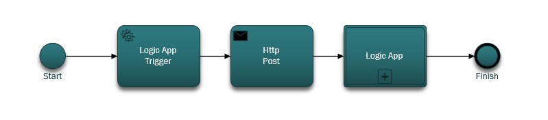

<properties 
    pageTitle="Le notifiche tramite le applicazioni di logica di modifica DocumentDB | Microsoft Azure" 
    description="." 
    keywords="notifica delle modifiche"
    services="documentdb" 
    authors="hedidin" 
    manager="jhubbard" 
    editor="mimig" 
    documentationCenter=""/>

<tags 
    ms.service="documentdb" 
    ms.workload="data-services" 
    ms.tgt_pltfrm="na" 
    ms.devlang="rest-api" 
    ms.topic="article" 
    ms.date="09/23/2016" 
    ms.author="b-hoedid"/>

# <a name="notifications-for-new-or-changed-documentdb-resources-using-logic-apps"></a>Notifiche per le risorse DocumentDB nuove o modificate utilizzando app logica

In questo articolo è stato acquistato da una domanda che ho visto inserito uno dei forum della community DocumentDB Azure. La domanda è stata **DocumentDB che supportano le notifiche per le risorse modificate**?

Se utilizzate con BizTalk Server per anni, si tratta di uno scenario molto comune quando si usa la [Scheda LOB WCF](https://msdn.microsoft.com/library/bb798128.aspx). Pertanto ho deciso di vedere se è possibile duplicare questa funzionalità in DocumentDB per i documenti nuovi e/o modificate.

In questo articolo viene fornita una panoramica dei componenti della soluzione di notifica di modifica, che include un [trigger](documentdb-programming.md#trigger) e un' [App di logica](../app-service-logic/app-service-logic-what-are-logic-apps.md). Importante frammenti di codice sono disponibili all'interno del testo e l'intera soluzione è disponibile in [GitHub](https://github.com/HEDIDIN/DocDbNotifications).

## <a name="use-case"></a>Utilizzare maiuscole/minuscole

Il brano seguente è il caso di utilizzo di questo articolo.

DocumentDB è l'archivio per i documenti di integrità livello sette internazionale (HL7) rapidamente il settore sanitario interoperabilità risorse (FHIR). Si supponga che il database DocumentDB combinati con l'API e App di logica di un Server di FHIR HL7.  Una struttura sanitaria è archiviazione dei dati nel DocumentDB database "Pazienti". Sono disponibili numerosi insiemi all'interno del database pazienti; Clinici, identificazione e così via. Informazioni sui pazienti rientra nel identificazione.  Si dispone di una raccolta denominata "Attesa".

Il cardiologica tiene traccia del personale integrità ed esercizio i dati. Ricerca di nuove o modificate pazienti è molto tempo. Hanno chiesto se si è verificato un modo Impossibile ricevono una notifica per nuove o modificate pazienti il reparto IT.  

Il reparto IT nonostante ciò che potrebbe facilmente forniscono seguente. Sono anche detto i documenti potrebbero push a [Archiviazione Blob Azure](https://azure.microsoft.com/services/storage/) in modo che il cardiologica Impossibile accedere in modo semplice.

## <a name="how-the-it-department-solved-the-problem"></a>Come il reparto IT risolto il problema

Per creare l'applicazione, il reparto IT scelto modellare prima di tutto.  L'aspetto interessante sull'utilizzo di Business Process Model and Notation BPMN () è che tecnici e non può facilmente comprensibile essa. Questo processo di notifica intero viene considerato un processo aziendale. 

## <a name="high-level-view-of-notification-process"></a>Panoramica del processo di notifica

1. Si inizia con un'App di logica che include un trigger timer. Per impostazione predefinita, il trigger viene eseguita ogni ora.
2. Si procedere POST HTTP all'App logica.
3. L'App logica automaticamente tutte le operazioni.



### <a name="lets-take-a-look-at-what-this-logic-app-does"></a>Diamo un'occhiata a che cosa significa questo App logica
Se si osserva figura riportata di seguito sono disponibili diversi passaggi del flusso di lavoro LogicApp.


I passaggi sono i seguenti:

1. È necessario ottenere DateTime UTC corrente da un'App API.  Il valore predefinito è un'ora precedente.

2. Valore DateTime UTC viene convertito in un formato Unix Timestamp. Questo è il formato predefinito per timestamp in DocumentDB.

3. REGISTRARE il valore in un'App API che esegue una DocumentDB query. Viene utilizzato il valore in una query.

    ```SQL
        SELECT * FROM Patients p WHERE (p._ts >= @unixTimeStamp)
    ```

    > [AZURE.NOTE] La _ts rappresenta i metadati TimeStamp per tutte le risorse DocumentDB.

4. Se sono presenti documenti trovati, il corpo della risposta viene inviato allo spazio di archiviazione Blob Azure.

    > [AZURE.NOTE] Archiviazione BLOB richiede un account di archiviazione Azure. È necessario effettuare il provisioning di un account di archiviazione Blob Azure e aggiungere un nuovo Blob denominato pazienti. Per ulteriori informazioni, vedere [gli account di archiviazione su Azure](../storage/storage-create-storage-account.md) e [iniziare a utilizzare archiviazione Blob Azure](../storage/storage-dotnet-how-to-use-blobs.md).

5. Infine, un messaggio di posta elettronica viene inviato che informa il destinatario del numero di documenti che si trovano. Se nessun documento trovato, il corpo del messaggio di posta elettronica è "0 documenti trovato". 

Dopo aver creato un'idea delle funzionalità del flusso di lavoro, diamo un'occhiata la modalità di implementazione.

### <a name="lets-start-with-the-main-logic-app"></a>Iniziamo con l'App logica principale

Se non si ha familiarità con le applicazioni di logica, sono disponibili in [Azure Marketplace](https://portal.azure.com/)e ottenere ulteriori informazioni nelle [quali sono le applicazioni di logica?](../app-service-logic/app-service-logic-what-are-logic-apps.md)

Quando si crea una nuova App logica, verrà richiesto **come si desidera iniziare?**

Quando si fa clic all'interno della casella di testo, è possibile scegliere di eventi. Per questa App logica selezionare **manuale - richiesta HTTP un quando si riceve** come illustrato di seguito.


### <a name="design-view-of-your-completed-logic-app"></a>Visualizzazione struttura dell'App logica completata
Di seguito subito ed esaminare la visualizzazione struttura completa per l'App logica denominato DocDB.


Quando si modificano le azioni nella finestra di progettazione di App logica, è possibile selezionare **output** dalla richiesta HTTP o da versioni della stessa, come illustrato nell'azione sendMail riportata di seguito.


Prima di ogni azione del flusso di lavoro, è possibile prendere una decisione; **Aggiungere un'azione** o **aggiungere una condizione** , come illustrato nella figura seguente.


Se si seleziona **Aggiungi una condizione**, viene visualizzata con una maschera, come illustrato nella figura seguente per immettere la logica.  Si tratta in sostanza, una regola di business.  Se fa clic all'interno di un campo, è possibile scegliere di selezionandolo parametri l'azione precedente. È inoltre possibile immettere direttamente i valori.


> [AZURE.NOTE] È anche la possibilità di immettere tutti gli elementi nella visualizzazione codice.

Esaminiamo un l'App logica completata nella visualizzazione codice.  

```JSON
   
    "$schema": "https://schema.management.azure.com/providers/Microsoft.Logic/schemas/2015-08-01-preview/workflowdefinition.json#",
    "actions": {
        "Conversion": {
            "conditions": [
                {
                    "dependsOn": "GetUtcDate"
                }
            ],
            "inputs": {
                "method": "post",
                "queries": {
                    "currentdateTime": "@{body('GetUtcDate')}"
                },
                "uri": "https://docdbnotificationapi-debug.azurewebsites.net/api/Conversion"
            },
            "metadata": {
                "apiDefinitionUrl": "https://docdbnotificationapi-debug.azurewebsites.net/swagger/docs/v1",
                "swaggerSource": "custom"
            },
            "type": "Http"
        },
        "Createfile": {
            "conditions": [
                {
                    "expression": "@greater(length(body('GetDocuments')), 0)"
                },
                {
                    "dependsOn": "GetDocuments"
                }
            ],
            "inputs": {
                "body": "@body('GetDocuments')",
                "host": {
                    "api": {
                        "runtimeUrl": "https://logic-apis-westus.azure-apim.net/apim/azureblob"
                    },
                    "connection": {
                        "name": "@parameters('$connections')['azureblob']['connectionId']"
                    }
                },
                "method": "post",
                "path": "/datasets/default/files",
                "queries": {
                    "folderPath": "/patients",
                    "name": "Patient_@{guid()}.json"
                }
            },
            "type": "ApiConnection"
        },
        "GetDocuments": {
            "conditions": [
                {
                    "dependsOn": "Conversion"
                }
            ],
            "inputs": {
                "method": "post",
                "queries": {
                    "unixTimeStamp": "@body('Conversion')"
                },
                "uri": "https://docdbnotificationapi-debug.azurewebsites.net/api/Patient"
            },
            "metadata": {
                "apiDefinitionUrl": "https://docdbnotificationapi-debug.azurewebsites.net/swagger/docs/v1",
                "swaggerSource": "custom"
            },
            "type": "Http"
        },
        "GetUtcDate": {
            "conditions": [],
            "inputs": {
                "method": "get",
                "queries": {
                    "hoursBack": "@{int(triggerBody()['GetUtcDate_HoursBack'])}"
                },
                "uri": "https://docdbnotificationapi-debug.azurewebsites.net/api/Authorization"
            },
            "metadata": {
                "apiDefinitionUrl": "https://docdbnotificationapi-debug.azurewebsites.net/swagger/docs/v1",
                "swaggerSource": "custom"
            },
            "type": "Http"
        },
        "sendMail": {
            "conditions": [
                {
                    "dependsOn": "GetDocuments"
                }
            ],
            "inputs": {
                "body": "api_user=@{triggerBody()['sendgridUsername']}&api_key=@{triggerBody()['sendgridPassword']}&from=@{parameters('fromAddress')}&to=@{triggerBody()['EmailTo']}&subject=@{triggerBody()['Subject']}&text=@{int(length(body('GetDocuments')))} Documents Found",
                "headers": {
                    "Content-type": "application/x-www-form-urlencoded"
                },
                "method": "POST",
                "uri": "https://api.sendgrid.com/api/mail.send.json"
            },
            "type": "Http"
        }
    },
    "contentVersion": "1.0.0.0",
    "outputs": {
        "Results": {
            "type": "String",
            "value": "@{int(length(body('GetDocuments')))} Records Found"
        }
    },
    "parameters": {
        "$connections": {
            "defaultValue": {},
            "type": "Object"
        },
        "fromAddress": {
            "defaultValue": "user@msn.com",
            "type": "String"
        },
        "toAddress": {
            "defaultValue": "XXXXX@XXXXXXX.net",
            "type": "String"
        }
    },
    "triggers": {
        "manual": {
            "inputs": {
                "schema": {
                    "properties": {},
                    "required": [],
                    "type": "object"
                }
            },
            "type": "Manual"
        }
    
```

Se non ha familiarità con ciò che rappresenta le diverse sezioni nel codice, è possibile visualizzare la documentazione di [Logica di App del flusso di lavoro Definition Language](http://aka.ms/logicappsdocs) .

Per questo flusso di lavoro si sta utilizzando un [Webhook Trigger HTTP](https://sendgrid.com/blog/whats-webhook/). Se osserva il codice precedente, si vedrà parametri come nell'esempio seguente.

```C#

    =@{triggerBody()['Subject']}

```

Il `triggerBody()` rappresenta i parametri sono incluse nel corpo di un POST resto all'API REST App logica. Il `()['Subject']` rappresenta il campo. Tutti i parametri costituiscono la JSON formattato corpo. 

> [AZURE.NOTE] Utilizzando una latino Web, è possibile avere accesso completo all'intestazione e il corpo della convocazione del trigger. In questa applicazione si desidera che il corpo.

Come detto in precedenza, è possibile utilizzare la finestra di progettazione per assegnare parametri oppure eseguire nella visualizzazione codice.
Se si farebbe in visualizzazione codice, quindi definire le proprietà che richiedono un valore, come illustrato nell'esempio seguente. 

```JSON

    "triggers": {
        "manual": {
            "inputs": {
            "schema": {
                "properties": {
            "Subject": {
                "type" : "String"   

            }
            },
                "required": [
            "Subject"
                 ],
                "type": "object"
            }
            },
            "type": "Manual"
        }
        }
```

Che si sta eseguendo Creazione di uno schema JSON passati dal corpo del POST HTTP.
Per generare i trigger, è necessario un URL di Callback.  Viene spiegato generare in un secondo momento nell'esercitazione.  

## <a name="actions"></a>Azioni
Vediamo che cosa significa ogni azione nell'applicazione logica.

### <a name="getutcdate"></a>GetUTCDate

**Visualizzazione della finestra di progettazione**


**Visualizzazione codice**

```JSON

    "GetUtcDate": {
            "conditions": [],
            "inputs": {
            "method": "get",
            "queries": {
                "hoursBack": "@{int(triggerBody()['GetUtcDate_HoursBack'])}"
            },
            "uri": "https://docdbnotificationapi-debug.azurewebsites.net/api/Authorization"
            },
            "metadata": {
            "apiDefinitionUrl": "https://docdbnotificationapi-debug.azurewebsites.net/swagger/docs/v1"
            },
            "type": "Http"
        },

```

Questa azione HTTP esegue un'operazione di lettura.  Chiama il metodo API APP GetUtcDate. Uri utilizza la proprietà 'GetUtcDate_HoursBack' passata nel corpo del Trigger.  'GetUtcDate_HoursBack' è impostato nell'App logica prima. In un secondo momento nell'esercitazione verranno fornite ulteriori informazioni sull'App logica Trigger.

Questa azione chiama l'App API per restituire il valore di stringa data UTC.

#### <a name="operations"></a>Operazioni

**Richiesta**

```JSON

    {
        "uri": "https://docdbnotificationapi-debug.azurewebsites.net/api/Authorization",
        "method": "get",
        "queries": {
          "hoursBack": "24"
        }
    }

```

**Risposta**

```JSON

    {
        "statusCode": 200,
        "headers": {
          "pragma": "no-cache",
          "cache-Control": "no-cache",
          "date": "Fri, 26 Feb 2016 15:47:33 GMT",
          "server": "Microsoft-IIS/8.0",
          "x-AspNet-Version": "4.0.30319",
          "x-Powered-By": "ASP.NET"
        },
        "body": "Fri, 15 Jan 2016 23:47:33 GMT"
    }

```

Il passaggio successivo consiste nel convertire il valore DateTime UTC il TimeStamp Unix, un tipo double .NET.

### <a name="conversion"></a>Conversione

##### <a name="designer-view"></a>Visualizzazione della finestra di progettazione


##### <a name="code-view"></a>Visualizzazione codice

```JSON

    "Conversion": {
        "conditions": [
        {
            "dependsOn": "GetUtcDate"
        }
        ],
        "inputs": {
        "method": "post",
        "queries": {
            "currentDateTime": "@{body('GetUtcDate')}"
        },
        "uri": "https://docdbnotificationapi-debug.azurewebsites.net/api/Conversion"
        },
        "metadata": {
        "apiDefinitionUrl": "https://docdbnotificationapi-debug.azurewebsites.net/swagger/docs/v1"
        },
        "type": "Http"
    },

```

In questo passaggio si passa il valore restituito dal GetUTCDate.  Esiste una condizione dependsOn, il che significa che l'azione GetUTCDate deve essere completata correttamente. In caso contrario, quindi questa azione è stata ignorata. 

Questa azione chiama l'App API per gestire la conversione.

#### <a name="operations"></a>Operazioni

##### <a name="request"></a>Richiesta

```JSON

    {
        "uri": "https://docdbnotificationapi-debug.azurewebsites.net/api/Conversion",
        "method": "post",
        "queries": {
        "currentDateTime": "Fri, 15 Jan 2016 23:47:33 GMT"
        }
    }   
```

##### <a name="response"></a>Risposta

```JSON

    {
        "statusCode": 200,
        "headers": {
          "pragma": "no-cache",
          "cache-Control": "no-cache",
          "date": "Fri, 26 Feb 2016 15:47:33 GMT",
          "server": "Microsoft-IIS/8.0",
          "x-AspNet-Version": "4.0.30319",
          "x-Powered-By": "ASP.NET"
        },
        "body": 1452901653
    }
```

In azione successiva, viene eseguita un'operazione POST per il nostro App API.

### <a name="getdocuments"></a>GetDocuments 

##### <a name="designer-view"></a>Visualizzazione della finestra di progettazione


##### <a name="code-view"></a>Visualizzazione codice

```JSON

    "GetDocuments": {
        "conditions": [
        {
            "dependsOn": "Conversion"
        }
        ],
        "inputs": {
        "method": "post",
        "queries": {
            "unixTimeStamp": "@{body('Conversion')}"
        },
        "uri": "https://docdbnotificationapi-debug.azurewebsites.net/api/Patient"
        },
        "metadata": {
        "apiDefinitionUrl": "https://docdbnotificationapi-debug.azurewebsites.net/swagger/docs/v1"
        },
        "type": "Http"
    },

```

Per l'azione GetDocuments si intende passare nel corpo della risposta dall'azione conversione. Si tratta di un parametro nell'Uri:

 
```C#

    unixTimeStamp=@{body('Conversion')}

```

L'azione QueryDocuments un'operazione HTTP POST all'API App. 

Il metodo chiamato è **QueryForNewPatientDocuments**.

#### <a name="operations"></a>Operazioni

##### <a name="request"></a>Richiesta

```JSON

    {
        "uri": "https://docdbnotificationapi-debug.azurewebsites.net/api/Patient",
        "method": "post",
        "queries": {
        "unixTimeStamp": "1452901653"
        }
    }
```

##### <a name="response"></a>Risposta

```JSON

    {
        "statusCode": 200,
        "headers": {
        "pragma": "no-cache",
        "cache-Control": "no-cache",
        "date": "Fri, 26 Feb 2016 15:47:35 GMT",
        "server": "Microsoft-IIS/8.0",
        "x-AspNet-Version": "4.0.30319",
        "x-Powered-By": "ASP.NET"
        },
        "body": [
        {
            "id": "xcda",
            "_rid": "vCYLAP2k6gAXAAAAAAAAAA==",
            "_self": "dbs/vCYLAA==/colls/vCYLAP2k6gA=/docs/vCYLAP2k6gAXAAAAAAAAAA==/",
            "_ts": 1454874620,
            "_etag": "\"00007d01-0000-0000-0000-56b79ffc0000\"",
            "resourceType": "Patient",
            "text": {
            "status": "generated",
            "div": "<div>\n      \n      <p>Henry Levin the 7th</p>\n    \n    </div>"
            },
            "identifier": [
            {
                "use": "usual",
                "type": {
                "coding": [
                    {
                    "system": "http://hl7.org/fhir/v2/0203",
                    "code": "MR"
                    }
                ]
                },
                "system": "urn:oid:2.16.840.1.113883.19.5",
                "value": "12345"
            }
            ],
            "active": true,
            "name": [
            {
                    "family": [
                        "Levin"
                    ],
                    "given": [
                        "Henry"
                    ]
                }
            ],
            "gender": "male",
            "birthDate": "1932-09-24",
            "managingOrganization": {
                "reference": "Organization/2.16.840.1.113883.19.5",
                "display": "Good Health Clinic"
            }
        },

```

L'azione successiva consiste nel salvare i documenti per [lo spazio di archiviazione di Azure Blog](https://azure.microsoft.com/services/storage/). 

> [AZURE.NOTE] Archiviazione BLOB richiede un account di archiviazione Azure. È necessario effettuare il provisioning di un account di archiviazione Blob Azure e aggiungere un nuovo Blob denominato pazienti. Per ulteriori informazioni, vedere [Guida introduttiva a archiviazione Blob Azure](../storage/storage-dotnet-how-to-use-blobs.md).

### <a name="create-file"></a>Creare File

##### <a name="designer-view"></a>Visualizzazione della finestra di progettazione


##### <a name="code-view"></a>Visualizzazione codice

```JSON

    {
    "host": {
        "api": {
            "runtimeUrl": "https://logic-apis-westus.azure-apim.net/apim/azureblob"
        },
        "connection": {
            "name": "subscriptions/fxxxxxc079-4e5d-b002-xxxxxxxxxx/resourceGroups/Api-Default-Central-US/providers/Microsoft.Web/connections/azureblob"
        }
    },
    "method": "post",
    "path": "/datasets/default/files",
    "queries": {
        "folderPath": "/patients",
        "name": "Patient_17513174-e61d-4b56-88cb-5cf383db4430.json"
    },
    "body": [
        {
            "id": "xcda",
            "_rid": "vCYLAP2k6gAXAAAAAAAAAA==",
            "_self": "dbs/vCYLAA==/colls/vCYLAP2k6gA=/docs/vCYLAP2k6gAXAAAAAAAAAA==/",
            "_ts": 1454874620,
            "_etag": "\"00007d01-0000-0000-0000-56b79ffc0000\"",
            "resourceType": "Patient",
            "text": {
                "status": "generated",
                "div": "<div>\n      \n      <p>Henry Levin the 7th</p>\n    \n    </div>"
            },
            "identifier": [
                {
                    "use": "usual",
                    "type": {
                        "coding": [
                            {
                                "system": "http://hl7.org/fhir/v2/0203",
                                "code": "MR"
                            }
                        ]
                    },
                    "system": "urn:oid:2.16.840.1.113883.19.5",
                    "value": "12345"
                }
            ],
            "active": true,
            "name": [
                {
                    "family": [
                        "Levin"
                    ],
                    "given": [
                        "Henry"
                    ]
                }
            ],
            "gender": "male",
            "birthDate": "1932-09-24",
            "managingOrganization": {
                "reference": "Organization/2.16.840.1.113883.19.5",
                "display": "Good Health Clinic"
            }
        },

```

Il codice viene generato dall'azione nella finestra di progettazione. Non è necessario modificare il codice.

Se non ha familiarità con l'API di Blob Azure, vedere [Introduzione all'API dello spazio di archiviazione blob Azure](../connectors/connectors-create-api-azureblobstorage.md).

#### <a name="operations"></a>Operazioni

##### <a name="request"></a>Richiesta

```JSON

    "host": {
        "api": {
            "runtimeUrl": "https://logic-apis-westus.azure-apim.net/apim/azureblob"
        },
        "connection": {
            "name": "subscriptions/fxxxxxc079-4e5d-b002-xxxxxxxxxx/resourceGroups/Api-Default-Central-US/providers/Microsoft.Web/connections/azureblob"
        }
    },
    "method": "post",
    "path": "/datasets/default/files",
    "queries": {
        "folderPath": "/patients",
        "name": "Patient_17513174-e61d-4b56-88cb-5cf383db4430.json"
    },
    "body": [
        {
            "id": "xcda",
            "_rid": "vCYLAP2k6gAXAAAAAAAAAA==",
            "_self": "dbs/vCYLAA==/colls/vCYLAP2k6gA=/docs/vCYLAP2k6gAXAAAAAAAAAA==/",
            "_ts": 1454874620,
            "_etag": "\"00007d01-0000-0000-0000-56b79ffc0000\"",
            "resourceType": "Patient",
            "text": {
                "status": "generated",
                "div": "<div>\n      \n      <p>Henry Levin the 7th</p>\n    \n    </div>"
            },
            "identifier": [
                {
                    "use": "usual",
                    "type": {
                        "coding": [
                            {
                                "system": "http://hl7.org/fhir/v2/0203",
                                "code": "MR"
                            }
                        ]
                    },
                    "system": "urn:oid:2.16.840.1.113883.19.5",
                    "value": "12345"
                }
            ],
            "active": true,
            "name": [
                {
                    "family": [
                        "Levin"
                    ],
                    "given": [
                        "Henry"
                    ]
                }
            ],
            "gender": "male",
            "birthDate": "1932-09-24",
            "managingOrganization": {
                "reference": "Organization/2.16.840.1.113883.19.5",
                "display": "Good Health Clinic"
            }
        },….


```

##### <a name="response"></a>Risposta

```JSON

    {
        "statusCode": 200,
        "headers": {
        "pragma": "no-cache",
        "x-ms-request-id": "2b2f7c57-2623-4d71-8e53-45c26b30ea9d",
        "cache-Control": "no-cache",
        "date": "Fri, 26 Feb 2016 15:47:36 GMT",
        "set-Cookie": "ARRAffinity=29e552cea7db23196f7ffa644003eaaf39bc8eb6dd555511f669d13ab7424faf;Path=/;Domain=127.0.0.1",
        "server": "Microsoft-HTTPAPI/2.0",
        "x-AspNet-Version": "4.0.30319",
        "x-Powered-By": "ASP.NET"
        },
        "body": {
        "Id": "0B0nBzHyMV-_NRGRDcDNMSFAxWFE",
        "Name": "Patient_47a2a0dc-640d-4f01-be38-c74690d085cb.json",
        "DisplayName": "Patient_47a2a0dc-640d-4f01-be38-c74690d085cb.json",
        "Path": "/Patient/Patient_47a2a0dc-640d-4f01-be38-c74690d085cb.json",
        "LastModified": "2016-02-26T15:47:36.215Z",
        "Size": 65647,
        "MediaType": "application/octet-stream",
        "IsFolder": false,
        "ETag": "\"c-g_a-1OtaH-kNQ4WBoXLp3Zv9s/MTQ1NjUwMTY1NjIxNQ\"",
        "FileLocator": "0B0nBzHyMV-_NRGRDcDNMSFAxWFE"
        }
    }
```

L'ultimo passaggio consiste nell'inviare un messaggio di notifica

### <a name="sendemail"></a>sendEmail

##### <a name="designer-view"></a>Visualizzazione della finestra di progettazione


##### <a name="code-view"></a>Visualizzazione codice

```JSON


    "sendMail": {
        "conditions": [
        {
            "dependsOn": "GetDocuments"
        }
        ],
        "inputs": {
        "body": "api_user=@{triggerBody()['sendgridUsername']}&api_key=@{triggerBody()['sendgridPassword']}&from=@{parameters('fromAddress')}&to=@{triggerBody()['EmailTo']}&subject=@{triggerBody()['Subject']}&text=@{int(length(body('GetDocuments')))} Documents Found",
        "headers": {
            "Content-type": "application/x-www-form-urlencoded"
        },
        "method": "POST",
        "uri": "https://api.sendgrid.com/api/mail.send.json"
        },
        "type": "Http"
    }
```

In questa operazione si invia una notifica tramite posta elettronica.  Si sta utilizzando [SendGrid](https://sendgrid.com/marketing/sendgrid-services?cvosrc=PPC.Bing.sendgrib&cvo_cid=SendGrid%20-%20US%20-%20Brand%20-%20&mc=Paid%20Search&mcd=BingAds&keyword=sendgrib&network=o&matchtype=e&mobile=&content=&search=1&utm_source=bing&utm_medium=cpc&utm_term=%5Bsendgrib%5D&utm_content=%21acq%21v2%2134335083397-8303227637-1649139544&utm_campaign=SendGrid+-+US+-+Brand+-+%28English%29).   

Il codice per questo stato generato utilizzando un modello per App logica e SendGrid nel [repository Github logica di 101-sendgrid di app](https://github.com/Azure/azure-quickstart-templates/tree/master/101-logic-app-sendgrid).
 
L'operazione HTTP è un POST. 

I parametri di autorizzazione sono le proprietà del trigger

```JSON

    },
        "sendgridPassword": {
             "type": "SecureString"
         },
         "sendgridUsername": {
            "type": "String"
         }

        In addition, other parameters are static values set in the Parameters section of the Logic App. These are:
        },
        "toAddress": {
            "defaultValue": "XXXX@XXXX.com",
            "type": "String"
        },
        "fromAddress": {
            "defaultValue": "XXX@msn.com",
            "type": "String"
        },
        "emailBody": {
            "defaultValue": "@{string(concat(int(length(actions('QueryDocuments').outputs.body)) Records Found),'/n', actions('QueryDocuments').outputs.body)}",
            "type": "String"
        },

```

Il emailBody è la concatenazione il numero di documenti restituiti dalla query, che può essere "0" o più lungo con, "Record trovata". Il resto dei parametri sono impostate dai parametri di Trigger.

Questa azione dipende dall'azione **GetDocuments** .

#### <a name="operations"></a>Operazioni

##### <a name="request"></a>Richiesta
```JSON

    {
        "uri": "https://api.sendgrid.com/api/mail.send.json",
        "method": "POST",
        "headers": {
        "Content-type": "application/x-www-form-urlencoded"
        },
        "body": "api_user=azureuser@azure.com&api_key=Biz@Talk&from=user@msn.com&to=XXXX@XXXX.com&subject=New Patients&text=37 Documents Found"
    }

```

##### <a name="response"></a>Risposta

```JSON

    {
        "statusCode": 200,
        "headers": {
        "connection": "keep-alive",
        "x-Frame-Options": "DENY,DENY",
        "access-Control-Allow-Origin": "https://sendgrid.com",
        "date": "Fri, 26 Feb 2016 15:47:35 GMT",
        "server": "nginx"
        },
        "body": {
        "message": "success"
        }
    }
```

Infine, si vuole essere in grado di visualizzare i risultati dell'App logica nel portale di Azure. A tale scopo, aggiungere un parametro alla sezione output.


```JSON

    "outputs": {
        "Results": {
            "type": "String",
            "value": "@{int(length(actions('QueryDocuments').outputs.body))} Records Found"
        }

```

Restituisce lo stesso valore che viene inviato nel corpo del messaggio di posta elettronica. Nella figura seguente è illustrato un esempio in cui "29 record trovata".


## <a name="metrics"></a>Metrica
È possibile configurare il monitoraggio delle App di logica principale nel portale. In questo modo è possibile visualizzare la latenza eseguire e altri eventi, come illustrato nella figura seguente.


## <a name="docdb-trigger"></a>Trigger DocDb

Questa App logica è il trigger che avvia il flusso di lavoro sull'applicazione di logica principale.

La figura seguente mostra la visualizzazione di progettazione.


```JSON

    {
        "$schema": "https://schema.management.azure.com/providers/Microsoft.Logic/schemas/2015-08-01-preview/workflowdefinition.json#",
        "actions": {
        "Http": {
            "conditions": [],
            "inputs": {
            "body": {
                "EmailTo": "XXXXXX@XXXXX.net",
                "GetUtcDate_HoursBack": "24",
                "Subject": "New Patients",
                "sendgridPassword": "********",
                "sendgridUsername": "azureuser@azure.com"
            },
            "method": "POST",
            "uri": "https://prod-01.westus.logic.azure.com:443/workflows/12a1de57e48845bc9ce7a247dfabc887/triggers/manual/run?api-version=2015-08-01-preview&sp=%2Ftriggers%2Fmanual%2Frun&sv=1.0&sig=ObTlihr529ATIuvuG-dhxOgBL4JZjItrvPQ8PV6973c"
            },
            "type": "Http"
        }
        },
        "contentVersion": "1.0.0.0",
        "outputs": {
        "Results": {
            "type": "String",
            "value": "@{body('Http')['status']}"
        }
        },
        "parameters": {},
        "triggers": {
        "recurrence": {
            "recurrence": {
            "frequency": "Hour",
            "interval": 24
            },
            "type": "Recurrence"
        }
        }
    }

```

Il Trigger è impostato per una ricorrenza di 24 ore. L'azione è un POST HTTP che utilizza l'URL di Callback per l'App logica principale. Il corpo contiene i parametri specificati nello Schema di JSON. 

#### <a name="operations"></a>Operazioni

##### <a name="request"></a>Richiesta

```JSON

    {
        "uri": "https://prod-01.westus.logic.azure.com:443/workflows/12a1de57e48845bc9ce7a247dfabc887/triggers/manual/run?api-version=2015-08-01-preview&sp=%2Ftriggers%2Fmanual%2Frun&sv=1.0&sig=ObTlihr529ATIuvuG-dhxOgBL4JZjItrvPQ8PV6973c",
        "method": "POST",
        "body": {
        "EmailTo": "XXXXXX@XXXXX.net",
        "GetUtcDate_HoursBack": "24",
        "Subject": "New Patients",
        "sendgridPassword": "********",
        "sendgridUsername": "azureuser@azure.com"
        }
    }

```

##### <a name="response"></a>Risposta

```JSON

    {
        "statusCode": 202,
        "headers": {
        "pragma": "no-cache",
        "x-ms-ratelimit-remaining-workflow-writes": "7486",
        "x-ms-ratelimit-burst-remaining-workflow-writes": "1248",
        "x-ms-request-id": "westus:2d440a39-8ba5-4a9c-92a6-f959b8d2357f",
        "cache-Control": "no-cache",
        "date": "Thu, 25 Feb 2016 21:01:06 GMT"
        }
    }
```

Ora esaminiamo l'API App.

## <a name="docdbnotificationapi"></a>DocDBNotificationApi

Sebbene esistano diverse operazioni nell'app, si intende solo utilizzare tre.

* GetUtcDate
* ConvertToTimeStamp
* QueryForNewPatientDocuments

### <a name="docdbnotificationapi-operations"></a>Operazioni DocDBNotificationApi
Esaminiamo la documentazione Swagger

> [AZURE.NOTE] Per poter chiamare le operazioni esternamente, è necessario aggiungere un CORS valore di origine di consentito "*" (senza virgolette) nelle impostazioni dell'App API come illustrato nella figura seguente.


#### <a name="getutcdate"></a>GetUtcDate


#### <a name="converttotimestamp"></a>ConvertToTimeStamp


#### <a name="queryfornewpatientdocuments"></a>QueryForNewPatientDocuments


Esaminiamo il codice questa operazione.

#### <a name="getutcdate"></a>GetUtcDate

```C#

    /// <summary>
    /// Gets the current UTC Date value
    /// </summary>
    /// <returns></returns>
    [H ttpGet]
    [Metadata("GetUtcDate", "Gets the current UTC Date value minus the Hours Back")]
    [SwaggerOperation("GetUtcDate")]
    [SwaggerResponse(HttpStatusCode.OK, type: typeof (string))]
    [SwaggerResponse(HttpStatusCode.InternalServerError, "Internal Server Operation Error")]
    public string GetUtcDate(
       [Metadata("Hours Back", "How many hours back from the current Date Time")] int hoursBack)
    {


        return DateTime.UtcNow.AddHours(-hoursBack).ToString("r");
    }
```

Questa operazione restituisce semplicemente il restituisce DateTime UTC corrente meno il valore di HoursBack.

#### <a name="converttotimestamp"></a>ConvertToTimeStamp

``` C#

        /// <summary>
        ///     Converts DateTime to double
        /// </summary>
        /// <param name="currentdateTime"></param>
        /// <returns></returns>
        [Metadata("Converts Universal DateTime to number")]
        [SwaggerResponse(HttpStatusCode.OK, null, typeof (double))]
        [SwaggerResponse(HttpStatusCode.BadRequest, "DateTime is invalid")]
        [SwaggerResponse(HttpStatusCode.InternalServerError)]
        [SwaggerOperation(nameof(ConvertToTimestamp))]
        public double ConvertToTimestamp(
            [Metadata("currentdateTime", "DateTime value to convert")] string currentdateTime)
        {
            double result;

            try
            {
                var uncoded = HttpContext.Current.Server.UrlDecode(currentdateTime);

                var newDateTime = DateTime.Parse(uncoded);
                //create Timespan by subtracting the value provided from the Unix Epoch
                var span = newDateTime - new DateTime(1970, 1, 1, 0, 0, 0, 0).ToLocalTime();

                //return the total seconds (which is a UNIX timestamp)
                result = span.TotalSeconds;
            }
            catch (Exception e)
            {
                throw new Exception("unable to convert to Timestamp", e.InnerException);
            }

            return result;
        }

```

Questa operazione converte la risposta dall'operazione di GetUtcDate in un valore double.

#### <a name="queryfornewpatientdocuments"></a>QueryForNewPatientDocuments

```C#

        /// <summary>
        ///     Query for new Patient Documents
        /// </summary>
        /// <param name="unixTimeStamp"></param>
        /// <returns>IList</returns>
        [Metadata("QueryForNewDocuments",
            "Query for new Documents where the Timestamp is greater than or equal to the DateTime value in the query parameters."
            )]
        [SwaggerOperation("QueryForNewDocuments")]
        [SwaggerResponse(HttpStatusCode.OK, type: typeof (Task<IList<Document>>))]
        [SwaggerResponse(HttpStatusCode.BadRequest, "The syntax of the SQL Statement is incorrect")]
        [SwaggerResponse(HttpStatusCode.NotFound, "No Documents were found")]
        [SwaggerResponse(HttpStatusCode.InternalServerError, "Internal Server Operation Error")]
        // ReSharper disable once ConsiderUsingAsyncSuffix
        public IList<Document> QueryForNewPatientDocuments(
            [Metadata("UnixTimeStamp", "The DateTime value used to search from")] double unixTimeStamp)
        {
            var context = new DocumentDbContext();
            var filterQuery = string.Format(InvariantCulture, "SELECT * FROM Patient p WHERE p._ts >=  {0}",
                unixTimeStamp);
            var options = new FeedOptions {MaxItemCount = -1};


            var collectionLink = UriFactory.CreateDocumentCollectionUri(DocumentDbContext.DatabaseId,
                DocumentDbContext.CollectionId);

            var response =
                context.Client.CreateDocumentQuery<Document>(collectionLink, filterQuery, options).AsEnumerable();

            return response.ToList();
    }

```

Questa operazione utilizza [DocumentDB.NET SDK](documentdb-sdk-dotnet.md) per creare una query di documento. 

```C#
     CreateDocumentQuery<Document>(collectionLink, filterQuery, options).AsEnumerable();
```

La risposta dall'operazione di ConvertToTimeStamp (unixTimeStamp) viene passata. L'operazione restituisce un elenco dei documenti, `IList<Document>`.

In precedenza sono stati illustrati il CallbackURL. Per avviare il flusso di lavoro nell'applicazione di logica principale, sarà necessario chiamarlo il CallbackURL.

## <a name="callbackurl"></a>CallbackURL

Per iniziare, sarà necessario il Token di Azure Active Directory.  Può essere difficile ottenere questo token. Serve un metodo semplice e Jeff Hollan, che è un'App di logica di Azure program manager, è consigliabile utilizzando [armclient](http://blog.davidebbo.com/2015/01/azure-resource-manager-client.html) in PowerShell.  È possibile installare Office seguendo le istruzioni visualizzate.

Le operazioni che si desidera utilizzare sono chiamare API ARM e accesso.
 
Accesso: Utilizzare le stesse credenziali per l'accesso al portale di Azure. 

L'operazione di chiamare Api ARM è quello che genera il CallBackURL.

In PowerShell, si chiama come indicato di seguito:  

```powershell

    ArmClient.exe post https://management.azure.com/subscriptions/[YOUR SUBSCRIPTION ID/resourcegroups/[YOUR RESOURCE GROUP]/providers/Microsoft.Logic/workflows/[YOUR LOGIC APP NAME/triggers/manual/listcallbackurl?api-version=2015-08-01-preview

```

Visualizzare il risultato dovrebbe risultare analoga alla seguente:

```powershell

    https://prod-02.westus.logic.azure.com:443/workflows/12a1de57e48845bc9ce7a247dfabc887/triggers/manual/run?api-version=2015-08-01-prevaiew&sp=%2Ftriggers%2Fmanual%2Frun&sv=1.0&sig=XXXXXXXXXXXXXXXXXXX

```

È possibile usare uno strumento come [postman](http://www.getpostman.com/) per testare App logica principale come illustrato nella figura seguente.


Nella tabella seguente elenca i parametri di Trigger che compongono la parte dell'App DocDB Trigger logica.

Parametro | Descrizione 
--- | --- 
GetUtcDate_HoursBack | Usato per impostare il numero di ore per la data di inizio di ricerca
sendgridUsername | Usato per impostare il numero di ore per la data di inizio di ricerca
sendgridPassword | Il nome utente per la posta elettronica inviare griglia
E-mail | L'indirizzo di posta elettronica che riceverà la notifica tramite posta elettronica
Oggetto | L'oggetto per la posta elettronica

## <a name="viewing-the-patient-data-in-the-azure-blob-service"></a>Visualizzare i dati dei pazienti nel servizio Blob Azure

Passare al proprio account di archiviazione Azure e selezionare BLOB in servizi come illustrato nella figura seguente.

 

Sarà possibile visualizzare le informazioni sul file blob pazienti, come illustrato di seguito.


## <a name="summary"></a>Riepilogo

In questa procedura dettagliata appreso le operazioni seguenti:

* È possibile implementare notifiche in DocumentDB.
* Utilizzando la logica App, è possibile automatizzare il processo.
* Utilizzando la logica App, è possibile ridurre il tempo che necessario per eseguire un'applicazione.
* Mediante il protocollo HTTP è possibile utilizzare facile un'App API all'interno di un'App di logica.
* È possibile creare facilmente un CallBackURL che sostituisce comunicare ascoltatore HTTP.
* È possibile creare facilmente flussi di lavoro personalizzati con logica App Designer.

Il tasto consiste nel pianificare e il flusso di lavoro del modello.

## <a name="next-steps"></a>Passaggi successivi
Scaricare e usare il codice di logica App fornito su [Github](https://github.com/HEDIDIN/DocDbNotifications). Invito di create sulla base dell'applicazione e inviare le modifiche al repo. 

Per ulteriori informazioni su DocumentDB, visitare il [Percorso di apprendimento](https://azure.microsoft.com/documentation/learning-paths/documentdb/).
