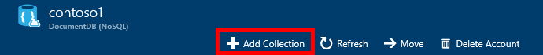

<properties 
    pageTitle="Creare un database di DocumentDB e raccolta | Microsoft Azure" 
    description="Informazioni su come creare i database NoSQL e raccolte documenti JSON tramite il portale di servizio online per DocumentDB Azure, database documento basato su un'area. È possibile ottenere una versione di valutazione." 
    services="documentdb" 
    authors="mimig1" 
    manager="jhubbard" 
    editor="monicar" 
    documentationCenter=""/>

<tags 
    ms.service="documentdb" 
    ms.workload="data-services" 
    ms.tgt_pltfrm="na" 
    ms.devlang="na" 
    ms.topic="article" 
    ms.date="10/17/2016" 
    ms.author="mimig"/>

# Come creare un insieme di DocumentDB e un database tramite il portale di Azure

Per utilizzare Microsoft Azure DocumentDB, è necessario disporre di un [account DocumentDB](documentdb-create-account.md), un database, una raccolta e documenti. In questo argomento viene illustrato come creare un insieme di DocumentDB nel portale di Azure. 

Se non si sa quale insieme è? Vedere [che cos'è un insieme di DocumentDB?](#what-is-a-documentdb-collection)

1.  Nel [portale di Azure](https://portal.azure.com/), in Jumpbar, fare clic su **DocumentDB (NoSQL)**e quindi selezionare l'account a cui aggiungere un insieme e il **DocumentDB (NoSQL)** . Se non si dispone di tutti gli account elencati, è necessario [creare un account DocumentDB](documentdb-create-account.md).

    
    
    Se non è visibile nella Jumpbar **DocumentDB (NoSQL)** , fare clic su **Altri servizi** e quindi fare clic su **DocumentDB (NoSQL)**. Se non si dispone di tutti gli account elencati, è necessario [creare un account DocumentDB](documentdb-create-account.md).

2. In blade **DocumentDB account** per il conto selezionato, fare clic su **Aggiungi raccolta**.

    

3. In e **l'Aggiungi raccolta** , nella casella **ID** immettere l'ID per la nuova raccolta. Nomi di insieme deve essere compreso tra 1 e 255 caratteri e non può contenere `/ \ # ?` o uno spazio finale. Quando il nome viene convalidato, nella casella ID viene visualizzato un segno di spunta verde.

    

4. Per impostazione predefinita, i **Prezzi livello** è impostata su **Standard** in modo che è possibile personalizzare la velocità e lo spazio di archiviazione per la raccolta. Per ulteriori informazioni sui prezzo livello, vedere [livelli di prestazioni in DocumentDB](documentdb-performance-levels.md).  

5. Selezionare una **modalità di partizionamento** per la raccolta, **Singola partizione** o **partizionati**. 

    Una **singola partizione** ha una capacità di archiviazione riservata di 10 GB e possono includere i livelli di velocità da unità richiesta 400 10.000/secondo (RU/s). Una RU corrisponde alla velocità di lettura di un documento di 1KB. Per ulteriori informazioni sulle unità richiesta, vedere [unità richiesta](documentdb-request-units.md). 

    Una **raccolta partizionata** possibile scalare per una quantità illimitata di spazio di archiviazione su più partizioni e può avere livelli di velocità partire da 10,100 RU/s. Nel portale di archiviazione più grande che possibile prenotare è 250 GB e la maggior parte delle velocità che è possibile prenotare è 250.000 RU/s. Per aumentare la quota uno dei due, inviare una richiesta come descritto nella [richiesta maggiore DocumentDB le quote di account](documentdb-increase-limits.md). Per ulteriori informazioni sulle raccolte partizionate, vedere [singola partizione e raccolte partizionata](documentdb-partition-data.md#single-partition-and-partitioned-collections).

    Per impostazione predefinita, la velocità di una nuova raccolta singola partizione è impostata a 1000 RU/s con una capacità di archiviazione di 10 GB. Per una raccolta partizionata, la velocità di raccolta è impostata su 10100 RU/s con una capacità di archiviazione di 250 GB. Dopo aver creata la raccolta, è possibile modificare la velocità e lo spazio di archiviazione per la raccolta. 

6. Se si sta creando un insieme partizionato, selezionare la **Chiave di partizione** per la raccolta. È importante per creare un insieme di efficienti selezionare la chiave partizione corretta. Per ulteriori informazioni sulla selezione di una chiave di partizione, vedere [Progettazione per partizioni](documentdb-partition-data.md#designing-for-partitioning).

7. In e il **Database** , creare un nuovo database o utilizzarne uno esistente. Nomi di database deve essere compreso tra 1 e 255 caratteri e non può contenere `/ \ # ?` o uno spazio finale. Per convalidare il nome, fare clic all'esterno della casella di testo. Quando il nome viene convalidato, viene visualizzato un segno di spunta verde nella casella.

8. Fare clic su **OK** nella parte inferiore dello schermo per creare la nuova raccolta. 

9. A questo punto la nuova raccolta viene visualizzata nel lens **raccolte** in e il **Panoramica** .
 
    

10. **Facoltativo:** Per modificare la velocità della raccolta nel portale, fare clic su **scala** nel menu delle risorse. 

    

## Che cos'è un insieme di DocumentDB? 

Una raccolta è un contenitore di documenti JSON e la logica dell'applicazione JavaScript associata. Una raccolta è un'entità fatturabile, in cui il [costo](documentdb-performance-levels.md) dipende dalla velocità provisioning della raccolta. Insiemi estesi a uno o più partizioni/server che possono essere personalizzate per gestire volumi praticamente illimitati di spazio di archiviazione o effettiva.

Le raccolte vengono automaticamente suddivise in uno o più server fisici da DocumentDB. Quando si crea una raccolta, è possibile specificare la velocità di provisioning in termini di unità richiesta al secondo e una proprietà chiave partizione. Il valore di questa proprietà verrà utilizzato da DocumentDB per distribuire i documenti tra partizioni e indirizzare le richieste come query. Il valore di chiave partizione funge anche dal limite di transazione per stored procedure e trigger. Ogni raccolta è presente una quantità riservata di velocità specifico a tale raccolta, non vengono condivisi con altre raccolte nello stesso account. Di conseguenza, è possibile ridimensionare dell'applicazione in termini di spazio di archiviazione e la velocità di trasmissione. 

Raccolte non corrispondono tabelle nei database relazionali. Raccolte non applicano schema, in realtà DocumentDB non vengono applicate gli schemi, si tratta di un database senza schema. Pertanto è possibile memorizzare diversi tipi di documenti con schemi diversi nella stessa raccolta. È possibile scegliere di utilizzare raccolte per memorizzare gli oggetti di un unico tipo come si farebbe con tabelle. Il modello migliore dipende dal solo il visualizzazione dei dati insieme nelle query e transazioni.

## Altri modi per creare un insieme di DocumentDB

Non è necessario creare tramite il portale di raccolte, è anche possibile creare mediante [DocumentDB SDK](documentdb-sdk-dotnet.md) e le API REST. 

- Per un esempio di codice c#, vedere gli [esempi di insieme c#](documentdb-dotnet-samples.md#collection-examples). 
- Per un esempio di codice Node, vedere gli [esempi di raccolta Node](documentdb-nodejs-samples.md#collection-examples).
- Per un esempio di codice Python, vedere [esempi di raccolta Python](documentdb-python-samples.md#collection-examples).
- Per un esempio di API REST, vedere [creare una raccolta](https://msdn.microsoft.com/library/azure/mt489078.aspx).

## Risoluzione dei problemi

Se **Aggiungi raccolta** è disattivato nel portale di Azure, significa che l'account è disattivato, che in genere si verifica quando vengono utilizzati tutti i crediti vantaggi per il mese.   

## Passaggi successivi

Dopo aver creato una raccolta, il passaggio successivo è per aggiungere documenti o importare la raccolta documenti. Quando si tratta di aggiunta di documenti a una raccolta, sono disponibili alcune opzioni:

- È possibile [aggiungere documenti](documentdb-view-json-document-explorer.md) utilizzando Esplora aree di documento nel portale.
- È possibile [importare documenti e dati](documentdb-import-data.md) utilizzando lo strumento di migrazione di dati DocumentDB, che consente di importare file CSV e JSON, come dati di SQL Server, MongoDB, archiviazione tabelle Azure e altre raccolte di DocumentDB. 
- Oppure è possibile aggiungere documenti utilizzando uno dei [DocumentDB SDK](documentdb-sdk-dotnet.md). DocumentDB .NET, Java, Python, Node e SDK API JavaScript. Per esempi di codice c# che mostra come lavorare con documenti utilizzando DocumentDB .NET SDK, vedere gli [esempi di documento c#](documentdb-dotnet-samples.md#document-examples). Per esempi di codice Node che mostra come usare i documenti utilizzando DocumentDB Node SDK, vedere gli [esempi di documento Node](documentdb-nodejs-samples.md#document-examples).

Dopo avere documenti in una raccolta, è possibile utilizzare [DocumentDB SQL](documentdb-sql-query.md) per [eseguire query](documentdb-sql-query.md#executing-queries) in base ai propri documenti utilizzando [Query Esplora](documentdb-query-collections-query-explorer.md) il portale, l' [API REST](https://msdn.microsoft.com/library/azure/dn781481.aspx)o uno dei [SDK](documentdb-sdk-dotnet.md). 
