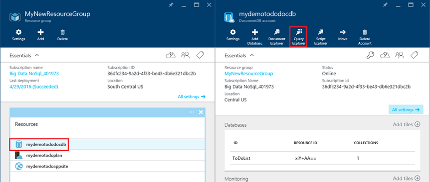
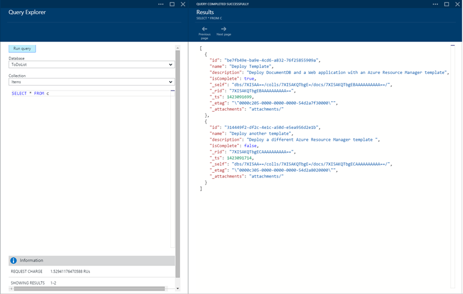
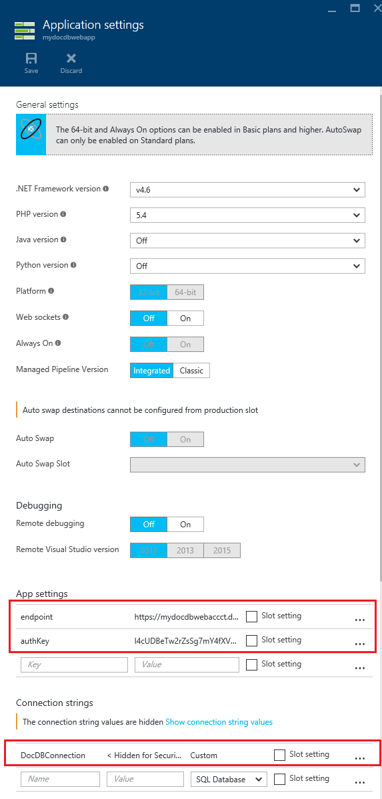

<properties 
    pageTitle="Distribuire DocumentDB e Azure App servizio Web Apps utilizzando un modello di gestione risorse Azure | Microsoft Azure" 
    description="Informazioni su come distribuire un account DocumentDB, Azure App servizio Web App e un'applicazione web di esempio utilizzando un modello di gestione di risorse Azure." 
    services="documentdb, app-service\web" 
    authors="h0n" 
    manager="jhubbard" 
    editor="monicar" 
    documentationCenter=""/>

<tags 
    ms.service="documentdb" 
    ms.workload="data-services" 
    ms.tgt_pltfrm="na" 
    ms.devlang="na" 
    ms.topic="article" 
    ms.date="08/02/2016" 
    ms.author="hawong"/>

# Distribuire DocumentDB e utilizzando un modello di gestione risorse Azure Azure App servizio Web Apps

In questa esercitazione viene illustrato come utilizzare un modello di gestione di risorse Azure per distribuire e integrare [Microsoft Azure DocumentDB](https://azure.microsoft.com/services/documentdb/), un [Servizio di Azure App](http://go.microsoft.com/fwlink/?LinkId=529714) web app e un'applicazione web di esempio.

Utilizzare i modelli di Manager delle risorse di Azure, è possibile automatizzare facilmente la distribuzione e configurazione delle risorse di Azure.  In questa esercitazione viene illustrato come distribuire un'applicazione web e configurare automaticamente informazioni di connessione DocumentDB account.

Al termine di questa esercitazione, sarà possibile rispondere alle domande seguenti:  

-   Come è possibile utilizzare un modello di gestione di risorse Azure per distribuire e integrare un account DocumentDB e un'app web nel servizio di Azure App?
-   Come è possibile utilizzare un modello di gestione di risorse Azure per distribuire e integrare un account DocumentDB, un'app web nelle App servizio Web App e un'applicazione Webdeploy?

## Prerequisiti
> [AZURE.TIP] Mentre in questa esercitazione non assume precedente esperienza con i modelli di gestione di risorse Azure o JSON, se lo si desidera modificare le opzioni di distribuzione, modelli di cui si fa riferimento quindi una conoscenza di ognuna di queste aree devono avvenire.

Prima di seguire le istruzioni in questa esercitazione, verificare di disporre le operazioni seguenti:

- Un abbonamento Azure. Azure è una piattaforma basata su abbonamento.  Per ulteriori informazioni su come ottenere una sottoscrizione, vedere [Le opzioni di acquisto](https://azure.microsoft.com/pricing/purchase-options/), [Membro offre](https://azure.microsoft.com/pricing/member-offers/)o [Versione di valutazione gratuita](https://azure.microsoft.com/pricing/free-trial/).

##Passaggio 1: Scaricare i file di modello ##
Per iniziare, il download dei file di modello che verrà usata in questa esercitazione.

1. Scaricare il modello di [creare un account di DocumentDB Web Apps e distribuire un esempio di applicazione demo](https://portalcontent.blob.core.windows.net/samples/DocDBWebsiteTodo.json) in una cartella locale (ad esempio C:\DocumentDBTemplates). Questo modello verrà distribuito un account DocumentDB, un servizio di App web app e un'applicazione web.  Verrà automaticamente configurato l'applicazione web per connettersi all'account di DocumentDB.

2. Scaricare il modello [Crea un account DocumentDB e App Web di esempio](https://portalcontent.blob.core.windows.net/samples/DocDBWebSite.json) in una cartella locale (ad esempio C:\DocumentDBTemplates). Questo modello verrà distribuito un account DocumentDB, un'app web di servizio di App e modificherà le impostazioni dell'applicazione del sito per superficie facilmente le informazioni di connessione DocumentDB, ma non include un'applicazione web.  

##Passaggio 2: Distribuire dell'account DocumentDB, l'applicazione servizio web app e demo esempio di applicazione

A questo punto si distribuisce il primo modello.

> [AZURE.TIP] Il modello non verificare che il nome dell'app web e il nome di account DocumentDB immesse sotto siano) valide e b) disponibili.  Si consiglia di verificare la disponibilità di nomi che si prevede di fornire prima di inviare la distribuzione.

1. Accesso al [Portale di Azure](https://portal.azure.com), fare clic su Nuovo e cercare "La distribuzione dei modelli".
    

2. Selezionare l'elemento di distribuzione di modello e fare clic su **Crea**
    

3.  Fare clic su **Modifica modello**, incollare il contenuto del file di modello DocDBWebsiteTodo.json e fare clic su **Salva**.
    

4. Fare clic su **Modifica i parametri**, fornire i valori per ognuno dei parametri obbligatori e fare clic su **OK**.  I parametri sono i seguenti:

    1. NOMESITO: Consente di specificare il nome dell'applicazione del servizio web app e viene utilizzata per creare l'URL che verrà utilizzato per accedere all'app web (ad esempio, se si specifica "mydemodocdbwebapp", quindi l'URL per il quale si accederà app web sarà mydemodocdbwebapp.azurewebsites.net).

    2. HOSTINGPLANNAME: Consente di specificare il nome del piano di hosting di servizi di App per creare.

    3. POSIZIONE: Consente di specificare la posizione in cui si desidera creare la DocumentDB e web app risorse Azure.

    4. DATABASEACCOUNTNAME: Consente di specificare il nome dell'account DocumentDB da creare.   

    

5. Scegliere un gruppo di risorse esistente o fornire un nome per creare un nuovo gruppo di risorse e scegliere un percorso per il gruppo di risorse.
    
  
6.  Fare clic su **note legali revisione**, **acquisto**e quindi fare clic su **Crea** per iniziare la distribuzione.  Selezionare **Aggiungi a dashboard** non è facilmente visibile nella pagina home del portale Azure distribuzione risultante.
    

7.  Al termine del processo di distribuzione, verrà aperto e il gruppo delle risorse.
      

8.  Per usare l'applicazione, è sufficiente passare a URL web app (nell'esempio precedente, l'URL sarebbero http://mydemodocdbwebapp.azurewebsites.net).  Verrà visualizzata l'applicazione web seguenti:

    

9. Procedere e creare un paio di attività in web app e quindi tornare a e il gruppo di risorse nel portale di Azure. Fare clic sulla risorsa account DocumentDB nell'elenco risorse e quindi fare clic su **Esplora Query**.
      

10. Eseguire la query predefinita, "SELECT *da c" ed esaminare i risultati.  Si noti che la query ha recuperato la rappresentazione JSON elementi todo creato nel passaggio 7 riportato sopra.  È possibile sperimentare l'utilizzo delle query. ad esempio, provare a eseguire selezionare* da c.isComplete dove c = true per restituire tutti gli elementi todo contrassegnato come completati.

    

11. È possibile esplorare l'esperienza di portale DocumentDB o modificare l'applicazione Todo di esempio.  Quando si è pronti, si distribuisce un altro modello.
    
 
## Passaggio 3: Distribuire il campione documento account e web app

A questo punto si distribuisce il secondo modello.  Questo modello è utile per mostrare come è possibile inserire le informazioni di connessione DocumentDB, ad esempio endpoint account e la chiave master in un'app web, come le impostazioni dell'applicazione o una stringa di connessione personalizzata. Ad esempio, ad esempio avere la propria applicazione web che si desidera distribuire con un account DocumentDB e le informazioni di connessione automaticamente durante la distribuzione.

> [AZURE.TIP] Il modello non verificare che il nome dell'app web e il nome di account DocumentDB immesse sotto siano) valide e b) disponibili.  Si consiglia di verificare la disponibilità di nomi che si prevede di fornire prima di inviare la distribuzione.

1. Nel [Portale di Azure](https://portal.azure.com), fare clic su Nuovo e cercare "La distribuzione dei modelli".
    

2. Selezionare l'elemento di distribuzione di modello e fare clic su **Crea**
    

3.  Fare clic su **Modifica modello**, incollare il contenuto del file di modello DocDBWebSite.json e fare clic su **Salva**.
    

4. Fare clic su **Modifica i parametri**, fornire i valori per ognuno dei parametri obbligatori e fare clic su **OK**.  I parametri sono i seguenti:

    1. NOMESITO: Consente di specificare il nome dell'applicazione del servizio web app e viene utilizzata per creare l'URL che verrà utilizzato per accedere all'app web (ad esempio, se si specifica "mydemodocdbwebapp", quindi l'URL per il quale si accederà app web sarà mydemodocdbwebapp.azurewebsites.net).

    2. HOSTINGPLANNAME: Consente di specificare il nome del piano di hosting di servizi di App per creare.

    3. POSIZIONE: Consente di specificare la posizione in cui si desidera creare la DocumentDB e web app risorse Azure.

    4. DATABASEACCOUNTNAME: Consente di specificare il nome dell'account DocumentDB da creare.   

    

5. Scegliere un gruppo di risorse esistente o fornire un nome per creare un nuovo gruppo di risorse e scegliere un percorso per il gruppo di risorse.
    
  
6.  Fare clic su **note legali revisione**, **acquisto**e quindi fare clic su **Crea** per iniziare la distribuzione.  Selezionare **Aggiungi a dashboard** non è facilmente visibile nella pagina home del portale Azure distribuzione risultante.
    

7.  Al termine del processo di distribuzione, verrà aperto e il gruppo delle risorse.
      

8. Fare clic su risorsa Web App nell'elenco risorse e quindi fare clic su **Impostazioni applicazione**
      

9. Nota sono presenti per l'endpoint DocumentDB e ognuna delle chiavi master DocumentDB le impostazioni dell'applicazione.
      

10. È possibile continuare a esplorare il portale di Azure o eseguire una delle nostro DocumentDB [esempi](http://go.microsoft.com/fwlink/?LinkID=402386) per creare un'applicazione DocumentDB.

    
    

## Passaggi successivi

Congratulazioni! È stato distribuito DocumentDB servizio App web app e un'applicazione web di esempio utilizzando i modelli di gestione di risorse Azure.

- Per ulteriori informazioni su DocumentDB, fare clic [qui](http://azure.com/docdb).
- Per ulteriori informazioni sulle App Azure App servizio Web, fare clic [qui](http://go.microsoft.com/fwlink/?LinkId=325362).
- Per ulteriori informazioni sui modelli di Manager delle risorse di Azure, fare clic [qui](https://msdn.microsoft.com/library/azure/dn790549.aspx).

## Novità
* Per una Guida per la modifica da siti Web al servizio App vedere: [servizio App Azure e il relativo impatto sulla esistente servizi di Windows Azure](http://go.microsoft.com/fwlink/?LinkId=529714)
* Per una Guida per la modifica del portale di vecchio al nuovo portale vedere: [Guida di riferimento per lo spostamento portale classica di Azure](http://go.microsoft.com/fwlink/?LinkId=529715)

>[AZURE.NOTE] Se si desidera iniziare a utilizzare il servizio di App Azure prima di iscriversi a un account Azure, accedere al [Servizio App provare](http://go.microsoft.com/fwlink/?LinkId=523751), in cui è possibile creare immediatamente un'app web starter breve nel servizio di App. Nessun carte di credito obbligatorio; Nessun impegni.
 
