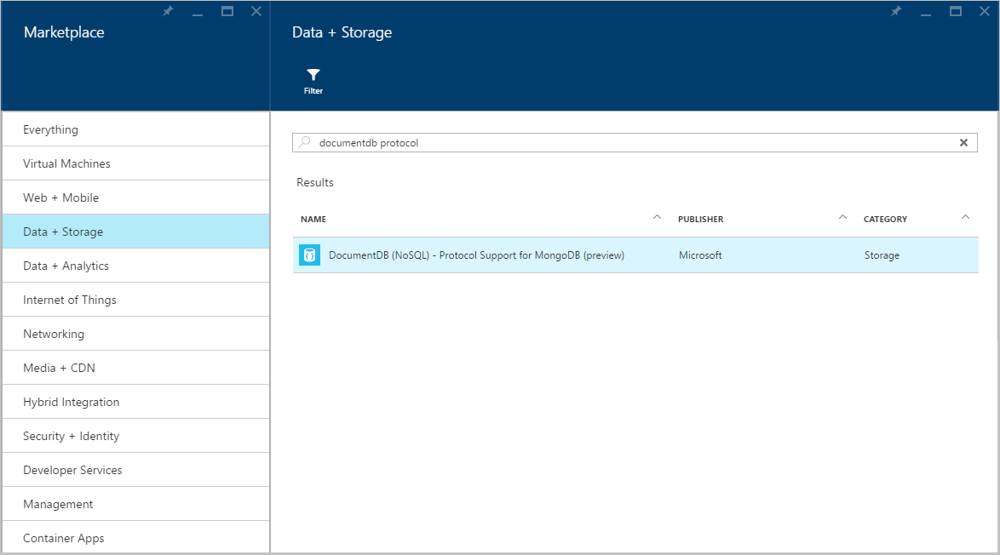

<properties 
    pageTitle="Creare un account DocumentDB con supporto del protocollo per MongoDB | Microsoft Azure" 
    description="Informazioni su come creare un account DocumentDB con supporto del protocollo per MongoDB, ora disponibile per l'anteprima." 
    services="documentdb" 
    authors="AndrewHoh" 
    manager="jhubbard" 
    editor="" 
    documentationCenter=""/>

<tags 
    ms.service="documentdb" 
    ms.workload="data-services" 
    ms.tgt_pltfrm="na" 
    ms.devlang="na" 
    ms.topic="article" 
    ms.date="10/20/2016" 
    ms.author="anhoh"/>

# Come creare un account DocumentDB con supporto del protocollo per MongoDB tramite il portale di Azure

Per creare un account Azure DocumentDB con supporto del protocollo per MongoDB, è necessario:

- Ha un account Azure. Se non è già disponibile, è possibile ottenere un [account Azure gratuito](https://azure.microsoft.com/free/) .

## Creare l'account  

Per creare un account DocumentDB con supporto del protocollo per MongoDB, procedere come segue.

1. In una nuova finestra, accedere al [Portale di Azure](https://portal.azure.com).
2. Fare clic su **Nuovo**, fare clic su **dati + spazio di archiviazione**, fare clic su **Visualizza tutto**e quindi cercare la categoria di **dati + spazio di archiviazione** per "Protocollo DocumentDB". Fare clic su **DocumentDB - supporto protocollo per MongoDB**.

    

3. In alternativa, nella categoria **dati + spazio di archiviazione** , in sistema di **archiviazione**, fare clic su **altro**e quindi fare clic su **Carica più** una o più volte per visualizzare **DocumentDB - supporto protocollo per MongoDB**. Fare clic su **DocumentDB - supporto protocollo per MongoDB**.

    

4. In e il **DocumentDB - supporto protocollo per MongoDB (preview)** , fare clic su **Crea** per avviare il processo di iscrizione a anteprima.

    

5. Selezionare **iscriversi per visualizzare in anteprima**e il **DocumentDB account** . Leggere le informazioni e quindi fare clic su **OK**.

    

6.  Dopo aver accettato le condizioni per l'anteprima, verrà restituito e il crea.  Nella finestra e **DocumentDB account** , specificare la configurazione desiderata per l'account.

    

    - Nella casella **ID** immettere un nome per identificare il conto.  Quando l' **ID** viene convalidata, nella casella **ID** viene visualizzato un segno di spunta verde. Il valore di **ID** diventa il nome host all'interno di URI. L' **ID** può contenere solo lettere minuscole lettere, numeri e i '-' caratteri e deve essere compreso tra 3 e 50 caratteri. Si noti che *documents.azure.com* viene aggiunto al nome dell'endpoint che si sceglie, il cui risultato diventa l'endpoint di account.

    - Per l' **abbonamento**, selezionare l'abbonamento Azure che si desidera utilizzare per l'account. Se l'account ha un solo abbonamento, tale account sia selezionata per impostazione predefinita.

    - Nel **Gruppo di risorse**, selezionare o creare un gruppo di risorse per l'account.  Per impostazione predefinita, verrà scelto un gruppo di risorse esistente in abbonamento Azure.  È possibile, tuttavia selezionare questa opzione per creare un nuovo gruppo di risorse a cui si desidera aggiungere l'account. Per ulteriori informazioni, vedere [tramite il portale di Azure per gestire le risorse Azure](resource-group-portal.md).

    - Utilizzare **posizione** per specificare l'area geografica in cui pubblicare l'account.
    
    - Facoltativo: Controllo **Aggiungi a dashboard**. Se bloccato a dashboard, seguire **il passaggio 8** riportata di seguito per visualizzare spostamento a sinistra del nuovo account.

7.  Dopo aver configurate le nuove opzioni di account, fare clic su **Crea**.  È possibile richiedere alcuni minuti per creare l'account.  Se aggiunte al dashboard, è possibile monitorare il provisioning dello stato di avanzamento di Startboard.  
      

    Se non è bloccato a dashboard, è possibile monitorare l'avanzamento dall'hub notifiche.  

      

    

8.  Per accedere all'account di nuovo, fare clic su **DocumentDB (NoSQL)** nel menu a sinistra. Nell'elenco di regolare DocumentDB e DocumentDB con un account di supporto protocollo Mongo, fare clic sul nome del nuovo account.

9.  È ora pronto per l'uso con le impostazioni predefinite. 

    
    

## Passaggi successivi

- Informazioni su come [connettersi](documentdb-connect-mongodb-account.md) a un account DocumentDB con protocollo di supporto per MongoDB.

 
