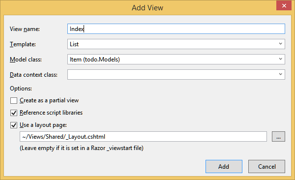

<properties 
    pageTitle="Esercitazione ASP.NET MVC per DocumentDB: sviluppo di applicazioni Web | Microsoft Azure" 
    description="Esercitazione su MVC ASP.NET per creare un'applicazione web MVC utilizzando DocumentDB. È necessario archiviare JSON e accedere ai dati da un'app todo ospitata in siti Web Azure - esercitazione ASP NET MVC passo dopo passo." 
    keywords="esercitazione mvc ASP.NET, sviluppo di applicazioni web, applicazione web mvc, asp mvc netto esercitazione passo dopo passo"
    services="documentdb" 
    documentationCenter=".net" 
    authors="syamkmsft" 
    manager="jhubbard" 
    editor="cgronlun"/>

<tags 
    ms.service="documentdb" 
    ms.workload="data-services" 
    ms.tgt_pltfrm="na" 
    ms.devlang="dotnet" 
    ms.topic="hero-article" 
    ms.date="08/25/2016" 
    ms.author="syamk"/>

# ASP.NET MVC esercitazione: Sviluppo di applicazioni Web con DocumentDB

> [AZURE.SELECTOR]
- [.NET](documentdb-dotnet-application.md)
- [Node](documentdb-nodejs-application.md)
- [Java](documentdb-java-application.md)
- [Python](documentdb-python-application.md) 

Per evidenziare query JSON documenti e come è possibile utilizzare in modo efficiente DocumentDB Azure per archiviare, in questo articolo fornisce una panoramica-to-end che mostra come creare un'app todo utilizzando DocumentDB Azure. Le attività verranno archiviate come documenti JSON in Azure DocumentDB.

Di seguito sono illustrati viene illustrato come utilizzare il servizio DocumentDB fornito da Azure per archiviare e accedere ai dati di un'applicazione web Asp.net ospitata in Azure. Se si sta cercando un'esercitazione in cui è incentrata solo su DocumentDB e non i componenti MVC ASP.NET, vedere [creare un'applicazione di console DocumentDB c#](documentdb-get-started.md).

> [AZURE.TIP] In questa esercitazione si presuppone che esista già esperienza nell'uso ASP.NET MVC e siti Web di Azure. Se ha familiarità con ASP.NET o gli [Strumenti prerequisiti](#_Toc395637760), si consiglia di scaricare il progetto di esempio completo [GitHub][] e seguire le istruzioni fornite in questo esempio. Dopo averla creata, è possibile esaminare in questo articolo per comprendere il codice nel contesto del progetto.

## Prerequisiti per questa esercitazione di database

Prima di seguire le istruzioni fornite in questo articolo, è necessario verificare di avere le operazioni seguenti:

- Un account Azure attivo. Se non si dispone di un account, è possibile creare un account di valutazione gratuito in pochi minuti. Per informazioni dettagliate, vedere [Versione di valutazione gratuita di Azure](https://azure.microsoft.com/pricing/free-trial/).
- [Visual Studio 2015](http://www.visualstudio.com/) o aggiornamento di Visual Studio 2013 4 o versione successiva. In Visual Studio 2013, è necessario installare il [pacchetto nuget Microsoft.Net.Compilers](https://www.nuget.org/packages/Microsoft.Net.Compilers/) per aggiungere supporto per c# 6.0. 
- Azure SDK per .NET versione 2.5.1 o versioni successive, disponibili tramite [Installazione guidata piattaforma Web Microsoft][].

Schermate in questo articolo sono state prese con Visual Studio 2013 aggiornamento 4 applicati e Azure SDK per .NET versione 2.5.1. Se il sistema è configurato con versioni diverse, che è possibile che le opzioni e schermate non corrispondono completamente, ma se è necessario soddisfare i requisiti sopra questa soluzione funzionerà.

## Passaggio 1: Creare un account di database DocumentDB

Iniziamo creando un account DocumentDB. Se si dispone già di un account, è possibile ignorare per [creare una nuova applicazione Asp.net](#_Toc395637762).

[AZURE.INCLUDE [documentdb-create-dbaccount](../../includes/documentdb-create-dbaccount.md)]

[AZURE.INCLUDE [documentdb-keys](../../includes/documentdb-keys.md)]

 
Verrà ora descritto come creare una nuova applicazione Asp.net da terra-up. 

## Passaggio 2: Creare una nuova applicazione di Asp.net

Dopo aver creato un account, creare il nuovo progetto ASP.NET.

1. In Visual Studio, nel menu **File** scegliere **Nuovo**e quindi fare clic su **progetto**.

    Verrà visualizzata la finestra di dialogo **Nuovo progetto** .
2. Nel riquadro di **tipi di progetto** , espandere **modelli**, **c#**, **Web**e quindi selezionare **Applicazione Web ASP.NET**.

    

3. Nella casella **nome** digitare il nome del progetto. In questa esercitazione utilizza il nome "todo". Se si sceglie di utilizzare un numero diverso da questa operazione, quindi nel punto in cui in questa esercitazione parla todo dello spazio dei nomi è necessario modificare gli esempi di codice fornito per l'utilizzo di qualsiasi elemento è assegnato un nome applicazione. 

4. Fare clic su **Sfoglia** per passare alla cartella in cui si desidera creare il progetto e quindi fare clic su **OK**.

    Viene visualizzata la finestra di dialogo **Nuovo progetto ASP.NET** .

    

5. Nel riquadro Modelli selezionare **MVC**.

6. Se si prevede di ospitare l'applicazione in Azure selezionare **Host nel cloud** in basso a destra di Azure ospitare l'applicazione. È stata selezionata per ospitare nel cloud e di eseguire l'applicazione ospitata in un sito Web di Azure. Selezionando questa opzione verrà preprovision un sito Web Azure necessità e semplificare notevolmente al momento per distribuire l'applicazione di lavoro finale. Se si vuole ospitare altri percorsi o non si desidera configurare Azure spese, quindi deselezionare la **Host nel Cloud**.

7. Fare clic su **OK** e attendere Visual Studio eseguire questa operazione intorno scaffolding il modello MVC ASP.NET vuoto. 

8. Se si è scelto di ospitare questo nel cloud, si vedrà almeno una schermata aggiuntiva chiesto di accedere al proprio account Azure e fornire i valori per il nuovo sito Web. Fornire ulteriori valori e continuare. 

    Non scelto "server di Database" qui, poiché non si utilizza un Server di Database SQL Azure qui, verrà creato un nuovo account Azure DocumentDB in un secondo momento nel portale di Azure.

    Per ulteriori informazioni sulla scelta di un **piano di servizio di App** e un **gruppo di risorse**, vedere [panoramica approfondita piani servizio App Azure](../app-service/azure-web-sites-web-hosting-plans-in-depth-overview.md).

    

9. Al termine Visual Studio creazione standard applicazione MVC è installata un'applicazione ASP.NET vuota che è possibile eseguire in locale.

    È necessario ignorare esecuzione del progetto in locale in quanto si è sicuri abbiamo visto tutti ASP.NET "Hello World" dell'applicazione. Passiamo direttamente all'aggiunta DocumentDB al progetto e creare l'applicazione.

## Passaggio 3: Aggiungere DocumentDB al progetto applicazione web MVC

Ora che è stata creata la maggior parte dell'infrastruttura di ASP.NET MVC necessari per questa soluzione, iniziamo allo scopo di questa esercitazione, l'aggiunta di Azure DocumentDB all'applicazione web MVC reale.

1. DocumentDB .NET SDK viene fornita e distribuito come pacchetto NuGet. Per ottenere il pacchetto NuGet in Visual Studio, utilizzare la gestione di pacchetti NuGet in Visual Studio destro del mouse sul progetto in **Esplora soluzioni** e quindi facendo clic su **Gestisci pacchetti NuGet**.

    

    Viene visualizzata la finestra di dialogo **Gestisci pacchetti NuGet** .

2. Nella casella NuGet **Sfoglia** digitare ***DocumentDB Azure***.
    
    Nei risultati, installare il pacchetto di **Microsoft Azure DocumentDB Client raccolta** . Verrà scaricare e installare il pacchetto di DocumentDB e tutte le dipendenze, ad esempio Newtonsoft.Json. Fare clic su **OK** nella finestra di **Anteprima** e **accetto** nella finestra di **Accettazione di licenza** per completare l'installazione.

    

    In alternativa è possibile utilizzare la Console di gestione pacchetti per installare il pacchetto. A tale scopo, nel menu **Strumenti** , fare clic su **Gestione pacchetti NuGet**e quindi fare clic su **Gestione pacchetti Console**. Al prompt dei comandi, digitare quanto segue.

        Install-Package Microsoft.Azure.DocumentDB

3. Dopo aver installato il pacchetto, soluzione Visual Studio dovrebbe essere simile alla seguente in due nuovi riferimenti aggiunti, Microsoft.Azure.Documents.Client e Newtonsoft.Json.

    

##Passaggio 4: Configurare l'applicazione Asp.net
 
A questo punto aggiungere i modelli, visualizzazioni e controller all'applicazione MVC:

- [Aggiungere un modello](#_Toc395637764).
- [Aggiungere un controller](#_Toc395637765).
- [Aggiungere visualizzazioni](#_Toc395637766).

### Aggiungere un modello di dati JSON

Iniziamo creando la **M** in MVC, il modello. 

1. In **Esplora soluzioni**fare clic sulla cartella **dei modelli di** , fare clic su **Aggiungi**e quindi fare clic su **classe**.

    Verrà visualizzata la finestra di dialogo **Aggiungi nuovo elemento** .

2. Assegnare un nome nuovo corso **Item.cs** e fare clic su **Aggiungi**. 

3. In questo nuovo file **Item.cs** , aggiungere quanto segue dopo l' ultima *istruzione*.
        
        using Newtonsoft.Json;
    
4. A questo punto sostituire questo codice 
        
        public class Item
        {
        }

    con il codice seguente.

        public class Item
        {
            [JsonProperty(PropertyName = "id")]
            public string Id { get; set; }
             
            [JsonProperty(PropertyName = "name")]
            public string Name { get; set; }

            [JsonProperty(PropertyName = "description")]
            public string Description { get; set; }

            [JsonProperty(PropertyName = "isComplete")]
            public bool Completed { get; set; }
        }

    Tutti i dati DocumentDB è passati in rete e memorizzati come JSON. Per controllare il modo in cui gli oggetti sono serializzato/deserializzato da JSON.NET è possibile utilizzare l'attributo **JsonProperty** come illustrato nella classe **dell'elemento** che appena creato. Non **dispone** per eseguire questo ma vuole garantire che le proprietà seguano le convenzioni di denominazione camelCase JSON. 
    
    Non solo è possibile controllare il formato del nome della proprietà quando entra in JSON, ma è possibile rinominare le proprietà .NET interamente come con la proprietà **Descrizione** . 
    

### Aggiungere un controller

Ciò che concerne la **M**ora possibile creare **C** in MVC, una classe controller.

1. In **Esplora soluzioni**fare clic sulla cartella **controller** , fare clic su **Aggiungi**e quindi fare clic su **Controller**.

    Viene visualizzata la finestra di dialogo **Aggiungi Scaffold** .

2. Selezionare **MVC 5 Controller - vuoto** e quindi fare clic su **Aggiungi**.

    

3. Assegnare un nome del nuovo Controller **ItemController.**

    

    Una volta creato il file, la soluzione Visual Studio dovrebbe essere simile seguenti con il nuovo file ItemController.cs in **Esplora soluzioni**. Viene visualizzato anche il nuovo file Item.cs creato in precedenza.

    

    È possibile chiudere ItemController.cs, è necessario torni a tale in un secondo momento. 

### Aggiungere visualizzazioni

A questo punto, creare **V** in MVC, le visualizzazioni:

- [Aggiungere una voce di indice di visualizzazione](#AddItemIndexView).
- [Aggiungi visualizzazione nuovo elemento](#AddNewIndexView).
- [Aggiungere una visualizzazione di modifica elemento](#_Toc395888515).

#### Aggiungere una visualizzazione di indice dell'elemento

1. In **Esplora soluzioni**, espandere la cartella di **visualizzazioni** , pulsante destro del mouse sulla cartella **elemento** vuota creato Visual Studio quando è stato aggiunto in precedenza **ItemController** , fare clic su **Aggiungi**e quindi fare clic su **Visualizza**.

    

2. Nella finestra di dialogo **Aggiungi visualizzazione** , eseguire le operazioni seguenti:
    - Nella casella **nome visualizzazione** digitare ***l'indice***.
    - Nella casella **modello** selezionare ***elenco***.
    - Nella casella **classe modello** selezionare ***elemento (todo. Modelli)***.
    - Lasciare vuota la casella di **classe contesto dati** . 
    - Nella pagina layout digitare ***~/Views/Shared/_Layout.cshtml***.
    
    

3. Dopo aver impostati tutti questi valori, fare clic su **Aggiungi** e consentire a Visual Studio di creare una nuova visualizzazione modello. Al termine, si aprirà il file cshtml che è stato creato. È possibile chiudere tale file in Visual Studio come si tornerà a tale in un secondo momento.

#### Aggiungere una vista di nuovo elemento

Simile a come sono stati creati una visualizzazione di **Indice dell'elemento** , si creerà una nuova visualizzazione per la creazione di nuovi **elementi**.

1. In **Esplora soluzioni**, pulsante destro del mouse sulla cartella **elemento** nuovo, fare clic su **Aggiungi**e quindi fare clic su **Visualizza**.

2. Nella finestra di dialogo **Aggiungi visualizzazione** , eseguire le operazioni seguenti:
    - Nella casella **nome visualizzazione** digitare ***Crea***.
    - Nella casella **modello** selezionare ***Crea***.
    - Nella casella **classe modello** selezionare ***elemento (todo. Modelli)***.
    - Lasciare vuota la casella di **classe contesto dati** .
    - Nella pagina layout digitare ***~/Views/Shared/_Layout.cshtml***.
    - Fare clic su **Aggiungi**.

#### Aggiungere una visualizzazione di modifica elemento

E infine, aggiungere un'unica visualizzazione ultima per la modifica di un **elemento** nello stesso modo come prima.

1. In **Esplora soluzioni**, pulsante destro del mouse sulla cartella **elemento** nuovo, fare clic su **Aggiungi**e quindi fare clic su **Visualizza**.

2. Nella finestra di dialogo **Aggiungi visualizzazione** , eseguire le operazioni seguenti:
    - Nella casella **nome visualizzazione** digitare ***Edit***.
    - Nella casella **modello** selezionare ***Modifica***.
    - Nella casella **classe modello** selezionare ***elemento (todo. Modelli)***.
    - Lasciare vuota la casella di **classe contesto dati** . 
    - Nella pagina layout digitare ***~/Views/Shared/_Layout.cshtml***.
    - Fare clic su **Aggiungi**.

Al termine, chiudere tutti i documenti cshtml di Visual Studio come abbiamo restituirà a queste visualizzazioni in un secondo momento.

## Passaggio 5: Collegare i DocumentDB

Ora che viene gestito il contenuto MVC standard, passiamo a aggiungendo il codice per DocumentDB. 

In questa sezione verranno aggiunte il codice per gestire le operazioni seguenti:

- [Elenco di elementi non completati](#_Toc395637770).
- [Aggiunta di elementi](#_Toc395637771).
- [La modifica degli elementi](#_Toc395637772).

### Elenco di elementi incompleti nell'applicazione web MVC

La prima cosa da fare di seguito è illustrata una classe che contiene la logica per connettersi e utilizzare DocumentDB per aggiungere. Per questa esercitazione si sarà includono tutti di tale logica in una classe di archivio denominata DocumentDBRepository. 

1. In **Esplora soluzioni**mouse sul progetto, fare clic su **Aggiungi**e quindi fare clic su **classe**. Denominare la nuova classe **DocumentDBRepository** e fare clic su **Aggiungi**.
 
2. In appena creato **DocumentDBRepository** per la classe e aggiungere le seguenti *istruzioni using* sopra la dichiarazione *dello spazio dei nomi*
        
        using Microsoft.Azure.Documents; 
        using Microsoft.Azure.Documents.Client; 
        using Microsoft.Azure.Documents.Linq; 
        using System.Configuration;
        using System.Linq.Expressions;
        using System.Threading.Tasks;

    A questo punto sostituire questo codice 

        public class DocumentDBRepository
        {
        }

    con il codice seguente.

        public static class DocumentDBRepository<T> where T : class
        {
            private static readonly string DatabaseId = ConfigurationManager.AppSettings["database"];
            private static readonly string CollectionId = ConfigurationManager.AppSettings["collection"];
            private static DocumentClient client;
    
            public static void Initialize()
            {
                client = new DocumentClient(new Uri(ConfigurationManager.AppSettings["endpoint"]), ConfigurationManager.AppSettings["authKey"]);
                CreateDatabaseIfNotExistsAsync().Wait();
                CreateCollectionIfNotExistsAsync().Wait();
            }
    
            private static async Task CreateDatabaseIfNotExistsAsync()
            {
                try
                {
                    await client.ReadDatabaseAsync(UriFactory.CreateDatabaseUri(DatabaseId));
                }
                catch (DocumentClientException e)
                {
                    if (e.StatusCode == System.Net.HttpStatusCode.NotFound)
                    {
                        await client.CreateDatabaseAsync(new Database { Id = DatabaseId });
                    }
                    else
                    {
                        throw;
                    }
                }
            }
    
            private static async Task CreateCollectionIfNotExistsAsync()
            {
                try
                {
                    await client.ReadDocumentCollectionAsync(UriFactory.CreateDocumentCollectionUri(DatabaseId, CollectionId));
                }
                catch (DocumentClientException e)
                {
                    if (e.StatusCode == System.Net.HttpStatusCode.NotFound)
                    {
                        await client.CreateDocumentCollectionAsync(
                            UriFactory.CreateDatabaseUri(DatabaseId),
                            new DocumentCollection { Id = CollectionId },
                            new RequestOptions { OfferThroughput = 1000 });
                    }
                    else
                    {
                        throw;
                    }
                }
            }
        }

    > [AZURE.TIP] Quando si crea un nuovo DocumentCollection è possibile fornire un parametro facoltativo RequestOptions di OfferType, che consente di specificare il livello di prestazioni della nuova raccolta. Se questo parametro non è passato verrà utilizzato il tipo di offerta predefinito. Per ulteriori informazioni su DocumentDB tipi di offerta, vedere [Livelli di prestazioni DocumentDB](documentdb-performance-levels.md)

3. Si desidera leggere alcuni valori della configurazione, in modo aprire il file **config** dell'applicazione e aggiungere le seguenti righe sotto la `<AppSettings>` sezione.
    
        <add key="endpoint" value="enter the URI from the Keys blade of the Azure Portal"/>
        <add key="authKey" value="enter the PRIMARY KEY, or the SECONDARY KEY, from the Keys blade of the Azure  Portal"/>
        <add key="database" value="ToDoList"/>
        <add key="collection" value="Items"/>
    
4. A questo punto, aggiornare i valori per *endpoint* e *authKey* utilizzando e il chiavi del portale di Azure. Utilizzare l' **URI** da e il tasti come valore dell'impostazione endpoint e la **Chiave primaria**e **Chiave SECONDARIA** da e il tasti come il valore dell'impostazione authKey.

    Che farà collegare i repository DocumentDB ora possibile aggiungere la logica dell'applicazione.

5. La prima cosa che si desidera eseguire con un'applicazione di elenco todo consiste nel visualizzare gli elementi non completati.  Copiare e incollare il frammento di codice seguente in un punto qualsiasi all'interno della classe **DocumentDBRepository** .

        public static async Task<IEnumerable<T>> GetItemsAsync(Expression<Func<T, bool>> predicate)
        {
            IDocumentQuery<T> query = client.CreateDocumentQuery<T>(
                UriFactory.CreateDocumentCollectionUri(DatabaseId, CollectionId))
                .Where(predicate)
                .AsDocumentQuery();

            List<T> results = new List<T>();
            while (query.HasMoreResults)
            {
                results.AddRange(await query.ExecuteNextAsync<T>());
            }

            return results;
        }

6. Aprire **ItemController** abbiamo aggiunto in precedenza e aggiungere le seguenti *istruzioni using* sopra la dichiarazione dello spazio dei nomi.

        using System.Net;
        using System.Threading.Tasks;
        using todo.Models;

    Se il progetto non è denominato "todo", quindi è necessario aggiornare utilizzando "todo. Modelli". in modo da rispecchiare il nome del progetto.

    A questo punto sostituire questo codice

        //GET: Item
        public ActionResult Index()
        {
            return View();
        }

    con il codice seguente.

        [ActionName("Index")]
        public async Task<ActionResult> IndexAsync()
        {
            var items = await DocumentDBRepository<Item>.GetItemsAsync(d => !d.Completed);
            return View(items);
        }
    
7. Aprire **Global.asax.cs** e aggiungere la riga seguente al metodo **Application_Start** 
 
        DocumentDBRepository<todo.Models.Item>.Initialize();
    
Soluzione a questo punto dovrebbe essere possibile creare senza errori.

Se si esegue l'applicazione a questo punto, da passare a **HomeController** e la visualizzazione di **indice** di tale controller. Questo è il comportamento predefinito per il progetto di modello MVC che abbiamo scelto all'inizio, ma non vogliamo che! Di seguito modificare il routing su questa applicazione MVC per modificare questo comportamento.

Apri ***App\_Start\RouteConfig.cs*** e individuare la riga a partire da "le impostazioni predefinite:" e sostituirla con simile al seguente.

        defaults: new { controller = "Item", action = "Index", id = UrlParameter.Optional }

Adesso indica MVC ASP.NET che se non è stato specificato un valore nell'URL per controllare il comportamento di routing che invece di **casa**, utilizzare **elemento** come il controller e l'utente **indice** come la visualizzazione.

Ora se si esegue l'applicazione, chiama nel **ItemController** che consente di partecipare alla classe repository e utilizzare il metodo GetItems per restituire tutti gli elementi non completati alle **visualizzazioni**\\**elemento**\\visualizzazione**dell'indice** . 

Se si generare ed eseguita il progetto a questo punto, viene visualizzato qualcosa che questo sia.    

### Aggiunta di elementi

Di seguito inserirvi alcuni elementi dal database in modo abbiamo qualcosa di più di una griglia vuota per esaminare.

Aggiungere codice DocumentDBRepository e ItemController per mantenere il record DocumentDB.

1.  Aggiungere il metodo seguente alla classe **DocumentDBRepository** .

        public static async Task<Document> CreateItemAsync(T item)
        {
            return await client.CreateDocumentAsync(UriFactory.CreateDocumentCollectionUri(DatabaseId, CollectionId), item);
        }

    Questo metodo è sufficiente accetta un oggetto passato alla funzione e viene mantenuto nel DocumentDB.

2. Aprire il file ItemController.cs e aggiungere il frammento di codice seguenti all'interno della classe. Verrà visualizzata come MVC ASP.NET sappia cosa fare per l'azione **Crea** . In questo caso solo il rendering della visualizzazione Create.cshtml associata creata in precedenza.

        [ActionName("Create")]
        public async Task<ActionResult> CreateAsync()
        {
            return View();
        }

    È ora necessario codice in questo controller in grado di accettare la presentazione dalla visualizzazione di **creazione** .

2. Aggiungere il blocco successivo di codice per la classe ItemController.cs che indica che cosa fare con un modulo POST per il controller MVC ASP.NET.
    
        [HttpPost]
        [ActionName("Create")]
        [ValidateAntiForgeryToken]
        public async Task<ActionResult> CreateAsync([Bind(Include = "Id,Name,Description,Completed")] Item item)
        {
            if (ModelState.IsValid)
            {
                await DocumentDBRepository<Item>.CreateItemAsync(item);
                return RedirectToAction("Index");
            }

            return View(item);
        }

    Questo codice chiama per la DocumentDBRepository e viene utilizzato il metodo CreateItemAsync per mantenere il nuovo elemento todo al database. 
 
    **Nota sulla sicurezza**: l'attributo **ValidateAntiForgeryToken** viene utilizzata per proteggere l'applicazione attacchi FALSO intersito richiesta. Ci sono più a tale appena aggiunta di questo attributo, necessario utilizzare questo token anti-FALSO anche le visualizzazioni. Per ulteriori informazioni su oggetto ed esempi di come implementare correttamente questa operazione, vedere [Impedendo intersito richiedere FALSO][]. Il codice sorgente fornito in [GitHub][] include l'implementazione completa in posizione.

    **Nota sulla sicurezza**: È inoltre utilizzare l'attributo **associare** il parametro del metodo per proteggere eccessiva registrazione attacchi. Per ulteriori informazioni vedere [Base operazioni CRUD in MVC ASP.NET][].

Questo conclude il codice necessario per aggiungere nuovi elementi per il database.

### Modifica di elementi

C'è un'ultima cosa a tale, ovvero per aggiungere la possibilità di modificare **gli elementi** del database e di contrassegnate come completate. La visualizzazione per la modifica già stato aggiunto al progetto, in modo che occorre aggiungere il codice per il controller e per la classe **DocumentDBRepository** nuovamente.

1. Aggiungere le operazioni seguenti per la classe **DocumentDBRepository** .

        public static async Task<Document> UpdateItemAsync(string id, T item)
        {
            return await client.ReplaceDocumentAsync(UriFactory.CreateDocumentUri(DatabaseId, CollectionId, id), item);
        }

        public static async Task<T> GetItemAsync(string id)
        {
            try
            {
                Document document = await client.ReadDocumentAsync(UriFactory.CreateDocumentUri(DatabaseId, CollectionId, id));
                return (T)(dynamic)document;
            }
            catch (DocumentClientException e)
            {
                if (e.StatusCode == HttpStatusCode.NotFound)
                {
                    return null;
                }
                else
                {
                    throw;
                }
            }
        }
    
    Prima di questi metodi **GetItem** recupera un elemento da DocumentDB passato alla **ItemController** e quindi su **Modifica** visualizzazione.
    
    Il secondo dei metodi appena aggiunto sostituisce che il **documento** in DocumentDB con la versione del **documento** passati da **ItemController**.

2. Aggiungere le operazioni seguenti per la classe **ItemController** .

        [HttpPost]
        [ActionName("Edit")]
        [ValidateAntiForgeryToken]
        public async Task<ActionResult> EditAsync([Bind(Include = "Id,Name,Description,Completed")] Item item)
        {
            if (ModelState.IsValid)
            {
                await DocumentDBRepository<Item>.UpdateItemAsync(item.Id, item);
                return RedirectToAction("Index");
            }

            return View(item);
        }

        [ActionName("Edit")]
        public async Task<ActionResult> EditAsync(string id)
        {
            if (id == null)
            {
                return new HttpStatusCodeResult(HttpStatusCode.BadRequest);
            }

            Item item = await DocumentDBRepository<Item>.GetItemAsync(id);
            if (item == null)
            {
                return HttpNotFound();
            }

            return View(item);
        }
    
    Il primo metodo gestisce Http GET che si verifica quando l'utente fa clic sul collegamento **Modifica** dalla visualizzazione **indice** . Questo metodo recupera un [**documento**](http://msdn.microsoft.com/library/azure/microsoft.azure.documents.document.aspx) da DocumentDB e passa alla visualizzazione di **Modifica** .

    Visualizzazione di **Modifica** produrrà quindi POST Http a **IndexController**. 
    
    Il secondo metodo che abbiamo aggiunto gestisce passare all'oggetto aggiornato DocumentDB da mantenere nel database.

Ecco fatto, ovvero tutto quello che è necessario eseguire l'applicazione, incompleti **gli elementi**dell'elenco, aggiungere nuovi **elementi**e modificare **gli elementi**.

## Passaggio 6: Eseguire l'applicazione localmente

Per testare l'applicazione sul computer locale, eseguire le operazioni seguenti:

1. Premere F5 in Visual Studio per generare l'applicazione in modalità di debug. Deve creare l'applicazione e avviare un browser con la pagina di griglia vuota che visto prima:

    

    Se si sta usando Visual Studio 2013 e visualizzato il messaggio di errore "Non è possibile attendere nel corpo di una clausola catture". è necessario installare il [pacchetto nuget Microsoft.Net.Compilers](https://www.nuget.org/packages/Microsoft.Net.Compilers/). È inoltre possibile confrontare il codice il progetto di esempio in [GitHub][]. 

2. Fare clic sul collegamento **Crea nuovo** e aggiungere valori ai campi **nome** e una **Descrizione** . Lascia **completate** casella deselezionata in caso contrario il nuovo **elemento** verrà aggiunto in uno stato completato e non verrà visualizzato nell'elenco iniziale.

    

3. Fare clic su **Crea** e si viene reindirizzati tornare alla visualizzazione di **indice** e l' **elemento** visualizzato nell'elenco.

    

    È possibile aggiungere alcuni altri **elementi** per l'elenco.

3. Fare clic su **Modifica** accanto a un **elemento** nell'elenco e si passa a visualizzazione di **Modifica** nel punto in cui è possibile aggiornare le proprietà dell'oggetto, incluso il contrassegno **completato** . Se si impostare il contrassegno di **completamento** e fare clic su **Salva**, l' **elemento** viene rimosso dall'elenco di attività non completate.

    

4. Una volta avere verificato l'app, premere Ctrl + F5 per interrompere il debug dell'app. Si è pronti per distribuire.

## Passaggio 7: Distribuire un'applicazione di siti Web di Azure

Dopo aver creato l'applicazione completa funzioni correttamente con DocumentDB verranno per distribuire questa applicazione web ai siti Web di Azure. Se si seleziona **Host nel cloud** al momento della creazione del progetto MVC ASP.NET vuoto Visual Studio rende questa molto semplice e la maggior parte del lavoro dell'utente. 

1. Per pubblicare l'applicazione è sufficiente è il pulsante destro del progetto in **Esplora soluzioni** e fare clic su **pubblica**.

    

2. Tutti gli elementi devono essere già configurato in base alle credenziali; in effetti il sito Web è già stato creato in Azure automaticamente nell' **URL di destinazione** e risulterà è sufficiente fare clic su **pubblica**.

    

In pochi secondi, verrà completare la pubblicazione dell'applicazione web e avviare un browser in cui è possibile visualizzare il lavoro comodo in esecuzione in Azure!

## Passaggi successivi

Congratulazioni! Appena creata la prima di ASP.NET MVC applicazione web che utilizza DocumentDB Azure e pubblicato su siti Web di Azure. Il codice sorgente per l'applicazione completa, inclusa la funzionalità di dettaglio ed Elimina non inclusi in questa esercitazione può essere scaricato o duplicato da [GitHub][]. Se è interessati a cui aggiungere l'app, in modo attirare l'attenzione il codice e aggiungerlo per questa app.

Per aggiungere funzionalità aggiuntive per l'applicazione, esaminare l'API disponibili nella [Raccolta .NET DocumentDB](https://msdn.microsoft.com/library/azure/dn948556.aspx) e liberamente contribuire alla libreria di .NET DocumentDB su [GitHub][]. 

[\*]: https://microsoft.sharepoint.com/teams/DocDB/Shared%20Documents/Documentation/Docs.LatestVersions/PicExportError
[Visual Studio Express]: http://www.visualstudio.com/products/visual-studio-express-vs.aspx
[Installazione guidata piattaforma Web Microsoft]: http://www.microsoft.com/web/downloads/platform.aspx
[Impedire l'autenticità richiesta intersito]: http://go.microsoft.com/fwlink/?LinkID=517254
[Operazioni di base CRUD in MVC ASP.NET]: http://go.microsoft.com/fwlink/?LinkId=317598
[GitHub]: https://github.com/Azure-Samples/documentdb-net-todo-app
