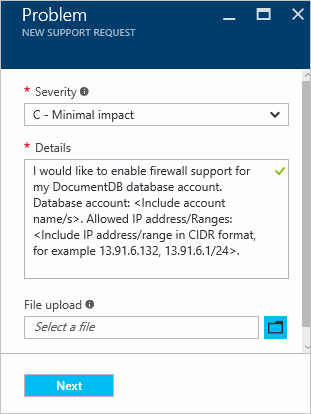

<properties
    pageTitle="Il supporto firewall DocumentDB | Microsoft Azure"
    description="Informazioni su come usare i criteri di controllo accesso IP per il supporto per gli account di database Azure DocumentDB firewall."
    keywords="Controllo di accesso IP, il supporto firewall"
    services="documentdb"
    authors="shahankur11"
    manager="jhubbard"
    editor=""
    tags="azure-resource-manager"
    documentationCenter=""/>

<tags 
    ms.service="documentdb" 
    ms.workload="data-services" 
    ms.tgt_pltfrm="na" 
    ms.devlang="na" 
    ms.topic="article" 
    ms.date="10/17/2016" 
    ms.author="ankshah; kraman"/>

# Supporto firewall DocumentDB

Per proteggere i dati archiviati in un account di database Azure DocumentDB, DocumentDB ha fornito il supporto per un segreta basate su [modello di autorizzazione](https://msdn.microsoft.com/library/azure/dn783368.aspx) che utilizza un codice di autenticazione sicuro messaggi basato su Hash (HMAC). A questo punto, oltre al modello di autorizzazioni basati su segreta DocumentDB supporta criteri basata sulle risorse basate su IP accedere ai controlli per il supporto del firewall in entrata. Questo modello è molto simile alle regole firewall di un sistema di database tradizionale e fornisce un ulteriore livello di sicurezza per l'account di database DocumentDB. Con questo modello, è possibile configurare un account di database DocumentDB per essere accessibili solo da un set approvato di computer e/o servizi cloud. Accesso alle risorse DocumentDB da questi approvata insiemi di computer e servizi richiedono comunque il chiamante presentare un token di autorizzazione valido.

## Cenni preliminari sul controllo di accesso IP

Per impostazione predefinita, è accessibile da internet pubblica un account di database DocumentDB come la convocazione è accompagnata da un token di autorizzazione valido. Per configurare il controllo dell'accesso basato sui criteri di indirizzi IP, l'utente deve fornire il set di indirizzi IP o intervalli di indirizzi IP nel modulo CIDR essere inclusi come elenco consentito di IP client per un account di database specificato. Dopo aver applicata questa configurazione, tutte le richieste provenienti da computer di fuori di questo elenco consentito verranno bloccate dal server.  Nel diagramma seguente viene descritta la connessione elaborazione flusso per il controllo dell'accesso basato sui IP.

## Connessioni dai servizi cloud

In Azure, servizi cloud rappresentano un modo molto comune per l'hosting logica del servizio intermedio utilizzando DocumentDB. Per abilitare l'accesso a un account di database DocumentDB da un servizio cloud, l'indirizzo IP pubblico del servizio cloud deve essere aggiunta all'elenco di indirizzi IP associati all'account di database DocumentDB contattando [il supporto di Azure](#configure-ip-policy)consentito.  In questo modo che tutte le istanze di ruolo di servizi cloud abbiano accesso al proprio account di database DocumentDB. È possibile recuperare gli indirizzi IP per i servizi cloud nel portale di Azure, come illustrato nella schermata seguente. 

Quando il servizio cloud di scalare aggiungendo istanze del ruolo aggiuntivi, le nuove istanze avrà automaticamente accesso all'account di database DocumentDB dal momento che fanno parte dello stesso servizio cloud.

## Connessioni da macchine virtuali

[Macchine virtuali](https://azure.microsoft.com/services/virtual-machines/) o agli [insiemi di scala macchina virtuale](../virtual-machine-scale-sets/virtual-machine-scale-sets-overview.md) può anche essere utilizzato per ospitare servizi intermedio utilizzando DocumentDB.  Per configurare il DocumentDB account del database per consentire l'accesso da macchine virtuali, indirizzi IP di macchina virtuale e/o set di scala macchina virtuale deve essere configurato come uno degli indirizzi IP consentiti per il proprio account di database DocumentDB contattando [il supporto di Azure](#configure-ip-policy). È possibile recuperare gli indirizzi IP per macchine virtuali nel portale di Azure, come illustrato nella schermata seguente.

Quando si aggiungono le istanze di macchina virtuale aggiuntiva al gruppo, vengono forniti automaticamente l'accesso al proprio account di database DocumentDB.

## Connessioni da internet

Quando si accede a un account di database DocumentDB da un computer su internet, l'indirizzo IP client o l'indirizzo IP del computer deve essere aggiunta all'elenco di indirizzi IP per l'account di database DocumentDB consentito. 

## La configurazione del criterio di controllo di accesso IP

Usare il portale di Azure inviare una richiesta di [Supporto di Azure](https://portal.azure.com/?#blade/Microsoft_Azure_Support/HelpAndSupportBlade) per attivare il criterio di controllo di accesso IP nel proprio account di database.

1. Selezionare **nuova richiesta di assistenza**e il [supporto + della Guida](https://portal.azure.com/?#blade/Microsoft_Azure_Support/HelpAndSupportBlade) .
2. Nella finestra e **nuovo supporto richiesta** , selezionare **Nozioni di base**.
3. In e il **Nozioni di base** , eseguire le operazioni seguenti:
    - **Tipo di problema**: Quota
    - **Sottoscrizione**: sottoscrizione associata all'account a cui aggiungere il criterio di controllo di accesso IP.
    - **Tipo di quota**: DocumentDB
    - **Piano di supporto**: supporto Quota - inclusi.
4. In e il **problema** , eseguire le operazioni seguenti:
    - **Gravità**: selezionare C - impatto minimo
    - **Dettagli**: copiare il testo seguente nella casella e includere il nome account/s e l'indirizzo IP/es: "Desidero attivare il supporto di firewall per l'account database DocumentDB. Account del database: *Includi account nome/s*. / Intervalli di indirizzi IP consentiti: *includere/intervallo di indirizzi IP in formato CIDR, ad esempio 13.91.6.132, 13.91.6.1/24*. "
    - Fare clic su **Avanti**. 
5. In e **l'informazioni sul contatto** , inserire i dettagli dei contatti e fare clic su **Crea**. 

Dopo aver ricevuta la richiesta, è necessario attivare il controllo dell'accesso IP entro 24 ore. Verrà visualizzato dopo aver completata la richiesta.

## Risoluzione dei problemi nei criteri di controllo di accesso IP

### Operazioni portale

Abilitando un criterio di controllo di accesso IP per l'account di database DocumentDB tutti l'accesso al proprio account di database DocumentDB dal computer di fuori dell'applicazione configurata consentito elenco degli intervalli di indirizzi IP bloccati. In questo modello, l'operazione di piano dati dal portale di esplorazione verranno bloccate anche per garantire l'integrità del controllo di accesso. 

### API Rest e SDK

Per motivi di sicurezza, accesso tramite SDK o API REST da computer non presenti nell'elenco consentito restituirà una generica 404 non trovato risposta con senza dettagli aggiuntivi. Verificare l'indirizzo IP consentito elenco configurato per l'account di database DocumentDB per garantire che la configurazione dei criteri corretti viene applicata al proprio account di database DocumentDB.

## Passaggi successivi

Per informazioni sulla rete suggerimenti sulle prestazioni correlati, vedere [suggerimenti per le prestazioni](documentdb-performance-tips.md).