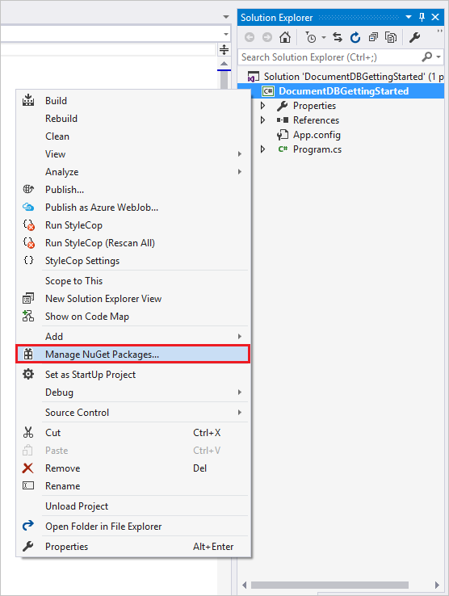

<properties
    pageTitle="Esercitazione NoSQL: DocumentDB .NET SDK | Microsoft Azure"
    description="Esercitazione NoSQL che consente di creare un database online e applicazione console c# mediante DocumentDB .NET SDK. DocumentDB è un database NoSQL per JSON."
    keywords="esercitazione NoSQL, database online, applicazione console c#"
    services="documentdb"
    documentationCenter=".net"
    authors="AndrewHoh"
    manager="jhubbard"
    editor="monicar"/>

<tags
    ms.service="documentdb"
    ms.workload="data-services"
    ms.tgt_pltfrm="na"
    ms.devlang="dotnet"
    ms.topic="hero-article"
    ms.date="08/29/2016"
    ms.author="anhoh"/>

# NoSQL esercitazione: creare un DocumentDB ad c# applicazione console

> [AZURE.SELECTOR]
- [.NET](documentdb-get-started.md)
- [Node](documentdb-nodejs-get-started.md)

Introduzione all'esercitazione NoSQL per Azure DocumentDB .NET SDK! Dopo aver seguito in questa esercitazione, è necessario un'applicazione console viene creato e query DocumentDB risorse.

Verranno illustrate:

- Creazione e la connessione a un account DocumentDB
- Configurazione di soluzione Visual Studio
- Creazione di un database online
- Creazione di una raccolta
- Creazione di documenti JSON
- La ricerca della raccolta
- Sostituzione di un documento
- Eliminazione di un documento
- Eliminazione del database

Non ha tempo? Non preoccuparti! La soluzione completa è disponibile in [GitHub](https://github.com/Azure-Samples/documentdb-dotnet-getting-started). Passare a [ottenere la sezione soluzione completa](#GetSolution) per ottenere istruzioni rapide.

Successivamente, utilizzare i pulsanti di voto nella parte superiore o inferiore della pagina per inviare un feedback. Se si desidera contattare direttamente, è possibile includere il proprio indirizzo di posta elettronica nei commenti.

A questo punto per iniziare.

## Prerequisiti

Assicurarsi che sono i seguenti:

- Un account Azure attivo. Se non si dispone di uno, è possibile iscriversi a un [account gratuito](https://azure.microsoft.com/free/).
- [Visual Studio 2013 / Visual Studio 2015](http://www.visualstudio.com/).
- .NET framework 4.6

## Passaggio 1: Creare un account DocumentDB

Creare un account DocumentDB. Se si dispone già di un account che si desidera utilizzare, può procedere alla [Configurazione soluzione di Visual Studio](#SetupVS).

[AZURE.INCLUDE [documentdb-create-dbaccount](../../includes/documentdb-create-dbaccount.md)]

## Passaggio 2: Impostare la soluzione Visual Studio

1. Aprire **Visual Studio 2015** nel computer in uso.
2. Nel menu **File** scegliere **Nuovo**e quindi scegliere **progetto**.
3. Nella finestra di dialogo **Nuovo progetto** , selezionare **modelli** / **c#** / **Applicazione Console**, assegnare un nome del progetto e quindi fare clic su **OK**.

4. In **Esplora soluzioni**destro del mouse scegliere la nuova applicazione console, ossia in soluzione Visual Studio.
5. Senza uscire dal menu di scelta, fare clic su **Gestisci pacchetti di NuGet** 
 
6. Nella scheda **Nuget** fare clic su **Sfoglia**e digitare **documentdb azure** nella casella di ricerca.
7. Nei risultati di ricerca **Microsoft.Azure.DocumentDB** e fare clic su **Installa**.
L'ID di pacchetto per la raccolta di Client DocumentDB è [Microsoft.Azure.DocumentDB](https://www.nuget.org/packages/Microsoft.Azure.DocumentDB)

Risposta corretta. Ora che è terminato la configurazione, iniziare l'esercitazione scrivendo del codice. È possibile trovare un progetto di codice completo di questa esercitazione in [GitHub](https://github.com/Azure-Samples/documentdb-dotnet-getting-started/blob/master/src/Program.cs).

## Passaggio 3: Connettersi a un account DocumentDB

Prima di tutto, aggiungere questi riferimenti all'inizio dell'applicazione c#, nel file Program.cs:

    using System;
    using System.Linq;
    using System.Threading.Tasks;

    // ADD THIS PART TO YOUR CODE
    using System.Net;
    using Microsoft.Azure.Documents;
    using Microsoft.Azure.Documents.Client;
    using Newtonsoft.Json;

> [AZURE.IMPORTANT] Per completare questa esercitazione NoSQL, assicurarsi di aggiungere le dipendenze sopra.

A questo punto, aggiungere queste due costanti e la variabile di *client* di sotto di una classe pubblica *programma*.

    public class Program
    {
        // ADD THIS PART TO YOUR CODE
        private const string EndpointUri = "<your endpoint URI>";
        private const string PrimaryKey = "<your key>";
        private DocumentClient client;

Intestazione di successivo, per il [Portale di Azure](https://portal.azure.com) per recuperare la chiave primaria e URI. Il DocumentDB URI e la chiave primaria sono necessari per l'applicazione comprendere la posizione in cui connettersi e per DocumentDB considerare attendibile connessione dell'applicazione.

Nel portale di Azure, passare al proprio account DocumentDB e quindi fare clic **sui tasti**.

Copiare l'URI del portale e incollarlo in `<your endpoint URI>` nel file program.cs. Quindi copiare la chiave primaria dal portale e incollarlo in `<your key>`.

![Schermata del portale di Azure utilizzato per l'esercitazione NoSQL per creare un'applicazione console c#. Mostra un account DocumentDB con hub attivo evidenziato, il pulsante tasti evidenziato nella e conto DocumentDB e i valori URI, chiave primaria e chiave SECONDARIA evidenziati nella e tasti][keys]

L'applicazione di iniziare il recupero Iniziamo creando una nuova istanza di **DocumentClient**.

Sotto il metodo **Main** , aggiungere questa nuova attività asincrona chiamata **GetStartedDemo**, che creerà il nuovo **DocumentClient**.

    static void Main(string[] args)
    {
    }

    // ADD THIS PART TO YOUR CODE
    private async Task GetStartedDemo()
    {
        this.client = new DocumentClient(new Uri(EndpointUri), PrimaryKey);
    }

Aggiungere il codice riportato di seguito per eseguire l'attività asincrono dal metodo **principale** . Il metodo **principali** eccezioni e li scrivere nella console.

    static void Main(string[] args)
    {
            // ADD THIS PART TO YOUR CODE
            try
            {
                    Program p = new Program();
                    p.GetStartedDemo().Wait();
            }
            catch (DocumentClientException de)
            {
                    Exception baseException = de.GetBaseException();
                    Console.WriteLine("{0} error occurred: {1}, Message: {2}", de.StatusCode, de.Message, baseException.Message);
            }
            catch (Exception e)
            {
                    Exception baseException = e.GetBaseException();
                    Console.WriteLine("Error: {0}, Message: {1}", e.Message, baseException.Message);
            }
            finally
            {
                    Console.WriteLine("End of demo, press any key to exit.");
                    Console.ReadKey();
            }

Premere **F5** per eseguire l'applicazione.

Congratulazioni! Si è connessi a un account DocumentDB, Ora esaminiamo un utilizzo delle risorse DocumentDB.  

## Passaggio 4: Creare un database
Prima di aggiungere il codice per la creazione di un database, aggiungere un metodo di supporto per la scrittura alla console.

Copiare e incollare il metodo **WriteToConsoleAndPromptToContinue** sotto il metodo **GetStartedDemo** .

    // ADD THIS PART TO YOUR CODE
    private void WriteToConsoleAndPromptToContinue(string format, params object[] args)
    {
            Console.WriteLine(format, args);
            Console.WriteLine("Press any key to continue ...");
            Console.ReadKey();
    }

DocumentDB [database](documentdb-resources.md#databases) può essere create utilizzando il metodo [CreateDatabaseAsync](https://msdn.microsoft.com/library/microsoft.azure.documents.client.documentclient.createdatabaseasync.aspx) della classe **DocumentClient** . Un database è il contenitore logico di spazio di archiviazione di documenti JSON suddiviso in raccolte.

Copiare e incollare il metodo **CreateDatabaseIfNotExists** sotto il metodo **WriteToConsoleAndPromptToContinue** .

    // ADD THIS PART TO YOUR CODE
    private async Task CreateDatabaseIfNotExists(string databaseName)
    {
            // Check to verify a database with the id=FamilyDB does not exist
            try
            {
                    await this.client.ReadDatabaseAsync(UriFactory.CreateDatabaseUri(databaseName));
                    this.WriteToConsoleAndPromptToContinue("Found {0}", databaseName);
            }
            catch (DocumentClientException de)
            {
                    // If the database does not exist, create a new database
                    if (de.StatusCode == HttpStatusCode.NotFound)
                    {
                            await this.client.CreateDatabaseAsync(new Database { Id = databaseName });
                            this.WriteToConsoleAndPromptToContinue("Created {0}", databaseName);
                    }
                    else
                    {
                            throw;
                    }
            }
    }

Copiare e incollare il codice riportato di seguito per il metodo di **GetStartedDemo** sotto la creazione di client. Verrà creato un database denominato *FamilyDB*.

    private async Task GetStartedDemo()
    {
        this.client = new DocumentClient(new Uri(EndpointUri), PrimaryKey);

        // ADD THIS PART TO YOUR CODE
        await this.CreateDatabaseIfNotExists("FamilyDB_oa");

Premere **F5** per eseguire l'applicazione.

Congratulazioni! Un database DocumentDB completata.  

## Passaggio 5: Creare una raccolta  

> [AZURE.WARNING] **CreateDocumentCollectionAsync** creerà un nuovo insieme fino a riservato, che ha prezzi implicazioni. Per ulteriori informazioni, visitare i [prezzi pagina](https://azure.microsoft.com/pricing/details/documentdb/).

Una [raccolta](documentdb-resources.md#collections) può essere create utilizzando il metodo [CreateDocumentCollectionAsync](https://msdn.microsoft.com/library/microsoft.azure.documents.client.documentclient.createdocumentcollectionasync.aspx) della classe **DocumentClient** . Una raccolta è un contenitore di documenti JSON e logica di applicazione JavaScript associata.

Copiare e incollare il metodo **CreateDocumentCollectionIfNotExists** sotto il metodo **CreateDatabaseIfNotExists** .

    // ADD THIS PART TO YOUR CODE
    private async Task CreateDocumentCollectionIfNotExists(string databaseName, string collectionName)
    {
        try
        {
            await this.client.ReadDocumentCollectionAsync(UriFactory.CreateDocumentCollectionUri(databaseName, collectionName));
            this.WriteToConsoleAndPromptToContinue("Found {0}", collectionName);
        }
        catch (DocumentClientException de)
        {
            // If the document collection does not exist, create a new collection
            if (de.StatusCode == HttpStatusCode.NotFound)
            {
                DocumentCollection collectionInfo = new DocumentCollection();
                collectionInfo.Id = collectionName;

                // Configure collections for maximum query flexibility including string range queries.
                collectionInfo.IndexingPolicy = new IndexingPolicy(new RangeIndex(DataType.String) { Precision = -1 });

                // Here we create a collection with 400 RU/s.
                await this.client.CreateDocumentCollectionAsync(
                    UriFactory.CreateDatabaseUri(databaseName),
                    collectionInfo,
                    new RequestOptions { OfferThroughput = 400 });

                this.WriteToConsoleAndPromptToContinue("Created {0}", collectionName);
            }
            else
            {
                throw;
            }
        }
    }

Copiare e incollare il codice riportato di seguito per il metodo di **GetStartedDemo** sotto la creazione del database. Per creare una raccolta documenti denominata *FamilyCollection_oa*.

        this.client = new DocumentClient(new Uri(EndpointUri), PrimaryKey);

        await this.CreateDatabaseIfNotExists("FamilyDB_oa");

        // ADD THIS PART TO YOUR CODE
        await this.CreateDocumentCollectionIfNotExists("FamilyDB_oa", "FamilyCollection_oa");

Premere **F5** per eseguire l'applicazione.

Congratulazioni! La creazione di una raccolta di documenti DocumentDB è stata completata.  

## Passaggio 6: Creare documenti JSON
Un [documento](documentdb-resources.md#documents) può essere create utilizzando il metodo [CreateDocumentAsync](https://msdn.microsoft.com/library/microsoft.azure.documents.client.documentclient.createdocumentasync.aspx) della classe **DocumentClient** . I documenti sono contenuti JSON (non autorizzato) definite dall'utente. È ora possibile inserire uno o più documenti. Se si dispone già di dati che si desidera memorizzare nel database, è possibile utilizzare del DocumentDB [strumento di migrazione di dati](documentdb-import-data.md).

Prima di tutto, è necessario creare una classe **famiglia** che rappresenta oggetti memorizzati all'interno di DocumentDB in questo esempio. Si creerà inoltre **padre**, **figlio**, **animale domestico**, sottoclassi **indirizzo** utilizzati all'interno di **famiglia**. Si noti che la proprietà **Id** serializzata come **id** in JSON devono essere documenti. Creare queste classi aggiungendo le seguenti classi secondari interne dopo il metodo **GetStartedDemo** .

Copiare e incollare la **famiglia**, **padre**, **figlio**, **animale domestico**e classi di **indirizzi** sotto il metodo **WriteToConsoleAndPromptToContinue** .

    private void WriteToConsoleAndPromptToContinue(string format, params object[] args)
    {
        Console.WriteLine(format, args);
        Console.WriteLine("Press any key to continue ...");
        Console.ReadKey();
    }

    // ADD THIS PART TO YOUR CODE
    public class Family
    {
        [JsonProperty(PropertyName = "id")]
        public string Id { get; set; }
        public string LastName { get; set; }
        public Parent[] Parents { get; set; }
        public Child[] Children { get; set; }
        public Address Address { get; set; }
        public bool IsRegistered { get; set; }
        public override string ToString()
        {
                return JsonConvert.SerializeObject(this);
        }
    }

    public class Parent
    {
        public string FamilyName { get; set; }
        public string FirstName { get; set; }
    }

    public class Child
    {
        public string FamilyName { get; set; }
        public string FirstName { get; set; }
        public string Gender { get; set; }
        public int Grade { get; set; }
        public Pet[] Pets { get; set; }
    }

    public class Pet
    {
        public string GivenName { get; set; }
    }

    public class Address
    {
        public string State { get; set; }
        public string County { get; set; }
        public string City { get; set; }
    }

Copiare e incollare il metodo **CreateFamilyDocumentIfNotExists** sotto il metodo **CreateDocumentCollectionIfNotExists** .

    // ADD THIS PART TO YOUR CODE
    private async Task CreateFamilyDocumentIfNotExists(string databaseName, string collectionName, Family family)
    {
        try
        {
            await this.client.ReadDocumentAsync(UriFactory.CreateDocumentUri(databaseName, collectionName, family.Id));
            this.WriteToConsoleAndPromptToContinue("Found {0}", family.Id);
        }
        catch (DocumentClientException de)
        {
            if (de.StatusCode == HttpStatusCode.NotFound)
            {
                await this.client.CreateDocumentAsync(UriFactory.CreateDocumentCollectionUri(databaseName, collectionName), family);
                this.WriteToConsoleAndPromptToContinue("Created Family {0}", family.Id);
            }
            else
            {
                throw;
            }
        }
    }

Inserire due documenti, uno per la famiglia Andersen e la famiglia Wakefield.

Copiare e incollare il codice riportato di seguito per il metodo di **GetStartedDemo** sotto la creazione di raccolta documenti.

    await this.CreateDatabaseIfNotExists("FamilyDB_oa");

    await this.CreateDocumentCollectionIfNotExists("FamilyDB_oa", "FamilyCollection_oa");

    // ADD THIS PART TO YOUR CODE
    Family andersenFamily = new Family
    {
            Id = "Andersen.1",
            LastName = "Andersen",
            Parents = new Parent[]
            {
                    new Parent { FirstName = "Thomas" },
                    new Parent { FirstName = "Mary Kay" }
            },
            Children = new Child[]
            {
                    new Child
                    {
                            FirstName = "Henriette Thaulow",
                            Gender = "female",
                            Grade = 5,
                            Pets = new Pet[]
                            {
                                    new Pet { GivenName = "Fluffy" }
                            }
                    }
            },
            Address = new Address { State = "WA", County = "King", City = "Seattle" },
            IsRegistered = true
    };

    await this.CreateFamilyDocumentIfNotExists("FamilyDB_oa", "FamilyCollection_oa", andersenFamily);

    Family wakefieldFamily = new Family
    {
            Id = "Wakefield.7",
            LastName = "Wakefield",
            Parents = new Parent[]
            {
                    new Parent { FamilyName = "Wakefield", FirstName = "Robin" },
                    new Parent { FamilyName = "Miller", FirstName = "Ben" }
            },
            Children = new Child[]
            {
                    new Child
                    {
                            FamilyName = "Merriam",
                            FirstName = "Jesse",
                            Gender = "female",
                            Grade = 8,
                            Pets = new Pet[]
                            {
                                    new Pet { GivenName = "Goofy" },
                                    new Pet { GivenName = "Shadow" }
                            }
                    },
                    new Child
                    {
                            FamilyName = "Miller",
                            FirstName = "Lisa",
                            Gender = "female",
                            Grade = 1
                    }
            },
            Address = new Address { State = "NY", County = "Manhattan", City = "NY" },
            IsRegistered = false
    };

    await this.CreateFamilyDocumentIfNotExists("FamilyDB_oa", "FamilyCollection_oa", wakefieldFamily);

Premere **F5** per eseguire l'applicazione.

Congratulazioni! Due documenti DocumentDB completata.  

##Passaggio 7: Query DocumentDB risorse

DocumentDB supporta [query](documentdb-sql-query.md) avanzate in JSON documenti archiviati in ogni raccolta.  Il codice di esempio seguente mostra varie query - entrambi sintassi DocumentDB SQL e LINQ - che è possibile eseguire i documenti è inserito nel passaggio precedente.

Copiare e incollare il metodo **ExecuteSimpleQuery** sotto il metodo **CreateFamilyDocumentIfNotExists** .

    // ADD THIS PART TO YOUR CODE
    private void ExecuteSimpleQuery(string databaseName, string collectionName)
    {
        // Set some common query options
        FeedOptions queryOptions = new FeedOptions { MaxItemCount = -1 };

            // Here we find the Andersen family via its LastName
            IQueryable<Family> familyQuery = this.client.CreateDocumentQuery<Family>(
                    UriFactory.CreateDocumentCollectionUri(databaseName, collectionName), queryOptions)
                    .Where(f => f.LastName == "Andersen");

            // The query is executed synchronously here, but can also be executed asynchronously via the IDocumentQuery<T> interface
            Console.WriteLine("Running LINQ query...");
            foreach (Family family in familyQuery)
            {
                    Console.WriteLine("\tRead {0}", family);
            }

            // Now execute the same query via direct SQL
            IQueryable<Family> familyQueryInSql = this.client.CreateDocumentQuery<Family>(
                    UriFactory.CreateDocumentCollectionUri(databaseName, collectionName),
                    "SELECT * FROM Family WHERE Family.LastName = 'Andersen'",
                    queryOptions);

            Console.WriteLine("Running direct SQL query...");
            foreach (Family family in familyQueryInSql)
            {
                    Console.WriteLine("\tRead {0}", family);
            }

            Console.WriteLine("Press any key to continue ...");
            Console.ReadKey();
    }

Copiare e incollare il codice riportato di seguito per il metodo di **GetStartedDemo** sotto la creazione di documenti secondo.

    await this.CreateFamilyDocumentIfNotExists("FamilyDB_oa", "FamilyCollection_oa", wakefieldFamily);

    // ADD THIS PART TO YOUR CODE
    this.ExecuteSimpleQuery("FamilyDB_oa", "FamilyCollection_oa");

Premere **F5** per eseguire l'applicazione.

Congratulazioni! Dispone di query con una raccolta di DocumentDB.

Il diagramma seguente illustra come il DocumentDB codice SQL nella sintassi della query è chiamata sull'insieme è stato creato e la stessa logica si applica anche alla query LINQ.

La parola chiave [FROM](documentdb-sql-query.md#from-clause) è facoltativa nella query perché query DocumentDB già sono limitate a un'unica raccolta. Di conseguenza, "Da famiglie f" possono essere scambiati con "Da r principale" o qualsiasi altra variabile il nome di scegliere. DocumentDB verranno dedurre tale famiglie, radice o il nome della variabile che scelto, fare riferimento all'insieme corrente per impostazione predefinita.

##Passaggio 8: Sostituire documento JSON

DocumentDB supporta la sostituzione JSON documenti.  

Copiare e incollare il metodo **ReplaceFamilyDocument** sotto il metodo **ExecuteSimpleQuery** .

    // ADD THIS PART TO YOUR CODE
    private async Task ReplaceFamilyDocument(string databaseName, string collectionName, string familyName, Family updatedFamily)
    {
        try
        {
            await this.client.ReplaceDocumentAsync(UriFactory.CreateDocumentUri(databaseName, collectionName, familyName), updatedFamily);
            this.WriteToConsoleAndPromptToContinue("Replaced Family {0}", familyName);
        }
        catch (DocumentClientException de)
        {
            throw;
        }
    }

Copiare e incollare il codice riportato di seguito per il metodo di **GetStartedDemo** sotto l'esecuzione della query. Dopo la sostituzione del documento, questo verrà eseguita la stessa query per visualizzare i documenti modificati.

    await this.CreateFamilyDocumentIfNotExists("FamilyDB_oa", "FamilyCollection_oa", wakefieldFamily);

    this.ExecuteSimpleQuery("FamilyDB_oa", "FamilyCollection_oa");

    // ADD THIS PART TO YOUR CODE
    // Update the Grade of the Andersen Family child
    andersenFamily.Children[0].Grade = 6;

    await this.ReplaceFamilyDocument("FamilyDB_oa", "FamilyCollection_oa", "Andersen.1", andersenFamily);

    this.ExecuteSimpleQuery("FamilyDB_oa", "FamilyCollection_oa");

Premere **F5** per eseguire l'applicazione.

Congratulazioni! È stato sostituito correttamente un documento DocumentDB.

##Passaggio 9: Elimina documento JSON

DocumentDB supporta documenti JSON eliminazione.  

Copiare e incollare il metodo **DeleteFamilyDocument** sotto il metodo **ReplaceFamilyDocument** .

    // ADD THIS PART TO YOUR CODE
    private async Task DeleteFamilyDocument(string databaseName, string collectionName, string documentName)
    {
        try
        {
            await this.client.DeleteDocumentAsync(UriFactory.CreateDocumentUri(databaseName, collectionName, documentName));
            Console.WriteLine("Deleted Family {0}", documentName);
        }
        catch (DocumentClientException de)
        {
            throw;
        }
    }

Copiare e incollare il codice riportato di seguito per il metodo di **GetStartedDemo** sotto la seconda esecuzione di query.

    await this.ReplaceFamilyDocument("FamilyDB_oa", "FamilyCollection_oa", "Andersen.1", andersenFamily);

    this.ExecuteSimpleQuery("FamilyDB_oa", "FamilyCollection_oa");

    // ADD THIS PART TO CODE
    await this.DeleteFamilyDocument("FamilyDB_oa", "FamilyCollection_oa", "Andersen.1");

Premere **F5** per eseguire l'applicazione.

Congratulazioni! Un documento DocumentDB eliminata.

##Passaggio 10: Eliminare il database

Eliminare il database creato comporta la rimozione del database e tutte le risorse figli (raccolte, documenti e così via).

Copiare e incollare il codice riportato di seguito per il metodo di **GetStartedDemo** sotto il documento Elimina per eliminare l'intero database e tutte le risorse figli.

    this.ExecuteSimpleQuery("FamilyDB_oa", "FamilyCollection_oa");

    await this.DeleteFamilyDocument("FamilyDB_oa", "FamilyCollection_oa", "Andersen.1");

    // ADD THIS PART TO CODE
    // Clean up/delete the database
    await this.client.DeleteDatabaseAsync(UriFactory.CreateDatabaseUri("FamilyDB_oa"));

Premere **F5** per eseguire l'applicazione.

Congratulazioni! Un database DocumentDB eliminata.

##Passaggio 11: Eseguire l'applicazione console c# tutte insieme!

Premere F5 in Visual Studio per generare l'applicazione in modalità di debug.

Verrà visualizzato l'output dell'app introduttiva get. L'output sarà visualizzati i risultati delle query abbiamo aggiunto e devono corrispondere il testo di esempio riportato di seguito.

    Created FamilyDB_oa
    Press any key to continue ...
    Created FamilyCollection_oa
    Press any key to continue ...
    Created Family Andersen.1
    Press any key to continue ...
    Created Family Wakefield.7
    Press any key to continue ...
    Running LINQ query...
        Read {"id":"Andersen.1","LastName":"Andersen","District":"WA5","Parents":[{"FamilyName":null,"FirstName":"Thomas"},{"FamilyName":null,"FirstName":"Mary Kay"}],"Children":[{"FamilyName":null,"FirstName":"Henriette Thaulow","Gender":"female","Grade":5,"Pets":[{"GivenName":"Fluffy"}]}],"Address":{"State":"WA","County":"King","City":"Seattle"},"IsRegistered":true}
    Running direct SQL query...
        Read {"id":"Andersen.1","LastName":"Andersen","District":"WA5","Parents":[{"FamilyName":null,"FirstName":"Thomas"},{"FamilyName":null,"FirstName":"Mary Kay"}],"Children":[{"FamilyName":null,"FirstName":"Henriette Thaulow","Gender":"female","Grade":5,"Pets":[{"GivenName":"Fluffy"}]}],"Address":{"State":"WA","County":"King","City":"Seattle"},"IsRegistered":true}
    Replaced Family Andersen.1
    Press any key to continue ...
    Running LINQ query...
        Read {"id":"Andersen.1","LastName":"Andersen","District":"WA5","Parents":[{"FamilyName":null,"FirstName":"Thomas"},{"FamilyName":null,"FirstName":"Mary Kay"}],"Children":[{"FamilyName":null,"FirstName":"Henriette Thaulow","Gender":"female","Grade":6,"Pets":[{"GivenName":"Fluffy"}]}],"Address":{"State":"WA","County":"King","City":"Seattle"},"IsRegistered":true}
    Running direct SQL query...
        Read {"id":"Andersen.1","LastName":"Andersen","District":"WA5","Parents":[{"FamilyName":null,"FirstName":"Thomas"},{"FamilyName":null,"FirstName":"Mary Kay"}],"Children":[{"FamilyName":null,"FirstName":"Henriette Thaulow","Gender":"female","Grade":6,"Pets":[{"GivenName":"Fluffy"}]}],"Address":{"State":"WA","County":"King","City":"Seattle"},"IsRegistered":true}
    Deleted Family Andersen.1
    End of demo, press any key to exit.

Congratulazioni! È stata completata questa esercitazione NoSQL e ha un'applicazione di console lavoro c#!

##Ottenere la soluzione esercitazione NoSQL completa
Per creare la soluzione GetStarted che contiene tutti gli esempi di questo articolo, è necessario quanto segue:

- Un account Azure attivo. Se non si dispone di uno, è possibile iscriversi a un [account gratuito](https://azure.microsoft.com/free/).
-   Un [account DocumentDB][documentdb-create-account].
-   La soluzione [GetStarted](https://github.com/Azure-Samples/documentdb-dotnet-getting-started) disponibile in GitHub.

Per ripristinare i riferimenti agli DocumentDB .NET SDK in Visual Studio, fare doppio clic soluzione **GetStarted** in Esplora soluzioni e quindi fare clic su **Abilita Ripristina pacchetto NuGet**. Poi, nel file App, aggiornare i valori EndpointUrl e AuthorizationKey come descritto in [connessione a un account DocumentDB](#Connect).

## Passaggi successivi

- Serve un'esercitazione ASP.NET MVC NoSQL più complessa? Vedere [creare un'applicazione web con ASP.NET MVC utilizzando DocumentDB](documentdb-dotnet-application.md).
- Se si vuole eseguire scala e delle prestazioni con DocumentDB? Vedere [test con Azure DocumentDB proporzioni e le prestazioni](documentdb-performance-testing.md)
-   Informazioni su come [monitor di un account DocumentDB](documentdb-monitor-accounts.md).
-   Eseguire query sul set di dati di esempio in [Query di test](https://www.documentdb.com/sql/demo).
-   Ulteriori informazioni sul modello di programmazione nella sezione elaborazione della [pagina della documentazione DocumentDB](https://azure.microsoft.com/documentation/services/documentdb/).

[documentdb-create-account]: documentdb-create-account.md
[documentdb-manage]: documentdb-manage.md
[keys]: media/documentdb-get-started/nosql-tutorial-keys.png
