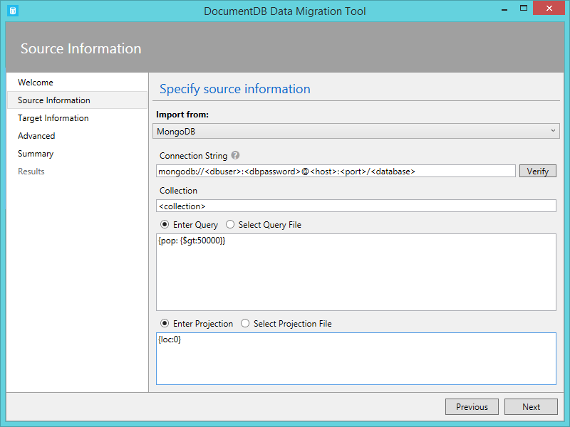
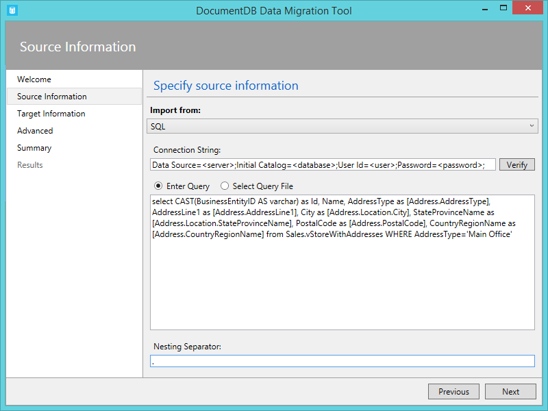
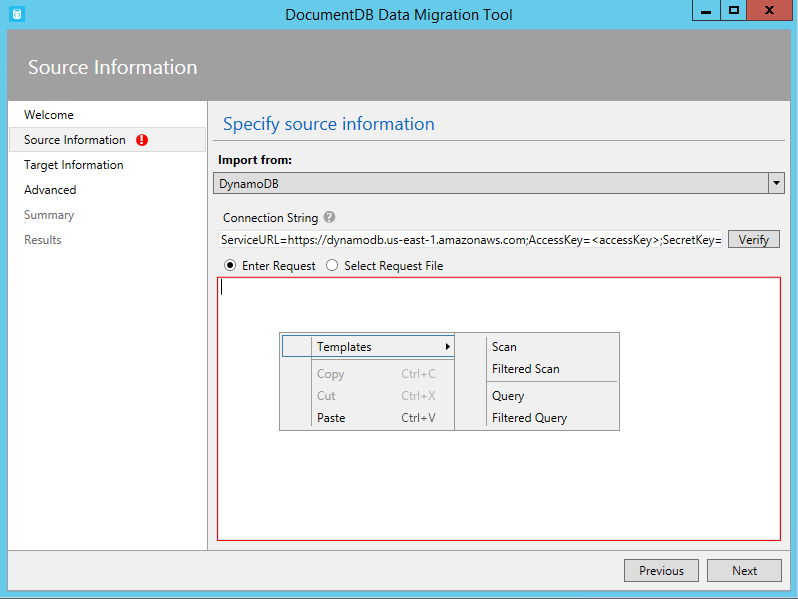
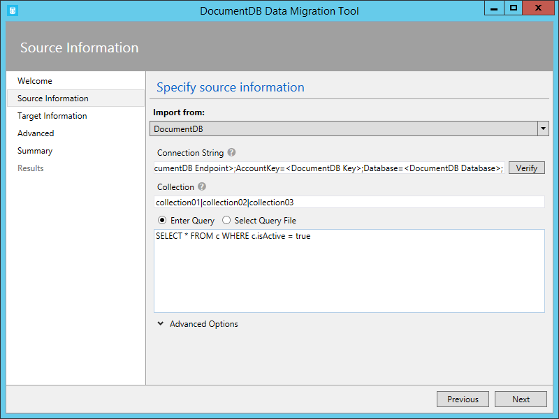

<properties
    pageTitle="Strumento di migrazione di database per DocumentDB | Microsoft Azure"
    description="Informazioni su come usare gli strumenti di migrazione Apri origine dati DocumentDB per importare dati in DocumentDB da diverse origini, inclusi file MongoDB, di SQL Server, lo spazio di archiviazione tabella, DynamoDB Amazon, CSV e JSON. CSV alla conversione JSON."
    keywords="CSV in json, strumenti di migrazione del database, convertire csv json"
    services="documentdb"
    authors="andrewhoh"
    manager="jhubbard"
    editor="monicar"
    documentationCenter=""/>

<tags
    ms.service="documentdb"
    ms.workload="data-services"
    ms.tgt_pltfrm="na"
    ms.devlang="na"
    ms.topic="article"
    ms.date="10/06/2016"
    ms.author="anhoh"/>

# Importare dati in DocumentDB con lo strumento di migrazione del Database

In questo articolo viene illustrato come utilizzare lo strumento di migrazione ufficiale Apri origine dati DocumentDB per importare dati in [Microsoft Azure DocumentDB](https://azure.microsoft.com/services/documentdb/) da diverse origini, inclusi file JSON, file CSV, SQL, MongoDB, archiviazione tabelle Azure, Amazon DynamoDB e DocumentDB raccolte.

Dopo aver letto in questo articolo, sarà possibile rispondere alle domande seguenti:  

-   Come è possibile importare file JSON, file CSV, dati di SQL Server o dati MongoDB in DocumentDB?
-   Come è possibile importare dati da archiviazione tabella Azure, Amazon DynamoDB e HBase a DocumentDB?
-   Come è possibile eseguire la migrazione di dati tra le raccolte DocumentDB?

##Prerequisiti

Prima di seguendo le istruzioni fornite in questo articolo, verificare che si siano installati i seguenti:

- [Microsoft .NET Framework da 4,51](https://www.microsoft.com/download/developer-tools.aspx) o versione successiva.

##Panoramica dello strumento di migrazione DocumentDB dati

Lo strumento di migrazione di dati DocumentDB è una soluzione Apri origine che importa dati in DocumentDB da una varietà di origini, tra cui:

- File JSON
- MongoDB
- SQL Server
- File CSV
- Archivio tabelle Azure
- DynamoDB di Amazon
- HBase
- Raccolte DocumentDB

Mentre l'utilità di importazione include un'interfaccia utente grafica (dtui.exe), può essere controllato anche dalla riga di comando (dt.exe). Infatti, esiste un'opzione per generare l'output del comando associato dopo aver impostato un'importazione tramite l'interfaccia utente. In modo che sia possono creare relazioni gerarchiche (secondari) durante l'importazione, è possono trasformare i dati di origine in formato tabulare (ad esempio file di SQL Server o CSV). Continuare a leggere per ulteriori informazioni sulle opzioni di origine, le righe di comando per importare da ogni origine, opzioni di destinazione e importare la visualizzazione dei risultati di esempio.

##Installare lo strumento di migrazione di dati DocumentDB

Il codice sorgente dello strumento di migrazione è disponibile in GitHub in [questo repository](https://github.com/azure/azure-documentdb-datamigrationtool) e una versione compilata è disponibile [dall'Area Download Microsoft](http://www.microsoft.com/downloads/details.aspx?FamilyID=cda7703a-2774-4c07-adcc-ad02ddc1a44d). È possibile compilare la soluzione o semplicemente scaricare ed estrarre la versione compilata in una directory di propria scelta. Eseguire quindi una:

- **Dtui.exe**: versione interfaccia grafica dello strumento
- **Dt.exe**: versione della riga di comando dello strumento

##Importare file JSON

L'opzione di importazione JSON origine file consente di importare uno o più singolo documento JSON file o JSON ciascuna delle quali contiene una matrice di JSON documenti. Quando si aggiungono le cartelle che contengono file JSON da importare, avere la possibilità di cercare i file in sottocartelle in modo ricorsivo.

Ecco alcuni esempi di riga di comando per importare file JSON:

    #Import a single JSON file
    dt.exe /s:JsonFile /s.Files:.\Sessions.json /t:DocumentDBBulk /t.ConnectionString:"AccountEndpoint=<DocumentDB Endpoint>;AccountKey=<DocumentDB Key>;Database=<DocumentDB Database>;" /t.Collection:Sessions /t.CollectionThroughput:2500

    #Import a directory of JSON files
    dt.exe /s:JsonFile /s.Files:C:\TESessions\*.json /t:DocumentDBBulk /t.ConnectionString:" AccountEndpoint=<DocumentDB Endpoint>;AccountKey=<DocumentDB Key>;Database=<DocumentDB Database>;" /t.Collection:Sessions /t.CollectionThroughput:2500

    #Import a directory (including sub-directories) of JSON files
    dt.exe /s:JsonFile /s.Files:C:\LastFMMusic\**\*.json /t:DocumentDBBulk /t.ConnectionString:" AccountEndpoint=<DocumentDB Endpoint>;AccountKey=<DocumentDB Key>;Database=<DocumentDB Database>;" /t.Collection:Music /t.CollectionThroughput:2500

    #Import a directory (single), directory (recursive), and individual JSON files
    dt.exe /s:JsonFile /s.Files:C:\Tweets\*.*;C:\LargeDocs\**\*.*;C:\TESessions\Session48172.json;C:\TESessions\Session48173.json;C:\TESessions\Session48174.json;C:\TESessions\Session48175.json;C:\TESessions\Session48177.json /t:DocumentDBBulk /t.ConnectionString:"AccountEndpoint=<DocumentDB Endpoint>;AccountKey=<DocumentDB Key>;Database=<DocumentDB Database>;" /t.Collection:subs /t.CollectionThroughput:2500

    #Import a single JSON file and partition the data across 4 collections
    dt.exe /s:JsonFile /s.Files:D:\\CompanyData\\Companies.json /t:DocumentDBBulk /t.ConnectionString:"AccountEndpoint=<DocumentDB Endpoint>;AccountKey=<DocumentDB Key>;Database=<DocumentDB Database>;" /t.Collection:comp[1-4] /t.PartitionKey:name /t.CollectionThroughput:2500

##Importare da MongoDB

L'opzione di importazione di origine MongoDB consente di importare da un insieme di MongoDB singoli e filtrare i documenti utilizzando una query e/o modificare la struttura del documento utilizzando una proiezione.  

La stringa di connessione è nel formato MongoDB standard:

    mongodb://<dbuser>:<dbpassword>@<host>:<port>/<database>

> [AZURE.NOTE] Utilizzare il comando verifica per verificare che l'istanza MongoDB specificato nel campo stringa di connessione è accessibile.

Immettere il nome della raccolta da cui verranno importati i dati. Se lo si desidera specificata o fornire un file per una query (ad esempio {pop: {$gt: 5000}}) e/o proiezione (ad esempio {loc:0}) a filtrare e modellare i dati da importare.

Ecco alcuni esempi di riga di comando per importare da MongoDB:

    #Import all documents from a MongoDB collection
    dt.exe /s:MongoDB /s.ConnectionString:mongodb://<dbuser>:<dbpassword>@<host>:<port>/<database> /s.Collection:zips /t:DocumentDBBulk /t.ConnectionString:"AccountEndpoint=<DocumentDB Endpoint>;AccountKey=<DocumentDB Key>;Database=<DocumentDB Database>;" /t.Collection:BulkZips /t.IdField:_id /t.CollectionThroughput:2500

    #Import documents from a MongoDB collection which match the query and exclude the loc field
    dt.exe /s:MongoDB /s.ConnectionString:mongodb://<dbuser>:<dbpassword>@<host>:<port>/<database> /s.Collection:zips /s.Query:{pop:{$gt:50000}} /s.Projection:{loc:0} /t:DocumentDBBulk /t.ConnectionString:"AccountEndpoint=<DocumentDB Endpoint>;AccountKey=<DocumentDB Key>;Database=<DocumentDB Database>;" /t.Collection:BulkZipsTransform /t.IdField:_id/t.CollectionThroughput:2500

##Importare file di esportazione MongoDB

L'opzione di importazione MongoDB esportazione JSON file origine consente di importare uno o più file JSON generati dall'utilità mongoexport.  

Quando si aggiungono cartelle che contengono MongoDB esportazione JSON file per l'importazione, disponibile l'opzione di ricerca per i file in sottocartelle in modo ricorsivo.

Ecco un esempio di riga di comando per importare da MongoDB esportazione JSON file:

    dt.exe /s:MongoDBExport /s.Files:D:\mongoemployees.json /t:DocumentDBBulk /t.ConnectionString:"AccountEndpoint=<DocumentDB Endpoint>;AccountKey=<DocumentDB Key>;Database=<DocumentDB Database>;" /t.Collection:employees /t.IdField:_id /t.Dates:Epoch /t.CollectionThroughput:2500

##Importazione da SQL Server

L'opzione di importazione di origine SQL consente di importare da un database di SQL Server singoli e filtrare i record da importare utilizzando una query. Inoltre, è possibile modificare la struttura del documento specificando un separatore di annidamento (ulteriori informazioni in un momento).  

Il formato della stringa di connessione è il formato di stringa di connessione SQL standard.

> [AZURE.NOTE] Utilizzare il comando verifica per verificare che l'istanza di SQL Server specificato nel campo stringa di connessione è accessibile.

L'annidamento di separatore proprietà è utilizzata per creare relazioni gerarchiche (documenti secondari) durante l'importazione. Considerare la query SQL seguente:

*Selezionare CAST (come BusinessEntityID varchar) come Id, nome, AddressType come [Address.AddressType], AddressLine1 come [Address.AddressLine1], città come [Address.Location.City], StateProvinceName come [Address.Location.StateProvinceName], CAP come [Address.PostalCode], CountryRegionName come [Address.CountryRegionName] da Sales.vStoreWithAddresses in AddressType = 'Principali Office'*

Che restituisce i risultati (parziali) seguenti:

Nota gli alias, ad esempio Address.AddressType e Address.Location.StateProvinceName. Specificando un separatore di annidamento di '.', lo strumento di importazione crea documenti secondari indirizzo e Address.Location durante l'importazione. Ecco un esempio di un documento risultante in DocumentDB:

*{"id": "956", "nome": "Più dettagliato e servizio di vendita", "Indirizzo": {"AddressType": "Principali Office", "AddressLine1": "#500 75 O'Connor via e numero civico", "Posizione": {"Città": "Ottawa", "StateProvinceName": "Ontario"}, "PostalCode": "K4B 1S2", "CountryRegionName": "Canada"}}*

Ecco alcuni esempi di riga di comando per l'importazione da SQL Server:

    #Import records from SQL which match a query
    dt.exe /s:SQL /s.ConnectionString:"Data Source=<server>;Initial Catalog=AdventureWorks;User Id=advworks;Password=<password>;" /s.Query:"select CAST(BusinessEntityID AS varchar) as Id, * from Sales.vStoreWithAddresses WHERE AddressType='Main Office'" /t:DocumentDBBulk /t.ConnectionString:" AccountEndpoint=<DocumentDB Endpoint>;AccountKey=<DocumentDB Key>;Database=<DocumentDB Database>;" /t.Collection:Stores /t.IdField:Id /t.CollectionThroughput:2500

    #Import records from sql which match a query and create hierarchical relationships
    dt.exe /s:SQL /s.ConnectionString:"Data Source=<server>;Initial Catalog=AdventureWorks;User Id=advworks;Password=<password>;" /s.Query:"select CAST(BusinessEntityID AS varchar) as Id, Name, AddressType as [Address.AddressType], AddressLine1 as [Address.AddressLine1], City as [Address.Location.City], StateProvinceName as [Address.Location.StateProvinceName], PostalCode as [Address.PostalCode], CountryRegionName as [Address.CountryRegionName] from Sales.vStoreWithAddresses WHERE AddressType='Main Office'" /s.NestingSeparator:. /t:DocumentDBBulk /t.ConnectionString:" AccountEndpoint=<DocumentDB Endpoint>;AccountKey=<DocumentDB Key>;Database=<DocumentDB Database>;" /t.Collection:StoresSub /t.IdField:Id /t.CollectionThroughput:2500

##Importare file CSV - CSV convertire in JSON

L'opzione di importazione origine file CSV consente di importare uno o più file CSV. Quando si aggiungono cartelle che contengono file CSV per l'importazione, disponibile l'opzione di ricerca per i file in sottocartelle in modo ricorsivo.

Simile all'origine SQL, le proprietà di separatore annidamento può essere utilizzata per creare relazioni gerarchiche (documenti secondari) durante l'importazione. Prendere in considerazione la seguente intestazione CSV righe di riga e di dati:

Nota gli alias, ad esempio DomainInfo.Domain_Name e RedirectInfo.Redirecting. Specificando un separatore di annidamento di '.', lo strumento di importazione verranno creati i documenti secondari DomainInfo e RedirectInfo durante l'importazione. Ecco un esempio di un documento risultante in DocumentDB:

*{"DomainInfo": {"Nome_dominio": "ACUS.GOV", "Domain_Name_Address": "http://www.ACUS.GOV"}, "Agenzia Federal": "amministrativi conferenza di Stati Uniti", "RedirectInfo": {"Reindirizzamento": "0", "Redirect_Destination": ""}, "id": "9cc565c5-ebcd-1c03-ebd3-cc3e2ecd814d"}*

Lo strumento di importazione tenterà di dedurre informazioni sul tipo di valori non racchiuso tra virgolette in file CSV (valori tra virgolette sono sempre considerati stringhe).  Tipi di identificate nell'ordine seguente: numero, datetime, boolean.  

Esistono due altri aspetti da tenere presente sull'importazione CSV:

1.  Per impostazione predefinita, i valori non racchiuso tra virgolette sono sempre tagliati per tabulazioni e spazi, mentre i valori tra virgolette vengono mantenuti come-è. Questo problema può essere sostituito con l'opzione della riga di comando /s.TrimQuoted o la casella di controllo di ritaglio valori tra virgolette.

2.  Per impostazione predefinita, un valore null non racchiuso tra virgolette viene considerato come un valore null. Override di questo comportamento (ad esempio considera un valore null non racchiuso tra virgolette come stringa "null") con la considera senza virgolette NULL come stringa Casella di controllo o l'opzione della riga di comando /s.NoUnquotedNulls.

Ecco un esempio di riga di comando per l'importazione CSV:

    dt.exe /s:CsvFile /s.Files:.\Employees.csv /t:DocumentDBBulk /t.ConnectionString:"AccountEndpoint=<DocumentDB Endpoint>;AccountKey=<DocumentDB Key>;Database=<DocumentDB Database>;" /t.Collection:Employees /t.IdField:EntityID /t.CollectionThroughput:2500

##Importare da archivio tabelle Azure

L'opzione di importazione origine dello spazio di archiviazione tabella Azure consente di importare da una singola tabella archiviazione tabella Azure e filtrare le entità della tabella da importare.  

Il formato della stringa di connessione di spazio di archiviazione tabella Azure è:

    DefaultEndpointsProtocol=<protocol>;AccountName=<Account Name>;AccountKey=<Account Key>;

> [AZURE.NOTE] Utilizzare il comando verifica per verificare che l'istanza di spazio di archiviazione Azure tabella specificata nel campo stringa di connessione è accessibile.

Immettere il nome della tabella Azure da cui verranno importati i dati. Facoltativamente, è possibile specificare un [filtro](https://msdn.microsoft.com/library/azure/ff683669.aspx).

L'opzione di importazione origine dello spazio di archiviazione tabella Azure è le seguenti opzioni aggiuntive:

1. Includere campi interni
    2. All - includere tutti i campi interni (PartitionKey, RowKey e Timestamp)
    3. Nessuno - esclude tutti i campi interni
    4. RowKey - includere solo il campo RowKey
3. Selezionare le colonne
    1. Filtri di spazio di archiviazione tabella Azure non supportano previsioni. Se si desidera importare solo proprietà entità tabella Azure specifiche, aggiungerle all'elenco colonne selezionate. Tutte le altre entità proprietà verranno ignorati.

Ecco un esempio di riga di comando per importare da archivio tabelle Azure:

    dt.exe /s:AzureTable /s.ConnectionString:"DefaultEndpointsProtocol=https;AccountName=<Account Name>;AccountKey=<Account Key>" /s.Table:metrics /s.InternalFields:All /s.Filter:"PartitionKey eq 'Partition1' and RowKey gt '00001'" /s.Projection:ObjectCount;ObjectSize  /t:DocumentDBBulk /t.ConnectionString:" AccountEndpoint=<DocumentDB Endpoint>;AccountKey=<DocumentDB Key>;Database=<DocumentDB Database>;" /t.Collection:metrics /t.CollectionThroughput:2500

##Importare da Amazon DynamoDB

L'opzione di importazione di origine di Amazon DynamoDB consente di importare da una singola tabella Amazon DynamoDB e filtrare le entità da importare. Sono disponibili vari modelli in modo che l'impostazione di un'importazione è semplice come possibili.

Il formato della stringa di connessione DynamoDB Amazon è:

    ServiceURL=<Service Address>;AccessKey=<Access Key>;SecretKey=<Secret Key>;

> [AZURE.NOTE] Utilizzare il comando verifica per verificare che l'istanza di Amazon DynamoDB specificato nel campo stringa di connessione è accessibile.

Ecco un esempio di riga di comando per importare da Amazon DynamoDB:

    dt.exe /s:DynamoDB /s.ConnectionString:ServiceURL=https://dynamodb.us-east-1.amazonaws.com;AccessKey=<accessKey>;SecretKey=<secretKey> /s.Request:"{   """TableName""": """ProductCatalog""" }" /t:DocumentDBBulk /t.ConnectionString:"AccountEndpoint=<DocumentDB Endpoint>;AccountKey=<DocumentDB Key>;Database=<DocumentDB Database>;" /t.Collection:catalogCollection /t.CollectionThroughput:2500

##Importare file dallo spazio di archiviazione Blob Azure

I file JSON, file di esportazione MongoDB e opzioni di importazione origine del file CSV consentono di importare uno o più file dallo spazio di archiviazione Blob Azure. Dopo aver specificato un URL contenitore Blob e chiave Account, è sufficiente specificare un'espressione regolare per selezionare i file da importare.

Ecco esempio riga di comando per importare file JSON dallo spazio di archiviazione Blob Azure:

    dt.exe /s:JsonFile /s.Files:"blobs://<account key>@account.blob.core.windows.net:443/importcontainer/.*" /t:DocumentDBBulk /t.ConnectionString:"AccountEndpoint=<DocumentDB Endpoint>;AccountKey=<DocumentDB Key>;Database=<DocumentDB Database>;" /t.Collection:doctest

##Importare da DocumentDB

L'opzione di importazione di origine DocumentDB consente di importare dati da una o più raccolte DocumentDB e filtrare i documenti utilizzando una query.  

Il formato della stringa di connessione DocumentDB è:

    AccountEndpoint=<DocumentDB Endpoint>;AccountKey=<DocumentDB Key>;Database=<DocumentDB Database>;

DocumentDB stringa di connessione account può essere recuperato da e il chiavi del portale di Azure, come descritto in [modalità di gestione di un account DocumentDB](documentdb-manage-account.md), tuttavia il nome del database deve essere aggiunta alla stringa di connessione nel formato seguente:

    Database=<DocumentDB Database>;

> [AZURE.NOTE] Utilizzare il comando verifica per verificare che l'istanza di DocumentDB specificato nel campo stringa di connessione è accessibile.

Per importare da un'unica raccolta DocumentDB, immettere il nome della raccolta da cui verranno importati i dati. Per importare da più raccolte DocumentDB, fornire un'espressione regolare per corrispondono a uno o più nomi di insieme (ad esempio collection01 | collection02 | collection03). È facoltativamente possibile specificare oppure fornire un file per una query per filtrare e forma i dati da importare.

> [AZURE.NOTE] Poiché il campo insieme accetta espressioni regolari, se si desidera importare da un'unica raccolta il cui nome contiene caratteri delle espressioni regolari, devono conseguenza escape questi caratteri.

L'opzione di importazione di origine DocumentDB è le seguenti opzioni avanzate:

1. Includere campi interni: Consente di specificare se includere o meno i proprietà-sistema documento DocumentDB all'esportazione (ad esempio _rid, _ts).
2. Numero di tentativi in caso di errore: Specifica il numero di tentativi la connessione a DocumentDB in caso di errori temporanei (ad esempio interruzioni di connettività di rete).
3. Intervallo: Specifica il tempo di attesa tra ritentare di stabilire la connessione a DocumentDB in caso di errori temporanei (ad esempio interruzioni di connettività di rete).
4. Modalità di connessione: Specifica la modalità di connessione da utilizzare con DocumentDB. Le opzioni disponibili sono DirectTcp, DirectHttps e Gateway. Le modalità di connessione diretta sono più veloci, mentre la modalità di gateway è firewall più descrittivo in quanto utilizza solo la porta 443.

> [AZURE.TIP] Modalità di connessione DirectTcp per impostazione predefinita lo strumento di importazione. Se si verificano problemi del firewall, passare alla modalità di connessione Gateway, come richiede solo la porta 443.

Ecco alcuni esempi di riga di comando per importare da DocumentDB:

    #Migrate data from one DocumentDB collection to another DocumentDB collections
    dt.exe /s:DocumentDB /s.ConnectionString:"AccountEndpoint=<DocumentDB Endpoint>;AccountKey=<DocumentDB Key>;Database=<DocumentDB Database>;" /s.Collection:TEColl /t:DocumentDBBulk /t.ConnectionString:" AccountEndpoint=<DocumentDB Endpoint>;AccountKey=<DocumentDB Key>;Database=<DocumentDB Database>;" /t.Collection:TESessions /t.CollectionThroughput:2500

    #Migrate data from multiple DocumentDB collections to a single DocumentDB collection
    dt.exe /s:DocumentDB /s.ConnectionString:"AccountEndpoint=<DocumentDB Endpoint>;AccountKey=<DocumentDB Key>;Database=<DocumentDB Database>;" /s.Collection:comp1|comp2|comp3|comp4 /t:DocumentDBBulk /t.ConnectionString:"AccountEndpoint=<DocumentDB Endpoint>;AccountKey=<DocumentDB Key>;Database=<DocumentDB Database>;" /t.Collection:singleCollection /t.CollectionThroughput:2500

    #Export a DocumentDB collection to a JSON file
    dt.exe /s:DocumentDB /s.ConnectionString:"AccountEndpoint=<DocumentDB Endpoint>;AccountKey=<DocumentDB Key>;Database=<DocumentDB Database>;" /s.Collection:StoresSub /t:JsonFile /t.File:StoresExport.json /t.Overwrite /t.CollectionThroughput:2500

##Importare da HBase

L'opzione di importazione di origine HBase consente di importare dati da una tabella HBase e filtrare i dati. Sono disponibili vari modelli in modo che l'impostazione di un'importazione è semplice come possibili.

Il formato della stringa di connessione HBase Stargate è:

    ServiceURL=<server-address>;Username=<username>;Password=<password>

> [AZURE.NOTE] Utilizzare il comando verifica per verificare che l'istanza di HBase specificato nel campo stringa di connessione è accessibile.

Ecco un esempio di riga di comando per importare da HBase:

    dt.exe /s:HBase /s.ConnectionString:ServiceURL=<server-address>;Username=<username>;Password=<password> /s.Table:Contacts /t:DocumentDBBulk /t.ConnectionString:"AccountEndpoint=<DocumentDB Endpoint>;AccountKey=<DocumentDB Key>;Database=<DocumentDB Database>;" /t.Collection:hbaseimport

##Importazione di DocumentDB (importazione di massa)

L'utilità di importazione in blocco DocumentDB consente di importare da alcuna delle opzioni di origine disponibili, mediante una procedura DocumentDB archiviati per migliorare l'efficienza. Lo strumento supporta l'importazione in un unico suddiviso DocumentDB insieme, oltre che sharded importazione in base al quale dati sono suddiviso in più raccolte DocumentDB suddiviso singola. Per ulteriori informazioni su suddividere dati, vedere [partizionamento e proporzioni dei caratteri in Azure DocumentDB](documentdb-partition-data.md). Lo strumento verrà creare, eseguire e quindi eliminare la stored procedure da presente destinazione.  

Il formato della stringa di connessione DocumentDB è:

    AccountEndpoint=<DocumentDB Endpoint>;AccountKey=<DocumentDB Key>;Database=<DocumentDB Database>;

DocumentDB stringa di connessione account può essere recuperato da e il chiavi del portale di Azure, come descritto in [modalità di gestione di un account DocumentDB](documentdb-manage-account.md), tuttavia il nome del database deve essere aggiunta alla stringa di connessione nel formato seguente:

    Database=<DocumentDB Database>;

> [AZURE.NOTE] Utilizzare il comando verifica per verificare che l'istanza di DocumentDB specificato nel campo stringa di connessione è accessibile.

Per importare in un'unica raccolta, immettere il nome della raccolta in cui verranno importati dati e fare clic sul pulsante Aggiungi. Per importare in più raccolte, immettere il nome di ogni raccolta singolarmente oppure utilizzare la sintassi seguente per specificare più raccolte: *collection_prefix*[start index - indice finale]. Quando si specificano più raccolte utilizzando la sintassi sopra, tenere presente quanto segue:

1. Sono supportati solo modelli di nomi intervallo integer. Ad esempio, l'indicazione insieme [0-3] produrranno gli insiemi di file seguenti: collection0, collection1, collection2, collection3.
2. È possibile utilizzare una sintassi abbreviata: insieme [3] genererà stesso set di raccolte indicata nel passaggio 1.
3. Più sostituzione può essere fornita. Ad esempio, raccolta [0-1] [0-9] genererà 20 nomi insieme con gli zeri iniziali (collection01,... 02,.. 03).

Dopo aver specificati i nomi di raccolta, scegliere la velocità desiderata del presente (400 servizio in modo che i 10.000 destinatari). Per ottimizzare le prestazioni di importazione, scegliere una velocità maggiore. Per ulteriori informazioni sui livelli di prestazioni, vedere [livelli di prestazioni in DocumentDB](documentdb-performance-levels.md).

> [AZURE.NOTE] L'impostazione di velocità delle prestazioni solo per la creazione della raccolta. Se esiste già l'insieme specificato, la velocità non verrà modificato.

Durante l'importazione in più raccolte, importazione strumento supporta hash in base a sharding. In questo scenario, specificare la proprietà del documento che si desidera utilizzare come chiave di partizione (se chiave di partizione è vuoto, documenti sarà sharded in modo casuale tra le raccolte di destinazione).

Facoltativamente, è possibile specificare quale campo dell'origine di importazione deve essere utilizzato come la proprietà di id documento DocumentDB durante l'importazione (si noti che se i documenti non contengono questa proprietà, quindi l'utilità di importazione verrà generato un GUID come valore della proprietà id).

Sono disponibili numerose opzioni avanzate durante l'importazione. Prima di tutto, mentre lo strumento include un blocco predefinito importare stored procedure (BulkInsert.js), è possibile specificare procedure importazione archiviati:

 

Inoltre, quando si importano i tipi di data (ad esempio da SQL Server o MongoDB), è possibile scegliere tra tre opzioni di importazione:

 

-   Stringa: Mantenere come un valore stringa
-   Periodo: Mantenere come un valore numerico periodo
-   Entrambi: Mantenere stringa e i valori numerici periodo. Questa opzione consente di creare un documento secondario, ad esempio: "date_joined": {"Valore": "2013-10-21T21:17:25.2410000Z", "periodo": 1382390245}

L'utilità di importazione in blocco DocumentDB sono le seguenti ulteriori opzioni avanzate:

1. Dimensione batch: Lo strumento per impostazione predefinita di una dimensione batch di 50.  Se i documenti da importare sono di grandi dimensioni, è consigliabile ridurre le dimensioni del batch. Analogamente, se i documenti da importare sono ridotte, si consiglia di generare le dimensioni del batch.
2. Dimensione dello Script max (byte): lo strumento valori predefiniti per una dimensione massima di 512KB
3. Disattiva generazione automatica di Id: Se tutti i documenti da importare contiene un campo id, quindi selezionando questa opzione può migliorare le prestazioni. Documenti di un campo id univoco mancante non verrà importati.
4. I documenti esistenti di aggiornamento: Lo strumento per impostazione predefinita non sostituire i documenti esistenti con i conflitti di id. Se si seleziona questa opzione consente di sovrascrivere i documenti esistenti con i corrispondenti ID. Questa funzionalità è utile per le migrazioni dati pianificato di aggiornare i documenti esistenti.
5. Numero di tentativi in caso di errore: Specifica il numero di tentativi la connessione a DocumentDB in caso di errori temporanei (ad esempio interruzioni di connettività di rete).
6. Intervallo: Specifica il tempo di attesa tra ritentare di stabilire la connessione a DocumentDB in caso di errori temporanei (ad esempio interruzioni di connettività di rete).
7. Modalità di connessione: Specifica la modalità di connessione da utilizzare con DocumentDB. Le opzioni disponibili sono DirectTcp, DirectHttps e Gateway. Le modalità di connessione diretta sono più veloci, mentre la modalità di gateway è firewall più descrittivo in quanto utilizza solo la porta 443.

> [AZURE.TIP] Modalità di connessione DirectTcp per impostazione predefinita lo strumento di importazione. Se si verificano problemi del firewall, passare alla modalità di connessione Gateway, come richiede solo la porta 443.

##Importazione di DocumentDB (Record sequenziali importare)

L'utilità di importazione di record sequenziali DocumentDB consente di importare da una qualsiasi delle opzioni di origine disponibili sulla base di un record. È possibile scegliere questa opzione se si importano a una raccolta esistente che ha raggiunto la quota di stored procedure. Lo strumento supporta l'importazione in un unico (singola partizione e partizione multiple) DocumentDB insieme, nonché come sharded importare ristabilire la partizione dati in più raccolte DocumentDB singola partizione e/o partizione multiple. Per ulteriori informazioni su suddividere dati, vedere [partizionamento e proporzioni dei caratteri in Azure DocumentDB](documentdb-partition-data.md).

Il formato della stringa di connessione DocumentDB è:

    AccountEndpoint=<DocumentDB Endpoint>;AccountKey=<DocumentDB Key>;Database=<DocumentDB Database>;

DocumentDB stringa di connessione account può essere recuperato da e il chiavi del portale di Azure, come descritto in [modalità di gestione di un account DocumentDB](documentdb-manage-account.md), tuttavia il nome del database deve essere aggiunta alla stringa di connessione nel formato seguente:

    Database=<DocumentDB Database>;

> [AZURE.NOTE] Utilizzare il comando verifica per verificare che l'istanza di DocumentDB specificato nel campo stringa di connessione è accessibile.

Per importare in un'unica raccolta, immettere il nome della raccolta in cui verranno importati dati e fare clic sul pulsante Aggiungi. Per importare in più raccolte, immettere il nome di ogni raccolta singolarmente oppure utilizzare la sintassi seguente per specificare più raccolte: *collection_prefix*[start index - indice finale]. Quando si specificano più raccolte utilizzando la sintassi sopra, tenere presente quanto segue:

1. Sono supportati solo modelli di nomi intervallo integer. Ad esempio, l'indicazione insieme [0-3] produrranno gli insiemi di file seguenti: collection0, collection1, collection2, collection3.
2. È possibile utilizzare una sintassi abbreviata: insieme [3] genererà stesso set di raccolte indicata nel passaggio 1.
3. Più sostituzione può essere fornita. Ad esempio, raccolta [0-1] [0-9] genererà 20 nomi insieme con gli zeri iniziali (collection01,... 02,.. 03).

Dopo aver specificati i nomi di raccolta, scegliere la velocità desiderata del presente (400 servizio in modo che i 250.000 destinatari). Per ottimizzare le prestazioni di importazione, scegliere una velocità maggiore. Per ulteriori informazioni sui livelli di prestazioni, vedere [livelli di prestazioni in DocumentDB](documentdb-performance-levels.md). Le operazioni di importazione alle raccolte fino a > 10.000 destinatari richiederà una chiave di partizione. Se si sceglie di 250.000 destinatari, vedere [richiedere l'aumento dei limiti account DocumentDB](documentdb-increase-limits.md).

> [AZURE.NOTE] L'impostazione di velocità solo per la creazione della raccolta. Se esiste già l'insieme specificato, la velocità non verrà modificato.

Durante l'importazione in più raccolte, importazione strumento supporta hash in base a sharding. In questo scenario, specificare la proprietà del documento che si desidera utilizzare come chiave di partizione (se chiave di partizione è vuoto, documenti sarà sharded in modo casuale tra le raccolte di destinazione).

Facoltativamente, è possibile specificare quale campo dell'origine di importazione deve essere utilizzato come la proprietà di id documento DocumentDB durante l'importazione (si noti che se i documenti non contengono questa proprietà, quindi l'utilità di importazione verrà generato un GUID come valore della proprietà id).

Sono disponibili numerose opzioni avanzate durante l'importazione. Prima di tutto, quando si importano i tipi di data (ad esempio da SQL Server o MongoDB), è possibile scegliere tra tre opzioni di importazione:

 

-   Stringa: Mantenere come un valore stringa
-   Periodo: Mantenere come un valore numerico periodo
-   Entrambi: Mantenere stringa e i valori numerici periodo. Questa opzione consente di creare un documento secondario, ad esempio: "date_joined": {"Valore": "2013-10-21T21:17:25.2410000Z", "periodo": 1382390245}

DocumentDB - utilità di importazione di record sequenziali sono le seguenti opzioni avanzate aggiuntive:

1. Numero di richieste parallele: lo strumento valori predefiniti per 2 le richieste in parallelo. Se i documenti da importare sono ridotte, si consiglia di generare il numero di richieste in parallelo. Nota Se il numero viene generato troppo, l'importazione riscontrino limitazione.
2. Disattiva generazione automatica di Id: Se tutti i documenti da importare contiene un campo id, quindi selezionando questa opzione può migliorare le prestazioni. Documenti di un campo id univoco mancante non verrà importati.
3. I documenti esistenti di aggiornamento: Lo strumento per impostazione predefinita non sostituire i documenti esistenti con i conflitti di id. Se si seleziona questa opzione consente di sovrascrivere i documenti esistenti con i corrispondenti ID. Questa funzionalità è utile per le migrazioni dati pianificato di aggiornare i documenti esistenti.
4. Numero di tentativi in caso di errore: Specifica il numero di tentativi la connessione a DocumentDB in caso di errori temporanei (ad esempio interruzioni di connettività di rete).
5. Intervallo: Specifica il tempo di attesa tra ritentare di stabilire la connessione a DocumentDB in caso di errori temporanei (ad esempio interruzioni di connettività di rete).
6. Modalità di connessione: Specifica la modalità di connessione da utilizzare con DocumentDB. Le opzioni disponibili sono DirectTcp, DirectHttps e Gateway. Le modalità di connessione diretta sono più veloci, mentre la modalità di gateway è firewall più descrittivo in quanto utilizza solo la porta 443.

> [AZURE.TIP] Modalità di connessione DirectTcp per impostazione predefinita lo strumento di importazione. Se si verificano problemi del firewall, passare alla modalità di connessione Gateway, come richiede solo la porta 443.

##Specificare un criterio di indicizzazione durante la creazione di raccolte DocumentDB

Se si consentono lo strumento di migrazione creare raccolte durante l'importazione, è possibile specificare i criteri di indicizzazione delle raccolte. Nelle opzioni avanzate importare sezione del blocco DocumentDB e DocumentDB sequenziale opzioni per i record, passare alla sezione criteri di indicizzazione.

Usa il criterio di indicizzazione opzione avanzata, è possibile selezionare un file di criteri di indicizzazione, manualmente immettere un criterio di indicizzazione o selezionare da un set di modelli predefiniti (facendo clic su a destra nella casella di testo dei criteri dell'indicizzazione).

I modelli di criteri che lo strumento fornisce sono:

- Per impostazione predefinita. Questo criterio è preferibile quando ci si eseguono query uguaglianza su stringhe e Usa ORDER BY, l'intervallo e le query di uguaglianza per i numeri. Questo criterio ha un sovraccarico di spazio di archiviazione indice inferiore rispetto intervallo.
- Intervallo. Questo criterio è preferibile che si usa query ORDER BY, intervallo e uguaglianza su stringhe e numeri. Questo criterio ha un maggiore sovraccarico di spazio di archiviazione indice superiore a quello predefinito o hashing.

> [AZURE.NOTE] Se non si specifica un criterio di indicizzazione, verrà applicato il criterio predefinito. Per ulteriori informazioni sui criteri di indicizzazione, vedere [regole di indicizzazione DocumentDB](documentdb-indexing-policies.md).

## Esportare in file JSON

Esportatore DocumentDB JSON consente di esportare alcuna delle opzioni di origine disponibili in un file JSON contenente una matrice di documenti JSON. Lo strumento consente di gestire l'esportazione dell'utente oppure è possibile scegliere di visualizzare il comando di migrazione risultante ed eseguire il comando se stessi. Potrebbe essere archiviato il file JSON risultante locale o in archiviazione Blob Azure.

È possibile scegliere di prettify JSON risultante, che ne aumenterà le dimensioni del documento risultante mentre si effettua il contenuto più chiaro.

    Standard JSON export
    [{"id":"Sample","Title":"About Paris","Language":{"Name":"English"},"Author":{"Name":"Don","Location":{"City":"Paris","Country":"France"}},"Content":"Don's document in DocumentDB is a valid JSON document as defined by the JSON spec.","PageViews":10000,"Topics":[{"Title":"History of Paris"},{"Title":"Places to see in Paris"}]}]

    Prettified JSON export
    [
    {
    "id": "Sample",
    "Title": "About Paris",
    "Language": {
      "Name": "English"
    },
    "Author": {
      "Name": "Don",
      "Location": {
        "City": "Paris",
        "Country": "France"
      }
    },
    "Content": "Don's document in DocumentDB is a valid JSON document as defined by the JSON spec.",
    "PageViews": 10000,
    "Topics": [
      {
        "Title": "History of Paris"
      },
      {
        "Title": "Places to see in Paris"
      }
    ]
    }]

## Configurazione avanzata

Nella schermata di configurazione avanzata, specificare il percorso del file di log a cui si desidera eventuali errori scritti. Le regole seguenti si applicano a questa pagina:

1.  Se non viene specificato un nome di file, verranno restituiti tutti gli errori nella pagina dei risultati.
2.  Se viene fornito un nome di file senza una directory, quindi il file verrà essere creato (o sovrascritto) nella directory ambiente corrente.
3.  Se si seleziona un'esistente verrà sovrascritti i file e quindi il file, non sarà disponibile Accodamento.

Scegliere se registrare tutte critico, o nessun messaggio di errore. Infine, decidere la frequenza verrà aggiornato il messaggio di trasferimento su schermo con lo stato di avanzamento.

    

## Confermare le impostazioni di importazione e riga di comando Visualizza

1. Dopo avere specificato le informazioni sull'origine, le informazioni di destinazione e configurazione avanzata, rivedere la migrazione di riepilogo e, facoltativamente, Visualizza/copia il comando di migrazione risultante (copiare il comando è utile per automatizzare operazioni di importazione):

    

    

2. Dopo avere specificato le opzioni di origine e destinazione, fare clic su **Importa**. Informazioni sugli errori (se non si è fornire un nome di file di configurazione avanzata), il tempo trascorso e conteggio trasferito aggiornerà durante l'importazione è in corso. Una volta completato, è possibile esportare i risultati (ad esempio, di occuparsi di eventuali errori di importazione).

    

3. È anche possibile avviare una nuova importazione se mantenere le impostazioni esistenti (ad esempio, informazioni, origine e destinazione scelta di stringa di connessione e così via) o il ripristino di tutti i valori.

    

## Passaggi successivi

- Per ulteriori informazioni su DocumentDB, vedere il [Percorso di apprendimento](https://azure.microsoft.com/documentation/learning-paths/documentdb/).
