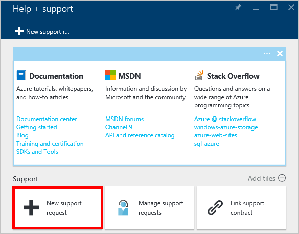

<properties
    pageTitle="Richiesta di aumentata le quote di account DocumentDB | Microsoft Azure"
    description="Informazioni su come richiedere un adeguamento per DocumentDB le quote di database, ad esempio lo spazio di archiviazione di documenti e produttività per insieme."
    services="documentdb"
    authors="AndrewHoh"
    manager="jhubbard"
    editor="monicar"
    documentationCenter=""/>

<tags
    ms.service="documentdb"
    ms.workload="data-services"
    ms.tgt_pltfrm="na"
    ms.devlang="na"
    ms.topic="article"
    ms.date="08/25/2016"
    ms.author="anhoh"/>

# Richiesta maggiore limiti del conto DocumentDB

[Microsoft Azure DocumentDB](https://azure.microsoft.com/services/documentdb/) dispone di un insieme di quote predefinite che possono essere modificati contattando il supporto di Azure.  In questo articolo viene illustrato come richiedere un aumento di quota.

Dopo aver letto in questo articolo, sarà possibile rispondere alle domande seguenti:  

-   Le quote di database DocumentDB possono essere modificate contattando il supporto di Azure?
-   Come è possibile richiedere una modifica di quota DocumentDB account?

##Quote di account DocumentDB

Nella tabella seguente descrive le quote di DocumentDB. Le quote che hanno un asterisco (*) possono essere modificate contattando il supporto di Azure:

[AZURE.INCLUDE [azure-documentdb-limits](../../includes/azure-documentdb-limits.md)]

##Richiedere una modifica di quota
La procedura seguente viene illustrato come richiedere una modifica quota.

1. Nel [portale di Azure](https://portal.azure.com), fare clic su **Altri servizi**e quindi fare clic su **Guida + supporto**.

    

2. Selezionare **nuova richiesta di assistenza**e il **supporto + della Guida** .

    

3. Selezionare **Nozioni di base**e il **Nuovo richiesta di assistenza** . Successivo, impostare **tipo di problema** di **Quota di** **sottoscrizione** al proprio abbonamento che ospita i DocumentDB account, **tipo di Quota** per **DocumentDB**e **piano di supporto** per **La Quota incluso il supporto per**. Scegliere **Avanti**.

    

4. In e il **problema** , scegliere una gravità e includere aumenta la quota di informazioni nei **Dettagli**. Fare clic su **Avanti**.

    

5. Infine, compilare le informazioni di contatto e **l'informazioni sul contatto** e fare clic su **Crea**.

Dopo aver creato il ticket di supporto, verrà visualizzato il numero di richiesta di supporto tramite posta elettronica.  È anche possibile visualizzare la richiesta di supporto facendo clic su **supporto per gestire le richieste** in e il **supporto + Guida** .

##Passaggi successivi
- Per ulteriori informazioni su DocumentDB, fare clic [qui](http://azure.com/docdb).
