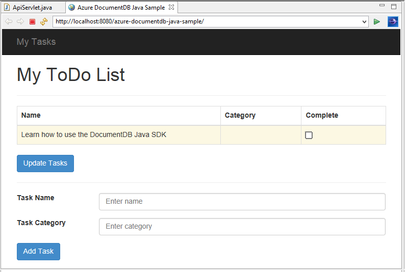
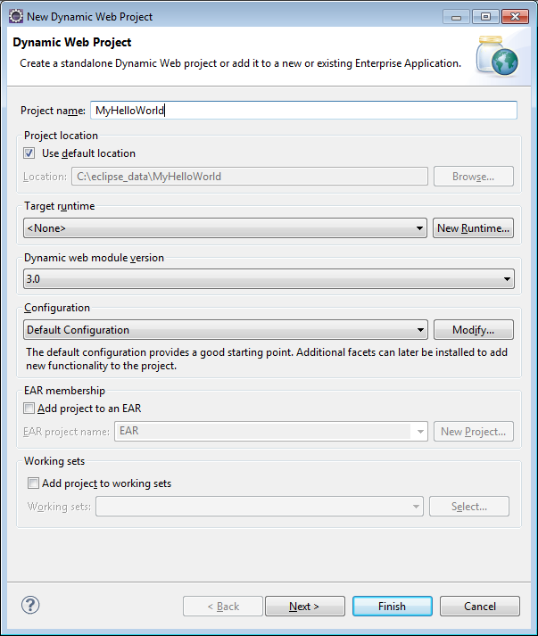

<properties
    pageTitle="Esercitazione sullo sviluppo di applicazioni Java utilizzando DocumentDB | Microsoft Azure"
    description="In questa esercitazione di applicazione web Java viene illustrato come utilizzare il servizio di Azure DocumentDB per archiviare e accedere a dati da un'applicazione di linguaggio ospitata in siti Web di Azure."
    keywords="Sviluppo di applicazioni, esercitazione con database, applicazione java, tutorial dell'applicazione web java, documentdb, azure, Microsoft azure"
    services="documentdb"
    documentationCenter="java"
    authors="dennyglee"
    manager="jhubbard"
    editor="mimig"/>

<tags
    ms.service="documentdb"
    ms.devlang="java"
    ms.topic="hero-article"
    ms.tgt_pltfrm="NA"
    ms.workload="data-services"
    ms.date="08/24/2016"
    ms.author="denlee"/>

# Creare un'applicazione web Java utilizzando DocumentDB

> [AZURE.SELECTOR]
- [.NET](documentdb-dotnet-application.md)
- [Node](documentdb-nodejs-application.md)
- [Java](documentdb-java-application.md)
- [Python](documentdb-python-application.md)

In questa esercitazione di applicazione web Java viene illustrato come utilizzare il servizio di [Microsoft Azure DocumentDB](https://portal.azure.com/#gallery/Microsoft.DocumentDB) per archiviare e accedere a dati da un'applicazione di linguaggio ospitata in siti Web di Azure. In questo argomento si apprenderà:

- Come creare un'applicazione di JSP base Eclisse.
- Informazioni su come lavorare con il servizio di Azure DocumentDB utilizzando [DocumentDB Java SDK](https://github.com/Azure/azure-documentdb-java).

In questa esercitazione applicazione Java viene illustrato come creare un'applicazione di gestione delle attività basate sul web che consente di creare, recuperare e contrassegnare le attività come completata, come illustrato nell'immagine seguente. Tutte le operazioni di elenco vengono memorizzati come documenti JSON in Azure DocumentDB.

> [AZURE.TIP] In questa esercitazione di sviluppo di applicazioni si presuppone che esista già esperienza nell'uso di linguaggio. Se ha familiarità con Java o gli [Strumenti prerequisiti](#Prerequisites), è consigliabile effettuando il download del progetto completata [todo](https://github.com/Azure-Samples/documentdb-java-todo-app) da GitHub e la compilazione, seguendo [le istruzioni alla fine di questo articolo](#GetProject). Dopo averla creata, è possibile consultare l'articolo per comprendere il codice nel contesto del progetto.  

##Prerequisiti per questa esercitazione di applicazione web Java
Prima di iniziare questa esercitazione di sviluppo di applicazioni, è necessario disporre le operazioni seguenti:

- Un account Azure attivo. Se non si dispone di un account, è possibile creare un account di valutazione gratuito in pochi minuti. Per informazioni dettagliate, vedere [Versione di valutazione gratuita di Azure](https://azure.microsoft.com/pricing/free-trial/).
- [Java Development Kit (JDK) + 7](http://www.oracle.com/technetwork/java/javase/downloads/index.html).
- [Eclipse IDE per sviluppatori Java Edition.](http://www.eclipse.org/downloads/packages/eclipse-ide-java-ee-developers/lunasr1)
- [Un sito di Azure con un ambiente runtime Java (ad esempio Tomcat o alla banchina) attivato.](../app-service-web/web-sites-java-get-started.md)

Se si sta eseguendo l'installazione di questi strumenti per la prima volta, coreservlets.com fornisce una panoramica del processo di installazione nella sezione Guida introduttiva della loro [Esercitazione: installazione TomCat7 e l'utilizzo con Eclipse](http://www.coreservlets.com/Apache-Tomcat-Tutorial/tomcat-7-with-eclipse.html) articolo.

##Passaggio 1: Creare un account di database DocumentDB

Iniziamo creando un account DocumentDB. Se si dispone già di un account, è possibile passare al [passaggio 2: creare l'applicazione Java JSP](#CreateJSP).

[AZURE.INCLUDE [documentdb-create-dbaccount](../../includes/documentdb-create-dbaccount.md)]

[AZURE.INCLUDE [documentdb-keys](../../includes/documentdb-keys.md)]

##Passaggio 2: Creare l'applicazione JSP Java

Per creare l'applicazione JSP:

1. Prima di tutto necessario Iniziamo con la creazione di un progetto di linguaggio. Avviare Eclisse, quindi fare clic su **File**, fare clic su **Nuovo**e quindi fare clic su **Project Web dinamico**. Se non è visibile **Dinamico progetto Web** elencato come un progetto disponibile, eseguire le operazioni seguenti: fare clic su **File**, fare clic su **Nuovo**, fare clic su **progetto**…, espandere **Web**, fare clic su **Progetto Web dinamico**e fare clic su **Avanti**.

    

2. Immettere il nome del progetto nella casella **nome del progetto** e nel menu a discesa **Runtime di destinazione** , è possibile selezionare un valore (ad esempio Apache Tomcat 7.0) e quindi fare clic su **Fine**. La selezione di un destinazione runtime consente di eseguire in locale del progetto tramite Eclisse.
3. In Eclisse, nella visualizzazione Gestione progetti espandere il progetto. Pulsante destro del mouse **DatiWeb**, fare clic su **Nuovo**e quindi fare clic su **File JSP**.
4. Nella finestra di dialogo **Nuovo File JSP** assegnare un nome di file **index.jsp**. Mantenere la cartella padre come **DatiWeb**, come illustrato nella figura seguente e quindi fare clic su **Avanti**.

    

5. Nella finestra di dialogo **Seleziona modello JSP** allo scopo di questa esercitazione selezionare **Nuovo File JSP (html)**e quindi fare clic su **Fine**.

6. Quando si apre il file index.jsp in Eclisse, aggiungere testo da visualizzare **Hello World!** all'interno di esistente <body> elemento. L'aggiornamento <body> contenuto avrà un aspetto simile al seguente codice:

        <body>
            <% out.println("Hello World!"); %>
        </body>

8. Salvare il file index.jsp.
9. Se si imposta un runtime di destinazione nel passaggio 2, è possibile fare clic su **progetto** e quindi su **Esegui** per eseguire l'applicazione JSP in locale:

    

##Passaggio 3: Installare il linguaggio DocumentDB SDK ##

Il modo più semplice in modo da estrarre SDK di linguaggio DocumentDB e le relative dipendenze è tramite [Maven Apache](http://maven.apache.org/).

A questo scopo è necessario convertire il progetto in un progetto maven completando la procedura seguente:

1. Pulsante destro del mouse sul progetto in Esplora aree di progetto, fare clic su **Configura**, fare clic su **Converti Maven progetto**.
2. Nella finestra **Crea nuovo POM** accettare le impostazioni predefinite e fare clic su **Fine**.
3. In **Gestione progetti**, aprire il file pom.xml.
4. Nella scheda **dipendenze** , nel riquadro **dipendenze** , fare clic su **Aggiungi**.
4. Nella finestra **Selezionare dipendenza** , eseguire le operazioni seguenti:
 - Nella casella **ID** immettere com.microsoft.azure.
 - Nella casella **Id elemento** immettere documentdb azure.
 - Nella casella **versione** immettere 1.5.1.

    

    Oppure aggiungere XML della dipendenza per ID gruppo e un ArtifactId direttamente a pom.xml tramite un editor di testo:

        <dependency>
            <groupId>com.microsoft.azure</groupId>
            <artifactId>azure-documentdb</artifactId>
            <version>1.5.1</version>
        </dependency>

5. Fare clic su **Ok** e Maven verrà installato SDK di linguaggio DocumentDB.
6. Salvare il file pom.xml.

##Passaggio 4: Utilizzo del servizio DocumentDB in un'applicazione Java

1. Prima di tutto, è importante definire l'oggetto TodoItem:

        @Data
        @Builder
        public class TodoItem {
            private String category;
            private boolean complete;
            private String id;
            private String name;
        }

    In questo progetto, si utilizza [Project Lombok](http://projectlombok.org/) per generare il costruttore, Get, set e un generatore. In alternativa, è possibile scrivere il codice manualmente o disporre IDE generato automaticamente.

2. Per attivare il servizio DocumentDB, creare un nuovo **DocumentClient**. In generale, è preferibile riutilizzare **DocumentClient** - invece di creare un nuovo client per ogni richiesta successiva. È possibile riutilizzare il client inserendo il client in un **DocumentClientFactory**. Questo è anche nel punto in cui è necessario incollare il valore di chiave primaria e URI salvato agli Appunti nel [passaggio 1](#CreateDB). Sostituire [il\_ENDPOINT\_qui] con il URI e Sostituisci [il\_chiave\_qui] con la chiave primaria.

        private static final String HOST = "[YOUR_ENDPOINT_HERE]";
        private static final String MASTER_KEY = "[YOUR_KEY_HERE]";

        private static DocumentClient documentClient;

        public static DocumentClient getDocumentClient() {
            if (documentClient == null) {
                documentClient = new DocumentClient(HOST, MASTER_KEY,
                        ConnectionPolicy.GetDefault(), ConsistencyLevel.Session);
            }

            return documentClient;
        }

3. A questo punto creare un oggetto DAO (Data Access) per estrarre il salvataggio il nostro elementi ToDo a DocumentDB.

    Per salvare gli elementi ToDo a una raccolta, è necessario sapere quali database e insieme in modo permanente per il client (come riferimento da self-collegamenti). In generale, è preferibile memorizzare nella cache del database e insieme laddove possibile per evitare ulteriori andata e ritorno al database.

    Il codice seguente viene illustrato come recuperare il database e nella raccolta, se esistente o crearne uno nuovo se non è presente:

        public class DocDbDao implements TodoDao {
            // The name of our database.
            private static final String DATABASE_ID = "TodoDB";

            // The name of our collection.
            private static final String COLLECTION_ID = "TodoCollection";

            // The DocumentDB Client
            private static DocumentClient documentClient = DocumentClientFactory
                    .getDocumentClient();

            // Cache for the database object, so we don't have to query for it to
            // retrieve self links.
            private static Database databaseCache;

            // Cache for the collection object, so we don't have to query for it to
            // retrieve self links.
            private static DocumentCollection collectionCache;

            private Database getTodoDatabase() {
                if (databaseCache == null) {
                    // Get the database if it exists
                    List<Database> databaseList = documentClient
                            .queryDatabases(
                                    "SELECT * FROM root r WHERE r.id='" + DATABASE_ID
                                            + "'", null).getQueryIterable().toList();

                    if (databaseList.size() > 0) {
                        // Cache the database object so we won't have to query for it
                        // later to retrieve the selfLink.
                        databaseCache = databaseList.get(0);
                    } else {
                        // Create the database if it doesn't exist.
                        try {
                            Database databaseDefinition = new Database();
                            databaseDefinition.setId(DATABASE_ID);

                            databaseCache = documentClient.createDatabase(
                                    databaseDefinition, null).getResource();
                        } catch (DocumentClientException e) {
                            // TODO: Something has gone terribly wrong - the app wasn't
                            // able to query or create the collection.
                            // Verify your connection, endpoint, and key.
                            e.printStackTrace();
                        }
                    }
                }

                return databaseCache;
            }

            private DocumentCollection getTodoCollection() {
                if (collectionCache == null) {
                    // Get the collection if it exists.
                    List<DocumentCollection> collectionList = documentClient
                            .queryCollections(
                                    getTodoDatabase().getSelfLink(),
                                    "SELECT * FROM root r WHERE r.id='" + COLLECTION_ID
                                            + "'", null).getQueryIterable().toList();

                    if (collectionList.size() > 0) {
                        // Cache the collection object so we won't have to query for it
                        // later to retrieve the selfLink.
                        collectionCache = collectionList.get(0);
                    } else {
                        // Create the collection if it doesn't exist.
                        try {
                            DocumentCollection collectionDefinition = new DocumentCollection();
                            collectionDefinition.setId(COLLECTION_ID);

                            collectionCache = documentClient.createCollection(
                                    getTodoDatabase().getSelfLink(),
                                    collectionDefinition, null).getResource();
                        } catch (DocumentClientException e) {
                            // TODO: Something has gone terribly wrong - the app wasn't
                            // able to query or create the collection.
                            // Verify your connection, endpoint, and key.
                            e.printStackTrace();
                        }
                    }
                }

                return collectionCache;
            }
        }

4. Il passaggio successivo consiste nello scrivere codice per mantenere TodoItems alla raccolta. In questo esempio, [Gson](https://code.google.com/p/google-gson/) verrà usata per serializzare e deserializzare TodoItem normale vecchi oggetti Java (POJOs) ai documenti JSON. [Bianchi](http://jackson.codehaus.org/) o il proprio serializzatore personalizzato sono alternative ideale per serializzare POJOs.

        // We'll use Gson for POJO <=> JSON serialization for this example.
        private static Gson gson = new Gson();

        @Override
        public TodoItem createTodoItem(TodoItem todoItem) {
            // Serialize the TodoItem as a JSON Document.
            Document todoItemDocument = new Document(gson.toJson(todoItem));

            // Annotate the document as a TodoItem for retrieval (so that we can
            // store multiple entity types in the collection).
            todoItemDocument.set("entityType", "todoItem");

            try {
                // Persist the document using the DocumentClient.
                todoItemDocument = documentClient.createDocument(
                        getTodoCollection().getSelfLink(), todoItemDocument, null,
                        false).getResource();
            } catch (DocumentClientException e) {
                e.printStackTrace();
                return null;
            }

            return gson.fromJson(todoItemDocument.toString(), TodoItem.class);
        }

5. Ad esempio DocumentDB database e raccolte, anche fanno riferimento i documenti da collegamenti automatica. La funzione di supporto seguenti consente recuperare i documenti da un altro attributo (ad esempio "id") anziché self-collegamento:

        private Document getDocumentById(String id) {
            // Retrieve the document using the DocumentClient.
            List<Document> documentList = documentClient
                    .queryDocuments(getTodoCollection().getSelfLink(),
                            "SELECT * FROM root r WHERE r.id='" + id + "'", null)
                    .getQueryIterable().toList();

            if (documentList.size() > 0) {
                return documentList.get(0);
            } else {
                return null;
            }
        }

6. È possibile utilizzare il metodo helper nel passaggio 5 per recuperare un documento TodoItem JSON per id e quindi deserializzare a un POJO:

        @Override
        public TodoItem readTodoItem(String id) {
            // Retrieve the document by id using our helper method.
            Document todoItemDocument = getDocumentById(id);

            if (todoItemDocument != null) {
                // De-serialize the document in to a TodoItem.
                return gson.fromJson(todoItemDocument.toString(), TodoItem.class);
            } else {
                return null;
            }
        }

7. È anche possibile utilizzare il DocumentClient per ottenere una raccolta o un elenco di TodoItems utilizzando DocumentDB SQL:

        @Override
        public List<TodoItem> readTodoItems() {
            List<TodoItem> todoItems = new ArrayList<TodoItem>();

            // Retrieve the TodoItem documents
            List<Document> documentList = documentClient
                    .queryDocuments(getTodoCollection().getSelfLink(),
                            "SELECT * FROM root r WHERE r.entityType = 'todoItem'",
                            null).getQueryIterable().toList();

            // De-serialize the documents in to TodoItems.
            for (Document todoItemDocument : documentList) {
                todoItems.add(gson.fromJson(todoItemDocument.toString(),
                        TodoItem.class));
            }

            return todoItems;
        }

8. Esistono diversi modi per aggiornare un documento con la DocumentClient. Nell'applicazione di elenco Todo, si desidera essere in grado di attivare la visualizzazione di un TodoItem è stata completata. Può essere ottenuto aggiornando l'attributo "completa" all'interno del documento:

        @Override
        public TodoItem updateTodoItem(String id, boolean isComplete) {
            // Retrieve the document from the database
            Document todoItemDocument = getDocumentById(id);

            // You can update the document as a JSON document directly.
            // For more complex operations - you could de-serialize the document in
            // to a POJO, update the POJO, and then re-serialize the POJO back in to
            // a document.
            todoItemDocument.set("complete", isComplete);

            try {
                // Persist/replace the updated document.
                todoItemDocument = documentClient.replaceDocument(todoItemDocument,
                        null).getResource();
            } catch (DocumentClientException e) {
                e.printStackTrace();
                return null;
            }

            return gson.fromJson(todoItemDocument.toString(), TodoItem.class);
        }

9. Infine, ci teniamo la possibilità di eliminare un TodoItem dall'elenco. A questo scopo è possibile utilizzare il metodo di supporto che è scritto in precedenza per recuperare la modalità self-creare un collegamento e quindi indicare al client per eliminarla:

        @Override
        public boolean deleteTodoItem(String id) {
            // DocumentDB refers to documents by self link rather than id.

            // Query for the document to retrieve the self link.
            Document todoItemDocument = getDocumentById(id);

            try {
                // Delete the document by self link.
                documentClient.deleteDocument(todoItemDocument.getSelfLink(), null);
            } catch (DocumentClientException e) {
                e.printStackTrace();
                return false;
            }

            return true;
        }

##Passaggio 5: Cablaggio il resto del linguaggio progetto dell'applicazione sviluppo insieme

Ora che sono state completato il divertimento bit - tutti che a sinistra consiste nel creare un utente rapido interfaccia e collegare fino a nostro DAO.

1. Prima di tutto, iniziamo con la creazione di un controller per chiamare il nostro DAO:

        public class TodoItemController {
            public static TodoItemController getInstance() {
                if (todoItemController == null) {
                    todoItemController = new TodoItemController(TodoDaoFactory.getDao());
                }
                return todoItemController;
            }

            private static TodoItemController todoItemController;

            private final TodoDao todoDao;

            TodoItemController(TodoDao todoDao) {
                this.todoDao = todoDao;
            }

            public TodoItem createTodoItem(@NonNull String name,
                    @NonNull String category, boolean isComplete) {
                TodoItem todoItem = TodoItem.builder().name(name).category(category)
                        .complete(isComplete).build();
                return todoDao.createTodoItem(todoItem);
            }

            public boolean deleteTodoItem(@NonNull String id) {
                return todoDao.deleteTodoItem(id);
            }

            public TodoItem getTodoItemById(@NonNull String id) {
                return todoDao.readTodoItem(id);
            }

            public List<TodoItem> getTodoItems() {
                return todoDao.readTodoItems();
            }

            public TodoItem updateTodoItem(@NonNull String id, boolean isComplete) {
                return todoDao.updateTodoItem(id, isComplete);
            }
        }

    In un'applicazione più complessa, il controller può contenere logica aziendale complesso nella parte superiore di DAO.

2. Successivamente, creiamo una servlet per indirizzare le richieste HTTP al controller di:

        public class TodoServlet extends HttpServlet {
            // API Keys
            public static final String API_METHOD = "method";

            // API Methods
            public static final String CREATE_TODO_ITEM = "createTodoItem";
            public static final String GET_TODO_ITEMS = "getTodoItems";
            public static final String UPDATE_TODO_ITEM = "updateTodoItem";

            // API Parameters
            public static final String TODO_ITEM_ID = "todoItemId";
            public static final String TODO_ITEM_NAME = "todoItemName";
            public static final String TODO_ITEM_CATEGORY = "todoItemCategory";
            public static final String TODO_ITEM_COMPLETE = "todoItemComplete";

            public static final String MESSAGE_ERROR_INVALID_METHOD = "{'error': 'Invalid method'}";

            private static final long serialVersionUID = 1L;
            private static final Gson gson = new Gson();

            @Override
            protected void doGet(HttpServletRequest request,
                    HttpServletResponse response) throws ServletException, IOException {

                String apiResponse = MESSAGE_ERROR_INVALID_METHOD;

                TodoItemController todoItemController = TodoItemController
                        .getInstance();

                String id = request.getParameter(TODO_ITEM_ID);
                String name = request.getParameter(TODO_ITEM_NAME);
                String category = request.getParameter(TODO_ITEM_CATEGORY);
                boolean isComplete = StringUtils.equalsIgnoreCase("true",
                        request.getParameter(TODO_ITEM_COMPLETE)) ? true : false;

                switch (request.getParameter(API_METHOD)) {
                case CREATE_TODO_ITEM:
                    apiResponse = gson.toJson(todoItemController.createTodoItem(name,
                            category, isComplete));
                    break;
                case GET_TODO_ITEMS:
                    apiResponse = gson.toJson(todoItemController.getTodoItems());
                    break;
                case UPDATE_TODO_ITEM:
                    apiResponse = gson.toJson(todoItemController.updateTodoItem(id,
                            isComplete));
                    break;
                default:
                    break;
                }

                response.getWriter().println(apiResponse);
            }

            @Override
            protected void doPost(HttpServletRequest request,
                    HttpServletResponse response) throws ServletException, IOException {
                doGet(request, response);
            }
        }

3. È necessario un'interfaccia utente Web da visualizzare all'utente. Di seguito nuovamente scrivere la index.jsp creato in precedenza:

        <html>
        <head>
          <meta http-equiv="Content-Type" content="text/html; charset=ISO-8859-1">
          <meta http-equiv="X-UA-Compatible" content="IE=edge;" />
          <title>Azure DocumentDB Java Sample</title>

          <!-- Bootstrap -->
          <link href="//ajax.aspnetcdn.com/ajax/bootstrap/3.2.0/css/bootstrap.min.css" rel="stylesheet">

          
        </head>
        <body>
          <!-- Nav Bar -->
          

            

              

                <a class="navbar-brand" href="#">My Tasks</a>
              

            

          

          <!-- Body -->
          

            <h1>My ToDo List</h1>

            

            <!-- The ToDo List -->
            

              <table class="table table-bordered table-striped" id="todoItems">
                <thead>
                  <tr>
                    <th>Name</th>
                    <th>Category</th>
                    <th>Complete</th>
                  </tr>
                </thead>
                <tbody>
                </tbody>
              </table>

              <!-- Update Button -->
              

                <form class="form-horizontal" role="form">
                  <button type="button" class="btn btn-primary">Update Tasks</button>
                </form>
              

            

            

            <!-- Item Input Form -->
            

              <form class="form-horizontal" role="form">
                

                  <label for="inputItemName" class="col-sm-2">Task Name</label>
                  

                    <input type="text" class="form-control" id="inputItemName" placeholder="Enter name">
                  

                

                

                  <label for="inputItemCategory" class="col-sm-2">Task Category</label>
                  

                    <input type="text" class="form-control" id="inputItemCategory" placeholder="Enter category">
                  

                

                <button type="button" class="btn btn-primary">Add Task</button>
              </form>
            

          

          <!-- Placed at the end of the document so the pages load faster -->
          
          
          
        </body>
        </html>

4. E infine scrivere alcuni Javascript sul lato client per collegano l'interfaccia utente web e servlet:

        var todoApp = {
          /*
           * API methods to call Java backend.
           */
          apiEndpoint: "api",

          createTodoItem: function(name, category, isComplete) {
            $.post(todoApp.apiEndpoint, {
                "method": "createTodoItem",
                "todoItemName": name,
                "todoItemCategory": category,
                "todoItemComplete": isComplete
              },
              function(data) {
                var todoItem = data;
                todoApp.addTodoItemToTable(todoItem.id, todoItem.name, todoItem.category, todoItem.complete);
              },
              "json");
          },

          getTodoItems: function() {
            $.post(todoApp.apiEndpoint, {
                "method": "getTodoItems"
              },
              function(data) {
                var todoItemArr = data;
                $.each(todoItemArr, function(index, value) {
                  todoApp.addTodoItemToTable(value.id, value.name, value.category, value.complete);
                });
              },
              "json");
          },

          updateTodoItem: function(id, isComplete) {
            $.post(todoApp.apiEndpoint, {
                "method": "updateTodoItem",
                "todoItemId": id,
                "todoItemComplete": isComplete
              },
              function(data) {},
              "json");
          },

          /*
           * UI Methods
           */
          addTodoItemToTable: function(id, name, category, isComplete) {
            var rowColor = isComplete ? "active" : "warning";

            todoApp.ui_table().append($("<tr>")
              .append($("<td>").text(name))
              .append($("<td>").text(category))
              .append($("<td>")
                .append($("<input>")
                  .attr("type", "checkbox")
                  .attr("id", id)
                  .attr("checked", isComplete)
                  .attr("class", "isComplete")
                ))
              .addClass(rowColor)
            );
          },

          /*
           * UI Bindings
           */
          bindCreateButton: function() {
            todoApp.ui_createButton().click(function() {
              todoApp.createTodoItem(todoApp.ui_createNameInput().val(), todoApp.ui_createCategoryInput().val(), false);
              todoApp.ui_createNameInput().val("");
              todoApp.ui_createCategoryInput().val("");
            });
          },

          bindUpdateButton: function() {
            todoApp.ui_updateButton().click(function() {
              // Disable button temporarily.
              var myButton = $(this);
              var originalText = myButton.text();
              $(this).text("Updating...");
              $(this).prop("disabled", true);

              // Call api to update todo items.
              $.each(todoApp.ui_updateId(), function(index, value) {
                todoApp.updateTodoItem(value.name, value.value);
                $(value).remove();
              });

              // Re-enable button.
              setTimeout(function() {
                myButton.prop("disabled", false);
                myButton.text(originalText);
              }, 500);
            });
          },

          bindUpdateCheckboxes: function() {
            todoApp.ui_table().on("click", ".isComplete", function(event) {
              var checkboxElement = $(event.currentTarget);
              var rowElement = $(event.currentTarget).parents('tr');
              var id = checkboxElement.attr('id');
              var isComplete = checkboxElement.is(':checked');

              // Toggle table row color
              if (isComplete) {
                rowElement.addClass("active");
                rowElement.removeClass("warning");
              } else {
                rowElement.removeClass("active");
                rowElement.addClass("warning");
              }

              // Update hidden inputs for update panel.
              todoApp.ui_updateForm().children("input[name='" + id + "']").remove();

              todoApp.ui_updateForm().append($("<input>")
                .attr("type", "hidden")
                .attr("class", "updateComplete")
                .attr("name", id)
                .attr("value", isComplete));

            });
          },

          /*
           * UI Elements
           */
          ui_createNameInput: function() {
            return $(".todoForm #inputItemName");
          },

          ui_createCategoryInput: function() {
            return $(".todoForm #inputItemCategory");
          },

          ui_createButton: function() {
            return $(".todoForm button");
          },

          ui_table: function() {
            return $(".todoList table tbody");
          },

          ui_updateButton: function() {
            return $(".todoUpdatePanel button");
          },

          ui_updateForm: function() {
            return $(".todoUpdatePanel form");
          },

          ui_updateId: function() {
            return $(".todoUpdatePanel .updateComplete");
          },

          /*
           * Install the TodoApp
           */
          install: function() {
            todoApp.bindCreateButton();
            todoApp.bindUpdateButton();
            todoApp.bindUpdateCheckboxes();

            todoApp.getTodoItems();
          }
        };

        $(document).ready(function() {
          todoApp.install();
        });

5. Amici! A questo punto tutto ciò che resta è per testare l'applicazione. Eseguire l'applicazione in locale e aggiungere alcuni elementi Todo specificando il nome elemento e la categoria e fare clic su **Aggiungi attività**.

6. Quando viene visualizzata l'elemento, è possibile aggiornare se è stata completata, attivare e disattivare la casella di controllo e fare clic su **Aggiorna attività**.

##Passaggio 6: Distribuire l'applicazione di linguaggio ai siti Web di Azure

Siti Web Azure consente la distribuzione delle applicazioni di linguaggio semplice come l'esportazione di un'applicazione come file WAR e di caricamento tramite il codice sorgente (ad esempio fra) o FTP.

1. Per esportare l'applicazione come una GUERRA, fare clic su un progetto in **Esplora progetti**, fare clic su **Esporta**e quindi fare clic su **File WAR**.
2. Nella finestra **WAR esportazione** , eseguire le operazioni seguenti:
 - Nella finestra di project Web immettere campioni linguaggio di documentdb azure.
 - Nella finestra di destinazione, scegliere una destinazione in cui salvare il file WAR.
 - Fare clic su **Fine**.

3. Dopo aver creato un file WAR in a portata di mano, è possibile caricarlo semplicemente alla directory **WebApp** del sito Web Azure. Per ulteriori informazioni sul caricamento di file, vedere [aggiunta di un'applicazione al sito Web di linguaggio Azure](../app-service-web/web-sites-java-add-app.md).

    Dopo il file WAR caricamento alla directory webapp, l'ambiente di runtime rileva stato aggiunto e verrà automaticamente caricata.
4. Per visualizzare il prodotto finito, passare a http://YOUR\_sito\_NAME.azurewebsites.net/azure-documentdb-java-sample/ e iniziare ad aggiungere le attività.

##È possibile ottenere il progetto dal GitHub

Tutti gli esempi di questa esercitazione sono inclusi nel progetto [todo](https://github.com/Azure-Samples/documentdb-java-todo-app) su GitHub. Per importare il progetto todo in Eclisse, verificare di disporre del software e risorse elencate nella sezione [Prerequisiti](#Prerequisites) , quindi eseguire le operazioni seguenti:

1. Installare [Project Lombok](http://projectlombok.org/). Lombok viene usata per generare costruttori, Get, metodi per l'impostazione del progetto. Dopo avere scaricato il file lombok.jar, fare doppio clic su esso per installarlo o installare dalla riga di comando.
2. Se Eclisse è aperta, chiuderla e riavviare in modo da caricare Lombok.
3. In Eclisse, nel menu **File** fare clic su **Importa**.
4. Nella finestra **Importa** fare clic su **fra**, fare clic su **progetti da fra**e quindi fare clic su **Avanti**.
5. Nella schermata **Selezionare archivio di origine** fare clic su **URI duplicato**.
6. Nella schermata di **Origine fra archivio** , nella casella **URI** immettere https://github.com/Azure-Samples/documentdb-java-todo-app.git e quindi fare clic su **Avanti**.
7. Nella schermata di **Selezione ramo** , assicurarsi che **master** sia selezionata e quindi fare clic su **Avanti**.
8. Nella schermata di **Destinazione locale** , fare clic su **Sfoglia** per selezionare una cartella in cui l'archivio possono essere copiati e quindi fare clic su **Avanti**.
9. Nella schermata **Selezionare una procedura guidata per l'importazione di progetti** , assicurarsi che **importare progetti esistenti** sia selezionata e quindi fare clic su **Avanti**.
10. Nella schermata di **Progetti di importazione** , deselezionare il progetto **DocumentDB** e quindi fare clic su **Fine**. Il progetto DocumentDB contiene SDK di linguaggio DocumentDB, verrà aggiunto come dipendenza invece.
11. In **Gestione progetti**, passare a azure-documentdb-java-sample\src\com.microsoft.azure.documentdb.sample.dao\DocumentClientFactory.java e sostituire i valori HOST e MASTER_KEY con la chiave primaria per l'account DocumentDB URI e quindi salvare il file. Per ulteriori informazioni, vedere [passaggio 1. Creare un account di database DocumentDB](#CreateDB).
12. In **Gestione progetti**, fare clic con il pulsante destro **campioni linguaggio di documentdb azure**e quindi fare clic su **Configura percorso compilare** **Compilazione percorso**.
13. Nella schermata di **Linguaggio creare percorso** , nel riquadro destro selezionare la scheda **raccolte** e quindi fare clic su **Aggiungi JARs esterni**. Passare al percorso del file lombok.jar e fare clic su **Apri**e quindi fare clic su **OK**.
14. Usare passaggio 12 per aprire nuovamente la finestra **proprietà** e quindi nel riquadro sinistro fare clic su **Runtime destinate**.
15. Nella schermata di **Runtime di destinazione** , fare clic su **Nuovo**, selezionare **Apache Tomcat 7.0**e fare clic su **OK**.
16. Utilizzare passaggio 12 per aprire nuovamente la finestra **proprietà** e quindi nel riquadro sinistro fare clic su **Progetto facet**.
17. Nella schermata **Facet progetto** selezionare **Modulo Web dinamico** e **Java**e quindi fare clic su **OK**.
18. Nella scheda **server** nella parte inferiore dello schermo, rapida **Tomcat 7.0 Server host locale** e quindi fare clic su **Aggiungi e Rimuovi**.
19. Nella finestra **aggiungere e rimuovere** spostare **campioni linguaggio di documentdb azure** nella casella **configurato** e quindi fare clic su **Fine**.
20. Nella scheda **Server** destro **Tomcat 7.0 Server host locale**e quindi scegliere **Riavvia**.
21. In un browser passare a http://localhost:8080/azure-documentdb-java-sample / e iniziare ad aggiungere all'elenco attività. Si noti che se sono state modificate i valori di porta predefinita, impostare il valore selezionato 8080.
22. Per distribuire il progetto in un sito web Azure, vedere [passaggio 6. Distribuire l'applicazione ai siti Web di Azure](#Deploy).

[1]: media/documentdb-java-application/keys.png
