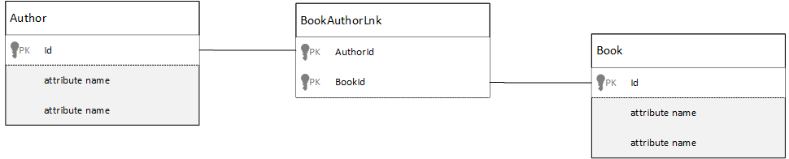

<properties 
    pageTitle="Modellazione dei dati di Azure DocumentDB | Microsoft Azure" 
    description="Informazioni sui dati di modellazione per DocumentDB, un database di documento NoSQL." 
    keywords="modellazione dei dati"
    services="documentdb" 
    authors="kiratp" 
    manager="jhubbard" 
    editor="mimig1" 
    documentationCenter=""/>

<tags 
    ms.service="documentdb" 
    ms.workload="data-services" 
    ms.tgt_pltfrm="na" 
    ms.devlang="na" 
    ms.topic="article" 
    ms.date="08/05/2016" 
    ms.author="kipandya"/>

#Modellazione dei dati in DocumentDB#
Mentre database gratuiti schema, ad esempio DocumentDB Azure, rendono super facile accogliere le modifiche apportate a un modello di dati devono ancora dedicato alcuni ritenere ora i dati. 

Dati modalità da archiviare? L'applicazione modalità per recuperare ed eseguire query di dati? L'applicazione leggere larga o scrittura è eccessivo? 

Dopo aver letto in questo articolo, sarà possibile rispondere alle domande seguenti:

- Come è opportuno considerare un documento in un database di documento?
- Che cos'è modellazione dei dati e perché è opportuno ansia? 
- Qual è la modellazione dei dati in un database di documenti diversi a un database relazionale?
- Come express relazioni tra i dati in un database non relazionali?
- Quando incorporare dati e quando si collega ai dati?

##Incorporamento di dati##
Quando si avvia modellazione dei dati in un archivio di documenti, ad esempio DocumentDB, provare a indicazione l'entità **indipendenti documenti** rappresentato in JSON.

Prima di iniziare è troppo maggiore, automatica pochi passaggi indietro e vedere come è possibile del modello di un elemento in un database relazionale, un oggetto molti utenti è già abituati. Nell'esempio seguente mostra come una persona può essere memorizzata in un database relazionale. 

Quando si lavora con i database relazionali, è state illustrate per gli anni normalizzare, normalizzare, normalizzare.

Normalizzare i dati in genere consiste nel prendere un'entità, ad esempio una persona e suddividere la a elementi distinti di dati. Nell'esempio precedente, un utente può avere più record di informazioni di contatto, nonché più record indirizzo. È anche passaggio successivo e suddivisione informazioni di contatto per l'estrazione ulteriormente comuni campi come tipo. Stesso indirizzo, ogni record qui dispone di un tipo, ad esempio *Home* o *Business* 

La Guida premise quando normalizzare dati consiste nell' **evitare di archiviare dati ridondanti** in ogni record e invece fare riferimento ai dati. In questo esempio, per leggere un utente, tutte le informazioni di contatto e indirizzi, è necessario utilizzare join per aggregare in modo efficace i dati in fase di esecuzione.

    SELECT p.FirstName, p.LastName, a.City, cd.Detail
    FROM Person p
    JOIN ContactDetail cd ON cd.PersonId = p.Id
    JOIN ContactDetailType on cdt ON cdt.Id = cd.TypeId
    JOIN Address a ON a.PersonId = p.Id

Aggiornamento di una sola persona con i contatti e gli indirizzi richiede operazioni di scrittura molti singole tabelle. 

A questo punto diamo un'occhiata a come si preferisce modello gli stessi dati come un'entità indipendente in un database di documento.
        
    {
        "id": "1",
        "firstName": "Thomas",
        "lastName": "Andersen",
        "addresses": [
            {            
                "line1": "100 Some Street",
                "line2": "Unit 1",
                "city": "Seattle",
                "state": "WA",
                "zip": 98012
            }
        ],
        "contactDetails": [
            {"email: "thomas@andersen.com"},
            {"phone": "+1 555 555-5555", "extension": 5555}
        ] 
    }

Utilizzando l'approccio sopra abbiamo ora **denormalizzati** persona registrare posizione in cui è **incorporata** tutte le informazioni relative a questa persona, ad esempio le informazioni di contatto e indirizzi a un singolo documento JSON.
Inoltre, poiché non è stiamo limitati a uno schema fisso è hanno la possibilità di eseguire operazioni come avere informazioni di contatto di forme diverse completamente. 

Recupero di un record persona completo dal database è ora un unico operazione su un'unica raccolta e per un singolo documento di lettura. Aggiornamento di un record di persona, con i contatti e gli indirizzi, è anche un'operazione di scrittura singola rispetto a un singolo documento.

Da denormalizzazione dei dati, l'applicazione potrebbe essere necessario eseguire un numero minore di query e aggiornamenti per completare le operazioni comuni. 

###Quando deve essere incorporato

In generale, utilizzare dati incorporati modelli quando:

- Esistono **contiene** le relazioni tra entità.
- Sono disponibili **uno per alcune** relazioni tra entità.
- Esiste dati incorporati che **vengono modificati raramente**.
- È incorporato non aumento **senza associazione**dati.
- Esiste dati incorporati **integrale** ai dati in un documento.

> [AZURE.NOTE] In genere dati denormalizzati offrono migliorare le prestazioni di **lettura** .

###Quando non incorporare

Mentre la regola generale in un database di documento per l'utilizzo della denormalizzazione tutti gli elementi e incorporare tutti i dati a un singolo documento, questo può comportare alcune situazioni che devono essere evitati.

Richiedere il frammento di JSON.

    {
        "id": "1",
        "name": "What's new in the coolest Cloud",
        "summary": "A blog post by someone real famous",
        "comments": [
            {"id": 1, "author": "anon", "comment": "something useful, I'm sure"},
            {"id": 2, "author": "bob", "comment": "wisdom from the interwebs"},
            …
            {"id": 100001, "author": "jane", "comment": "and on we go ..."},
            …
            {"id": 1000000001, "author": "angry", "comment": "blah angry blah angry"},
            …
            {"id": ∞ + 1, "author": "bored", "comment": "oh man, will this ever end?"},
        ]
    }

Può essere un'entità post con commenti incorporati aspetto che avrà se sono stati modellare un tipico blog o CMS, sistema. Il problema con questo esempio è in forma di matrice commenti **illimitata**, non significa che non esiste alcun limite (pratico) al numero di commenti possono avere qualsiasi post singola. Come le dimensioni del documento potrebbero aumentare notevolmente diventerà un problema.

> [AZURE.TIP] I documenti in DocumentDB sono una dimensione massima. Per ulteriori informazioni su questo consultare [limiti DocumentDB](documentdb-limits.md).

Quando le dimensioni del documento aumentano la possibilità di trasmettere i dati in transito, nonché la lettura e aggiornamento del documento, in scala, verranno interessati.

In questo caso sarebbe migliore da prendere in considerazione il seguente modello.
        
    Post document:
    {
        "id": "1",
        "name": "What's new in the coolest Cloud",
        "summary": "A blog post by someone real famous",
        "recentComments": [
            {"id": 1, "author": "anon", "comment": "something useful, I'm sure"},
            {"id": 2, "author": "bob", "comment": "wisdom from the interwebs"},
            {"id": 3, "author": "jane", "comment": "....."}
        ]
    }

    Comment documents:
    {
        "postId": "1"
        "comments": [
            {"id": 4, "author": "anon", "comment": "more goodness"},
            {"id": 5, "author": "bob", "comment": "tails from the field"},
            ...
            {"id": 99, "author": "angry", "comment": "blah angry blah angry"}
        ]
    },
    {
        "postId": "1"
        "comments": [
            {"id": 100, "author": "anon", "comment": "yet more"},
            ...
            {"id": 199, "author": "bored", "comment": "will this ever end?"}
        ]
    }

Questo modello include tre più recente commenti incorporati sul post stesso, ovvero una matrice con fisse associato a questo momento. Altri commenti sono raggruppati in batch di 100 commenti e archiviati in documenti distinti. Le dimensioni del batch è stato scelto come 100 applicazione fittizia consente all'utente di caricare 100 commenti alla volta.  

Un altro caso in cui incorporare dati non sono consigliabile è quando i dati incorporati viene usati spesso in tutti i documenti e modificati frequentemente. 

Richiedere il frammento di JSON.

    {
        "id": "1",
        "firstName": "Thomas",
        "lastName": "Andersen",
        "holdings": [
            {
                "numberHeld": 100,
                "stock": { "symbol": "zaza", "open": 1, "high": 2, "low": 0.5 }
            },
            {
                "numberHeld": 50,
                "stock": { "symbol": "xcxc", "open": 89, "high": 93.24, "low": 88.87 }
            }
        ]
    }

Questa operazione può rappresentare portfolio per quotazioni azionarie di una persona. Avendo scelto incorporare le informazioni in ogni documento portfolio. In un ambiente in cui vengono modificati frequentemente dati correlati, ad esempio un titolo applicazione di gestione, l'incorporamento di dati vengono modificati frequentemente verrà significa che si sta aggiornando ogni documento portfolio continuamente ogni volta che vengono scambiate un azioni.

Per quotazioni azionarie *zaza* possono essere scambiati centinaia di volte in un singolo giorno e migliaia di utenti potrebbero avere *zaza* sulla loro portfolio. Con un modello di dati come le risposte sopra è necessario aggiornare tutte le volte migliaia di documenti portfolio quotidianamente con un sistema che non è possibile ridimensionare ben. 

##Fare riferimento ai dati##

E quindi incorporare dati funziona perfettamente per molti casi, ma è chiaro che vi sono scenari quando denormalizzazione dei dati causerà altri problemi che è importante. Che cosa viene eseguito ora? 

Database relazionali non sono l'unico punto in cui è possibile creare relazioni tra entità. In un database di documento si possono contenere informazioni in un documento in realtà relative ai dati in altri documenti. A questo punto, sta non viene invitato per anche un minuto creiamo sistemi da più adatto a un database relazionale in DocumentDB o qualsiasi altro database di documento, ma le relazioni semplici sono fitta e possono essere molto utile. 

Nel JSON riportata di seguito si è scelto di usare l'esempio di un portfolio per quotazioni azionarie da versioni precedenti, ma questa volta abbiamo fare riferimento all'elemento per quotazioni azionarie nel portfolio anziché incorporandolo. In questo modo, quando l'elemento per quotazioni azionarie vengono modificati frequentemente durante il giorno l'unico documento che deve essere aggiornato è l'unico documento per quotazioni azionarie. 

    Person document:
    {
        "id": "1",
        "firstName": "Thomas",
        "lastName": "Andersen",
        "holdings": [
            { "numberHeld":  100, "stockId": 1},
            { "numberHeld":  50, "stockId": 2}
        ]
    }
    
    Stock documents:
    {
        "id": "1",
        "symbol": "zaza",
        "open": 1,
        "high": 2,
        "low": 0.5,
        "vol": 11970000,
        "mkt-cap": 42000000,
        "pe": 5.89
    },
    {
        "id": "2",
        "symbol": "xcxc",
        "open": 89,
        "high": 93.24,
        "low": 88.87,
        "vol": 2970200,
        "mkt-cap": 1005000,
        "pe": 75.82
    }
    

Un immediato svantaggio di questo approccio è tuttavia se l'applicazione è necessario per visualizzare informazioni su ciascun titolo viene mantenuto quando si visualizzano portfolio di una persona; In questo caso, sarà necessario rendere più trip al database per caricare le informazioni per ogni documento per quotazioni azionarie. Di seguito sono state apportate una decisione per migliorare l'efficienza delle operazioni di scrittura, che si verificano spesso nell'intera giornata, ma a sua violazioni per le operazioni di lettura che potenzialmente hanno un impatto minore sulle prestazioni del sistema specifico.

> [AZURE.NOTE] Normalizzato dati modelli **può richiedere più round trip** al server.

### Informazioni sulle chiavi esterne?
Poiché non c'è alcun concetto di un vincolo, chiave esterna o in caso contrario, eventuali relazioni tra i documenti contenenti nei documenti sono effettivamente "deboli" e non verranno verificati dal database stesso. Se si desidera verificare che i dati di che un documento fa riferimento esista, è necessario eseguire questa operazione nell'applicazione o mediante l'utilizzo di trigger lato server o stored procedure DocumentDB.

###Casi in cui fanno riferimento a
In generale, utilizzare i dati normalizzati modelli quando:

- Che rappresenta le relazioni **uno-a-molti** .
- Che rappresenta le relazioni **molti-a-molti** .
- Correlato ai dati **vengono modificati spesso**.
- Dati di cui viene fatto riferimenti potrebbero essere **illimitata**.

> [AZURE.NOTE] In genere normalizzare consente di migliorare le prestazioni di **scrittura** .

###Dove posizionare la relazione
La crescita della relazione consente di determinare quali documento per archiviare la Guida di riferimento.

Se si osserva il JSON che modelli autori e il materiale.

    Publisher document:
    {
        "id": "mspress",
        "name": "Microsoft Press",
        "books": [ 1, 2, 3, ..., 100, ..., 1000]
    }

    Book documents:
    {"id": "1", "name": "DocumentDB 101" }
    {"id": "2", "name": "DocumentDB for RDBMS Users" }
    {"id": "3", "name": "Taking over the world one JSON doc at a time" }
    ...
    {"id": "100", "name": "Learn about Azure DocumentDB" }
    ...
    {"id": "1000", "name": "Deep Dive in to DocumentDB" }

Se il numero di libri per publisher è piccolo con crescita limitata, quindi archiviare il riferimento di libro all'interno del documento di publisher può essere utile. Tuttavia, se il numero di libri per publisher è illimitato, questo modello di dati da portare a matrici modificabile, crescente, come illustrato sopra il documento di publisher esempio. 

Cambio di elementi all'interno di un po' comporterebbe un modello che rappresenta ancora gli stessi dati ma ora evita le raccolte di grandi dimensioni modificabili.

    Publisher document: 
    {
        "id": "mspress",
        "name": "Microsoft Press"
    }
    
    Book documents: 
    {"id": "1","name": "DocumentDB 101", "pub-id": "mspress"}
    {"id": "2","name": "DocumentDB for RDBMS Users", "pub-id": "mspress"}
    {"id": "3","name": "Taking over the world one JSON doc at a time"}
    ...
    {"id": "100","name": "Learn about Azure DocumentDB", "pub-id": "mspress"}
    ...
    {"id": "1000","name": "Deep Dive in to DocumentDB", "pub-id": "mspress"}

Nell'esempio precedente sono abbiamo eliminati insieme illimitata nel documento di publisher. Invece abbiamo solo un riferimento al server di pubblicazione su ogni documento della Rubrica.

###Modalità di modello di relazioni molti: molti
In un database relazionale le relazioni *molti: molti* spesso vengono create con le tabelle di join solo uniscono i record da altre tabelle. 

Potrebbe essere utilizzati per replicare la stessa operazione utilizzando documenti e produrre un modello di dati che ha un aspetto simile al seguente.

    Author documents: 
    {"id": "a1", "name": "Thomas Andersen" }
    {"id": "a2", "name": "William Wakefield" }
    
    Book documents:
    {"id": "b1", "name": "DocumentDB 101" }
    {"id": "b2", "name": "DocumentDB for RDBMS Users" }
    {"id": "b3", "name": "Taking over the world one JSON doc at a time" }
    {"id": "b4", "name": "Learn about Azure DocumentDB" }
    {"id": "b5", "name": "Deep Dive in to DocumentDB" }
    
    Joining documents: 
    {"authorId": "a1", "bookId": "b1" }
    {"authorId": "a2", "bookId": "b1" }
    {"authorId": "a1", "bookId": "b2" }
    {"authorId": "a1", "bookId": "b3" }

Questa operazione è corretta. Tuttavia, il caricamento di un autore con rubriche o il caricamento di un libro con autore, sempre richiede almeno due query aggiuntive sul database. Una query per il documento di unione e quindi da un'altra query per recuperare il documento da unire. 

Se tutte esegue questa tabella di join è incollaggio tra loro due elementi di dati, perché non rilasciarla completamente?
Tenere presente quanto segue.

    Author documents:
    {"id": "a1", "name": "Thomas Andersen", "books": ["b1, "b2", "b3"]}
    {"id": "a2", "name": "William Wakefield", "books": ["b1", "b4"]}
    
    Book documents: 
    {"id": "b1", "name": "DocumentDB 101", "authors": ["a1", "a2"]}
    {"id": "b2", "name": "DocumentDB for RDBMS Users", "authors": ["a1"]}
    {"id": "b3", "name": "Learn about Azure DocumentDB", "authors": ["a1"]}
    {"id": "b4", "name": "Deep Dive in to DocumentDB", "authors": ["a2"]}

A questo punto, se dispone di un autore, so immediatamente quali libri che hanno scritto e viceversa se dispone di un documento di libro caricato SO gli ID degli autori. Consente di salvare la query intermedia contro la tabella di join riducendo il numero del server di andata e l'applicazione. 

##Modelli di dati ibrido##
Ora che abbiamo esaminato incorporare (o denormalizzazione) e dati di riferimenti (o normalizzazione), disporre le upsides e hanno compromessi come abbiamo visto. 

Non sempre è necessario essere o non essere impaurito combinare elementi un po'. 

In base a criteri di utilizzo specifici e carichi di lavoro possono essere casi in cui la combinazione di incorporata dell'applicazione e dati di riferimento senso e può comportare la logica dell'applicazione più semplice con meno server andata e ritorno mantenendo un livello di prestazioni.

Valutare la possibilità di JSON seguenti. 

    Author documents: 
    {
        "id": "a1",
        "firstName": "Thomas",
        "lastName": "Andersen",     
        "countOfBooks": 3,
        "books": ["b1", "b2", "b3"],
        "images": [
            {"thumbnail": "http://....png"}
            {"profile": "http://....png"}
            {"large": "http://....png"}
        ]
    },
    {
        "id": "a2",
        "firstName": "William",
        "lastName": "Wakefield",
        "countOfBooks": 1,
        "books": ["b1"],
        "images": [
            {"thumbnail": "http://....png"}
        ]
    }
    
    Book documents:
    {
        "id": "b1",
        "name": "DocumentDB 101",
        "authors": [
            {"id": "a1", "name": "Thomas Andersen", "thumbnailUrl": "http://....png"},
            {"id": "a2", "name": "William Wakefield", "thumbnailUrl": "http://....png"}
        ]
    },
    {
        "id": "b2",
        "name": "DocumentDB for RDBMS Users",
        "authors": [
            {"id": "a1", "name": "Thomas Andersen", "thumbnailUrl": "http://....png"},
        ]
    }

Qui sono state seguita (prevalentemente) modello incorporato, in dati da altre entità sono incorporati nel documento principale, ma si desidera fare riferimento altri dati. 

Se osserva il documento della Rubrica, è possibile vedere alcune interessanti campi quando si osserva la matrice degli autori. Esiste un campo *id* che corrisponde al campo che viene utilizzata per fare riferimento a un documento di autore, pratica standard in un modello normalizzato alcuni quindi è il *nome* e *thumbnailUrl*. È possibile avere solo bloccato con *id* e a sinistra dell'applicazione per ottenere informazioni aggiuntive che base alle esigenze dal documento autore rispettivi attraverso il collegamento"", ma perché l'applicazione consente di visualizzare il nome dell'autore e un'immagine di anteprima con ogni libro visualizzato è possibile salvare un round trip nel server per libro in un elenco denormalizzandoli **alcuni** dati dell'autore.

Sicuramente se modificato il nome dell'autore o si desidera aggiornare le foto che è necessario passare un aggiornamento ogni libro possono mai pubblicati ma per l'applicazione basata sul presupposto che gli autori non vengono modificati frequentemente, i nomi si tratta di una decisione progettazione accettabile.  

Nell'esempio sono disponibili i valori **pre-calcolati aggregazioni** per salvare elaborazione costosa in un'operazione di lettura. Nell'esempio, alcuni dati incorporati nel documento autore sono i dati che viene calcolati in fase di esecuzione. Ogni volta che viene pubblicato un nuovo libro, viene creato un documento della Rubrica **e** che il campo countOfBooks è impostato su un campo calcolato in base al numero di documenti esistenti per un particolare autore. Questa ottimizzazione sono utile nei sistemi piena letti in futuro sarà possibile è facile eseguire calcoli scrittura per ottimizzare legge.

La possibilità di disporre di un modello con i campi pre-calcolati è possibile perché DocumentDB supporta **le transazioni più documenti**. Numerosi archivi NoSQL non è possibile eseguire le transazioni in tutti i documenti e pertanto assistenza decisioni relative alla progettazione, ad esempio "incorpora sempre tutto", a causa di questa limitazione. Con DocumentDB, è possibile utilizzare trigger lato server o stored procedure per inserire il materiale e aggiornare gli autori tutto all'interno di una transazione ACID. A questo punto non **dispone di** incorporare tutti gli elementi a un documento solo per assicurarsi che i dati rimangono coerenti.

##Passaggi successivi

I materiale principali da questo articolo è che è importante quanto mai modellazione dei dati in un mondo senza schema. 

Così come non esiste alcun modo singola per rappresentare i dati in una schermata, non è solo per modellare i dati. È necessario conoscere l'applicazione e come verrà generato, utilizzare ed elaborare i dati. Quindi, tramite l'applicazione di alcune delle linee guida qui è possibile impostare sulla creazione di un modello che soddisfa le esigenze immediate dell'applicazione. Quando è necessario modificare le applicazioni, è possibile sfruttare la flessibilità libero schema in un database per accogliere modificare e aggiornare il modello di dati con facilità. 

Per ulteriori informazioni su Azure DocumentDB, fare riferimento alla pagina [della documentazione](https://azure.microsoft.com/documentation/services/documentdb/) del servizio. 

Per altre informazioni sull'ottimizzazione gli indici DocumentDB Azure, consultare l'articolo alle [regole di indicizzazione](documentdb-indexing-policies.md).

Per comprendere come a condiviso i dati in più partizioni, fare riferimento ai [Dati partizione in DocumentDB](documentdb-partition-data.md). 

E infine per istruzioni sulla modellazione dei dati e sharding per le applicazioni multi-tenant, consultare [il ridimensionamento di un'applicazione multi-Tenant con Azure DocumentDB](http://blogs.msdn.com/b/documentdb/archive/2014/12/03/scaling-a-multi-tenant-application-with-azure-documentdb.aspx).
 
