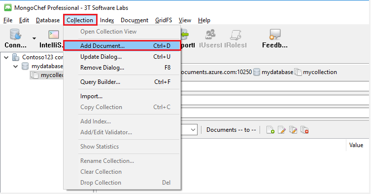

<properties 
    pageTitle="Utilizzare MongoChef con un account DocumentDB con protocollo per MongoDB | Microsoft Azure" 
    description="Informazioni su come utilizzare MongoChef con un account DocumentDB con protocollo per MongoDB, ora disponibile per l'anteprima." 
    keywords="mongochef"
    services="documentdb" 
    authors="AndrewHoh" 
    manager="jhubbard" 
    editor="" 
    documentationCenter=""/>

<tags 
    ms.service="documentdb" 
    ms.workload="data-services" 
    ms.tgt_pltfrm="na" 
    ms.devlang="na" 
    ms.topic="article" 
    ms.date="08/25/2016" 
    ms.author="anhoh"/>

# Utilizzare MongoChef con un account DocumentDB con protocollo per MongoDB

Per connettersi a un account Azure DocumentDB con supporto del protocollo per MongoDB utilizzando MongoChef, è necessario:

- Scaricare e installare [MongoChef](http://3t.io/mongochef)
- Richiedere che l'account DocumentDB con protocollo per MongoDB [stringa di connessione](documentdb-connect-mongodb-account.md) informazioni

## Creare la connessione in MongoChef  

Per aggiungere l'account DocumentDB con protocollo per MongoDB per la gestione di connessione MongoChef, procedere come segue.

1. Recuperare i DocumentDB con protocollo per informazioni sulla connessione MongoDB seguendo le istruzioni riportate [di seguito](documentdb-connect-mongodb-account.md).

    

2. Fare clic su **Connetti** per aprire Gestione connessione e quindi fare clic su **Nuova connessione**

    
    
2. Nella finestra **Nuova connessione** , nella scheda **Server** immettere HOST (FQDN) del conto DocumentDB con protocollo per MongoDB e la porta.
    
    

3. Nella finestra **Nuova connessione** , nella scheda **autenticazione** scegliere la modalità di autenticazione **Standard (MONGODB CR o SCARM-SHA-1)** e immettere il nome utente e la PASSWORD.  Accettare la db di autenticazione predefinito (amministratori) o specificare un valore personalizzato.

    

4. Nella finestra **Nuova connessione** , nella scheda **SSL** , selezionare la casella di controllo **protocollo Usa SSL per la connessione** e il pulsante di opzione **accetta i certificati SSL autofirmati** .

    

5. Fare clic sul pulsante **Test connessione** per convalidare le informazioni di connessione, fare clic su **OK** per tornare alla finestra della nuova connessione e quindi fare clic su **Salva**.

    

## Utilizzare MongoChef per creare un database, insieme e documenti  

Per creare un database, insieme e documenti utilizzando MongoChef, procedere come segue.

1. In **Gestione connessione**, evidenziare la connessione e fare clic su **Connetti**.

    

2. Fare clic con il pulsante destro all'host e scegliere **Aggiungi Database**.  Specificare un nome di database e fare clic su **OK**.
    
    

3. Fare clic con il pulsante destro del database e scegliere **Aggiungi raccolta**.  Specificare un nome di raccolta e fare clic su **Crea**.

    

4. Selezionare la voce di menu **insieme** , quindi fare clic su **Aggiungi documento**.

    

5. Nella finestra di dialogo Aggiungi documento incollare le operazioni seguenti e quindi fare clic su **Aggiungi documento**.

        {
        "_id": "AndersenFamily",
        "lastName": "Andersen",
        "parents": [
            { "firstName": "Thomas" },
            { "firstName": "Mary Kay"}
        ],
        "children": [
        {
            "firstName": "Henriette Thaulow", "gender": "female", "grade": 5,
            "pets": [{ "givenName": "Fluffy" }]
        }
        ],
        "address": { "state": "WA", "county": "King", "city": "seattle" },
        "isRegistered": true
        }

    
6. Aggiungere un altro documento, questa volta con il seguente contenuto.

        {
        "_id": "WakefieldFamily",
        "parents": [
            { "familyName": "Wakefield", "givenName": "Robin" },
            { "familyName": "Miller", "givenName": "Ben" }
        ],
        "children": [
            {
                "familyName": "Merriam", 
                "givenName": "Jesse", 
                "gender": "female", "grade": 1,
                "pets": [
                    { "givenName": "Goofy" },
                    { "givenName": "Shadow" }
                ]
            },
            { 
                "familyName": "Miller", 
                "givenName": "Lisa", 
                "gender": "female", 
                "grade": 8 }
        ],
        "address": { "state": "NY", "county": "Manhattan", "city": "NY" },
        "isRegistered": false
        }

7. Eseguire una query di esempio. Ad esempio, cercare le famiglie con il cognome 'Andersen' e restituire i genitori e i campi di stato.

    
    

## Passaggi successivi

- Esplorare DocumentDB con protocollo per MongoDB [esempi](documentdb-mongodb-samples.md).

 
