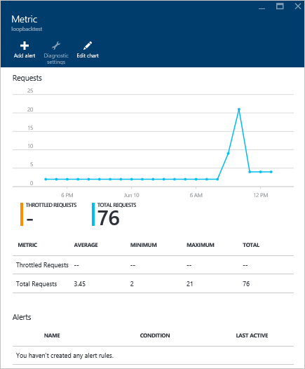

<properties
    pageTitle="Monitorare lo spazio di archiviazione e le richieste di DocumentDB | Microsoft Azure"
    description="Informazioni su come eseguire il monitoraggio account DocumentDB per metriche di prestazioni, ad esempio gli errori di server e le richieste e metriche di utilizzo, ad esempio il consumo di spazio di archiviazione."
    services="documentdb"
    documentationCenter=""
    authors="mimig1"
    manager="jhubbard"
    editor="cgronlun"/>

<tags
    ms.service="documentdb"
    ms.workload="data-services"
    ms.tgt_pltfrm="na"
    ms.devlang="na"
    ms.topic="article"
    ms.date="10/17/2016"
    ms.author="mimig"/>

# Monitorare le richieste DocumentDB, utilizzo e lo spazio di archiviazione

È possibile monitorare gli account Azure DocumentDB nel [portale di Azure](https://portal.azure.com/). Per ogni account DocumentDB entrambi metriche di prestazioni, ad esempio le richieste e gli errori del server e metriche di utilizzo, ad esempio il consumo di spazio di archiviazione, sono disponibili.

È possibile esaminare metriche e il conto o su e il nuovo formato.

## Visualizzazione di prestazioni relativi alla e metriche

1. In una nuova finestra, aprire il [portale di Azure](https://portal.azure.com/), fare clic su **Altri servizi**, fare clic su **DocumentDB (NoSQL)**e fare clic sul nome dell'account DocumentDB per il quale si desidera visualizzare dati sulle prestazioni.
2. Nel menu delle risorse, fare clic su **metriche**.

Apre e il metriche ed è possibile selezionare la raccolta per verificare. È possibile esaminare le metriche di disponibilità, le richieste, velocità e lo spazio di archiviazione e confrontarli con contratti di servizio DocumentDB.

## Visualizzazione di prestazioni relativi alla e conto
1.  In una nuova finestra, aprire il [portale di Azure](https://portal.azure.com/), fare clic su **Altri servizi**, fare clic su **DocumentDB (NoSQL)**e fare clic sul nome dell'account DocumentDB per il quale si desidera visualizzare dati sulle prestazioni.

2.  Per impostazione predefinita, l'obiettivo di **monitoraggio** Visualizza i riquadri seguenti:
    *   Totale richieste per il giorno corrente.
    *   Spazio di archiviazione utilizzato.

    Se la tabella consente di visualizzare **dati non disponibili** e si ritiene che ci siano dati nel database, vedere la sezione [risoluzione dei problemi](#troubleshooting) .

    

3.  Fare clic sul **richieste** o **lo spazio di archiviazione** riquadro aprirà blade **unità di misura metriche** dettagliate.
4.  E **l'unità di misura metriche** Mostra i dettagli sul metriche è stato selezionato.  Nella parte superiore e il è un grafico di richieste nel grafico ogni ora e sotto di esso, tabella contenente i valori di aggregazione per le richieste di accelerata e totale.  E il metrico Mostra anche l'elenco di avvisi che sono state definite, filtrata in base ai metriche che vengono visualizzati nella e metrico corrente (in questo modo, se si dispone di un numero di avvisi, verranno visualizzati solo quelle pertinenti presentate di seguito).   

    

## Personalizzare le visualizzazioni metriche di prestazioni nel portale

1.  Per personalizzare le metriche che vengono visualizzati in un grafico specifico, fare clic sul grafico per aprirlo in e **l'unità di misura metriche** e quindi fare clic su **Modifica grafico**.  
    

2.  In e il **Grafico di modifica** sono disponibili opzioni per modificare le metriche che vengono visualizzati nel grafico, come l'intervallo di tempo.  
    

3.  Per modificare le metriche visualizzate nella parte, è sufficiente selezionare o deselezionare le metriche di prestazioni disponibili e quindi fare clic su **OK** nella parte inferiore della stessa e.  
4.  Per modificare l'intervallo di tempo, scegliere un intervallo diverso (ad esempio, **personalizzati**) e quindi fare clic su **OK** nella parte inferiore della stessa e.  

    

## Creare grafici side-by-side nel portale
Il portale di Azure consente di creare grafici metrici side-by-side.  

1.  Prima di tutto, fare doppio clic sul grafico che si desidera copiare e selezionare **Personalizza**.

    

2.  Fare clic su **Copia** dal menu per copiare la parte e quindi fare clic su **completato la personalizzazione**.

      

Si può ora indicazione questa parte qualsiasi altra parte metrica, personalizzare l'intervallo di criteri di misurazione e l'ora visualizzata nella parte.  In questo modo è possibile visualizzare due diverse metriche grafico side-by-side nello stesso momento.  
      

## Impostare avvisi nel portale
1.  Nel [portale di Azure](https://portal.azure.com/), fare clic su **Altri servizi**, fare clic su **DocumentDB (NoSQL)**e quindi fare clic sul nome dell'account DocumentDB per il quale si desidera configurare avvisi metriche di prestazioni.

2.  Nel menu delle risorse, fare clic su **Regole di avviso** per aprire e il regole di avviso.  
    

3.  In e il **regole di avviso** , fare clic su **Aggiungi avviso**.  
    

4.  Nella finestra e **aggiungere una regola di avviso** specificare:
    *   Il nome della regola di avviso che si sta impostando.
    *   Descrizione della nuova regola di avviso.
    *   Metrica per la regola di avviso.
    *   La condizione, soglia e periodo che determinano quando l'avviso attiva. Ad esempio, un server Errore numero maggiore di 5 su 15 minuti.
    *   Se l'amministratore del servizio e coadministrators vengono inviati tramite posta elettronica quando viene attivata l'avviso.
    *   Indirizzi di posta elettronica aggiuntivi per le notifiche di avviso.  
    

## Eseguire il monitoraggio a livello di programmazione DocumentDB
Metriche livello account disponibili nel portale, ad esempio richieste di utilizzo e totale di spazio di archiviazione account, non sono disponibili in pratici APIs DocumentDB. Tuttavia, è possibile recuperare dati di utilizzo a livello di raccolta utilizzando APIs DocumentDB. Per recuperare i dati a livello di raccolta, eseguire le operazioni seguenti:

- Per utilizzare l'API REST, [eseguire una GET nella raccolta](https://msdn.microsoft.com/library/mt489073.aspx). Vengono restituite le informazioni di quota e l'utilizzo della raccolta intestazioni di ms di x-quota di risorse e Uso risorse di ms x nella risposta.
- Per utilizzare .NET SDK, utilizzare il metodo [DocumentClient.ReadDocumentCollectionAsync](https://msdn.microsoft.com/library/microsoft.azure.documents.client.documentclient.readdocumentcollectionasync.aspx) , che restituisce un [ResourceResponse](https://msdn.microsoft.com/library/dn799209.aspx) che contiene un numero di proprietà di utilizzo, ad esempio **CollectionSizeUsage**, **DatabaseUsage**, **DocumentUsage**e altro ancora.

Per accedere a statistiche aggiuntive, utilizzare [Azure Monitor SDK](https://www.nuget.org/packages/Microsoft.Azure.Insights). Tramite la chiamata, è possono recuperare le definizioni di metriche disponibili:

    https://management.azure.com/subscriptions/{SubscriptionId}/resourceGroups/{ResourceGroup}/providers/Microsoft.DocumentDb/databaseAccounts/{DocumentDBAccountName}/metricDefinitions?api-version=2015-04-08

Query per recuperare singoli metriche utilizzare nel formato seguente:

    https://management.azure.com/subscriptions/{SubecriptionId}/resourceGroups/{ResourceGroup}/providers/Microsoft.DocumentDb/databaseAccounts/{DocumentDBAccountName}/metrics?api-version=2015-04-08&$filter=%28name.value%20eq%20%27Total%20Requests%27%29%20and%20timeGrain%20eq%20duration%27PT5M%27%20and%20startTime%20eq%202016-06-03T03%3A26%3A00.0000000Z%20and%20endTime%20eq%202016-06-10T03%3A26%3A00.0000000Z

Per ulteriori informazioni, vedere [Il recupero delle risorse metriche tramite l'API REST di Azure Monitor](https://blogs.msdn.microsoft.com/cloud_solution_architect/2016/02/23/retrieving-resource-metrics-via-the-azure-insights-api/). Si noti che è stata rinominata "Azure Inights" "Azure Monitor".  Questo post di blog si intende il nome precedente.

## Risoluzione dei problemi
Se i riquadri monitoraggio visualizzare il messaggio **Nessun dato disponibile** e hai apportate richieste o aggiungere dati al database, è possibile modificare il riquadro per riflettere l'utilizzo di recente.

### Modificare un riquadro per aggiornare i dati correnti
1.  Per personalizzare le metriche che vengono visualizzati in una parte specifica, fare clic sul grafico per aprire e **l'unità di misura metriche** e quindi fare clic su **Modifica grafico**.  
    

2.  Scegliere e il **Grafico di modifica** , nella sezione **Intervallo di tempo** , fare clic su **oltre all'ora**e quindi fare clic su **OK**.  
    

3.  Nel riquadro a questo punto è necessario aggiornare con i dati correnti e l'uso.  
    

## Passaggi successivi
Per ulteriori informazioni sulla capacità DocumentDB, vedere [gestire DocumentDB capacità](documentdb-manage.md).
