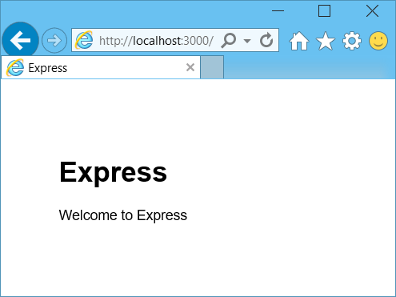

<properties 
    pageTitle="Informazioni su Node - DocumentDB Node esercitazione | Microsoft Azure" 
    description="Informazioni su Node! Esercitazione viene illustrato come utilizzare Microsoft Azure DocumentDB per archiviare e accedere ai dati da un'applicazione web Node Express ospitata in siti Web di Azure." 
    keywords="Sviluppo di applicazioni, esercitazione con database di informazioni Node, Node esercitazione, documentdb, azure, Microsoft azure"
    services="documentdb" 
    documentationCenter="nodejs" 
    authors="syamkmsft" 
    manager="jhubbard" 
    editor="cgronlun"/>

<tags 
    ms.service="documentdb" 
    ms.workload="data-services" 
    ms.tgt_pltfrm="na" 
    ms.devlang="nodejs" 
    ms.topic="hero-article" 
    ms.date="08/25/2016" 
    ms.author="syamk"/>

# Creare un'applicazione web Node utilizzando DocumentDB

> [AZURE.SELECTOR]
- [.NET](documentdb-dotnet-application.md)
- [Node](documentdb-nodejs-application.md)
- [Java](documentdb-java-application.md)
- [Python](documentdb-python-application.md)

In questa esercitazione Node viene illustrato come utilizzare il servizio di Azure DocumentDB per archiviare e accedere a dati da un'applicazione di Express Node ospitata in siti Web di Azure.

Si consiglia di iniziare, guardare il video seguente, in cui viene spiegato come effettuare il provisioning di un account di database DocumentDB Azure e archiviare i documenti JSON nell'applicazione Node. 

> [AZURE.VIDEO azure-demo-getting-started-with-azure-documentdb-on-nodejs-in-linux]

Quindi, tornare in questa esercitazione Node, in cui si apprenderanno le risposte alle domande seguenti:

- Utilizzo DocumentDB uso del modulo di npm documentdb
- Come è possibile distribuire l'applicazione web ai siti Web di Azure?

Seguendo l'esercitazione di database, si creerà un'applicazione di semplice gestione delle attività basate sul web che consente la creazione, il recupero e il completamento delle attività. Le attività verranno archiviate come documenti JSON in Azure DocumentDB.

Non è possibile completare l'esercitazione e si desidera semplicemente ottenere la soluzione completa? Non è un problema, è possibile ottenere la soluzione di esempio completo da [GitHub][].

## Prerequisiti

> [AZURE.TIP] In questa esercitazione Node si presuppone alcuni già esperienza nell'uso Node e siti Web di Azure.

Prima di seguire le istruzioni fornite in questo articolo, è necessario verificare di avere le operazioni seguenti:

- Un account Azure attivo. Se non si dispone di un account, è possibile creare un account di valutazione gratuito in pochi minuti. Per informazioni dettagliate, vedere [Versione di valutazione gratuita di Azure](https://azure.microsoft.com/pricing/free-trial/).
- [Node][] versione v0.10.29 o versione successiva.
- [Esprimere generatore](http://www.expressjs.com/starter/generator.html) (è possibile installare questo tramite `npm install express-generator -g`)
- [Operazioni][].

## Passaggio 1: Creare un account di database DocumentDB

Iniziamo creando un account DocumentDB. Se si dispone già di un account, è possibile passare al [passaggio 2: creare una nuova applicazione Node](#_Toc395783178).

[AZURE.INCLUDE [documentdb-create-dbaccount](../../includes/documentdb-create-dbaccount.md)]

[AZURE.INCLUDE [documentdb-keys](../../includes/documentdb-keys.md)]

## Passaggio 2: Informazioni su come creare una nuova applicazione Node

A questo punto si informazioni su come creare un progetto Node Hello World base utilizzando il framework [Express](http://expressjs.com/) .

1. Aprire il terminale preferito.

2. Utilizzare il generatore di express per generare una nuova applicazione denominata **todo**.

        express todo

3. Aprire la nuova directory **todo** e installare dipendenze.

        cd todo
        npm install

4. Eseguire l'applicazione di nuova.

        npm start

5. È possibile visualizzare la nuova applicazione passando il browser [http://localhost:3000](http://localhost:3000).

    

## Passaggio 3: Installare moduli aggiuntivi

Il file **package.json** corrisponde a uno dei file creati nella radice del progetto. Questo file contiene un elenco di moduli aggiuntivi necessari per l'applicazione Node. In un secondo momento, quando si distribuisce questa applicazione a un Azure siti Web, il file viene utilizzato per determinare quali moduli è necessario installare su Azure per supportare l'applicazione. È comunque necessario installare due più pacchetti per questa esercitazione.

1. In terminale, installare il modulo **asincrono** tramite npm.

        npm install async --save

1. Installare il modulo **documentdb** tramite npm. Questo è il modulo in cui viene eseguita tutto il necessario DocumentDB.

        npm install documentdb --save

3. Una verifica del file **package.json** dell'applicazione deve essere visualizzata moduli aggiuntivi. Il file che indica quali pacchetti di scaricare e installare durante l'esecuzione di un'applicazione di Azure. Il risultato sarà simile nell'esempio seguente.

    

    In questo modo nodo (e versioni successive Azure) che l'applicazione dipende da questi moduli aggiuntivi.

## Passaggio 4: Utilizzo del servizio DocumentDB in un'applicazione di nodo

Ciò che concerne tutte iniziali la configurazione, a questo punto si get verso il basso per perché siamo qui, ovvero scrivere codice con Azure DocumentDB.

### Creare il modello

1. Nella directory del progetto, creare una nuova directory denominata **modelli**.
2. Creare un nuovo file denominato **taskDao.js**nella cartella **modelli** . In questo file conterrà il modello per le attività create dall'applicazione.
3. Nella stessa directory di **modelli** , creare un altro file denominato **docdbUtils.js**. In questo file conterrà codice utile, riutilizzabile, che verrà utilizzato in tutta l'applicazione. 
4. Copiare il codice seguente in **docdbUtils.js**

        var DocumentDBClient = require('documentdb').DocumentClient;
            
        var DocDBUtils = {
            getOrCreateDatabase: function (client, databaseId, callback) {
                var querySpec = {
                    query: 'SELECT * FROM root r WHERE r.id= @id',
                    parameters: [{
                        name: '@id',
                        value: databaseId
                    }]
                };
        
                client.queryDatabases(querySpec).toArray(function (err, results) {
                    if (err) {
                        callback(err);
        
                    } else {
                        if (results.length === 0) {
                            var databaseSpec = {
                                id: databaseId
                            };
        
                            client.createDatabase(databaseSpec, function (err, created) {
                                callback(null, created);
                            });
        
                        } else {
                            callback(null, results[0]);
                        }
                    }
                });
            },
        
            getOrCreateCollection: function (client, databaseLink, collectionId, callback) {
                var querySpec = {
                    query: 'SELECT * FROM root r WHERE r.id=@id',
                    parameters: [{
                        name: '@id',
                        value: collectionId
                    }]
                };             
                
                client.queryCollections(databaseLink, querySpec).toArray(function (err, results) {
                    if (err) {
                        callback(err);
        
                    } else {        
                        if (results.length === 0) {
                            var collectionSpec = {
                                id: collectionId
                            };
                            
                            client.createCollection(databaseLink, collectionSpec, function (err, created) {
                                callback(null, created);
                            });
        
                        } else {
                            callback(null, results[0]);
                        }
                    }
                });
            }
        };
                
        module.exports = DocDBUtils;

    > [AZURE.TIP] createCollection accetta un parametro facoltativo requestOptions che può essere utilizzato per specificare il tipo di offerta per la raccolta. Se viene specificato alcun valore requestOptions.offerType della raccolta verrà creata usando il tipo di offerta predefinito.
    >
    > Per ulteriori informazioni sui tipi di offerta DocumentDB fare riferimento ai [livelli di prestazioni in DocumentDB](documentdb-performance-levels.md) 
        
3. Salvare e chiudere il file **docdbUtils.js** .

4. All'inizio del file **taskDao.js** , aggiungere il codice seguente per fare riferimento a **DocumentDBClient** e **docdbUtils.js** creato in precedenza:

        var DocumentDBClient = require('documentdb').DocumentClient;
        var docdbUtils = require('./docdbUtils');

4. Aggiungere, il codice per definire ed esportare l'oggetto di attività. Questo è responsabile per inizializzare l'oggetto di attività e configurare il Database e insieme documento che verrà usata.

        function TaskDao(documentDBClient, databaseId, collectionId) {
          this.client = documentDBClient;
          this.databaseId = databaseId;
          this.collectionId = collectionId;
        
          this.database = null;
          this.collection = null;
        }
        
        module.exports = TaskDao;

5. Aggiungere il codice riportato di seguito per definire altri metodi nell'oggetto di attività, che consentono interazioni con i dati archiviati in DocumentDB.

        TaskDao.prototype = {
            init: function (callback) {
                var self = this;
        
                docdbUtils.getOrCreateDatabase(self.client, self.databaseId, function (err, db) {
                    if (err) {
                        callback(err);
                    } else {
                        self.database = db;
                        docdbUtils.getOrCreateCollection(self.client, self.database._self, self.collectionId, function (err, coll) {
                            if (err) {
                                callback(err);
        
                            } else {
                                self.collection = coll;
                            }
                        });
                    }
                });
            },
        
            find: function (querySpec, callback) {
                var self = this;
        
                self.client.queryDocuments(self.collection._self, querySpec).toArray(function (err, results) {
                    if (err) {
                        callback(err);
        
                    } else {
                        callback(null, results);
                    }
                });
            },
        
            addItem: function (item, callback) {
                var self = this;
        
                item.date = Date.now();
                item.completed = false;
        
                self.client.createDocument(self.collection._self, item, function (err, doc) {
                    if (err) {
                        callback(err);
        
                    } else {
                        callback(null, doc);
                    }
                });
            },
        
            updateItem: function (itemId, callback) {
                var self = this;
        
                self.getItem(itemId, function (err, doc) {
                    if (err) {
                        callback(err);
        
                    } else {
                        doc.completed = true;
        
                        self.client.replaceDocument(doc._self, doc, function (err, replaced) {
                            if (err) {
                                callback(err);
        
                            } else {
                                callback(null, replaced);
                            }
                        });
                    }
                });
            },
        
            getItem: function (itemId, callback) {
                var self = this;
        
                var querySpec = {
                    query: 'SELECT * FROM root r WHERE r.id = @id',
                    parameters: [{
                        name: '@id',
                        value: itemId
                    }]
                };
        
                self.client.queryDocuments(self.collection._self, querySpec).toArray(function (err, results) {
                    if (err) {
                        callback(err);
        
                    } else {
                        callback(null, results[0]);
                    }
                });
            }
        };

6. Salvare e chiudere il file **taskDao.js** . 

### Creare il controller

1. Nella directory **indirizza** del progetto, creare un nuovo file denominato **tasklist.js**. 
2. Aggiungere il codice seguente **tasklist.js**. Consente di caricare i moduli vengono utilizzati da **tasklist.js**DocumentDBClient e asincrono. Questa operazione definita anche funzione **elenco attività** , che verrà passata un'istanza dell'oggetto **attività** definita in precedenza:

        var DocumentDBClient = require('documentdb').DocumentClient;
        var async = require('async');
        
        function TaskList(taskDao) {
          this.taskDao = taskDao;
        }
        
        module.exports = TaskList;

3. Continuare ad aggiungere il file **tasklist.js** aggiungendo i metodi utilizzati per **showTasks, addTask**e **completeTasks**:
        
        TaskList.prototype = {
            showTasks: function (req, res) {
                var self = this;
        
                var querySpec = {
                    query: 'SELECT * FROM root r WHERE r.completed=@completed',
                    parameters: [{
                        name: '@completed',
                        value: false
                    }]
                };
        
                self.taskDao.find(querySpec, function (err, items) {
                    if (err) {
                        throw (err);
                    }
        
                    res.render('index', {
                        title: 'My ToDo List ',
                        tasks: items
                    });
                });
            },
        
            addTask: function (req, res) {
                var self = this;
                var item = req.body;
        
                self.taskDao.addItem(item, function (err) {
                    if (err) {
                        throw (err);
                    }
        
                    res.redirect('/');
                });
            },
        
            completeTask: function (req, res) {
                var self = this;
                var completedTasks = Object.keys(req.body);
        
                async.forEach(completedTasks, function taskIterator(completedTask, callback) {
                    self.taskDao.updateItem(completedTask, function (err) {
                        if (err) {
                            callback(err);
                        } else {
                            callback(null);
                        }
                    });
                }, function goHome(err) {
                    if (err) {
                        throw err;
                    } else {
                        res.redirect('/');
                    }
                });
            }
        };

4. Salvare e chiudere il file **tasklist.js** .
 
### Aggiungere config.js

1. Creare un nuovo file denominato **config.js**nella directory del progetto.
2. Aggiungere quanto segue a **config.js**. Consente di definire le impostazioni di configurazione e i valori necessari per l'applicazione.

        var config = {}
        
        config.host = process.env.HOST || "[the URI value from the DocumentDB Keys blade on http://portal.azure.com]";
        config.authKey = process.env.AUTH_KEY || "[the PRIMARY KEY value from the DocumentDB Keys blade on http://portal.azure.com]";
        config.databaseId = "ToDoList";
        config.collectionId = "Items";
        
        module.exports = config;

3. Nel file **config.js** aggiornare i valori dell'HOST e AUTH_KEY utilizzando i valori contenuti nei e chiavi del proprio account DocumentDB nel [Portale di Microsoft Azure](https://portal.azure.com):

4. Salvare e chiudere il file **config.js** .
 
### Modificare app.js

1. Nella directory del progetto, aprire il file **app.js** . Il file è stato creato in precedenza al momento della creazione dell'applicazione web Express.
2. Aggiungere il codice seguente nella parte superiore **app.js**
    
        var DocumentDBClient = require('documentdb').DocumentClient;
        var config = require('./config');
        var TaskList = require('./routes/tasklist');
        var TaskDao = require('./models/taskDao');

3. Questo codice definisce il file di configurazione da utilizzare e continua per leggere i valori da questo file in per alcune variabili verrà usata breve.
4. Sostituire le due righe nel file **app.js** seguenti:

        app.use('/', routes);
        app.use('/users', users); 

      con il frammento di codice seguente:

        var docDbClient = new DocumentDBClient(config.host, {
            masterKey: config.authKey
        });
        var taskDao = new TaskDao(docDbClient, config.databaseId, config.collectionId);
        var taskList = new TaskList(taskDao);
        taskDao.init();
        
        app.get('/', taskList.showTasks.bind(taskList));
        app.post('/addtask', taskList.addTask.bind(taskList));
        app.post('/completetask', taskList.completeTask.bind(taskList));
        app.set('view engine', 'jade');

6. Queste linee definiscono una nuova istanza dell'oggetto **TaskDao** , con una nuova connessione a DocumentDB (usando i valori leggere **config.js**), inizializzare l'oggetto di attività e associano azioni modulo metodi sul controller il nostro **elenco attività** . 

7. Infine, salvare e chiudere il file **app.js** , praticamente termine.
 
## Passaggio 5: Creare un'interfaccia utente

A questo punto è possibile attivare il nostro attenzione alla creazione dell'interfaccia utente in modo che un utente in realtà è possibile interagire con l'applicazione. L'applicazione Express creato utilizza **Jade** come il motore di visualizzazione. Per ulteriori informazioni sulla Jade fare riferimento a [http://jade-lang.com/](http://jade-lang.com/).

1. Il file **layout.jade** nella directory **visualizzazioni** viene utilizzato come modello globale per gli altri file **.jade** . In questo passaggio verrà modificato in modo da utilizzare [Avvio Twitter](https://github.com/twbs/bootstrap), ovvero un toolkit che semplifica la progettazione di un sito Web dall'aspetto interessante. 
2. Aprire il file **layout.jade** nella cartella **visualizzazioni** e sostituire il contenuto con i seguenti:
    
        doctype html
        html
          head
            title= title
            link(rel='stylesheet', href='//ajax.aspnetcdn.com/ajax/bootstrap/3.3.2/css/bootstrap.min.css')
            link(rel='stylesheet', href='/stylesheets/style.css')
          body
            nav.navbar.navbar-inverse.navbar-fixed-top
              div.navbar-header
                a.navbar-brand(href='#') My Tasks
            block content
            script(src='//ajax.aspnetcdn.com/ajax/jQuery/jquery-1.11.2.min.js')
            script(src='//ajax.aspnetcdn.com/ajax/bootstrap/3.3.2/bootstrap.min.js')

    In modo efficace questo indica al motore di **Jade** per il rendering del codice HTML per l'applicazione e si crea un **blocco** denominata **contenuto** in cui è in grado di fornire il layout per le pagine di contenuto.
    Salvare e chiudere il file **layout.jade** .

4. A questo punto aprire il file **index.jade** , la visualizzazione che verrà utilizzata dall'applicazione e sostituire il contenuto del file con le operazioni seguenti:

        extends layout
        
        block content
          h1 #{title}
          br
        
          form(action="/completetask", method="post")
            table.table.table-striped.table-bordered
              tr
                td Name
                td Category
                td Date
                td Complete
              if (typeof tasks === "undefined")
                tr
                  td
              else
                each task in tasks
                  tr
                    td #{task.name}
                    td #{task.category}
                    - var date  = new Date(task.date);
                    - var day   = date.getDate();
                    - var month = date.getMonth() + 1;
                    - var year  = date.getFullYear();
                    td #{month + "/" + day + "/" + year}
                    td
                      input(type="checkbox", name="#{task.id}", value="#{!task.completed}", checked=task.completed)
            button.btn(type="submit") Update tasks
          hr
          form.well(action="/addtask", method="post")
            label Item Name:
            input(name="name", type="textbox")
            label Item Category:
            input(name="category", type="textbox")
            br
            button.btn(type="submit") Add item

    Si estende layout e fornisce contenuto per il segnaposto di **contenuto** che precedenza nel file **layout.jade** .
    
    In questo layout creato due moduli HTML. 
    Primo modulo contiene una tabella per i dati e un pulsante che consente di aggiornare gli elementi tramite la registrazione nella metodo **/completetask** del nostro controller.
    La seconda forma contiene due campi di input e un pulsante che consente di creare un nuovo elemento tramite la registrazione nella metodo **/addtask** del nostro controller.
    
    Deve trattarsi di tutti gli elementi è necessario utilizzare l'applicazione.

5. Aprire il file **Style. CSS** nella directory **public\stylesheets** e sostituire il codice con le operazioni seguenti:

        body {
          padding: 50px;
          font: 14px "Lucida Grande", Helvetica, Arial, sans-serif;
        }
        a {
          color: #00B7FF;
        }
        .well label {
          display: block;
        }
        .well input {
          margin-bottom: 5px;
        }
        .btn {
          margin-top: 5px;
          border: outset 1px #C8C8C8;
        }

    Salvare e chiudere il file **Style. CSS** .

## Passaggio 6: Eseguire l'applicazione localmente

1. Per testare l'applicazione sul computer locale, eseguire `npm start` in terminale per avviare l'applicazione e avviare un browser con una pagina è simile all'immagine riportata di seguito:

    

2. Utilizzare i campi disponibili per elemento, nome elemento e la categoria per immettere informazioni e quindi fare clic su **Aggiungi elemento**.

3. Per visualizzare l'elemento appena creato l'elenco necessario aggiornare la pagina.

    

4. Per completare un'attività, è sufficiente selezionare la casella di controllo nella colonna completa e quindi fare clic su **Aggiorna attività**.

## Passaggio 7: Distribuire il progetto di sviluppo di applicazioni a siti Web di Azure

1. Se non è ancora disponibile, abilitare un repository fra per il sito Web Azure. È possibile trovare istruzioni su come eseguire questa operazione nell'argomento della [Distribuzione locale di fra al servizio App Azure](../app-service-web/app-service-deploy-local-git.md) .

2. Aggiungere il sito Web Azure come un fra remoto.

        git remote add azure https://username@your-azure-website.scm.azurewebsites.net:443/your-azure-website.git

3. Distribuire premendo per il computer remoto.

        git push azure master

4. In pochi secondi, fra verrà completare la pubblicazione dell'applicazione web, verrà avviato un browser in cui è possibile visualizzare il lavoro comodo in esecuzione in Azure!

## Passaggi successivi

Congratulazioni! Appena creato il primo Node Express applicazione Web che utilizza DocumentDB Azure e pubblicato su siti Web di Azure.

Il codice sorgente per l'applicazione di riferimento completo può essere scaricato dal [GitHub][].

Per ulteriori informazioni, vedere il [Centro per sviluppatori Node](https://azure.microsoft.com/develop/nodejs/).

[Node]: http://nodejs.org/
[Operazioni]: http://git-scm.com/
[Github]: https://github.com/Azure-Samples/documentdb-node-todo-app
 
