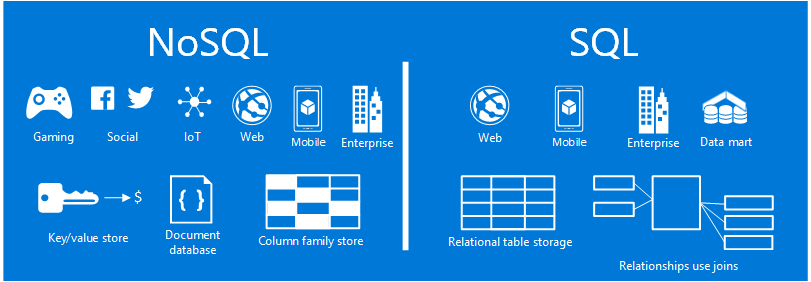

<properties
    pageTitle="Quando utilizzare Visual Studio NoSQL SQL | Microsoft Azure"
    description="Confrontare i vantaggi dell'utilizzo NoSQL non relazionali soluzioni e le soluzioni SQL. Informazioni su se uno dei servizi Microsoft Azure NoSQL o SQL Server migliore rientra proprio scenario."
    keywords="NoSQL vs sql, quando utilizzare NoSQL, nosql vs sql"
    services="documentdb"
    documentationCenter=""
    authors="mimig1"
    manager="jhubbard"
    editor=""/>

<tags
    ms.service="documentdb"
    ms.workload="data-services"
    ms.tgt_pltfrm="na"
    ms.devlang="dotnet"
    ms.topic="article" 
    ms.date="06/24/2016"
    ms.author="mimig"/>

# NoSQL vs SQL

SQL Server e database relazionali (RDBMS) sono rimasto database Vai a per più di 20 anni. Tuttavia, la necessità di maggiore per l'elaborazione di costi più elevati volumi e tipi di dati in un numero elevato ha modificato natura esigenze di archiviazione dei dati per gli sviluppatori di applicazioni. Per abilitare questo scenario, database NoSQL che consentono la memorizzazione dei dati eterogenei e non in scala hanno acquisita popolarità. 

NoSQL è una categoria relativa ai database nettamente diversi da database SQL. NoSQL viene spesso utilizzato per fare riferimento a sistemi di gestione dati che sono un approccio alla gestione dei dati che include "non solo SQL" o "Non SQL". Sono disponibili numerose tecnologie nella categoria NoSQL, inclusi database di documento, archivi valore chiave, archivi famiglia di colonna e i database di grafico, vengono con gioco social networking, e IoT app.

L'obiettivo di questo articolo è utile per conoscere le differenze tra NoSQL e SQL e fornire un'introduzione alle offerte NoSQL e SQL di Microsoft.  

## Quando utilizzare NoSQL?

Immaginiamo che si crea un nuovo sito di social engagement. Gli utenti possono creare post e aggiungervi le immagini, video e musica. Altri utenti possono commentare i post e assegnare un punto (apprezzamenti) per valutare i post. La pagina di destinazione avrà un feed di post che gli utenti possono condividere e interagire con. 

In che modo vengono archiviati i dati? Se si ha familiarità con SQL, è possibile iniziare disegno simile al seguente:

Molto bene, ma ora prendere in considerazione la struttura di un messaggio e come visualizzarlo. Se si desidera visualizzare il post e le immagini associate, audio, video, commenti, punti e informazioni utente in un sito Web o applicazione, è necessario eseguire una query con otto join delle tabelle appena per recuperare il contenuto. Supponiamo un flusso di post da caricare e visualizzati nella schermata dinamicamente e sta per richiedere molti join per completare l'attività e delle migliaia di query è possibile che in futuro.

A questo punto è possibile utilizzare una soluzione relazionale come SQL Server per archiviare i dati, ma esiste un'altra opzione, un'opzione NoSQL che semplifica l'approccio. Trasformando il post in un documento JSON simile al seguente e archiviare i dati in DocumentDB, un servizio di database documenti NoSQL Azure, è possibile migliorare le prestazioni e recuperare il post intero con una query e senza linee di join. È semplice, più semplice e produrre offre prestazioni migliori.

    {
        "id":"ew12-res2-234e-544f",
        "title":"post title",
        "date":"2016-01-01",
        "body":"this is an awesome post stored on NoSQL",
        "createdBy":User,
        "images":["http://myfirstimage.png","http://mysecondimage.png"],
        "videos":[
            {"url":"http://myfirstvideo.mp4", "title":"The first video"},
            {"url":"http://mysecondvideo.mp4", "title":"The second video"}
        ],
        "audios":[
            {"url":"http://myfirstaudio.mp3", "title":"The first audio"},
            {"url":"http://mysecondaudio.mp3", "title":"The second audio"}
        ]
    }

Inoltre, questi dati possono essere suddivise da id post l'immissione dei dati a scalabilità naturalmente e usufruire delle caratteristiche di scala NoSQL. Anche sistemi NoSQL consentono agli sviluppatori Allentare la coerenza e offrono App altamente disponibili.  Infine, questa soluzione non richiedere agli sviluppatori di definire, gestire e Gestisci schema nel livello di dati di iterazione rapida.

È quindi possibile creare in questa soluzione con altri servizi di Azure:

- [Ricerca di Azure](https://azure.microsoft.com/services/search/) può essere utilizzato tramite web app per consentire agli utenti di cercare i post.
- [Servizi di App di Windows Azure](https://azure.microsoft.com/services/app-service/) può essere utilizzato per ospitare applicazioni e processi in background.
- [Archiviazione Blob Azure](https://azure.microsoft.com/services/storage/) può essere usata per archiviare i profili utente completa comprese le immagini.
- [Database SQL Azure](https://azure.microsoft.com/services/sql-database/) può essere usata per archiviare grandi quantità di dati, ad esempio le informazioni di accesso e i dati per analitica l'uso.
- [Apprendimento Azure](https://azure.microsoft.com/services/machine-learning/) può essere utilizzato per creare knowledge e business intelligence in grado di fornire commenti e suggerimenti al processo e offrire contenuti giusti per gli utenti corretti.

Questo sito social engagement è solo una uno scenario in cui un database NoSQL è il modello di dati corretti per il processo. Se si desidera leggere altre informazioni su questo scenario e su come modello di dati per DocumentDB nelle applicazioni di social networking, vedere [passando social con DocumentDB](documentdb-social-media-apps.md). 

## Confronto tra SQL di vs NoSQL

Nella tabella seguente contiene un confronto le principali differenze tra NoSQL e SQL. 

Se un database NoSQL migliore risponde alle proprie esigenze, passare alla sezione successiva per ulteriori informazioni sui servizi NoSQL disponibili da Azure. In caso contrario, se un database SQL migliore adatto alle proprie esigenze, andare al [quali sono le offerte di Microsoft SQL?](#what-are-the-microsoft-sql-offerings)

## Quali sono le offerte di Microsoft Azure NoSQL?

Azure è quattro servizi NoSQL completamente gestito: 

- [DocumentDB Azure](https://azure.microsoft.com/services/documentdb/)
- [Archivio tabelle Azure](https://azure.microsoft.com/services/storage/)
- [Azure HBase come parte di HDInsight](https://azure.microsoft.com/services/hdinsight/)
- [Cache Redis Azure](https://azure.microsoft.com/services/cache/)

Il grafico di confronto seguenti consentono di progettare le principali differenze per ogni servizio. Quale modo più accurato descrive le esigenze dell'applicazione? 

Se uno o più di questi servizi potrebbero soddisfare le esigenze dell'applicazione, ulteriori con le risorse seguenti: 

- [Percorso di apprendimento DocumentDB](https://azure.microsoft.com/documentation/learning-paths/documentdb/) e [DocumentDB use case](documentdb-use-cases.md)
- [Guida introduttiva a archiviazione tabelle Azure](../storage/storage-dotnet-how-to-use-tables.md)
- [Che cos'è HBase in HDInsight](../hdinsight/hdinsight-hbase-overview.md)
- [Redis Cache percorso formativo:](https://azure.microsoft.com/documentation/learning-paths/redis-cache/)

Per informazioni di valutazione gratuite quindi passare alla sezione [passaggi successivi](#next-steps) .

## Quali sono le offerte di Microsoft SQL?

Microsoft ha cinque offerte SQL: 

- [Database SQL Azure](https://azure.microsoft.com/services/sql-database/)
- [SQL Server in macchine virtuali di Azure](https://azure.microsoft.com/services/virtual-machines/sql-server/)
- [SQL Server](https://www.microsoft.com/server-cloud/products/sql-server-2016/)
- [SQL Azure Data Warehouse (Preview)](https://azure.microsoft.com/services/sql-data-warehouse/)
- [Sistema di piattaforma Analitica (accessorio locale)](https://www.microsoft.com/en-us/server-cloud/products/analytics-platform-system/)

Se è interessati a SQL Server in una macchina virtuale o un Database SQL, quindi leggere [scegliere un'opzione di SQL Server cloud: Database SQL Azure (PaaS) o SQL Server in macchine virtuali di Azure (IaaS)](../sql-database/sql-database-paas-vs-sql-server-iaas.md) per ulteriori informazioni sulle differenze tra i due.

Se SQL suoni che l'opzione ottimale, quindi passare a [SQL Server](https://www.microsoft.com/server-cloud/products/) per informazioni su cosa Microsoft SQL prodotti e servizi avere per l'offerta.

Quindi passare alla [procedura successiva gratuitamente collegamenti versione di valutazione e di valutazione.](#next-steps)

## Passaggi successivi

Informazioni aggiuntive sui prodotti SQL e NoSQL da valutando loro gratuitamente invita. 

- Per tutti i servizi Azure, è possibile effettuare l'iscrizione per un [periodo di prova di un mese gratuito](https://azure.microsoft.com/pricing/free-trial/) e ricevere $200 dedicare in uno qualsiasi dei servizi Azure.
    - [DocumentDB Azure](https://azure.microsoft.com/services/documentdb/)
    - [Azure HBase come parte di HDInsight](https://azure.microsoft.com/services/hdinsight/)
    - [Cache Redis Azure](https://azure.microsoft.com/services/cache/)
    - [SQL Azure Data Warehouse (Preview)](https://azure.microsoft.com/services/sql-data-warehouse/)
    - [Database SQL Azure](https://azure.microsoft.com/services/sql-database/)
    - [Archivio tabelle Azure](https://azure.microsoft.com/services/storage/)

- Selezione di una [versione di valutazione di SQL Server 2016 in un computer virtuale](https://azure.microsoft.com/marketplace/partners/microsoft/sqlserver2016ctp33evaluationwindowsserver2012r2/) o scaricare una [versione di valutazione di SQL Server](https://www.microsoft.com/en-us/evalcenter/evaluate-sql-server-2016).
    - [SQL Server](https://www.microsoft.com/server-cloud/products/sql-server-2016/)
    - [SQL Server in macchine virtuali di Azure](https://azure.microsoft.com/services/virtual-machines/sql-server/)

