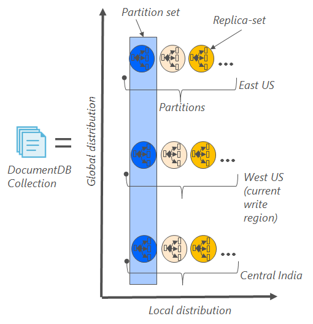

<properties
    pageTitle="Backup e ripristino con DocumentDB | Microsoft Azure"
    description="Informazioni su come eseguire il backup automatico e il ripristino del database NoSQL con Azure DocumentDB."
    keywords="eseguire il backup e ripristino, backup in linea"
    services="documentdb"
    documentationCenter=""
    authors="RahulPrasad16"
    manager="jhubbard"
    editor="monicar"/>

<tags
    ms.service="documentdb"
    ms.workload="data-services"
    ms.tgt_pltfrm="na"
    ms.devlang="multiple"
    ms.topic="article"
    ms.date="09/23/2016"
    ms.author="raprasa"/>

# Il backup automatico in linea e il ripristino con DocumentDB 

Azure DocumentDB automaticamente consente di eseguire backup di tutti i dati a intervalli regolari. Il backup automatico senza influire sulle prestazioni o la disponibilità delle operazioni di database NoSQL. Tutti i backup non vengono memorizzati in un altro servizio di archiviazione e tali backup verranno replicate a livello globale per adattabilità contro guasti internazionali. Backup automatici sono indicate per scenari quando si elimina per sbaglio la raccolta di DocumentDB e versioni successive richiedono il recupero dei dati o una soluzione di ripristino di emergenza.  

In questo articolo inizia con un rapido riepilogo della ridondanza dei dati e disponibilità in DocumentDB e quindi illustra come backup. 

## Disponibilità con DocumentDB - conclusioni

DocumentDB è progettato per essere [distribuito a livello globale](documentdb-distribute-data-globally.md) : consente di ridurre la velocità di trasmissione in più regioni Azure insieme criteri basati su trasparente API più assegnazione di una posizione e failover. Come un sistema di database che offre [disponibilità del 99,99% contratti di servizio](https://azure.microsoft.com/support/legal/sla/documentdb/v1_0/), tutte le operazioni di scrittura DocumentDB vengono salvate in modo permanente a dischi locali da una base di repliche all'interno di un centro dati locali prima del riconoscimento al client. Si noti che la disponibilità di DocumentDB si basa sull'archiviazione locale e non dipende da qualsiasi tecnologie di archiviazione esterni. Inoltre, se l'account di database è associato a più aree di Azure, la scrittura vengono replicate nelle altre aree anche. Per ridimensionare i dati di velocità e l'accesso alla latenza bassa, è possibile impostare come molti letto associate al proprio account di database mentre si è soddisfatti delle aree geografiche. In ogni regione lettura, i dati (replicati) in modo permanente viene mantenuti un set di replica.  

Come illustrato nella figura seguente, un'unica raccolta DocumentDB viene [suddiviso in senso orizzontale](documentdb-partition-data.md). "Partizione" contraddistinta da un cerchio nel diagramma seguente e ogni partizione è reso disponibile attraverso un set di replica. Verrà visualizzata la distribuzione locale in una singola regione Azure (contrassegnata con l'asse X). Inoltre, ogni partizione (con il set di replica corrispondente) quindi globalmente distribuito in più regioni associate all'account di database (ad esempio, in questa figura le tre aree geografiche – Stati Uniti orientali, ovest negli Stati Uniti e India centrale). "Set di partizioni" è globalmente distribuito entità è costituita da più copie dei dati in ogni area (contrassegnato con l'asse Y). È possibile assegnare priorità alle aree associate all'account di database e DocumentDB verranno trasparente il controllo a area successiva in caso di emergenza. È possibile simulare manualmente failover per verificare la disponibilità di fine-fine dell'applicazione.  

Nella figura seguente viene illustrato l'elevato grado di ridondanza con DocumentDB.

## Backup completo, automatico, in linea

Si noterà che è eliminata una raccolta o un database! Con DocumentDB, non solo i dati, ma il backup dei dati sono altamente ridondanti e flessibile al emergenza internazionali. Questi backup automatici provengono attualmente circa ogni 4 ore. 

Il backup senza influire sulle prestazioni o la disponibilità delle operazioni di database. DocumentDB esegue il backup in background senza che utilizzano i provisioning destinatari o sulle prestazioni e senza influire sulla disponibilità del database NoSQL. 

Diversamente da quanto succede ai dati memorizzati all'interno di DocumentDB, i backup automatici sono archiviati nel servizio di archiviazione Blob Azure. Per garantire il caricamento latenza bassa/efficiente, snapshot del backup viene caricato in un'istanza di spazio di archiviazione Blob Azure nella stessa regione l'area di scrittura corrente del proprio account di database DocumentDB. Per motivi di flessibilità contro regionali, ogni snapshot dei dati di backup in archiviazione Blob Azure viene nuovamente replicato tramite geografico ridondanti dello spazio di archiviazione (GRS) a un'altra area. Nel diagramma seguente mostra che l'intero insieme DocumentDB (con tutte le tre partizioni primarie negli Stati Uniti ovest, in questo esempio) viene eseguito il backup in un account di archiviazione Blob Azure remoto negli Stati Uniti ovest e quindi GRS replicate in orientale degli Stati Uniti. 

Di seguito sono illustrate periodici completi di tutte le entità DocumentDB in archiviazione Azure GRS.

## Periodo di conservazione per un determinato snapshot

Come descritto in precedenza, è periodicamente istantanee dei dati e per le regole di conformità, è mantenere l'ultimo snapshot backup a 90 giorni prima che non hanno un limite viene eliminato. Se viene eliminato un account o un insieme, DocumentDB memorizza l'ultimo backup per 90 giorni.

## Ripristinare un database dal backup in linea

Nel caso in cui si eliminano per sbaglio i dati, è possibile [chiamare il supporto di Azure](https://azure.microsoft.com/support/options/) per ripristinare i dati dall'ultimo backup automatico o [file un ticket di supporto](https://portal.azure.com/?#blade/Microsoft_Azure_Support/HelpAndSupportBlade) . Di uno snapshot specifico del backup da ripristinare, DocumentDB è necessario che i dati è stata almeno disponibili con noi per la durata del ciclo di backup per tale snapshot.

## Passaggi successivi

Per replicare il database NoSQL in più data center, vedere [distribuire i dati a livello globale con DocumentDB](documentdb-distribute-data-globally.md). 

Contatto file Azure supporto [file ticket dal portale di Azure](https://portal.azure.com/?#blade/Microsoft_Azure_Support/HelpAndSupportBlade).