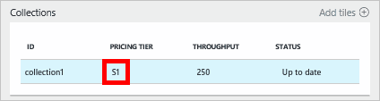

<properties
    pageTitle="Livelli di prestazioni in DocumentDB | Microsoft Azure"
    description="Informazioni sui livelli di prestazioni in DocumentDB come consentono di prenotare velocità alla scala cronologica per ogni raccolta."
    services="documentdb"
    authors="mimig1"
    manager="jhubbard"
    editor="monicar"
    documentationCenter=""/>

<tags
    ms.service="documentdb"
    ms.workload="data-services"
    ms.tgt_pltfrm="na"
    ms.devlang="na"
    ms.topic="article"
    ms.date="08/26/2016"
    ms.author="mimig"/>

# Livelli di prestazioni in DocumentDB

In questo articolo viene fornita una panoramica delle prestazioni in [Microsoft Azure DocumentDB](https://azure.microsoft.com/services/documentdb/).

Dopo aver letto in questo articolo, sarà possibile rispondere alle domande seguenti:  

-   Che cos'è un livello di prestazioni?
-   Come è riservata velocità di un account di database
-   Utilizzo dei livelli di prestazioni
-   Come viene effettuata per i livelli di prestazioni?

## Introduzione ai livelli di prestazioni

Viene eseguito il provisioning di ogni raccolta DocumentDB creato con un account Standard con un livello di prestazioni associati. Ogni raccolta in un database può avere un livello di prestazioni diversi consente di designare più velocità per gli insiemi di frequente e minore velocità per le raccolte raramente. DocumentDB supporta entrambi i livelli delle prestazioni definite dall'utente e predefinite livelli di prestazioni.  

Ogni livello di prestazioni ha un limite di velocità associato [unità richiesta (RU)](documentdb-request-units.md) . Questo rappresenta la velocità riservati per una raccolta in base al livello di prestazioni ed è disponibile per l'utilizzo da tale insieme in modo esclusivo.

<table border="0" cellspacing="0" cellpadding="0">
    <tbody>
        <tr>
            <td valign="top">

</td>
            <td valign="top">
Dettagli
</td>
            <td valign="top">
Limiti di velocità
</td>
            <td valign="top">
Limiti di archiviazione
</td>
            <td valign="top">
Versione
</td>
            <td valign="top">
API
</td>            
        </tr>
        <tr>
            <td valign="top">
Prestazioni definite dall'utente
</td>
            <td valign="top">
Spazio di archiviazione a consumo in base l'uso di GB.

Velocità in unità di 100 RU/s
</td>
            <td valign="top">
Illimitato. 400 - 250.000 richiedere unità/s per impostazione predefinita (in alto richiesta)
</td>
            <td valign="top">
Illimitato. 250 GB per impostazione predefinita (in alto richiesta) 
</td>
            <td valign="top">
V2
</td>
            <td valign="top">
API 2015-12-16 e versioni successive
</td>  
        </tr>
        <tr>
            <td valign="top">
Prestazioni predefinite
</td>
            <td valign="top">
Archiviazione di 10 GB riservato.

S1 = 250 RU/s, S2 = 1000 RU/s, S3 = 2500 RU/s
</td>
            <td valign="top">
2500 RU/s
</td>
            <td valign="top">
10 GB
</td>
            <td valign="top">
V1
</td>
            <td valign="top">
Qualsiasi
</td>  
        </tr>        
    </tbody>
</table>                

DocumentDB consente una vasta gamma di operazioni di database, incluse le query, query con funzioni definite dall'utente (funzioni definite dall'utente), stored procedure e trigger. Il costo di elaborazione associato a ognuna di queste operazioni variano in base alla CPU, IO e memoria necessari per completare l'operazione. Invece di pensa e gestione delle risorse hardware, è possibile pensare di un'unità richiesta come una singola misura per le risorse necessarie per una richiesta di applicazione di servizio ed eseguire varie operazioni di database.

È possono creare raccolte tramite il [portale di Microsoft Azure](https://portal.azure.com), l' [API REST](https://msdn.microsoft.com/library/azure/mt489078.aspx) o qualsiasi [SDK DocumentDB](https://msdn.microsoft.com/library/azure/dn781482.aspx). APIs DocumentDB consentono di specificare il livello di prestazioni di una raccolta.

> [AZURE.NOTE] È possibile regolare il livello di prestazioni di una raccolta tramite l'API o il [portale di Microsoft Azure](https://portal.azure.com/). Modifiche a livello di prestazioni devono completare all'interno di 3 minuti.

## Impostazione dei livelli di prestazioni per le raccolte
Dopo aver creata una raccolta, l'allocazione completo di destinatari in base al livello di prestazioni designato sono riservati per la raccolta.

Si noti che con entrambi i livelli prestazioni definite dall'utente e predefiniti, DocumentDB opera in base alla prenotazione di trasmissione. La creazione di un insieme di un'applicazione ha riservato ed effettuata dalla velocità riservata indipendentemente dalla quantità di in cui la produttività viene utilizzato attivamente. Con livelli di prestazioni definite dall'utente, lo spazio di archiviazione è a consumo in base a consumo, ma con livelli di prestazioni predefiniti, 10 GB di spazio di archiviazione è riservata al momento della creazione di raccolta.  

Dopo la creazione di raccolte, è possibile modificare il livello di prestazioni tramite SDK DocumentDB o tramite il portale classica Azure.

> [AZURE.IMPORTANT] Raccolte DocumentDB Standard vengono addebitate di sola lettura e ogni raccolta che si crea per la fatturazione per una minimo un'ora di utilizzo.

Se si modificano le prestazioni di una raccolta all'interno di un'ora, per la fatturazione per il livello di prestazioni massimo impostato durante l'ora. Ad esempio, se si aumenta il livello di prestazioni per una raccolta ore 8:53 verrà addebitato per il nuovo livello iniziando 8:00 am. Analogamente, se si riduce il livello di prestazioni ore 8:53, il nuovo tasso verrà applicato alle 9:00.

Richiesta di unità sono riservate per ogni raccolta in base al set di livello di prestazioni. Richiesta di unità consumo viene valutato come un numero al secondo. Applicazioni che superano il tasso di unità di provisioning richiesta (o livello di prestazioni) in una raccolta saranno filtrate fino a quando il tasso inserisce sotto il livello di riservato per la raccolta. Se l'applicazione richiede un livello superiore di trasmissione, è possibile aumentare il livello di prestazioni per ogni raccolta.

> [AZURE.NOTE] Quando l'applicazione supera i livelli di prestazioni per una o più raccolte, le richieste saranno filtrate in base a una raccolta per. Questo errore indica che alcune richieste di applicazione potrebbero esito positivo mentre gli altri utenti possono essere limitati. È consigliabile aggiungere un numero limitato di tentativi quando limitato per gestire picchi di traffico richiesta.

## Utilizzo dei livelli di prestazioni
Raccolte DocumentDB consentono di raggruppare i dati in base alle esigenze di prestazioni dell'applicazione e modelli di query. Con del DocumentDB indicizzazione automatica e il supporto di query, è spesso inserire i documenti eterogenei nella stessa raccolta. Considerazioni chiave per decidere se è necessario utilizzare raccolte separate includono:

- Le query, una raccolta è l'ambito per l'esecuzione di query. Se è necessario eseguire query su un set di documenti, i modelli di lettura più efficienti provengono da trasmissivi documenti in un'unica raccolta.
- Transazioni: tutte le transazioni sono limitate all'ambito all'interno di un'unica raccolta. Se si dispone di documenti che devono essere aggiornati all'interno di una singola stored procedure o trigger, devono essere archiviati nella stessa raccolta. In particolare, una chiave di partizione all'interno di una raccolta è il limite di transazione. Per ulteriori informazioni, vedere [partizionamento in DocumentDB](documentdb-partition-data.md) .
- Isolamento delle prestazioni: una raccolta con un livello di prestazioni associati. In questo modo che ogni raccolta influisce sulle prestazioni prevedibili tramite destinatari riservati. Dati da allocare alle raccolte diverse, con prestazioni diverse, in base a frequenza di accesso.

> [AZURE.IMPORTANT] È importante conoscere che scelta per la fatturazione in base ai tassi completo standard in base al numero di raccolte create dall'applicazione in uso.

È consigliabile che l'applicazione effettua utilizzare di un numero limitato di raccolte, a meno che non si dispone di grandi dimensioni requisiti di spazio di archiviazione o effettiva. Assicurarsi che siano ormai i modelli di applicazione per la creazione di nuove raccolte. È possibile scegliere di prenotare la creazione della raccolta come azione gestione gestita all'esterno dell'applicazione. Analogamente, regolare il livello di prestazioni per una raccolta cambierà tariffa oraria in cui viene effettuata la raccolta. Monitorare le prestazioni di raccolta se l'applicazione consente di regolare queste in modo dinamico.

## Passare da S1, S2, S3 a prestazioni definite dall'utente

Seguire questa procedura per passare dall'utilizzo dei livelli di velocità predefiniti ai livelli di velocità definite dall'utente nel portale di Azure. Utilizzando i livelli di velocità definite dall'utente, è possibile personalizzare la velocità per le proprie esigenze. E se si usa ancora un account di S1, è possibile aumentare la velocità di predefinito da 250 RU/s a 400 RU/s con pochi clic.

Per ulteriori informazioni sulla produttività correlato definite dall'utente e predefiniti modifiche prezzi, vedere il post del blog [DocumentDB: tutto quello è necessario conoscere utilizzando le nuove opzioni prezzi](https://azure.microsoft.com/blog/documentdb-use-the-new-pricing-options-on-your-existing-collections/).

> [AZURE.VIDEO changedocumentdbcollectionperformance]

1. Nel browser passare al [**portale di Azure**](https://portal.azure.com).
2. Fare clic su **Sfoglia** -> **DocumentDB account**, quindi selezionare l'account DocumentDB da modificare.   
3. Nell'obiettivo di **database** , selezionare il database da modificare e quindi selezionare la raccolta per la modifica e il **Database** . Per gli account tramite velocità predefiniti sono un livello prezzo di S1, S2 o S3.

      

4. In e il **raccolte** , fare clic su **altro**, quindi **Impostazioni** sulla barra superiore.   
5. In e **l'Impostazioni** , fare clic su **Livello prezzi** e stima dei costi mensile per ciascun piano viene visualizzato in e lo **scegliere il livello dei prezzi** . Per impostare la velocità di trasmissione definite dall'utente, fare clic su **Standard**e quindi fare clic su **Seleziona** per salvare la modifica.

      

6. Di nuovo in e **l'Impostazioni** **Prezzi livello** viene modificato in **Standard** e viene visualizzata la **velocità (RU/s)** con un valore predefinito di 400. Impostare la velocità tra 400 e 10.000 [richiedere unità](documentdb-request-units.md)computer (RU/s). **Prezzi riepilogo** nella parte inferiore della pagina viene aggiornato automaticamente con una stima del costo mensile. Fare clic su **OK** per salvare le modifiche.

    

7. Nuovo in e il **Database** , è possibile verificare la nuova velocità della raccolta.

    

Se si determina che è necessario maggiore velocità (maggiore di 10.000 RU/s) o altro spazio di archiviazione (maggiore di 10GB) è possibile creare una raccolta partizionata. Per creare una raccolta partizionata, vedere [creare una raccolta](documentdb-create-collection.md).

>[AZURE.NOTE] Modifica dei livelli di prestazioni di una raccolta potrebbe richiedere fino a 2 minuti.

## Modifica dei livelli di prestazioni utilizzando .NET SDK

Un'altra opzione per la modifica dei livelli di prestazioni le raccolte consiste nell'usare il nostro SDK. In questa sezione illustra solo la modifica livello di prestazioni dell'insieme utilizzando il nostro [.NET SDK](https://msdn.microsoft.com/library/azure/dn948556.aspx), ma il processo è simile per il nostro altri [SDK](https://msdn.microsoft.com/library/azure/dn781482.aspx). Se ha familiarità con Windows SDK .NET, visitare il nostro [esercitazione introduttiva](documentdb-get-started.md).

Ecco un frammento di codice per modificare la velocità di offerta 50.000 unità richiesta al secondo:

    //Fetch the resource to be updated
    Offer offer = client.CreateOfferQuery()
                      .Where(r => r.ResourceLink == collection.SelfLink)    
                      .AsEnumerable()
                      .SingleOrDefault();

    // Set the throughput to 5000 request units per second
    offer = new OfferV2(offer, 5000);

    //Now persist these changes to the database by replacing the original resource
    await client.ReplaceOfferAsync(offer);

    // Set the throughput to S2
    offer = new Offer(offer);
    offer.OfferType = "S2";

    //Now persist these changes to the database by replacing the original resource
    await client.ReplaceOfferAsync(offer);

> [AZURE.NOTE] Raccolte effettuato il provisioning con 10.000 in unità di misura richiesta per secondo possono eseguire la migrazione tra offerte fino a definite dall'utente e velocità predefiniti (S1, S2, S3) in qualsiasi momento. Raccolte che vengono effettuato il provisioning con sopra 10.000 unità richiesta per non possono essere convertite in secondo luogo ai livelli di velocità predefiniti.

Visitare [MSDN](https://msdn.microsoft.com/library/azure/microsoft.azure.documents.client.documentclient.aspx) per visualizzare ulteriori esempi e altre informazioni sui metodi nostro offerta:

- [**ReadOfferAsync**](https://msdn.microsoft.com/library/azure/microsoft.azure.documents.client.documentclient.readofferasync.aspx)
- [**ReadOffersFeedAsync**](https://msdn.microsoft.com/library/azure/microsoft.azure.documents.client.documentclient.readoffersfeedasync.aspx)
- [**ReplaceOfferAsync**](https://msdn.microsoft.com/library/azure/microsoft.azure.documents.client.documentclient.replaceofferasync.aspx)
- [**CreateOfferQuery**](https://msdn.microsoft.com/library/azure/microsoft.azure.documents.linq.documentqueryable.createofferquery.aspx)

## Modificare la velocità di una raccolta

Se si utilizza già prestazioni definite dall'utente, è possibile modificare la velocità della raccolta eseguendo le operazioni seguenti. Se è necessario passare da un livello di prestazioni S1, S2 o S3 (prestazioni predefiniti) a prestazioni definite dall'utente, vedere [modificare da S1, S2, S3 alle prestazioni definite dall'utente](#changing-performance-levels-using-the-azure-portal).

1. Nel browser passare al [**portale di Azure**](https://portal.azure.com).
2. Fare clic su **Sfoglia** -> **DocumentDB account**, quindi selezionare l'account DocumentDB da modificare.   
3. Scegliere e il **DocumentDB account** , nell'obiettivo di **database** , selezionare il database da modificare e quindi selezionare la raccolta per la modifica e il **Database** .
4. In e il **raccolte** , fare clic su **Impostazioni** sulla barra superiore.   
5. In e **l'Impostazioni** aumentare il valore nella casella **velocità (RU/s)** e quindi fare clic su **OK** per salvare le modifiche. **Prezzi riepilogo** nella parte inferiore della stessa e aggiornamenti per mostrare è il nuovo costo mensile stimato dell'insieme in una singola regione.

    

Se non si conosce la quantità per aumentare la velocità, vedere [velocità Estimating deve](documentdb-request-units.md#estimating-throughput-needs) e [richiedere Calcolatrice di unità](https://www.documentdb.com/capacityplanner).

## Passaggi successivi

Per ulteriori informazioni sui prezzi e sulla gestione dei dati con Azure DocumentDB, esplorare queste risorse:

- [DocumentDB prezzi](https://azure.microsoft.com/pricing/details/documentdb/)
- [Gestione delle capacità DocumentDB](documentdb-manage.md)
- [Modellazione dei dati in DocumentDB](documentdb-modeling-data.md)
- [Suddividere dati in DocumentDB](documentdb-partition-data.md)
- [Richiedere l'unità di misura](http://go.microsoft.com/fwlink/?LinkId=735027)

Per ulteriori informazioni su DocumentDB, vedere la [documentazione](https://azure.microsoft.com/documentation/services/documentdb/)di Azure DocumentDB.

Per iniziare con scala e delle prestazioni con DocumentDB, vedere [prestazioni e scala test con Azure DocumentDB](documentdb-performance-testing.md).

[1]: ./media/documentdb-performance-levels/documentdb-change-collection-performance7-9.png
[2]: ./media/documentdb-performance-levels/documentdb-change-collection-performance10-11.png
