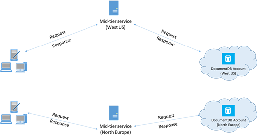

<properties 
    pageTitle="Suggerimenti sulle prestazioni DocumentDB | Microsoft Azure" 
    description="Altre opzioni di configurazione di client per migliorare le prestazioni del database DocumentDB Azure"
    keywords="come migliorare le prestazioni del database"
    services="documentdb" 
    authors="mimig1" 
    manager="jhubbard" 
    editor="" 
    documentationCenter=""/>

<tags 
    ms.service="documentdb" 
    ms.workload="data-services" 
    ms.tgt_pltfrm="na" 
    ms.devlang="na" 
    ms.topic="article" 
    ms.date="10/17/2016" 
    ms.author="mimig"/>

# Prestazioni di suggerimenti per DocumentDB

Azure DocumentDB è un database distribuito veloce e flessibile scale diretta con latenza garantita e la velocità effettiva. Non è necessario apportare le modifiche all'architettura principali o scrivere codice complesso per ridimensionare il database con DocumentDB. Il ridimensionamento alto e verso il basso è semplice come effettuare una chiamata API singola o un [metodo SDK chiamare](documentdb-performance-levels.md#changing-performance-levels-using-the-net-sdk). Tuttavia, poiché DocumentDB è possibile accedere tramite chiamate di rete sono disponibili le ottimizzazioni lato client che è possibile apportare per ottenere prestazioni ottimali.

In modo che se si desidera che "come è migliorare le prestazioni del database?" considerare le seguenti opzioni:

## Rete

1. **Criterio di connessione: utilizzare la modalità connessione diretta**
    
    Come un client si connette a Azure DocumentDB ha implicazioni sulle prestazioni, in particolare in termini di osservati latenza lato client. Sono disponibili due impostazioni di configurazione della chiave per la configurazione di client Criteri di connessione-la *modalità* di connessione e il [ *protocollo*di connessione](#connection-protocol).  Due modalità disponibili sono:

    1. Modalità di gateway (impostazione predefinita)
    2. Modalità diretta

    Poiché DocumentDB è un sistema di archiviazione distribuita, risorse DocumentDB come raccolte suddivisa in più computer e ogni partizione replicato disponibilità elevata. Logica alla traduzione indirizzo fisico si trova in una tabella di routing, disponibile anche internamente come risorsa.

    In modalità di Gateway macchine di gateway DocumentDB eseguono il routing, consentendo il codice client sia semplice e compatto. Un'applicazione client invia le richieste ai computer gateway DocumentDB, che tradurre URI logico nella richiesta per l'indirizzo fisico del nodo back-end e inoltrare la richiesta in modo appropriato.  Invece in modalità diretta client devono mantenere – e aggiornare periodicamente – una copia di questa tabella routing e connettersi direttamente ai nodi DocumentDB back-end.

    Modalità di gateway supportata in tutte le piattaforme SDK, predefinito configurato.  Se l'applicazione viene eseguita all'interno di una rete aziendale con restrizioni firewall restrittive, modalità Gateway è la scelta migliore poiché utilizza la porta HTTPS standard e un unico endpoint. Compromesso prestazioni invece che modalità Gateway richiede un hop di rete aggiuntive ogni volta che dati vengono letti o scritti DocumentDB.   Per questi motivi, modalità diretta offre prestazioni migliori a causa di un numero minore hop di rete.

2. **Criterio di connessione: usare il protocollo TCP**

    Quando sfruttando modalità diretta, sono disponibili due opzioni protocollo:

    - TCP
    - HTTPS

    DocumentDB offre un semplice e aprire un modello di programmazione REST in HTTPS. Inoltre, offre un utilizzo efficiente protocollo TCP, che è anche RESTful nel modello di comunicazione ed è disponibile tramite il client di .NET SDK. TCP diretto e HTTPS Usa SSL per l'autenticazione iniziale e la crittografia del traffico. Per ottenere prestazioni ottimali, usare il protocollo TCP laddove possibile. 

    Quando si utilizza TCP in modalità di Gateway, porta TCP 443 è la porta DocumentDB e 10250 è la porta MongoDB API. Quando si utilizza TCP in modalità diretta, oltre a porte Gateway, è necessario assicurarsi che la porta intervallo compreso tra 10000 e 20000 è aperto poiché DocumentDB utilizza le porte TCP dinamiche. Se si tenta di utilizzare TCP queste porte non siano aperte, si riceverà un errore 503 Servizio non disponibile. 

    La modalità di integrazione applicativa è configurata durante la creazione dell'istanza DocumentClient con il parametro ConnectionPolicy. Se si utilizza la modalità diretta, è inoltre possibile impostare il protocollo all'interno del parametro ConnectionPolicy.

        var serviceEndpoint = new Uri("https://contoso.documents.net");
        var authKey = new "your authKey from Azure Mngt Portal";
        DocumentClient client = new DocumentClient(serviceEndpoint, authKey, 
        new ConnectionPolicy
        {
            ConnectionMode = ConnectionMode.Direct,
            ConnectionProtocol = Protocol.Tcp
        });

    Poiché TCP è supportato solo in modalità diretta, se viene utilizzata la modalità di Gateway, il protocollo HTTPS viene sempre utilizzato per comunicare con il Gateway e il valore protocollo la ConnectionPolicy viene ignorato.

    

3. **Chiamare OpenAsync per evitare la latenza di avvio alla prima richiesta**

    Per impostazione predefinita, la prima richiesta avrà una latenza superiore perché contiene recuperare la tabella di routing degli indirizzi. Per evitare questo latenza di avvio alla prima richiesta, è necessario chiamare OpenAsync() volta durante l'inizializzazione come indicato di seguito.

        await client.OpenAsync();

4. **Inserire i client nella stessa regione Azure per prestazioni ottimali**

    Se possibile, posizionare tutte le applicazioni di chiamare DocumentDB nella stessa regione database DocumentDB. Per un confronto approssimativo, le chiamate a DocumentDB all'interno dell'area stessa completata entro 1-2 ms, ma la latenza tra la costa occidentale e costa orientale degli Stati Uniti è > 50 ms. Questa latenza probabilmente può variare da una richiesta a seconda della route della richiesta durante il passaggio dal client al limite di Azure Data Center. La latenza più bassa possibili è necessario garantire che l'applicazione chiamata si trova all'interno dell'area di Azure stesso come endpoint DocumentDB provisioning. Per un elenco di aree disponibili, vedere [Le aree di Azure](https://azure.microsoft.com/regions/#services).

    

5. **Aumentare il numero di thread/attività**

    Poiché le chiamate a DocumentDB effettuate in rete, potrebbe essere necessario variare il grado di parallelismo le richieste in modo che l'applicazione client impiega molto tempo in attesa tra le richieste. Ad esempio, se si sta utilizzando. [Raccolta in parallelo delle attività](https://msdn.microsoft.com//library/dd460717.aspx), della NET creare nell'ordine 100s delle attività di lettura o la scrittura di DocumentDB.

## Uso SDK

1. **Installare SDK più recente**

    SDK DocumentDB vengono costantemente aggiornate per fornire le massime prestazioni. Visualizzare le pagine [DocumentDB SDK](documentdb-sdk-dotnet.md) per determinare il SDK più recente e rivedere miglioramenti. 

2. **Utilizzare un client di DocumentDB singleton per la durata dell'applicazione**
  
    Si noti che ogni istanza DocumentClient thread safe ed esegue la gestione efficiente connessione e indirizzo memorizzazione nella cache quando si opera in modalità di accesso diretto. Per consentire la gestione delle connessioni efficiente e migliorare le prestazioni da DocumentClient, è consigliabile usare una sola istanza di DocumentClient per dominio applicazione per la durata dell'applicazione.

3. **Aumentare System.Net MaxConnections per host**

    Le richieste di DocumentDB effettuate HTTPS/parte rimanente per impostazione predefinita e sono soggetti al limite di connessione predefinito per nome host o l'indirizzo IP. Potrebbe essere necessario impostare il MaxConnections su un valore superiore (100-1000) in modo che la libreria client può utilizzare più connessioni simultanee per DocumentDB. In .NET SDK 1.8.0 e versioni successive, il valore predefinito per [ServicePointManager. DefaultConnectionLimit](https://msdn.microsoft.com/library/system.net.servicepointmanager.defaultconnectionlimit.aspx) è 50 e per modificare il valore, è possibile impostare [Documents.Client.ConnectionPolicy.MaxConnectionLimit](https://msdn.microsoft.com/en-us/library/azure/microsoft.azure.documents.client.connectionpolicy.maxconnectionlimit.aspx) su un valore superiore.  

4. **Ottimizzazione delle query in parallelo per raccolte partizionate**

     DocumentDB .NET SDK versione 1.9.0 e sopra la query in parallelo di supporto che consentono di eseguire una query un insieme partizionato in parallelo (vedere [lavorare con gli SDK](documentdb-partition-data.md#working-with-the-sdks) e correlati [esempi di codice](https://github.com/Azure/azure-documentdb-dotnet/blob/master/samples/code-samples/Queries/Program.cs) per altre informazioni). Query parallele sono progettate per migliorare la latenza delle query e la velocità effettiva sulle loro seriale equivalente. Tipo di query in parallelo offre due parametri che gli utenti possono ottimizzare per personalizzata adatta rispettivi requisiti, (a) MaxDegreeOfParallelism: per controllare il numero massimo di partizioni che è possibile eseguire una query in parallelo e MaxBufferedItemCount (b): per controllare il numero di risultati già recuperati. 
    
    (a) ***regolazione MaxDegreeOfParallelism\: *** 
    parallela works query eseguendo una query più partizioni in parallelo. Tuttavia, da un singolo raccogliere partizionata vengono recuperati seriale per la query. E quindi l'impostazione di MaxDegreeOfParallelism al numero di partizioni ha massima possibilità di raggiungere la maggior parte delle query efficienti, purché tutte le altre condizioni di sistema rimangono invariati. Se non si conosce il numero delle partizioni, è possibile impostare il MaxDegreeOfParallelism a un numero elevato e il sistema verrà scelto il valore minimo (numero di partizioni, input dall'utente) come il MaxDegreeOfParallelism. 
    
    È importante tenere presente che query parallele producano vantaggi ottimali se i dati viene distribuiti uniformemente su tutte le partizioni relative alle query. Se la raccolta partizionata è suddiviso modo che tutti o solo un maggior parte dei dati restituiti da una query è concentrati in pochi partizioni (una partizione nel caso peggiore), quindi le prestazioni della query da essere problemi di prestazioni dovute da tali partizioni. 
    
    (b) ***regolazione MaxBufferedItemCount\: *** 
    query parallela è progettata per pre-recuperare risultati durante l'elaborazione batch corrente di risultati dal client. Il recupero consente di ottimizzazione Latenza complessiva di una query. MaxBufferedItemCount è il parametro per limitare la quantità di risultati già recuperati. L'impostazione MaxBufferedItemCount il numero di risultati restituiti previsti (o un numero più alto) consente la query ricevere il massimo vantaggio da pre-recupero. 
    
    Si noti che pre-recupero funziona nello stesso modo indipendentemente dal MaxDegreeOfParallelism e non esiste un singolo buffer per i dati da tutte le partizioni.  

5. **Attivare catalogo globale sul lato server**
    
    In alcuni casi può contribuire a ridurre la frequenza di simultanea. In .NET impostare [gcServer](https://msdn.microsoft.com/library/ms229357.aspx) su true.

6. **Implementare backoff RetryAfter intervalli**
 
    Durante la verifica delle prestazioni, è necessario aumentare carico fino a ottenere limitato un tasso di piccole dimensioni di richieste di tipo. Se è limitato, l'applicazione client deve backoff sulla limitazione per l'intervallo specificato server. Rispettando il backoff garantisce dedicato minima quantità di tempo di attesa tra tentativi. Supporto dei criteri Riprova è incluso nella versione 1.8.0 e versioni successive di DocumentDB [.NET](documentdb-sdk-dotnet.md) e [Java](documentdb-sdk-java.md)e versione 1.9.0 e di sopra della [Node](documentdb-sdk-node.md) e [Python](documentdb-sdk-python.md). Per ulteriori informazioni, vedere [limiti di velocità riservato Exceeding](documentdb-request-units.md#exceeding-reserved-throughput-limits) e [RetryAfter](https://msdn.microsoft.com/library/microsoft.azure.documents.documentclientexception.retryafter.aspx).

7. **Scalabilità il carico di lavoro client**

    Se si stanno verificando livelli alta velocità (> 50.000 RU/s), l'applicazione client può diventare bottiglia a causa di computer terminazione fuori sull'utilizzo della CPU o della rete. Se si raggiunge questo punto, è possibile continuare a push ulteriormente l'account DocumentDB ridimensionando le applicazioni client su più server.

8. **Documento di cache URI per la latenza di lettura inferiore**

    Documento di cache URI ogni volta che è possibile che le massime prestazioni di lettura.

9. **Regolare le dimensioni di pagina per i feed di query/letto per migliorare le prestazioni**

    Durante l'esecuzione di un blocco lettura di documenti tramite lettura feed funzionalità (ad esempio, ReadDocumentFeedAsync) o per l'invio di una query SQL DocumentDB, i risultati vengono restituiti in modo segmentato se il risultato è troppo grande. Per impostazione predefinita, i risultati vengono restituiti in blocchi di 100 elementi o 1 MB, indipendentemente dal limite viene raggiunto prima. 

    Per ridurre il numero di round trip in necessari per recuperare tutti i risultati applicabili rete, è possibile aumentare le dimensioni della pagina con intestazione x-ms-max--numero di elementi a un massimo di 1000. Nei casi in cui è necessario visualizzare solo pochi risultati, ad esempio, se l'API di applicazione o dell'interfaccia utente restituisce solo 10 genera una volta, è inoltre possibile ridurre le dimensioni della pagina a 10 per ridurre la velocità utilizzata per la lettura e le query.

    È inoltre possibile impostare le dimensioni della pagina usando gli SDK DocumentDB disponibili.  Per esempio:
    
        IQueryable<dynamic> authorResults = client.CreateDocumentQuery(documentCollection.SelfLink, "SELECT p.Author FROM Pages p WHERE p.Title = 'About Seattle'", new FeedOptions { MaxItemCount = 1000 });

10. **Aumentare il numero di thread/attività**

    Vedere [aumentare il numero di thread/attività](#increase-threads) nella sezione Networking.

## Criterio di indicizzazione

1. **Utilizzare l'indicizzazione Prato per velocità massima di acquisizione di tempo**

    DocumentDB consente di specificare – a livello di raccolta, un criterio di indicizzazione, che consente di scegliere se si vuole che i documenti in una raccolta da indicizzare automaticamente o meno.  Inoltre, è possibile scegliere tra l'icona del (coerenti) e gli aggiornamenti di indice asincroni (Lazy). Per impostazione predefinita, l'indice viene aggiornato in modo sincrono in ogni Inserisci, Sostituisci o eliminazione di un documento alla raccolta. In modo sincrono modalità consente di eseguire query rispettare allo stesso [livello coerenza](documentdb-consistency-levels.md) che legge il documento senza ritardi per l'indice di "".
    
    L'indicizzazione Prato possono essere considerato per gli scenari in cui i dati sono scritto in burst e si vuole relativo del lavoro necessario per il contenuto di indice per un periodo di tempo più lungo. L'indicizzazione Prato consente anche di usare la velocità di provisioning in modo efficace e rispondere alle richieste di scrittura picco con latenza minima. È importante tenere presente che quando è abilitata l'indicizzazione Prato, i risultati della query saranno infine coerente indipendentemente dal livello coerenza configurato per l'account DocumentDB.

    Di conseguenza, coerenti in modalità di indicizzazione (IndexingPolicy.IndexingMode è impostato su coerenti) comporta la spesa unitaria richiesta più alta per scrittura, mentre si Lazy indicizzazione modalità (IndexingPolicy.IndexingMode è impostato su Lazy) e non l'indicizzazione (IndexingPolicy.Automatic è impostato su False) sono uguali a zero indicizzazione costo in fase di scrittura.

2. **Escludere percorsi inutilizzati dall'indicizzazione per velocizzare scrittura**

    Criterio di indicizzazione del DocumentDB consente anche di specificare i percorsi di documento per includere o escludere dall'indicizzazione sfruttando l'indicizzazione percorsi (IndexingPolicy.IncludedPaths e IndexingPolicy.ExcludedPaths). L'uso di indicizzazione di percorsi può offrire prestazioni migliorate scrittura e archiviazione di indice inferiore per gli scenari in cui i modelli di query si conoscono in anticipo, come i costi di indicizzazione dipendono direttamente al numero di percorsi univoci indicizzate.  Ad esempio, il codice seguente viene illustrato come escludere (noto anche un'intera sezione dei documenti una sottostruttura) dall'indicizzazione utilizzando il "*" con caratteri jolly.

        var collection = new DocumentCollection { Id = "excludedPathCollection" };
        collection.IndexingPolicy.IncludedPaths.Add(new IncludedPath { Path = "/*" });
        collection.IndexingPolicy.ExcludedPaths.Add(new ExcludedPath { Path = "/nonIndexedContent/*");
        collection = await client.CreateDocumentCollectionAsync(UriFactory.CreateDatabaseUri("db"), excluded);

    Per ulteriori informazioni, vedere [regole di indicizzazione DocumentDB](documentdb-indexing-policies.md).

## Velocità di trasmissione

1. **Misurare e regolare richiesta inferiore di unità/secondo l'uso**

    DocumentDB offre una vasta gamma di operazioni di database, incluse le query relazionale e gerarchiche con funzioni definite dall'utente, stored procedure e trigger-funzionamento sui documenti all'interno di un insieme di database. Il costo associato a ognuna di queste operazioni variano in base la CPU, IO e memoria necessari per completare l'operazione. Invece di pensare e la gestione delle risorse hardware, è possibile pensare di un'unità di richiesta (RU) come una singola misura per le risorse necessarie per una richiesta di applicazione di servizio ed eseguire varie operazioni di database.

    [Richiedere l'unità](documentdb-request-units.md) viene effettuato il provisioning per ogni account di database in base al numero di unità di capacità che si acquista. Richiesta di unità consumo viene valutato come un tasso al secondo. Applicazioni che superano il tasso di unità di provisioning richiesta per il proprio account è limitato finché il tasso inferiore livello riservato per l'account. Se l'applicazione richiede un livello superiore di trasmissione, è possibile acquistare unità capacità aggiuntive.

    La complessità di una query influenza il numero di unità richiedere vengono utilizzato per un'operazione. Il numero di predicati, natura predicati, numero di funzioni definite dall'utente e la dimensione del set di dati di origine tutti influenzare il costo di operazioni di query.

    Misurare il sovraccarico di qualsiasi operazione (creare, aggiornare o eliminare), esaminare l'intestazione x ms-richiesta gratuito (o la proprietà RequestCharge equivalente in ResourceResponse<T> o FeedResponse<T> in .NET SDK) per misurare il numero di unità richiesta consumata da queste operazioni.

        // Measure the performance (request units) of writes
        ResourceResponse<Document> response = await client.CreateDocumentAsync(collectionSelfLink, myDocument);
        Console.WriteLine("Insert of document consumed {0} request units", response.RequestCharge);
        // Measure the performance (request units) of queries
        IDocumentQuery<dynamic> queryable = client.CreateDocumentQuery(collectionSelfLink, queryString).AsDocumentQuery();
        while (queryable.HasMoreResults)
             {
                  FeedResponse<dynamic> queryResponse = await queryable.ExecuteNextAsync<dynamic>();
                  Console.WriteLine("Query batch consumed {0} request units", queryResponse.RequestCharge);
             }
        
    Le spese richiesta restituite in questa intestazione sono una frazione della velocità di provisioning (ad esempio, i destinatari 2000 / secondo). Se la query precedente restituisce 1000 1KB documenti, ad esempio il costo dell'operazione sarà 1000. Di conseguenza, all'interno di un secondo server rispetta solo due richieste prima la limitazione per le successive richieste. Per ulteriori informazioni, vedere [unità richiesta](documentdb-request-units.md) e [calcolo unità richiesta](https://www.documentdb.com/capacityplanner).

2. **Gestire frequenza limitando/richieste tasso troppo grande**

    Quando un client tenta di superano la velocità riservata per un account, esistono Nessuna riduzione delle prestazioni sul server e non utilizzo della capacità di velocità oltre il livello riservato. Il server in modo preemptive terminare la richiesta con RequestRateTooLarge (codice di stato HTTP 429) e restituire l'intestazione x-ms-Riprova-dopo-ms che indica la quantità di tempo in millisecondi, che l'utente deve attendere prima di eseguire nuovamente la richiesta.
 
        HTTP Status 429,
        Status Line: RequestRateTooLarge
        x-ms-retry-after-ms :100

    Gli SDK tutti in modo implicito intercettare questa risposta, rispettano l'intestazione Riprova dopo server specificato e riprovare. A meno che l'account è utilizzata contemporaneamente da più client, Riprova successiva avrà esito positivo.

    Se si dispone di più client in modo cumulativo operativo in modo coerente sopra la frequenza di richiesta, il numero di tentativi predefinito attualmente impostato su 9 internamente dal client non è sufficiente; In questo caso, il client genera un DocumentClientException con codice di stato 429 all'applicazione. Il numero di tentativi predefinito può essere modificato mediante l'impostazione di RetryOptions nell'istanza ConnectionPolicy. Per impostazione predefinita, se la richiesta continua a funzionare sopra la frequenza di richiesta DocumentClientException con codice di stato 429 viene restituito dopo un tempo di attesa cumulativa di 30 secondi. In tal caso anche quando il numero di tentativi corrente è minore del numero massimo di tentativi, ovvero il valore predefinito di 9 o un valore definite dall'utente.

    Mentre il comportamento di Riprova automatizzato consente una maggiore flessibilità e facilità d'uso per la maggior parte delle applicazioni, possono risultare conflittuale quando si esegue benchmark delle prestazioni, soprattutto se la misurazione della latenza.  La latenza osservati client verrà sovraccarico se la prova raggiunge la limitazione di server e, il client SDK ritentare automaticamente. Per evitare picchi latenza durante esperimenti prestazioni, misurare la spesa restituita da ogni operazione e verificare che le richieste di funzionino aliquota richiesta riservato. Per ulteriori informazioni, vedere [richiedere l'unità di misura](documentdb-request-units.md).
   
3. **Progettazione per i documenti più piccoli della velocità effettiva superiore**

    Le spese di richiesta (ad esempio i costi di elaborazione della richiesta) di una determinata operazione direttamente è correlata a ottenere le dimensioni del documento. Operazioni sui documenti di grandi dimensioni costi più operazioni per documenti di piccole dimensioni.

## Livelli di coerenza

1. **Utilizzare i livelli di coerenza meno sicuri per migliorare latenza di lettura**

    Un altro fattore importante da prendere in considerazione durante l'ottimizzazione delle prestazioni delle applicazioni di DocumentDB livello coerenza. La scelta del livello di coerenza include sulle prestazioni di lettura e scrittura. È possibile configurare il livello di uniformità predefinita per l'account di database e il livello di coerenza scelto quindi si applica a tutte le raccolte (per tutti i database) all'interno di account DocumentDB. In termini di operazioni di scrittura, l'impatto della modifica livello di coerenza osservato come latenza richiesta. Come vengono usati più livelli la coerenza, ne aumenterà latenza di scrittura. Mano, osserva l'impatto di livello la coerenza in operazioni di lettura in termini di velocità. Meno sicuri coerenza livelli consentono più leggere velocità è realizzato dal client.

    Per impostazione predefinita tutti lettura e le query eseguite su risorse definite dall'utente utilizzerà il livello di coerenza predefinito specificato per l'account di database. È tuttavia possibile, diminuire il livello di coerenza di una richiesta di lettura/query specifica specificando l'intestazione della richiesta di livello la coerenza di ms x. Per ulteriori informazioni, vedere [livelli di coerenza in DocumentDB](documentdb-consistency-levels.md).

## Passaggi successivi

Per un'applicazione di esempio utilizzata per valutare DocumentDB per gli scenari di prestazioni elevate in alcuni computer client, vedere [test con Azure DocumentDB proporzioni e le prestazioni](documentdb-performance-testing.md).

Per ulteriori informazioni sulla creazione di un'applicazione a scala e prestazioni elevate, vedere anche [partizionamento e proporzioni dei caratteri in Azure DocumentDB](documentdb-partition-data.md).
