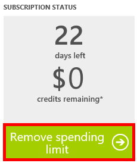

<properties
    pageTitle="Risoluzione dei problemi relativi al portale DocumentDB | Microsoft Azure"
    description="Informazioni su come per risolvere i problemi nel portale di DocumentDB Azure." 
    services="documentdb"
    documentationCenter=""
    authors="mimig1"
    manager="jhubbard"
    editor="monicar"/>

<tags
    ms.service="documentdb"
    ms.workload="data-services"
    ms.tgt_pltfrm="na"
    ms.devlang="na"
    ms.topic="article"
    ms.date="08/29/2016"
    ms.author="mimig"/>

# Azure portale DocumentDB Suggerimenti risoluzione dei problemi

In questo articolo viene descritto come risolvere i problemi di DocumentDB nel portale di Azure. 

## Le risorse risultano mancante

**Problema**: i portale pale mancano database o raccolte.

**Soluzione**: ridurre l'utilizzo di applicazione funzionare in quota produttività massima per la raccolta. 

**Spiegazione**: il portale è un'applicazione come qualsiasi altro, le chiamate a DocumentDB database e raccolte. Se le richieste sono attualmente viene limitate a causa di chiamate da un'applicazione separata, il portale potrebbe anche essere limitato, causando risorse non vengono visualizzati nel portale. Per risolvere il problema, la causa dell'utilizzo del alta velocità di indirizzi e quindi aggiornare e il portale. Informazioni su come misurare e l'uso di velocità inferiore sono disponibili nella sezione [effettiva](documentdb-performance-tips.md#throughput) dell'articolo [suggerimenti sulle prestazioni](documentdb-performance-tips.md) .
 
## Non è possibile caricare pagine o pale

**Sintomo**: pagine e pale nel portale non verranno visualizzati.

**Soluzione**: ridurre l'utilizzo di applicazione funzionare in quota produttività massima per la raccolta. 

**Spiegazione**: il portale è un'applicazione come qualsiasi altro, le chiamate a DocumentDB database e raccolte. Se le richieste sono attualmente viene limitate a causa di chiamate da un'applicazione separata, il portale potrebbe anche essere limitato, causando risorse non vengono visualizzati nel portale. Per risolvere il problema, la causa dell'utilizzo del alta velocità di indirizzi e quindi aggiornare e il portale. Informazioni su come misurare e l'uso di velocità inferiore sono disponibili nella sezione [effettiva](documentdb-performance-tips.md#throughput) dell'articolo [suggerimenti sulle prestazioni](documentdb-performance-tips.md) .

## Aggiungere insieme pulsante è disattivato

**Sintomo**: attivato e il Database è stato disabilitato sul pulsante **Aggiungi raccolta** .

**Spiegazione**: se l'abbonamento Azure è associata a crediti benefit, ad esempio crediti gratuiti rispetto a un abbonamento MSDN e tutti i crediti usato per il mese, non è possibile creare le raccolte in DocumentDB.

**Soluzione**: rimuovere il limite di spesa dal proprio account.

1. Nel portale di Azure, in Jumpbar, fare clic su **abbonamenti**, fare clic sull'abbonamento associato al database DocumentDB e quindi in e il **sottoscrizione** , fare clic su **Gestisci**. 
    

2. Nella nuova finestra del browser, si noterà che hai esaurito rimanente. Fare clic sul pulsante **Rimuovi limite di spesa** per rimuovere le spese per solo il periodo di fatturazione corrente o tempo indefinito. Quindi completare la procedura guidata per aggiungere o verificare le informazioni sulla carta di credito. 
    

 
## Esplora query viene completata con errori

Vedere [risolvere i problemi di Esplora risorse di Query](documentdb-query-collections-query-explorer.md#troubleshoot).

## Nessun dato disponibile per il controllo delle sezioni

Vedere [risoluzione dei problemi di monitoraggio delle sezioni](documentdb-monitor-accounts.md#troubleshooting).

## Non contiene documenti restituiti in Document Explorer

Vedere [risoluzione dei problemi Document Explorer](documentdb-view-json-document-explorer.md#troubleshoot).

## Passaggi successivi

Se si verificano ancora problemi nel portale, vedere inviare tramite posta elettronica [askdocdb@microsoft.com](mailto:askdocdb@microsoft.com) di aiuto o file richiesta di un supporto nel portale facendo clic su **Sfoglia**, **Guida + supporto**, e quindi fare clic su **Crea richiesta di assistenza**.
