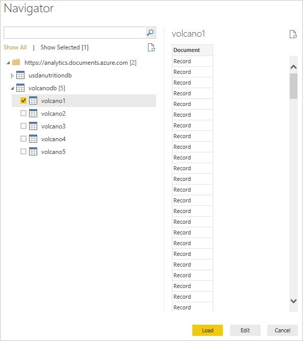
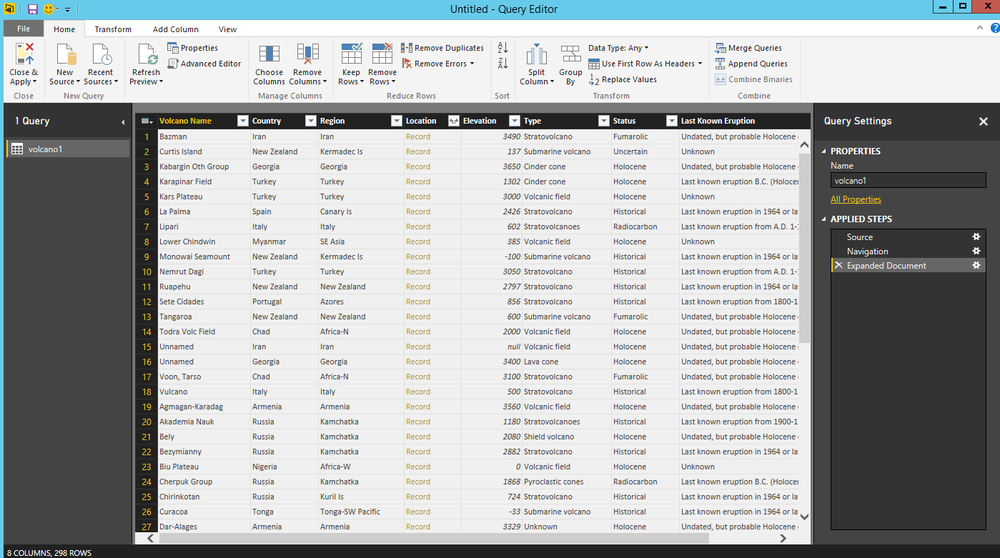

<properties
    pageTitle="Esercitazione di Power BI per connettore DocumentDB | Microsoft Azure"
    description="Utilizzare questa esercitazione di Power BI per importare JSON, creare report dettagliati e visualizzare dati tramite il connettore DocumentDB e Power BI."
    keywords="Power bi esercitazione, visualizzare i dati, connettore di power bi"
    services="documentdb"
    authors="h0n"
    manager="jhubbard"
    editor="mimig"
    documentationCenter=""/>

<tags
    ms.service="documentdb"
    ms.workload="data-services"
    ms.tgt_pltfrm="na"
    ms.devlang="na"
    ms.topic="article"
    ms.date="09/22/2016"
    ms.author="hawong"/>

# Esercitazione di Power BI per DocumentDB: visualizzare dati tramite il connettore di Power BI

[PowerBI.com](https://powerbi.microsoft.com/) è un servizio in linea nel punto in cui è possibile creare e condividere report e dashboard con dati importanti per la propria organizzazione.  Power BI Desktop è uno strumento che consente di recuperare dati da varie origini dati, unire e trasformare i dati, creare visualizzazioni e report avanzati e pubblicare i report in Power BI di creazione di report dedicato.  Con la versione più recente di Power BI Desktop, è ora possibile connettersi all'account DocumentDB tramite il connettore DocumentDB per Power BI.   

In questa esercitazione di Power BI è ripetere i passaggi per connettersi a un account DocumentDB in Power BI Desktop, passare a una raccolta in cui si desidera estrarre i dati utilizzando lo strumento di navigazione e trasformare i dati JSON in formato tabulare con Power BI Desktop Editor di Query e creare e pubblicare un report in PowerBI.com.

Al termine di questa esercitazione di Power BI, sarà possibile rispondere alle domande seguenti:  

-   Come è possibile creare report con i dati da DocumentDB uso di Power BI Desktop?
-   Come è possibile connettersi a un account DocumentDB in Power BI Desktop?
-   Come è possibile recuperare dati da una raccolta in Power BI Desktop?
-   Come è possibile trasformare i dati JSON nidificate in Power BI Desktop?
-   Come è possibile pubblicare e condividere i report in PowerBI.com?

## Prerequisiti

Prima di seguire le istruzioni in questa esercitazione di Power BI, verificare di disporre le operazioni seguenti:

- [La versione più recente di Power BI Desktop](https://powerbi.microsoft.com/desktop).
- Accesso al nostro demo account o ai dati nel proprio account Azure DocumentDB.
    - L'account demo viene popolata con i dati volcano visualizzati in questa esercitazione. Questo account demo non è soggetta a qualsiasi contratti di servizio e in genere dimostrativo.  Abbiamo riserva il diritto di apportare modifiche a questo account demo inclusi, ma non è limitato per terminare l'account, modificare la chiave, limitare l'accesso, modificare ed eliminare i dati in qualsiasi momento senza preavviso o motivo.
        - URL: https://analytics.documents.azure.com
        - Chiave di sola lettura: MSr6kt7Gn0YRQbjd6RbTnTt7VHc5ohaAFu7osF0HdyQmfR + YhwCH2D2jcczVIR1LNK3nMPNBD31losN7lQ/fkw = =
    - In alternativa, per creare il proprio account, vedere [creare un account di database DocumentDB tramite il portale di Azure](https://azure.microsoft.com/documentation/articles/documentdb-create-account/). Per ottenere volcano esempio dati simile a quanto viene utilizzati in questa esercitazione (ma non contengano blocchi GeoJSON), vedere il [sito NOAA](https://www.ngdc.noaa.gov/nndc/struts/form?t=102557&s=5&d=5) e quindi come importare i dati utilizzando lo [strumento di migrazione dati DocumentDB](https://azure.microsoft.com/documentation/articles/documentdb-import-data/).

Per condividere i report in PowerBI.com, è necessario disporre di un account in PowerBI.com.  Per ulteriori informazioni su Power BI per Power BI Pro e gratuito, visitare [https://powerbi.microsoft.com/pricing](https://powerbi.microsoft.com/pricing).

## Iniziamo
In questa esercitazione, immaginiamo sono un geologist studiare vulcani tutto il mondo.  I dati volcano vengono memorizzati in un account DocumentDB e i documenti JSON simile a quella riportata di seguito.

    {
        "Volcano Name": "Rainier",
        "Country": "United States",
        "Region": "US-Washington",
        "Location": {
            "type": "Point",
            "coordinates": [
            -121.758,
            46.87
            ]
        },
        "Elevation": 4392,
        "Type": "Stratovolcano",
        "Status": "Dendrochronology",
        "Last Known Eruption": "Last known eruption from 1800-1899, inclusive"
    }

Si desidera recuperare i dati volcano dall'account DocumentDB e visualizzare i dati in un report di Power BI interattivi come quello illustrato di seguito.

Pronti per sperimentare? Iniziamo.

1. Eseguire Power BI Desktop sulla workstation.
2. Una volta Power BI Desktop viene avviata, viene visualizzata una schermata di *benvenuto* .

    

3. È possibile **Ottenere dati**, vedere **Origini recenti**o **Apri altri report** direttamente dalla schermata *iniziale* .  Fare clic sulla X nell'angolo superiore destro per chiudere la schermata. Visualizzazione **Report** di Power BI Desktop.

    

4. Selezionare la **pagina iniziale** della barra multifunzione, quindi fare clic su **Carica dati**.  Verrà visualizzata la finestra **Carica dati** .

5. Fare clic su **Azure**, selezionare **Microsoft Azure DocumentDB (Beta)**e quindi fare clic su **Connetti**.  Finestra di **Microsoft Azure DocumentDB Connect** dovrebbero essere visualizzate.

    

6. Specificare l'URL di endpoint account DocumentDB si desidera recuperare i dati, come illustrato di seguito, quindi fare clic su **OK**. È possibile recuperare l'URL nella casella URI e il **[chiavi](documentdb-manage-account.md#keys)** del portale di Azure o è possibile usare l'account demo, nel qual caso l'URL è `https://analytics.documents.azure.com`. 

    Omette il nome del database, nome della raccolta e l'istruzione SQL come questi campi sono facoltativi.  Se, tuttavia, verrà usata di selezione per selezionare il Database e insieme per identificare la provenienza dei dati.

    

7. Se ci si connette all'endpoint per la prima volta, verrà richiesto per la chiave account.  È possibile recuperare la chiave nella casella **Chiave primaria** e il **[tasti di sola lettura](documentdb-manage-account.md#keys)** del portale di Azure o è possibile usare l'account demo, nel qual caso la chiave è `RcEBrRI2xVnlWheejXncHId6QRcKdCGQSW6uSUEgroYBWVnujW3YWvgiG2ePZ0P0TppsrMgscoxsO7cf6mOpcA==`. Immettere la chiave account e fare clic su **Connetti**.

    È consigliabile utilizzare il tasto di sola lettura quando si creano rapporti.  Ciò impedirà pericolosa esposizione della chiave master a potenziali rischi di sicurezza. Il tasto di sola lettura è disponibile da e il [chiavi](documentdb-manage-account.md#keys) del portale di Azure o è possibile utilizzare le informazioni sull'account demo disponibile sopra.

    

8. Quando l'account connesso, verrà visualizzata la **selezione** .  **Strumento di navigazione** visualizzerà un elenco di database con l'account.
9. Fare clic su ed espandere il database in cui i dati per il report vengono recapitata, se si usa l'account demo, selezionare **volcanodb**.   

10. A questo punto, selezionare una raccolta per recuperare i dati da. Se si usa l'account demo, selezionare **volcano1**.

    Riquadro di anteprima viene visualizzato un elenco di elementi di **Record** .  Un documento viene rappresentato come un tipo di **Record** in Power BI. Analogamente, un blocco JSON nidificato all'interno di un documento è anche un **Record**.

    

11. Fare clic su **Modifica** per avviare l'Editor di Query in modo che è possibile trasformare i dati.

## Appiattimento e la trasformazione di documenti JSON
1. Nell'Editor di Query di Power BI, verrà visualizzata una colonna di **documento** nel riquadro centrale.

2. Fare clic sul pulsante di espansione sul lato destro dell'intestazione della colonna **documento** .  Verrà visualizzato il menu di scelta rapida con un elenco di campi.  Selezionare i campi che necessari per il report, ad esempio, Volcano nome, paese, regione, posizione, elevazione, tipo, stato e ultima eruzione fonti, e quindi fare clic su **OK**.

    

3. Riquadro centrale verrà visualizzata un'anteprima del risultato con i campi selezionati.

    

4. In questo esempio, la proprietà percorso è un blocco di GeoJSON in un documento.  Come si può notare, posizione viene rappresentata come un tipo di **Record** in Power BI Desktop.  
5. Fare clic sul pulsante di espansione sul lato destro dell'intestazione della colonna posizione.  Verrà visualizzato il menu di scelta rapida con campi tipo e le coordinate.  Di seguito, selezionare il campo di coordinate e fare clic su **OK**.

    

6. Riquadro centrale verrà visualizzato una colonna di coordinate del tipo di **elenco** .  Come illustrato all'inizio dell'esercitazione, i dati GeoJSON in questa esercitazione sono di tipo decimale con valori di latitudine e longitudine registrati nella matrice di coordinate.

    L'elemento di coordinate [0] rappresenta longitudine mentre le coordinate [1] rappresenta latitudine.
    

7. Per unire la matrice di coordinate, verrà creata una **Colonna personalizzata** denominata LatLong.  Selezionare la barra multifunzione **Aggiungi colonna** e fare clic su **Aggiungi colonna personalizzata**.  Viene visualizzata la finestra **Aggiungi colonna personalizzata** .

8. Specificare un nome per la nuova colonna, ad esempio LatLong.

9. Successivamente, specificare la formula personalizzata per la nuova colonna.  In questo esempio, si verranno concatenare i valori di latitudine e longitudine separati da una virgola, come illustrato di seguito utilizzando la formula seguente: `Text.From([Document.Location.coordinates]{1})&","&Text.From([Document.Location.coordinates]{0})`. Fare clic su **OK**.

    Per ulteriori informazioni su espressioni DAX (Data Analysis) incluse le funzioni DAX, visitare [Base DAX in Power BI Desktop](https://support.powerbi.com/knowledgebase/articles/554619-dax-basics-in-power-bi-desktop).

    

10. A questo punto, nel riquadro centrale vengono visualizzati la nuova colonna LatLong inserita i valori di latitudine e longitudine separati da una virgola.

    

    Se si riceve un messaggio di errore nella nuova colonna, assicurarsi che i passaggi applicati in impostazioni Query corrispondano figura riportata di seguito:

    

    Se la procedura è diversa, eliminare i passaggi aggiuntivi e provare ad aggiungere di nuovo la colonna personalizzata. 

11. Unire i dati in formato tabulare è stata completata.  È possibile sfruttare tutte le funzionalità disponibili nell'Editor di Query alla forma e trasformare i dati in DocumentDB.  Se si usa il campione, modificare il tipo di dati di elevazione al **numero intero** , la modifica del **Tipo di dati** sulla barra multifunzione **Home** .

    

12. Fare clic su **Applica e Chiudi** per salvare il modello di dati.

    

## Creare i report
Visualizzazione di Power BI Desktop Report è nel punto in cui è possibile avviare la creazione di report per visualizzare i dati.  È possibile creare report mediante trascinamento della selezione di campi nell'area di lavoro **Report** .

In visualizzazione Report, è necessario trovare:

 1. Riquadro **campi** si tratta in cui verrà visualizzato un elenco di modelli di dati con i campi da utilizzare per i report.

 2. Riquadro **visualizzazioni** . Un report può contenere uno o più visualizzazioni.  Selezionare i tipi di visual adatta alle proprie esigenze dal riquadro **visualizzazioni** .

 3. Area di lavoro **Report** , si tratta in cui verrà creato gli elementi visivi per il report.

 4. Pagina del **Report** . È possibile aggiungere più pagine di report in Power BI Desktop.

Di seguito viene illustrato la procedura di base della creazione di un report di visualizzazione mappa interattivo semplice.

1. In questo esempio, si creerà una visualizzazione mappa che mostra la posizione di ogni volcano.  Nel riquadro di **visualizzazioni** , scegliere il tipo di visual mappa come mostrato nella figura riportata sopra.  Verrà visualizzato il tipo di visual mappa disegnato nell'area di lavoro di **Report** .  Il riquadro di **visualizzazione** dovrebbe essere inoltre visualizzato un insieme di proprietà relative al tipo di visual mappa.

2. A questo punto, trascinare e rilasciare il campo LatLong dal riquadro **campi** per la proprietà **posizione** nel riquadro di **visualizzazioni** .
3. Successivamente, trascinare e rilasciare il campo nome Volcano sulla proprietà **legenda** .  

4. Quindi, trascinare e rilasciare il campo più elevati per la proprietà **dimensioni** .  

5. Verrà visualizzata la mappa visivo con un set di bolle che indica la posizione di ogni volcano con le dimensioni della bolla correlazione possibile elevazione del volcano.

6. A questo punto è stato creato un report di base.  È possibile personalizzare ulteriormente il report mediante l'aggiunta di più visualizzazioni.  In questo caso, abbiamo aggiunto un filtro dei dati di tipo Volcano per rendere il report interattivi.  

    

## Pubblicare e condividere i report
Per condividere il report, è necessario disporre di un account in PowerBI.com.

1. In Power BI Desktop, fare clic sulla barra multifunzione **Home** .
2. Fare clic su **pubblica**.  Verrà richiesto di immettere il nome utente e la password dell'account PowerBI.com.
3. Una volta autenticata le credenziali, il report viene pubblicato nel percorso di destinazione selezionato.
4. Fare clic su **Apri 'PowerBITutorial.pbix' in Power BI** per visualizzare e condividere il report in PowerBI.com.

    

## Creare un dashboard in PowerBI.com

Dopo aver creato un report, consente di condividere in PowerBI.com

Quando si pubblica il report da Power BI Desktop per PowerBI.com, genera un **Report** e un **set di dati** nel tenant di PowerBI.com. Ad esempio, dopo che è stato pubblicato un report denominato **PowerBITutorial** a PowerBI.com, si vedrà PowerBITutorial nelle sezioni **report** e **set di dati** in PowerBI.com.

   

Per creare un dashboard condivisibile, fare clic sul pulsante **Aggiungi pagina Live** nel report PowerBI.com.

   

Quindi seguire le istruzioni in [si può aggiungere un riquadro da un report](https://powerbi.microsoft.com/documentation/powerbi-service-pin-a-tile-to-a-dashboard-from-a-report/#pin-a-tile-from-a-report) per creare un nuovo dashboard. 

È anche possibile eseguire ad hoc modifiche al report prima di creare un dashboard. Tuttavia, è consigliabile usare Power BI Desktop per apportare le modifiche e ripubblicare il report PowerBI.com.

## Aggiornare i dati in PowerBI.com

Esistono due modi per aggiornare i dati, ad hoc e pianificati.

Per un aggiornamento ad hoc, è sufficiente fare clic su eclipses (…) per il **set di dati**, ad esempio PowerBITutorial. Verrà visualizzato un elenco di azioni inclusa **Aggiorna adesso**. Fare clic su **Aggiorna** per aggiornare i dati.

Per un aggiornamento pianificato, eseguire le operazioni seguenti.

1. Fare clic su **Pianifica aggiornamento** nell'elenco di azioni. 
    

2. Nella pagina **Impostazioni** espandere **le credenziali dell'origine dati**. 

3. Fare clic su **Modifica credenziali**. 

    Viene visualizzato il popup configurato automaticamente. 

4. Immettere il tasto per connettersi all'account di DocumentDB per il set di dati e quindi fare clic su **Accedi**. 

5. Espandere **Pianifica aggiornamento** e configurare la pianificazione che si desidera aggiornare il set di dati. 
  
6. Fare clic su **Applica** e aver configurazione aggiornamento pianificato.

## Passaggi successivi
- Per ulteriori informazioni su Power BI, vedere [Introduzione a Power BI](https://powerbi.microsoft.com/documentation/powerbi-service-get-started/).
- Per ulteriori informazioni sulla DocumentDB, vedere la [documentazione DocumentDB pagina di destinazione](https://azure.microsoft.com/documentation/services/documentdb/).
